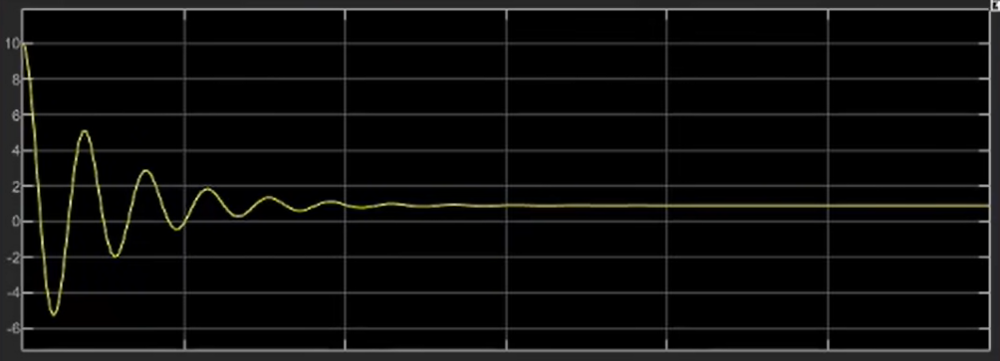
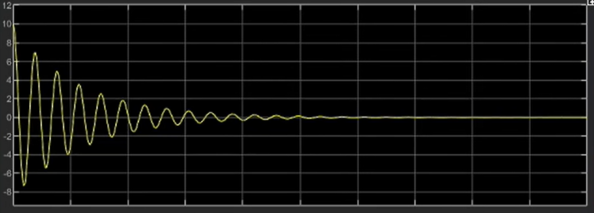
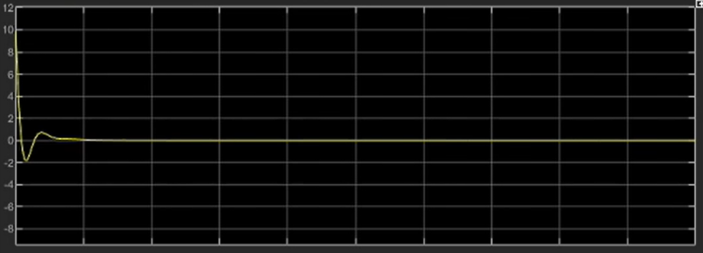

# $$\text{Control Algorithm for Learning}$$
## $\text{MPC}$
### 基本概念
#### 最优控制
最优控制的研究理念是在**约束条件**下达到**最优**的系统表现，以数学方式来描述这个最优化问题：
$r(t)-\mathrm{Reference}$到$u(t)-\mathrm{Input}$到$y(t)-\mathrm{Output}$再回到$r(t)$，是一个**单输入单输出系统**$\mathrm{(SISD)}$，定义误差$e=y-r$，从轨迹追踪的角度来说：
- $\int^t_0 e^2 dt$越小，误差越小，追踪越好
- $\int^y_0 u^2 dt$越小，输入越小，系统越容易以更少的能量稳定

我们可以去设定一个目标代价函数
$$J = \int^t_0 (qe^2 + ru^2) dt
$$其中$q$和$r$分别是**误差代价权重**和**控制代价权重**，通过设置一个控制器$u$去调节这两个参数使得$J$最小，如果$q$设计的远大于$r$，表示我们更看重误差，如果$r$设计的远大于$q$，表示我们更看重输入
而在**多输入多数出系统**$(\mathrm{MIMD})$中，对于状态空间：
$$\begin{cases}
    \cfrac{d\boldsymbol{x}}{dt} = \boldsymbol{Ax} + \boldsymbol{Bu} \\
    \boldsymbol{y} = \boldsymbol{Cx}
\end{cases}
$$其中$\boldsymbol{x},\boldsymbol{y}$分别是状态变量和输出，于是可以设计它的目标代价函数：
$$J = \int^{t}_0 \boldsymbol{e}^T \boldsymbol{Qe} + \boldsymbol{u}^T\boldsymbol{Ru}
$$其中矩阵$\boldsymbol{Q,R}$是**调节矩阵**，都是对角矩阵，矩阵元素则是权重系数，用来决定更关注哪些状态量，更关注哪些输入（值的注意的是，MPC等其他控制算法在描述公式时基本上都会出现三明治类型的项，例如$\boldsymbol{e}^T\boldsymbol{Qe}$，它们被称为二次型，同时内部矩阵$\boldsymbol{Q}$基本被要求为是**半正定**或**正定**的，这保证了这个式子总会有最小值）

#### $\mathrm{MPC}$
对于mpc来说，它多用于数位控制和离散型状态空间表达，它主要有三个步骤：
在$k$时刻
- 估计或测量读取当前的系统状态
- 基于$u_k,u_{k+1},\cdots,u_{k+N}$来进行最优化，我们设定一个目标代价函数
  $$J = \sum\limits_k^{N - 1} (\boldsymbol{e}^T_k\boldsymbol{Qe}_k + \boldsymbol{u}^T_k\boldsymbol{Ru}_k + \boldsymbol{e}^T_N\boldsymbol{Fe}_N)
  $$其中第三项是**终端误差代价**，$\boldsymbol{F}$是**终端代价权重矩阵**，随后对整个目标代价函数进行最优化，同时在求解这个问题时还需要附上系统的约束
  数据获取过程具体来说就是设定一个**控制区间**，在这个区间内去预测例如$u_k,u_{k+1},u_{k+2}$的输入的结果$y_{k+1},y_{k+2},y_{k+3}$，这些输入的输出所在区间为**预测区间**
- 最后，我们只选取上一步预测的$u_k$作为$k$时刻的输入，而舍弃后面时刻，随后我们均将两个区间向右移动一时刻，继续上述步骤，这就叫**滚动优化控制**$(\mathbf{Receding~Horizon~Control})$

##### Tube Based MPC
普通RHC/MPC的基本流程是一个单循环：
1. User层面设定优化问题，包括目标函数、预测时域、状态约束、输入约束等
2. 测量真实系统当前状态$x$
3. 将$x$作为优化问题的初始状态，进入优化层
4. 求解得到最优控制序列$u^*$，只取第一小段控制量传给真实系统运行
5. 真实系统运行一小段时间后，再次回到步骤2，重新测量状态并滚动优化

这种方法的核心是**滚动优化**：每次只执行当前最优控制序列的第一段，然后用新的真实状态重新规划。它对一般扰动有一定修正能力，但如果模型误差或外部扰动比较明显，真实轨迹可能在两次重规划之间偏离预测轨迹，甚至违反状态或输入约束。

**Tube Based MPC**可以理解为RHC的一种鲁棒改进。它不直接只围绕真实系统做一次循环，而是引入一个**名义系统**，让优化层先在名义系统上规划理想轨迹，再用真实状态和名义状态的偏差进行反馈修正。因此它可以看成存在两个循环：

1. User层面设定优化问题，同时给出扰动范围、误差允许集合、收缩后的状态约束和输入约束
2. 读取或更新名义状态$x^*$
3. 将$x^*$送入优化层，在名义系统上求解优化问题
4. 得到名义最优控制$u^*$，传给名义系统运行，得到下一时刻名义状态$x^*$，随后回到步骤2，继续进行名义系统的滚动优化
5. 同时测量真实系统状态$x$
6. 将名义状态$x^*$和真实状态$x$送入联合控制器，计算真实系统实际执行的控制量，让真实系统运行一小段时间后，再回到步骤5继续反馈修正

这里的联合控制器通常可以写成：
$$
u = u^* + K(x - x^*)
$$
其中$u^*$是名义MPC求出的控制量，$K(x-x^*)$是误差反馈项，用来把真实状态拉回名义轨迹附近。名义状态$x^*$和真实状态$x$之间的误差形成一个“管道”：
$$
e = x - x^*
$$
只要扰动没有超过设计时考虑的范围，真实轨迹就会被限制在名义轨迹周围的一定区域内，这个区域就是Tube。

为了保证真实系统不违反约束，Tube Based MPC通常会对名义系统的约束进行**收缩**。例如真实状态约束是$x \in \mathcal{X}$，如果误差可能落在集合$\mathcal{E}$中，那么名义状态就需要满足更严格的约束：
$$
x^* \in \mathcal{X} \ominus \mathcal{E}
$$
这样即使真实状态相对名义状态产生误差，也仍然有机会保证$x = x^* + e$不超出原本的安全约束。

和普通RHC相比，Tube Based MPC的重点不是简单地“偏了再重规划”，而是把名义规划和误差反馈分开：名义系统负责规划一条可行且满足收缩约束的轨迹，真实系统通过反馈控制跟随这条轨迹。因此它更适合模型不确定性明显、外部扰动不可忽略、同时又必须严格满足状态或输入约束的场景。缺点是需要估计扰动边界和误差集合，控制器设计也比普通RHC更复杂。

##### 二次规划$(\text{QP})$
二次规划的一般形式是求解
$$
\boldsymbol{z}^T\boldsymbol{Qz}+\boldsymbol{C}^T\boldsymbol{z}
$$这种二次型式子的最小值，当$\boldsymbol{Q}$为对角矩阵时，上述矩阵经过合理的换元变形能化为$\boldsymbol{A}^T\boldsymbol{A\hat{x}}=\boldsymbol{A}^T\boldsymbol{b}$型，这就是一个最小二乘法解决的**最小二乘问题**$(\text{LS})$，最小二乘问题形式上和QP是一样的，不同在于LS通常无约束，同时后面推导的$\boldsymbol{H}$必须是正定或半正定的，而QP没有要求，我们从头推导这个公式
我们规定$u_{i|j}$表示在$j$时刻预测时预测到的$i$时刻时的输入，同理定义$x_{i|j}$
在$k$时刻，我们有一个预测区间$N$，我们需要得到：
$$
\boldsymbol{X}_k = \begin{bmatrix}
  x_{k|k} \\
  x_{k + 1|k} \\
  x_{k + 2|k} \\
  \vdots \\
  x_{k + N|k}
\end{bmatrix},\boldsymbol{U}_k = \begin{bmatrix}
  u_{k|k} \\
  u_{k + 1|k} \\
  u_{k + 2|k} \\
  \vdots \\
  u_{k + N - 1|k}
\end{bmatrix}
$$即状态量向量和输入量向量，此时我们令参考值为$0$，$\boldsymbol{C} = \boldsymbol{I}$，那么有输出等于状态，此时的目标代价函数就是：
$$
J = \sum\limits_{i = 0}^{N - 1} (x_{k + i|k}^TQx_{k + i|k} + u_{k + i|k}^TRu_{k + i|k}) + x_{k + N|k}^TFx_{k + N|k}
$$我们一开始有初始条件$x_k = x_{k|k}$，问题在于怎么把在$k$时刻预测其他时刻得到的状态量给全部化为由$u$和$x_k$表示，实际上只要根据$x_{k+1|k} = \boldsymbol{A}x_{k|k}+\boldsymbol{B}u_{k|k}$这个公式不断代换递推就能得到
$$
x_{k+N|k} = \boldsymbol{A}^Nx_k + \sum\limits_{i = 0}^{N - 1} \boldsymbol{A}^{N - 1 - i}\boldsymbol{B}u_{k + i|k}
$$通过化简，能得到
$$
\boldsymbol{X}_k = \begin{bmatrix}
  \boldsymbol{I} \\
  \boldsymbol{A} \\
  \boldsymbol{A^2} \\
  \vdots \\
  \boldsymbol{A}^N
\end{bmatrix}x_k + \begin{bmatrix}
  0 & 0 & \cdots & 0 \\
  \boldsymbol{B} & 0 & \cdots & 0 \\
  \boldsymbol{AB} & \boldsymbol{B} & \cdots & 0 \\
  \vdots & \vdots & & 0 \\
  \boldsymbol{A}^{N - 1}\boldsymbol{B} & \boldsymbol{A}^{N - 2}\boldsymbol{B} & \cdots & \boldsymbol{B}
\end{bmatrix}\begin{bmatrix}
  u_{k|k} \\
  u_{k + 1|k} \\
  \vdots \\
  u_{k + N - 1|k}
\end{bmatrix}
$$令第一项和第二项的左乘矩阵分别为$\boldsymbol{M, C}$，那么就有
$$
\boldsymbol{X}_k = \boldsymbol{M}x_k + \boldsymbol{CU}_k
$$同时对$J$展开，我们也能得到
$$
J = \boldsymbol{X}^T_k\bar{\boldsymbol{Q}}\boldsymbol{X}_k + \boldsymbol{U}^T_k\bar{\boldsymbol{R}}\boldsymbol{U}_k
$$其中$\bar{\boldsymbol{Q}} = \begin{bmatrix}
  \boldsymbol{Q} & 0 & \cdots & 0 \\
  0 & \boldsymbol{Q} & \cdots & 0 \\
  \vdots & \vdots & & \vdots \\
  0 & 0 & \cdots & \boldsymbol{F}
\end{bmatrix}$，而$\bar{\boldsymbol{R}}$则是一个全为$\boldsymbol{R}$的对角矩阵
再将上述式子带入$J$，再经过化简整理能得到
$$
J = x^T_k\boldsymbol{G}x_k + 2x^T_k\boldsymbol{E}\boldsymbol{U}_k + \boldsymbol{U}_k\boldsymbol{HU}_k
$$其中$\boldsymbol{G,E,H}$分别是$\boldsymbol{M}^T\bar{\boldsymbol{Q}}\boldsymbol{M},\boldsymbol{C}^T\bar{\boldsymbol{Q}}\boldsymbol{M},\boldsymbol{C}^T\bar{\boldsymbol{R}}\boldsymbol{C} + \boldsymbol{R}$
这个形式实际上是一个初始状态 + 一个线性型 + 一个二次型，和最开始的式子基本一致
如果引入了$x_{\mathrm{ref}}$，即路径采样点（根据每$\Delta t$的步长采取的规划器计算出来的路径点），类似$x_k$的定义以定义$\boldsymbol{X}_{k,\mathrm{ref}}$
那么代价函数变为
$$
J = (\boldsymbol{X}_k - \boldsymbol{X}_{ref})^T \bar{\boldsymbol{Q}} (\boldsymbol{X}_k - \boldsymbol{X}_{ref}) + \boldsymbol{U}_k^T \bar{\boldsymbol{R}} \boldsymbol{U}_k
$$
此时$\boldsymbol{H}$的形式不变，需要重新定义$\boldsymbol{f} = \boldsymbol{W} = \boldsymbol{C}^T \bar{\boldsymbol{Q}} (\boldsymbol{M}x_k - \boldsymbol{X}_{\text{ref}}),\boldsymbol{G} = (\boldsymbol{Mx}_k - \boldsymbol{X}_{ref})^T \bar{\boldsymbol{Q}} (\boldsymbol{Mx}_k - \boldsymbol{X}_{ref})$
此时式子变为：
$$
J = \boldsymbol{G} + 2\boldsymbol{f} \boldsymbol{U}_k + \boldsymbol{U}_k^T \boldsymbol{H} \boldsymbol{U}_k
$$常数项（即$\boldsymbol{G}$）一般不影响最终求解结果，所以我们只关注后两项，和上述形式是一样的
于是最后我们只需要调整适当的$\boldsymbol{Q,R,F}$参数即可
##### PVAJ形式
如果单步状态定义为$x = [p, v, a]^T$，控制输入定义为$u = j$，那么当前笔记里的写法和常见的**PVAJ**写法本质上一致。此时$\boldsymbol{X}_k$就是未来时域内所有$p,v,a$堆叠起来的大状态向量，而$\boldsymbol{U}_k$就是未来时域内所有jerk组成的向量，所以
$$
\|P\|^2 + \|V\|^2 + \|A\|^2 + \lambda \|J\|^2
$$
这种写法，本质上就是把当前的
$$
\boldsymbol{X}_k^T\bar{\boldsymbol{Q}}\boldsymbol{X}_k + \boldsymbol{U}_k^T\bar{\boldsymbol{R}}\boldsymbol{U}_k
$$
按$p,v,a,j$分别展开后的具体形式。

其中$T_p,T_v,T_a$通常是**选择矩阵**，用来从$\boldsymbol{X}_k$中分别抽出位置、速度、加速度部分：
$$
P = T_p\boldsymbol{X}_k,\quad V = T_v\boldsymbol{X}_k,\quad A = T_a\boldsymbol{X}_k
$$
而$B_p,B_v,B_a$这类矩阵，本质上就是把$P,V,A$进一步写成初始状态$x_k$和控制序列$\boldsymbol{U}_k$的线性映射矩阵，它们和前面的$\boldsymbol{M},\boldsymbol{C}$是对应的，只是把总状态按分量拆开写了。

- 1. $\boldsymbol{Q}$调大，更信任路径；调小，允许有偏离路径的行为
- 2. $\boldsymbol{R}$调大，通过惩罚减少变化的增量大小；调小，完全信任电机响应能力，反应迅速灵敏
- 3. $\boldsymbol{F}$调大，可能在终点前迅速大幅度偏转变速回正；调小，可能无法达到理想的终点位姿

##### 参数空间
上面推导的是离散时间形式的MPC，本质上已经默认采用了一种**参数化方法**：把连续时间上的控制函数$u(t)$离散成预测时域内的一串控制量
$$
\boldsymbol{U}_k =
\begin{bmatrix}
  u_{k|k} \\
  u_{k + 1|k} \\
  \vdots \\
  u_{k + N - 1|k}
\end{bmatrix}
$$
也就是说，我们并没有直接优化一个任意连续函数$u(t)$，而是在优化有限维向量$\boldsymbol{U}_k$。这就是所谓的**参数空间**思想：把原本无限维的连续控制问题转化为有限维参数优化问题。

从连续时间最优控制角度看，MPC可以先写成：
$$
\min_{u(t)} C_F(x(t_f)) + \int_{t_0}^{t_f} C_R(x(t), u(t))dt
$$
其中$C_F(x(t_f))$是终端代价，表示最后状态是否接近目标；$C_R(x(t), u(t))$是运行过程代价，表示中间过程中的误差、输入能量、约束惩罚等。这个式子的问题在于，$u(t)$是连续时间函数，如果不做任何处理，优化变量是一个函数空间中的元素，维度是无限的，计算机很难直接求解。

因此工程上会把$u(t)$表示成由有限个参数决定的函数：
$$
u(t) = \phi(t, \boldsymbol{p})
$$
其中$\boldsymbol{p}$就是参数向量。这样原问题就从“寻找最优函数$u(t)$”变成“寻找最优参数$\boldsymbol{p}$”。不同MPC方法的差异，很多时候就在于如何选择这个参数化方式。

- **零阶保持 Zero Order Hold, ZOH**
  在每个采样周期内认为输入保持不变：
  $$
  u(t) = u_i,\quad t \in [t_i, t_{i + 1})
  $$
  这就是最常见的直接离散化方法。我们前面推导的$\boldsymbol{U}_k = [u_{k|k}, u_{k+1|k}, \cdots, u_{k+N-1|k}]^T$就属于这种形式。它的优点是实现简单，容易化成QP；缺点是控制输入在采样点处可能不够平滑。

- **多项式参数化 Polynomial**
  将输入写成有限阶多项式，例如：
  $$
  u(t) = at^3 + bt^2 + ct + d
  $$
  此时优化变量不再是每个时刻的$u_i$，而是多项式系数$a,b,c,d$。这种方法可以得到更平滑的输入，但如果阶数选择不好，可能表达能力不足或数值条件较差。

- **B样条参数化 B-spline**
  使用一组基函数和控制点来表示输入轨迹：
  $$
  u(t) = \sum_i P_i B_i(t)
  $$
  其中$P_i$是需要优化的控制点，$B_i(t)$是B样条基函数。它比普通多项式更适合表达局部平滑变化，因为调整某个控制点通常只影响局部一段轨迹。

- **数值映射 Numerical Mapping**
  也可以不显式写出简单解析函数，而是使用某种数值映射生成控制输入，例如jerk limited trajectory、神经网络等。这类方法的重点是通过一个有限维参数或模型，把复杂控制轨迹映射出来。

- **边界约束运动基元 Boundary Constrained Motion Primitives, BSCP**
  我们可以直接给出初始状态和期望达到的理想状态，根据实际情况求解一个BVP/OBVP问题得到输入，然后模拟一段轨迹，它的整个流程类似于基于运动学的路径规划方法。
  另一方面，如果想规避BVP/OBVP的求解，可以使用$\text{General BSCP}$方法，即我们不直接去优化轨迹，而是使用一个求解器$\mathcal{S}$来生成轨迹。对于初始状态$\boldsymbol{x_0}$与终端参数$\boldsymbol{\theta}$，假设有一个求解器$\mathcal{S}$可以做到：
  $$
  \mathcal{S}: \langle \boldsymbol{x_0}, \boldsymbol{\theta} \rangle \rightarrow \langle \hat{\boldsymbol{u}}(t), \hat{\boldsymbol{x}}(t), \hat{t}_f \rangle
  $$
  那么我们只需要优化参数$\boldsymbol{\theta}$就可以求得最优轨迹了，所以需要优化的目标就变成了：
  $$
  \min_\theta L_F(\theta) + \int^{t_f}_{t = t_0} L_R(\theta)dt
  $$
  随后使用PSO等无需梯度信息的方法进行求解即可。

- **加加速度受限轨迹 Jerk limited trajectory**
  也就是限制的约束为$p,v,a,j$，分别设立这四个量的约束，生成一个轨迹，本质上可以看作一个OBVP问题，但一般会利用解的特殊性去求解它，而不是用一般的OBVP求解方法或求解器（$\text{Time Optimal Control, TOC}$方法就是它的二阶模型情况），它也类似于基于运动学的路径规划方法。

因此，截图中所说的参数空间并不是指$\boldsymbol{Q,R,F}$这些代价权重，而是指**用什么有限维变量来表示预测时域内的控制输入轨迹**。在我们当前这份笔记中，$\boldsymbol{U}_k$就是参数空间中的变量；$\boldsymbol{Q,R,F}$则是代价函数的调节权重，用来决定这些参数怎样才算“更优”。

从这个角度看，离散MPC和连续MPC不是两套完全不同的东西，而是同一个最优控制问题的不同表达层次：
- 连续形式先说明问题本身：最小化终端代价和过程代价。
- 参数化形式说明如何把连续函数$u(t)$变成有限维优化变量。
- 离散QP形式是在选择ZOH参数化和线性离散模型后，把问题进一步整理成求解器可以直接处理的矩阵形式。

##### 常见优化方法
当我们把控制问题写成有限维优化问题后，就需要选择具体的优化求解方法。不同方法适合的问题类型不一样，主要差异在于是否离散、是否线性、是否凸、是否需要梯度信息。

- **图搜索 Graph Search**
  图搜索一般用于离散状态空间或离散动作空间的问题，例如AStar、Dijkstra等。它不直接求连续变量的最优值，而是把问题拆成节点和边，在图上寻找总代价最小的路径。优点是逻辑清晰、可解释性强；缺点是状态维度升高后节点数量会迅速膨胀。

- **线性规划 Linear Programming, LP**
  如果目标函数和约束都是线性的，就可以写成线性规划：
  $$
  \min_x c^Tx,\quad \mathrm{s.t.}\ Ax \leq b
  $$
  线性规划求解速度快、理论成熟，但表达能力有限，很多控制问题中的能量、误差平方等代价无法直接写成线性形式。

- **二次规划 Quadratic Programming, QP**
  QP的目标函数是二次型，约束一般是线性的：
  $$
  \min_x \cfrac{1}{2}x^THx+f^Tx,\quad \mathrm{s.t.}\ Ax \leq b
  $$
  线性MPC最常见的求解形式就是QP，因为系统动力学是线性的，误差和输入代价通常是二次型。只要$H$半正定，这个问题就是凸优化，求解相对稳定。

- **序列二次规划 Sequential Quadratic Programming, SQP**
  SQP用于求解非线性优化问题。它的基本思想是：在当前点附近把非线性目标和约束近似成一个QP，求出一步更新，然后不断重复。非线性MPC常用SQP，因为车辆模型、机器人动力学模型往往不是线性的。优点是能处理较复杂的非线性约束；缺点是需要梯度信息，对初值和线性化质量比较敏感。

- **梯度下降 Gradient Descent**
  梯度下降利用目标函数的梯度方向不断更新变量：
  $$
  x_{k+1}=x_k-\alpha \nabla J(x_k)
  $$
  其中$\alpha$是步长。它适合规模较大、变量较多的问题，形式简单；缺点是容易受步长影响，且对非凸问题可能收敛到局部最优。

- **粒子群优化 Particle Swarm Optimization, PSO**
  PSO是一种无梯度的群智能优化方法。它维护一群粒子，每个粒子代表一个候选解，粒子会根据自身历史最优解和群体历史最优解调整搜索方向。优点是不需要目标函数可导，适合黑箱优化或复杂非凸问题；缺点是收敛速度和精度不如专门的凸优化方法稳定，实时控制中要谨慎使用。

- **遗传算法 Genetic Algorithm, GA**
  遗传算法把候选解看成个体，通过选择、交叉、变异等操作逐代搜索更优解。它和PSO一样不依赖梯度，适合复杂非凸或离散变量问题；缺点是计算量通常较大，更常用于离线调参或全局搜索，不太适合高频实时MPC。

简单来说，如果问题能写成凸QP，应优先使用QP；如果是非线性但模型和梯度可用，可以考虑SQP；如果问题高度离散，可以考虑图搜索；如果模型很复杂、不可导或主要用于离线调参，可以考虑PSO、GA等启发式优化方法。

##### 软硬约束
硬约束就是全局满足一个不等式，软约束就是将惩罚加入到代价函数一起优化，我们一般选择的策略是：
- 涉及状态约束的使用软约束，这是因为其受到测量噪声干扰影响
- 涉及输入约束的使用硬约束，避免对物理系统造成损害

##### General BSCP 优化
如果不用PSO方法，还有另一种方法**神经网络 - NN**可以作为替代的优化方案。即给定大量已经通过BVP/OBVP求解器对初始状态和终端参数求解出的最优轨迹作为数据集来训练神经网络，采用神经网络那么就会有两种做法：
- NN生成初值$\theta$，然后使用BVP/OBVP求解器进行精修，寻找最优轨迹
  优点：结果精确最优
  缺点：占用比较大
- NN生成初值$\theta$，随后通过反向传播求得代价函数$J$关于参数$\theta$的导数，然后使用梯度下降法不断优化得到最优$\theta^*$来生成轨迹
  优点：占用不大，简单好写
  缺点：结果并不一定最优

第二种方法还可以给代价函数加上各种软约束/硬约束求得更符合条件的轨迹，以下是反向传播计算梯度的伪代码：

---

$$
\begin{array}{l}
\textbf{Given: } x_0,\ S_\phi,\ \theta^0,\ \alpha,\ R \\[2pt]
\textbf{Freeze network parameters } \phi \\[6pt]

\textbf{for } r=0,1,\dots,R-1 \textbf{ do} \\[4pt]

\quad
\{x_k,u_k,t_f\}
\leftarrow
S_\phi(x_0,\theta^r)
\\[6pt]

\quad
J(\theta^r)
\leftarrow
C_F(x_N,\theta^r)
+
\dfrac{t_f}{N}
\displaystyle\sum_{k=0}^{N-1}
C_R(x_k,u_k)
\\[10pt]

\quad
g^r
\leftarrow
\nabla_{\theta}J(\theta^r)
\\[6pt]

\quad
\theta^{r+1}
\leftarrow
\theta^r-\alpha g^r
\\[6pt]

\quad
\theta^{r+1}
\leftarrow
\Pi_{\Theta}(\theta^{r+1})
\\[4pt]

\textbf{end for}
\end{array}
$$

---

注意，这里不要直接算$\cfrac{\partial y}{\partial \theta}$，否则出来的雅可比矩阵可能会很大，难以计算，可以直接算$\nabla_yJ\cfrac{\partial y}{\partial \theta}$，这个是**向量-雅可比积 - VJP**，效率更高，计算方法如果用`PyTorch`的话可以直接调用反向传播函数进行计算VJP，也可以自行保存每一步的导数，到最后反向传播时乘一起手写反向传播。

### 建图
首先对地图进行二值化，然后建立一个$\text{Euclidean Distance Transform, EDT}$图，途中离障碍物越近（欧氏距离）的颜色越深，否则越浅，最后基于EDT构建代价地图，包含三部分区域：
- 空闲区域：代价最小
- 障碍物区域：代价最高
- 盲区：代价中等

### 局部路径规划
可以使用**拐点追踪**方法，即每次显示下一段轨迹的拐点，等接近这个拐点后，再显示下一个拐点，我们的优化目标就是：
- 目标点始终为下一个拐点，并快速到达
- 保持轨迹无碰撞
- 通过选择不同终点状态生成不同备选轨迹

由此将问题分解为多个两点间边值问题（TPBVP），以生成复合动力学特性的jerk-limited轨迹

#### 事件管理器
使用事件管理器来管理可能发生的事件：
- 该条轨迹不安全
- 该条轨迹即将到达终点
- 全局轨迹已被更改
  
结合tube based MPC可以减少访问频率，不仅节省计算资源，还能使轨迹更平滑

## 粒子群优化 - $\text{PSO}$算法
轨迹求解需要解一个$\text{Jerk limited trajectory, JLT}$问题，无解析表达式而且惩罚函数不连续，梯度缺失，为了解决这些问题，其中一个优化方案就是**粒子群优化 - PSO**算法。 
在状态空间的一定范围内随机撒点，每一个点都是一个候选解，称为**粒子**$\theta_i$，每一个粒子都有运动方向$\delta_i$，随后对每个点生成一个轨迹，对这些轨迹打分，选择代价分数最小的作为最优解。于是显而易见的，缺点就是计算量大以及缺乏智能搜索机制，其伪代码为：

---

$$
\begin{array}{l}
\textbf{Algorithm 1: Particle Swarm Optimization} \\[4pt]

\textbf{Input: } x_{\mathrm{ini}},\ \mathcal{M}\text{(map)} \\[2pt]
\textbf{Output: } \theta^\star \text{ (best end state constraint)} \\[6pt]

\Theta \leftarrow \operatorname{Particle\_Initialization}() \\[4pt]

c_i^\star \leftarrow \infty,\quad
\theta_i^\star \leftarrow \theta_i,\quad
\delta_i \leftarrow \operatorname{rand},
\quad
\forall i\in \{1,\dots,|\Theta|\} \\[6pt]

\textbf{for } m=1 \textbf{ to } \mathrm{MAX\_ITERS} \textbf{ do} \\[4pt]

\quad \textbf{for each } \theta_i\in\Theta \textbf{ do} \\[4pt]

\quad\quad
[x(t),u(t)] \leftarrow S_{\mathrm{NN}}(x_{\mathrm{ini}},\theta_i)
\\[4pt]

\quad\quad
c_i \leftarrow J(x(t),u(t),\mathcal{M})
\\[4pt]

\quad\quad
\textbf{if } c_i < c_i^\star \textbf{ then}
\\[4pt]

\quad\quad\quad
c_i^\star \leftarrow c_i
\\[4pt]

\quad\quad\quad
\theta_i^\star \leftarrow \theta_i
\\[4pt]

\quad\quad
\textbf{end if}
\\[4pt]

\quad \textbf{end for}
\\[6pt]

\quad
i^\star \leftarrow \arg\min_i c_i^\star
\\[4pt]

\quad
\theta^\star \leftarrow \theta_{i^\star}^\star
\\[6pt]

\quad \textbf{for each } \theta_i\in\Theta \textbf{ do}
\\[4pt]

\quad\quad
\delta_i \leftarrow
\delta_i
+
k_1\operatorname{rand}\left(\theta_i^\star-\theta_i\right)
+
k_2\operatorname{rand}\left(\theta^\star-\theta_i\right)
\\[6pt]

\quad\quad
\theta_i \leftarrow \theta_i+\delta_i
\\[4pt]

\quad \textbf{end for}
\\[4pt]

\textbf{end for}
\end{array}
$$

---

所以在MPC的集成方案就是：
1. 每个控制周期运行PSO算法
2. 寻找当前最优终点状态
3. 执行对应轨迹片段
4. 重新规划下一个周期

## $\text{PID}$
### $\text{拉普拉斯变换 - Laplace Transform}$
我们称使得复数$s$经过函数$F(s)$得到：
$$
F(s) = \int^{\infty}_0 f(t)e^{-st} dt
$$
的$F$称为**拉普拉斯变换**

#### $\text{3Blue1Brown视频笔记}$
参考视频：
- [But what is a Laplace Transform?](https://www.youtube.com/watch?v=j0wJBEZdwLs)
- [Why Laplace transforms are so useful](https://www.youtube.com/watch?v=FE-hM1kRK4Y)

拉普拉斯变换可以理解为：把一个随时间变化的信号$f(t)$，拿去和一族指数函数$e^{-st}$做加权积分，从而观察这个信号在不同复数参数$s$下的整体响应。这里的$s$不是普通的时间变量，而是一个复数：
$$
s = \sigma + i\omega
$$
因此
$$
e^{-st}=e^{-\sigma t}e^{-i\omega t}
$$
其中$e^{-\sigma t}$控制信号随时间衰减或增长的权重，$e^{-i\omega t}$对应旋转的复平面相位。直观上，拉普拉斯变换是在问：如果把原信号按某个频率“绕起来”，再按某个指数衰减方式加权，它整体会偏向哪里、偏向多少？

第一集强调的是几何直觉：傅里叶变换主要关注纯频率成分，而拉普拉斯变换多了一个实部$\sigma$，所以不仅能描述振荡频率，还能描述增长、衰减和稳定性。对于控制系统来说，这一点很重要，因为系统响应往往不仅有“振荡得多快”，还有“会不会衰减到稳定状态”或“会不会发散”的问题。

第二集强调的是工程用途：拉普拉斯变换能把微分方程变成代数方程。因为在零初始条件下有：
$$
\mathcal{L}\left(\cfrac{df}{dt}\right)=sF(s)
$$
以及
$$
\mathcal{L}\left(\int f(t)dt\right)=\cfrac{1}{s}F(s)
$$
于是时域中的微分、积分运算，在$s$域中会分别变成乘以$s$和除以$s$。这就是控制系统中常用传递函数的基础：原本需要求解动态微分方程的问题，可以转换成关于$s$的代数表达式来分析。

对于PID控制来说，这个观点能解释为什么：
$$
u(t)=k_pe(t)+k_I\int e(t)dt+k_D\cfrac{de(t)}{dt}
$$
经过拉普拉斯变换后会得到：
$$
U(s)=\left(k_p+\cfrac{k_I}{s}+k_Ds\right)E(s)
$$
其中比例项$k_p$保持不变，积分项变成$\cfrac{k_I}{s}$，微分项变成$k_Ds$。因此PID在$s$域中可以看成一个控制器传递函数：
$$
C(s)=k_p+\cfrac{k_I}{s}+k_Ds
$$

从控制角度看，$s$域表达不仅是换一种写法，更方便观察系统的极点、零点和稳定性。极点位置决定系统响应是否稳定、是否振荡以及收敛快慢：如果极点实部为负，响应会衰减；如果极点实部为正，响应会发散；如果靠近虚轴，系统往往衰减慢或振荡明显。因此拉普拉斯变换的核心意义是：把时域中的动态过程，转换成更容易分析稳定性、频率响应和控制器结构的$s$域模型。

#### $\text{常用性质与传递函数}$
在控制系统里，我们通常使用的是**单边拉普拉斯变换**：
$$
F(s)=\mathcal{L}\{f(t)\}=\int_0^{\infty} f(t)e^{-st}dt
$$
它只关心$t \geq 0$之后的系统响应，这正好符合控制系统从某个初始时刻开始受到输入并产生响应的场景。严格来说，拉普拉斯变换存在需要信号增长速度不能超过某个指数函数，否则积分不收敛；不过在控制分析中，我们通常默认讨论的信号满足这个条件。

拉普拉斯变换最重要的性质是**线性性**：
$$
\mathcal{L}\{af(t)+bg(t)\}=aF(s)+bG(s)
$$
因此复杂信号可以拆成多个简单信号分别变换后再相加。

对于微分项，完整公式是：
$$
\mathcal{L}\left\{\cfrac{df(t)}{dt}\right\}=sF(s)-f(0)
$$
如果初始条件为0，就会简化为：
$$
\mathcal{L}\left\{\cfrac{df(t)}{dt}\right\}=sF(s)
$$
对于二阶导数也类似：
$$
\mathcal{L}\left\{\cfrac{d^2f(t)}{dt^2}\right\}=s^2F(s)-sf(0)-\dot{f}(0)
$$
零初始条件下则简化为$s^2F(s)$。这就是为什么微分方程在$s$域中会变成多项式形式。

对于积分项，有：
$$
\mathcal{L}\left\{\int_0^t f(\tau)d\tau\right\}=\cfrac{1}{s}F(s)
$$
所以在$s$域中，微分对应乘以$s$，积分对应除以$s$。

例如一个简单的一阶系统：
$$
\tau \cfrac{dy(t)}{dt}+y(t)=Ku(t)
$$
两边做拉普拉斯变换，并假设零初始条件，可以得到：
$$
\tau sY(s)+Y(s)=KU(s)
$$
整理为：
$$
(\tau s+1)Y(s)=KU(s)
$$
于是输入到输出的比例关系就是：
$$
\cfrac{Y(s)}{U(s)}=\cfrac{K}{\tau s+1}
$$
这个比值就叫**传递函数**，通常记为：
$$
G(s)=\cfrac{Y(s)}{U(s)}
$$
传递函数描述的是线性时不变系统在零初始条件下，输入和输出之间的动态关系。它不是某一次具体输入对应的输出，而是系统本身的动态特性。

对于控制系统来说，如果被控对象传递函数为$G(s)$，控制器传递函数为$C(s)$，那么开环传递函数为：
$$
L(s)=C(s)G(s)
$$
在单位负反馈结构下，有：
$$
e(t)=r(t)-y(t),\quad u(t)=C(s)e(t),\quad y(t)=G(s)u(t)
$$
所以可以推出闭环传递函数：
$$
\cfrac{Y(s)}{R(s)}=\cfrac{C(s)G(s)}{1+C(s)G(s)}
$$
误差传递函数为：
$$
\cfrac{E(s)}{R(s)}=\cfrac{1}{1+C(s)G(s)}
$$
因此PID调参本质上就是通过改变$C(s)$的形式，改变闭环系统的极点位置，从而影响响应速度、超调量、稳态误差和稳定裕度。

#### $\text{PID在s域中的含义}$
PID控制律为：
$$
u(t)=k_pe(t)+k_I\int_0^t e(\tau)d\tau+k_D\cfrac{de(t)}{dt}
$$
在零初始条件下，对两边做拉普拉斯变换：
$$
U(s)=k_pE(s)+k_I\cfrac{1}{s}E(s)+k_DsE(s)
$$
因此PID控制器的传递函数为：
$$
C(s)=\cfrac{U(s)}{E(s)}=k_p+\cfrac{k_I}{s}+k_Ds
$$
也可以写成统一分母的形式：
$$
C(s)=\cfrac{k_Ds^2+k_ps+k_I}{s}
$$
从这个式子可以看出，积分项给控制器引入了一个位于$s=0$的极点，它会增强低频增益，有利于消除稳态误差；微分项给控制器引入了和$s$相关的项，它会增强对误差变化率的反应，有利于提前抑制快速变化，但同时也会放大高频噪声。

从频率角度看，如果令$s=j\omega$，就能观察不同频率信号经过控制器后的放大或衰减情况：
- 比例项$k_p$对所有频率的放大基本一致
- 积分项$\cfrac{k_I}{s}$在低频处作用更强，所以适合修正长期积累的稳态误差
- 微分项$k_Ds$在高频处作用更强，所以能反应变化趋势，但也容易放大测量噪声

因此实际工程中很少直接使用理想微分项$k_Ds$，常常会给微分项加一个低通滤波，例如：
$$
C_D(s)=\cfrac{k_Ds}{1+\tau_ds}
$$
其中$\tau_d$是滤波时间常数，用来限制高频噪声被过度放大。

### 基本概念
和mpc算法一样，pid算法也有参考$r$-输入$u$-输出-参考这一循环过程，实际上pid算法并不比mpc算法更优，不过其优点也是其实现简单，占用资源不大，它也是$\text{PI}$控制和$\text{PD}$控制的结合
对于pid算法，我们主要有三个核心要点
- **当前误差**
  当前误差由$k_pe$表示，其中$k_p$是比例增益，$e$是参考值与输出值的误差，而比例增益是用来决定我们调节的幅度的，以调节水温为例，在水凉了时越凉比例增益越大，我们要调的就越大，反之亦然。我们要通过误差来调节输入$u$
- **过去误差**
  过去误差由$k_I\int edt$表示，它会同时注重过去积累的误差，其中$k_I$是积分增益，效果与地位和$k_p$一致
- **变化趋势**
  变化增益由$k_D\cfrac{de}{dt}$表示，其中$k_D$是微分增益，和$k_p$一致，还是以水温为例，这个关心的就是水温变化的速度

将上述三项加在一起就得到了pid控制的核心公式：
$$u = k_pe + k_I\int edt + k_D\cfrac{de}{dt}$$
两边作拉普拉斯变换就能得到pid的**传递函数**（描述线性时不变系统输入输出动态关系的数学模型）：
$$\mathcal{L}(u) = \mathcal{L}(k_pe + k_I\int edt + k_D\cfrac{de}{dt}) \\
u_{(s)} = (k_p + k_I\cfrac{1}{s} + k_Ds)E_{(s)}$$
其中$s$是拉普拉斯算子
回到原公式，我们从比例增益开始，如果只有比例增益，其他均为0，那么整个系统是无法将误差降为0的（很难），最终可能会浮动到例如1上下的位置，这是因为越接近0比例增益就会越小，最终可能无法到达0，例如这个样图：

现在加上积分增益，其略小于比例增益，我们能看到确实误差最后稳定在了0，但是整个变化过程很漫长，且振幅很大，这是因为参考了积分增益相当于考虑了过去的误差，它会通过误差累计来修正，但是这个修正很迟钝，由于累计误差很大，导致每次修正的修正量也很大，同时它不会去考虑修正时的变化趋势（也就是变化速度），所以导致很难快速的修正下来，例如这个样图：

现在加上了微分增益，略小于积分增益，可以看到很快就平稳了，没有过大的震荡也没有漫长的修正时间，但是有一个问题就是输入初始值非常的大，这类似于重疾要用猛药，过大的输入会需要非常高的能量，这明显也是不利的，例如这个样图：

如果我们在输入加上一个非常微小的变化非常迅速的白噪音，这样就会导致整个系统的输入变化非常的剧烈且大，这是微分增益导致的，因为微分会放大快速变换的地方，例如$0.001\sin 1000t$这个输入，对其微分后是$\cos1000t$，放大了$1000$倍
