## $$\mathbf{Nav2}~学习笔记$$
### 安装与配置
#### 示例包
使用
```bash
sudo apt install ros-jazzy-navigation2
sudo apt install ros-jazzy-nav2-bringup
```
可安装jazzy版本（可安装其他版本）下的nav2的示例包，使用
```bash
sudo apt install ros-jazzy-turtlebot3*
```
可安装$\mathbf{Turtlebot~3}$，然后用
```bash
source /opt/ros/jazzy/setup.bash
export TURTLEBOT3_MODEL=waffle
export GAZEBO_MODEL_PATH=$GAZEBO_MODEL_PATH:/opt/ros/jazzy/share/turtlebot3_gazebo/models
```
配置好环境变量（第一行如果配置ros时用过就不需要再用了），然后用
```bash
ros2 launch nav2_bringup tb3_simulation_launch.py
```
就能启动运行了
启动后应该能看到这样的画面

一般来说选择左下角的`Startup`就能启动显示这个画面
然后依次选择上方的`2D Pose Estimate`进行放置指定位置的机器人并扫描整个平面，然后点击`Nav2 Goal`（也有`Navigation2 Goal`的版本）指定接下来机器人移动的目标和最终朝向
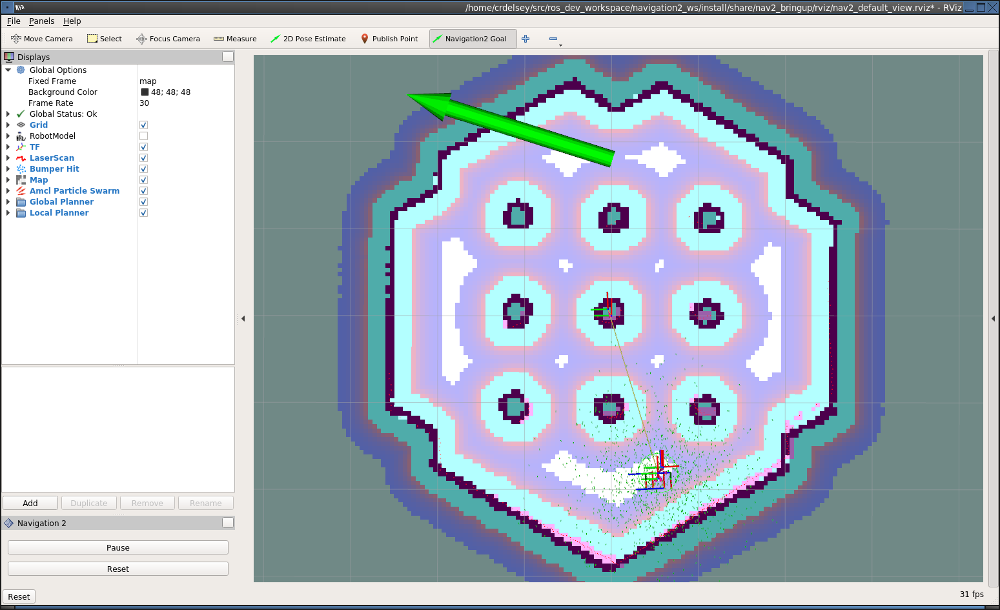
途中的一团复杂的彩色线段堆砌的位置就是机器人所在处，巨大的绿色箭头的起点是机器人移动的目标点，方向是机器人最终朝向，松手后机器人就会自动寻路移动

#### 安装与编译
##### 安装
在$\mathbf{Ubuntu20.04}$以上的版本，使用
```bash
sudo apt install ros-jazzy-navigation2 ros-jazzy-nav2-bringup ros-jazzy-turtlebot3*
```
来安装nav2
##### 编译
安装好后需要进行编译
先创建一个名为`nav2_ws`的工作空间，进到其下的`src`文件夹内，随后将nav2分支功能包克隆到这个目录下：（在humble或foxy版本中需要将`main`改为对应的`<ros2-distro>-devel`）
```bash
git clone https://github.com/ros-planning/navigation2.git --branch main
```
然后退回到`nav2_ws`目录下，用rosdep获取所有依赖项
```bash
rosdep install -y -r -q --from-paths src --ignore-src --rosdistro jazzy
```
然后使用
```bash
colcon build --symlink-install
```
进行软链接编译
（注意，直接进行编译可能会导致并行编译强制跑满所有内存和cpu直接卡死重启，为了避免这种情况，可以考虑设置交换内存为16~32G，同时进行限制性编译（即限制编译时只能一次编译一个项目等）例如：
```bash
MAKEFLAGS="-j1" colcon build --symlink-install --executor sequential --parallel-workers 1
```
这意味着一次进行一个项目编译，绝不多占用，这样不会导致卡死，但是仍有一个问题就是可能会出现编译器无法识别到`.hpp`文件的情况（明明存在且找到），这时候最好直接安装二进制版，不再折腾此编译，这里我们以二进制版本继续）
输入
```bash
rm -rf ~/nav2_ws/src/navigation2
```
可以删除之前编译的源代码，使用
```bash
sudo apt install ros-jazzy-navigation2 ros-jazzy-nav2-bringup ros-jazzy-turtlebot3-gazebo
```
安装二进制版
同时再使用
```bash
sudo apt install ros-jazzy-nav2-loopback-sim ros-jazzy-nav2-bringup ros-jazzy-turtlebot3-gazebo
```
安装```nav2_loopback_sim```，因为jazzy将nav2拆分的更细，光靠上面的无法安装全部
（如果是在折腾全部编译中途传过来二进制版，则很可能遇到环境污染，此时需要删除编译产物
```bash
cd ~/nav2_ws
rm -rf build/ install/ log/
```
记得设置环境变来嗯
```bash
export TURTLEBOT3_MODEL=burger
export GAZEBO_MODEL_PATH=$GAZEBO_MODEL_PATH:/opt/ros/jazzy/share/turtlebot3_gazebo/models
```
）
随后使用```ros2 launch nav2_bringup tb3_simulation_launch.py headless:=False```就能启动仿真了
如果不走二进制安装，且实在无法编译源码，可以使用$\mathbf{Docker}$容器，这里不详细展开

### 导航相关概念
#### 生命周期节点
该节点为ros2独有的节点，和普通节点（`rclcpp::Node`）不一样，生命周期节点（`rclcpp_lifecycle::LifecycleNode`）引入了状态机，它被划分为
- **未配置**$-\mathbf{Unconfigured}$
- **未激活**$-\mathbf{Inactive}$
- **激活**$-\mathbf{Active}$
- **已结束**$-\mathbf{Finalized}$

四个状态
同时必须通过外部指令（或者launch）手动触发它的状态转换
|          |普通节点                |生命周期节点                  |
|----------|----------------------|-----------------------------|
|逻辑执行时间|构造函数完成            |进入Active状态                |
|配置灵活性  |运行时修改参数较麻烦     |可在Inactive状态下完成配置再激活|
|确定性     |低（节点启动顺序不确定等）|高                           |

在nav2中，我们可以使用`nav2_util LifecycleNode`这个包装器，它统一了原有的复杂逻辑并简化了操作，同时它还拥有一个`bond`，这个东西用于连接**生命周期管理器**与各个导航服务，如果`bond`断开，管理器认为服务器不一定处于Active状态，无法信任，会直接**向下过渡**，让所有的导航节点都变为Inactive或者Unconfigured状态

*在后文学习了`nav2_params.yaml`文件的配置后再往下看横线内的内容*

---
生命周期节点统一由`lifecycle_manager`控制，如果想要增加自己的生命周期节点，需在某个launch文件中修改，如果目前是遵照官方的教程，使用`bringup_launch.py`和其调用的`navigation_launch.py`启动的话，那就在这两个文件中找到启动`lifecycle_manager`的那一个文件进行修改，例如添加一个自定义`sensor_driver`节点：
```py
lifecycle_nodes = ['sensor_driver',
                   'controller_server',
                   'smoother_server',
                   'planner_server',
                   'behavior_server',
                   'bt_navigator',
                   'waypoint_follower']
...
Node(
    package='nav2_sensor_driver',
    executable='sensor_driver',
    name='sensor_driver',
    output='screen',
    parameters=[configured_params],
    remappings=remappings),
Node(
    package='nav2_lifecycle_manager',
    executable='lifecycle_manager',
    name='lifecycle_manager_navigation',
    output='screen',
    parameters=[{'autostart': autostart},
                {'node_names': lifecycle_nodes}]),
```
`lifecycle_manager_navigation`需要填入`lifecycle_nodes`作为参数记录节点名，而我们要添加的新节点名称就添加到`lifecycle_nodes`里，并额外新定义一个节点`Node`

---

#### 有限状态机($\mathbf{Finite~State~Machine,~FSM}$)
状态机是一种数学模型，描述了一个对象在其生命周期内所经历的状态，以及由于触发事件而导致的状态转换
有限状态机-FSM就是有限个状态，包含
- 有限个状态
- 转换条件
- 状态动作

它的局限性是当逻辑变得复杂，异常情况会增多，难以维护

#### 行为树($\mathbf{Behaviour~Tree,~BT}$)
在这里仅简要介绍，具体可阅读《Behaviour Tree in Robotics and AI》（https://arxiv.org/abs/1709.00084）
假如有若干个状态，FSM就像是网状结构，状态就是各个网络中的节点，自由切换，但是逻辑复杂起来就异常庞大，难以维护
而BT就是一棵树，状态就是各个节点，例如有四个状态A,B,C,D，其中B，D是A的子节点，C是B的子节点
当切换状态时，A会每秒发出多次信号脉冲（$\mathbf{Tick}$），这个tick会一直往下深探，直到到达某个节点后它返回**成功**或者**失败**，如果失败则往回走，如果成功则停下来，若这个节点只是一个**策略**，那么就直接继续走，在这里它经过B到达C，此时B根据C返回的信号决定是否回到A还是继续走或者停止继续
举个例子：
假如A是一个选择节点，B是走路，D是原地自旋，C是前进
A先发射tick到B，经过B到达C，如果确实可以前进，那就在这里停止，否则就返回失败信号，此时A知道B这个路走不通，就去D，再重复以上逻辑
Nav2使用`Behaviour CPP V3`作为行为树库，它可以加载子树，也就是说可以将一个nav2项目的BT加载到另一个更高级别的BT中，从而将其作为插件，同时它还提供了一个NavigationToPoseAction插件，可以从客户端应用程序通过通常的动作接口调用Nav2软件堆栈

#### 导航服务器
规划器和控制器是导航任务的核心，恢复器用于使机器人摆脱不良状态或尝试处理各种形式的问题，以使系统具有容错能力

##### 规划器、控制器和恢复器
在ros2中，这三个服务器以Action Server形式存在，并由BT统一管理调用
它们都托管于一个**地图算法插件**，即**代价地图**$-\mathbf{Costmap~2D}$（被实现为pluginlib插件）及其相关插件层
- 地图算法插件
  所有的导航服务器都托管于代价地图上，规划器托管于**全局代价地图**（关注整张地图），控制器托管于**局部代价地图**（关注机器人周边局部地图）
  这个插件则是代价地图的层级结构，分为
  - **静态层**
    提供自地图的`.yaml`文件，记录的是死物
  - **障碍物层**
    来自激光雷达或者摄像机，捕捉的是活物或动物
  - **膨胀层**
    给障碍物画一个警戒圈，警示机器人与墙的距离

规划器和控制器都需要在运行时配置一个配置名称（任务别名）和使用的算法类型（已注册的插件库的名称）
例如使用名为`FollowPath`的DWB控制器，此时DWB的所有参数都会放置在该命名空间中，例`FollowPath.<param>`
然后这两个服务器会公开任务对应的操作接口，以便调用所选算法
对于恢复器，它类似于备选方案，即用于给机器人不同方案执行后出现问题后的备选方案，其公共接口一般是原地旋转、等待、后退、清理代价图层等
它主要由BT监控并调用，而不是用户

#### 航点跟随
航点跟随是导航系统的基本功能之一，它会告知系统如何使用导航程序到达多个目的地
`nav2_waypoint_follower`软件包含一个航路点和跟踪程序，它一般有两种主要的实现思想，即哑机器人应用程序+智能集中式调度器和智能机器人应用程序+哑集中式调度器
区别在于统一由调度器考虑所有信息还是分给各部分分别考虑

#### 状态估计
在导航项目中，需要提供两个主要的坐标转换：
- map 到 odom 的坐标变换由定位系统（定位，建图，SLAM）提供
- odom 到 base_link 的坐标转换由里程计系统提供

$\mathbf{REP-105}$(https://www.ros.org/reps/rep-0105.html)表示至少必须为机器人建造一个包含``map`` -> `odom` -> `base_link` -> `[sensor frames]/base_laser` 的完整的TF树，TF2是ROS 2中的时变坐标变换库，Nav2使用TF2来表达和获取时间同步的坐标变换
全球定位系统 (GPS、SLAM-同步定位与建图、动作捕捉Motion Capture) 的工作是至少要提供 `map` -> `odom` 的坐标转换
然后，里程计系统的作用是提供 `odom` -> `base_link` 的坐标转化
关于 base_link 的其余坐标转换应该是静态的，并应在 URDF 中定义
`map`是全局地图坐标系，`odom`是里程计坐标系，`base_link`是机器人中心坐标系，`base_laser`是传感器坐标系
这个`map` -> `odom` -> `base_link` -> `base_laser`转换实际上是
`base_laser`传感获取数据，处理为`base_link`坐标系下的数据，再处理为给`odom`坐标系下使用的数据，最后处理为`map`即整张地图的数据（类似于一个坐标）
这样的处理就是为了给导航服务器等其他东西使用的，用于规划和执行机器人运动方案
为什么要多一个odom？为什么不直接把转换到odom这一步的数据直接当成map处理？
因为里程计有误差，从odom到map这一步转换通过AMCL-**自适应蒙特卡洛定位**插件得出，即一个微小的数据修正处理
最后得到的map才是精准的数据

#### 地图过滤器
我们可以对地图文件进行**注释**，即可以将某些区域排除在外避免在这些区域内进行路径规划，这种带注释的地图称为$\mathbf{Filter~mask}$
这个地图过滤器基于成本地图插件实现

### 配置一个机器人
#### urdf
使用urdf可以快速建模一个机器人，语法和`.xml`是一样的，本节内容在`Ros2 for learning`中已学习，假设我们已经有一个urdf建模的机器人，它拥有四个轮子，长方体身体，一个雷达
切记定义一个机器人需要定义它的`visual`、`collision`，如果需要更为专业，需要额外定义`inertial`，关于这个标签-物理属性的惯性 的相关公式，可以直接网上查询到
同时各个关节之间也需要标签`joint`链接，这个标签可以用于发布静态tf转换（注意`odom` -> `base_link`是动态转换）

#### 里程计系统
我们可以从各种传感器硬件中获取里程计信息，如IMU($\mathbf{Inertial~Measurement~Unit}$)-惯性测量单元、LIDAR、RADAR等，odom框架与之相关
里程计系统主要用于解决机器人局部的运动问题（局部的轮胎打滑、运动漂移、运动不稳等）
这个`odom` -> `base_link`的转换一般由tf2或诸如`robot_localization`等的框架发布
这个`robot_localization`会订阅各个有关机器人位姿和运动参数（传感器IMU、车轮编码器等），通过一系列矫正算法（EKF、UKF等）计算出最合适的转换并发布，和`map` -> `odom`不同的是，这个转换着重于在整个地图上的精确位置，而这个`robot_localization`则是关注于机器人的局部
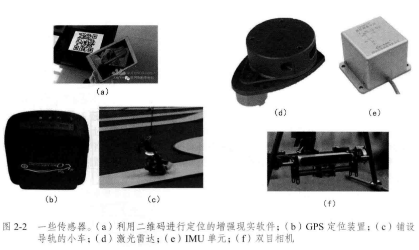
在编写仿真机器人时，其核心代码（一般由python或c++编写的ros2节点代码）应具备TF2的`odom` -> `base_link`的转换以及也要发送消息至Nav2的`nav_msgs/Odometry`，它应包含以下信息：
```bash
# This represents estimates of position and velocity in free space.
# The pose in this message should be specified in the coordinate frame given by header.frame_id
# The twist in this message should be specified in the coordinate frame given by the child_frame_id

# Includes the frame id of the pose parent.
std_msgs/Header header

# Frame id the pose is pointing at. The twist is in this coordinate frame.
string child_frame_id

# Estimated pose that is typically relative to a fixed world frame.
geometry_msgs/PoseWithCovariance pose

# Estimated linear and angular velocity relative to child_frame_id.
geometry_msgs/TwistWithCovariance twist
```
这个信息是发给规划器的，而前面发布的tf转换是给rviz看的
我们还可以设置这个类型为`nav_msgs::msg::Odometry`发布到规划器的信息`odom`中的协方差矩阵参数`odom.pose.covariance[i]`，在其对角线上的部分位置设置为$1\mathrm{e}-9$表示更相信模拟数据
最后注意整个tf树应该是`odom` -> `base_footprint` -> `base_link` -> `other`
注意不要在`.urdf`里写错`<parent link>`和`<child link>`

#### $\mathbf{Gazebo}$
在进入下一步前，可以先在urdf中集成gazebo插件，它可以接管我们原本写的核心框架中负责**监听`/cmd_vel`并发布`odom`和TF**的工作
既然是在urdf中集成，那我们需要直接修改`.urdf.xacro`（如果没有使用xacro则修改`.urdf`），在`</robot>`标签前添加：
```xml
<gazebo>
    <plugin
        filename="gz-sim-diff-drive-system"
        name="gz::sim::systems::DiffDrive">
        <left_joint>front_left_wheel_joint</left_joint> 
        <right_joint>front_right_wheel_joint</right_joint>

        <wheel_separation>${chassis_width + wheel_width}</wheel_separation>
        <wheel_radius>${wheel_radius}</wheel_radius>

        <topic>cmd_vel</topic>
        <odom_topic>odom</odom_topic>
        <frame_id>odom</frame_id>
        <child_frame_id>base_footprint</child_frame_id>
        <publish_odom_tf>true</publish_odom_tf>
    </plugin>

    <plugin
        filename="gz-sim-joint-state-publisher-system"
        name="gz::sim::systems::JointStatePublisher">
        <topic>joint_states</topic>
    </plugin>
</gazebo>
```
其中在humble版本下会有`<gazebo reference="link_name">`即包含的内容表示重新识别机器人在仿真环境中的颜色（因为gazebo使用不同的渲染引擎不识别urdf中的`<material>`标签），这个标签内还可定义摩擦力（如`<mu1>`等标签），在jazzy版gazebo进行了大更新，许多旧版的规则不适用，目前不用写这个标签的原因可能是渲染引擎已经可以自动识别
随后的`<gazebo>`标签内的内容主要是把这个机器人的属性添加到gazebo中，让gazebo“认识”这个机器人，最后的
```xml
<topic>cmd_vel</topic>
<odom_topic>odom</odom_topic>
<tf_topic>/tf</tf_topic>
<frame_id>odom</frame_id>
<child_frame_id>base_footprint</child_frame_id>
<publish_odom_tf>true</publish_odom_tf>
<use_gz_time>true</use_gz_time>
```
分别表明订阅速度的话题名称？里程计的话题名称？tf树话题名称？里程计的坐标系名称？里程计要转换到的机器人基准点坐标系名称？以及是否发布tf转换？是否使用gazebo仿真时间？
配置好后gazebo会代替原本核心框架中的三件事：
- 订阅`/cmd_vel`并发布速度，它会根据物理学推导最终机器人的位姿
- 物理仿真
- 发布里程计话题`/odom`和TF变换（`odom` -> `base_footprint`）

之后还需要写一个新的launch文件，负责启动robot state publisher、Gazebo、调用`spawn_entity`节点-负责将机器人模型添加到gazebo里、bridge桥接节点-桥接gazebo和ros2的话题（gazebo内部使用$\mathbf{gz~transport}$协议，而ros2内部使用$\mathbf{DDS}$协议，这样会导致ros2无法通过`ros2 topic list`等获取数据）
（注意：使用jazzy下的gazebo应提前用
```bash
sudo apt install ros-jazzy-ros-gz
```
安装gazebo依赖，同时`spawn_entity`节点在新版gazebo下的可执行程序变为了`create`，位于`/opt/ros/jazzy/lib/ros_gz_sim`，而gazebo的launch文件变为了`gz_sim.launch.py`，位于`/opt/ros/jazzy/share/ros_gz_sim/launch`，以及最重要的一点，必须先提前为gazebo设定好预设场景，否则一开始机器人就往下掉，因为没有地板，可以使用`empty.sdf`或`shapes.sdf`）

#### 配置传感器
在开始配置传感器前，先在urdf中建模出雷达，同时也要给他各种物理属性（碰撞箱和惯性）
随后我们在`laser_joint`的`</joint>`标签后添加
```xml
<gazebo reference="laser_link">
    <sensor name="gpu_lidar" type="gpu_lidar">
        <topic>scan</topic>
        <pose>0 0 0 0 0 0</pose>
        <frame_id>laser_link</frame_id>
        <gz_frame_id>laser_link</gz_frame_id>
        <visualize>true</visualize> <update_rate>10</update_rate>
        <lidar>
            <scan>
                <horizontal>
                    <samples>360</samples>
                    <resolution>1</resolution>
                    <min_angle>-3.14159</min_angle>
                    <max_angle>3.14159</max_angle>
                </horizontal>
            </scan>
            <range>
                <min>0.12</min>
                <max>12.0</max>
                <resolution>0.01</resolution>
            </range>
        </lidar>
        <plugin filename="gz-sim-sensors-system" name="gz::sim::systems::Sensors">
            <render_engine>ogre2</render_engine>
        </plugin>
    </sensor>
</gazebo>
```
这段代码表明雷达是一个`gpu_lidar`类型（利用显卡扫描而不是cpu）的雷达，第一个`<topic>`标签用于告诉gazebo将扫描的信息发到`/scan`话题，否则它会发到自己的一个长的话题，后面的`<pose>`标签则分别表示相对于原`laser_link`分别在`x y z r p y`上的偏移量，这里的`<frame_id>`和`<gz_frame_id>`标签可能很重要，它告诉rviz雷达消息来源于这个坐标系，`<visualize>`标签表示显示扫描光束，下一个标签明显是扫描频率（单位是$\mathrm{Hz}$）
之后`<scan>`标签里的内容是2D扫描参数
- `<samples>`
  表示一圈扫描产生360个采样点
- `<min/max_angle>`
  表示扫描范围，这里是全方位扫描

之后的`<range>`标签表示测距范围，里面的第三个标签表示传感器能识别$1\mathrm{cm}$级别的距离变化
后面就是插件加载标签了，`orge2`是指定的渲染引擎
这里时间戳同步非常重要，请注意启动rviz2时它的时间戳是仿真时间内的（启动左下角看时间），同时也要注意tf2 monitor给出的时间戳延迟（Net Delay）最好为0
我们也可以添加一个摄像头，用来捕捉图像，只需要在urdf的`<gazebo>`标签下建立和`<sensor>`同标签的另一个`<sensor>`标签下有`<camera>`标签：
```xml
<sensor name="camera" type="camera">
    <pose>0.2 0 0.2 0 0 0</pose> <update_rate>30</update_rate>
    <frame_id>laser_link</frame_id>
    <gz_frame_id>laser_link</gz_frame_id>
    <visualize>true</visualize>
    <topic>camera/image_raw</topic> 
    <camera>
        <horizontal_fov>1.089</horizontal_fov>
        <image>
            <width>640</width>
            <height>480</height>
            <format>R8G8B8</format>
        </image>
        <clip>
            <near>0.05</near>
            <far>8.0</far>
        </clip>
    </camera>
</sensor>
```
同时在py的桥接器节点中添加图像和摄像机信息的传输：
```py
...
'/camera/image_raw@sensor_msgs/msg/Image@gz.msgs.Image',
'/camera/camera_info@sensor_msgs/msg/CameraInfo@gz.msgs.CameraInfo',
...
```
最后放入两个障碍物并将rviz2中的`/scan`话题下的`LaserScan`添加，再将这个下的`Topic`下的`Reliability Policy`改为`Best Effort`，就能看到扫描的红色轨迹，之后添加`/camera/image_raw`话题下`Image`添加，就能在左下角看到捕捉的图了，效果大概是这样：
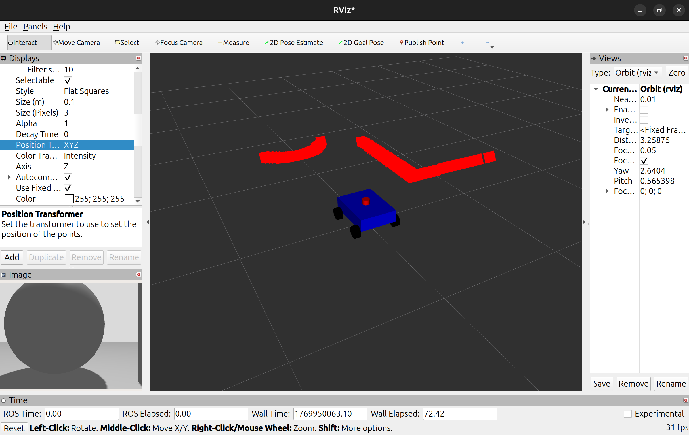
同时如果场景选择的是`sensors.sdf`，能在gazebo里看到
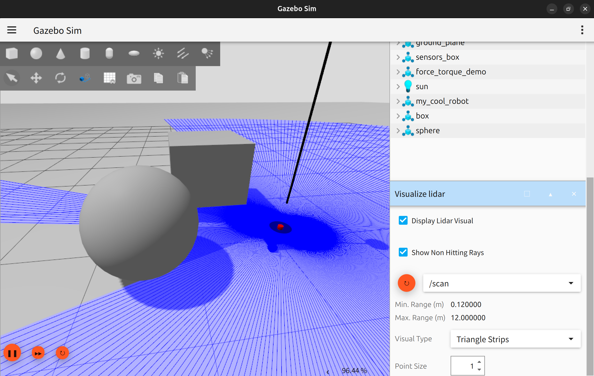

#### 配置$\mathbf{Footprint}$
`footprint`和我们之前定义的`base_footprint`不一样，`footprint`是机器人在底面的投影，说白了就是碰撞面积，用于给规划器规划路径作为参考数据，而`base_footprint`是机器人中心在底面的投影
`footprint`更表示多边形，如果你的机器人不需要很精确的碰撞，改用`robot_radius`可直接使用半径表示碰撞面积
我们需要一个`nav2_params.yaml`文件来配置相关信息，https://github.com/ros-navigation/navigation2_tutorials/blob/rolling/sam_bot_description/config/nav2_params.yaml 是一个官方提供的nav2教程包里的默认nav2 yaml文件（最新版本下），按理来说一般不通用，因为我们没有按照教程包编写机器人，但是这个确实能让我们的代码跑起来，我们将`robot_radius`那一栏（一共有两处，全局代价地图和局部代价地图，全局代价地图上的可以不改）改为`footprint`，输入格式为
```py
footprint: "[ [0.2, 0.15], [0.2, -0.15], [-0.2, -0.15], [-0.2, 0.15] ]"
```
类似这样按顺时针或逆时针的方式输入所有角点即可，`robot_radius`可填$0.25$
我们编译运行gazebo后，运行
```bash
ros2 run tf2_ros static_transform_publisher 0 0 0 0 0 0 map odom
```
来发送一个`map` -> `odom`的转换
随后用
```bash
ros2 launch nav2_bringup navigation_launch.py params_file:=$HOME/nav2_test/src/my_nav2_robot/config/nav2_params.yaml 
```
运行`nav2_params.yaml`文件，按理来说不出现各种`[ERROR]`和`[FATAL]`信息，再在rviz中添加两个`Polygon`，应该能看到如下场景（记住`Fixed Frame`要设置为`map`）
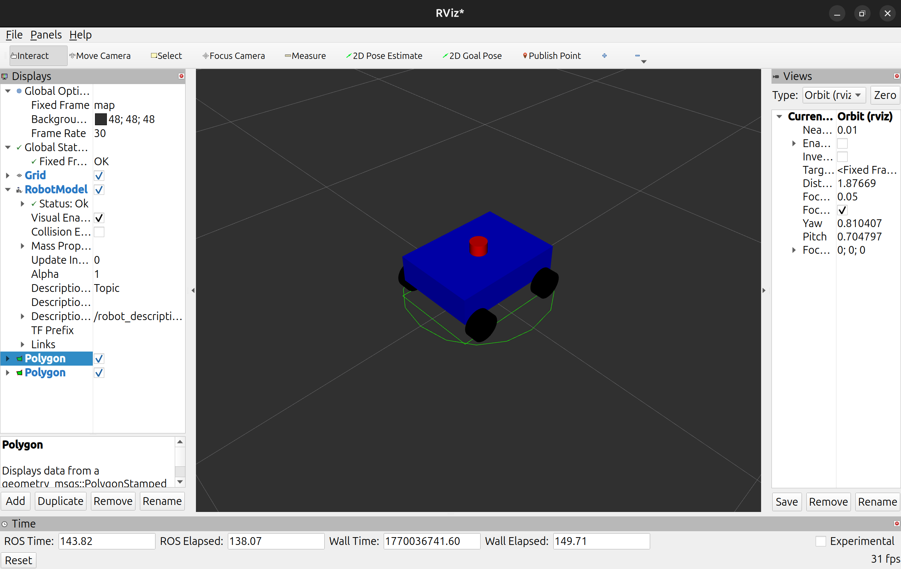
（注意：在挪用别人的`nav2_params.yaml`时，需要注意修改`robot_base_frame`、`odom_frame`、`global_frame`（一般是`map`）和urdf里一致，同时`observation_sources`下的`topic`要和你的扫描话题`/scan`一致，最后就是其他机器人的动力学约束，和你本身的机器人一致，最重要的是$\mathbf{MPPI/DWB}$控制器参数和激光雷达的`max_obstacle_height`，同时注意类型对齐，即如果`/cmd_vel`的类型不带`Stamped`，应该在文件中将所有地方的`enable_stamped_cmd_vel`全都设置为`false`）
在地图方面，由于官方的`.yaml`文件所在的教程包内自带地图文件，如果想不使用地图文件运行，建议在`global_costmap`下新增`rolling_window`设置为`true`，然后将`plugins`的`static_layer`去掉，同时安装slam
```bash
sudo apt install ros-jazzy-slam-toolbox
```
我们最好先将`robot.urdf.xacro`内的`<publish_odom_tf>`设为`false`
随后先运行
```bash
ros2 launch slam_toolbox online_async_launch.py use_sim_time:=True
```
再运行nav2
```bash
ros2 launch nav2_bringup bringup_launch.py use_sim_time:=True params_file:=$HOME/nav2_test/src/my_nav2_robot/config/nav2_params.yaml
```
需要注意的是，这次我们使用`bringup_launch.py`启动，它还多启动了`amcl`和`map_server`节点
这时slam会自动扫描并建图，同时也会自动发布`map` -> `odom`的转换
如果你的小车是四轮，在`<gazebo>`中设置两个轮标签时可能会导致后续gazebo转动时由于另外两个轮摩擦力太大导致gazebo中无法转动，rviz中可以转动但是`LaserScan`的扫描物也会一起转动，这很可能是摩擦力和扭矩的问题，我们可以设置
```xml
<gazebo reference="rear_left_wheel_link">
    <mu1>0.01</mu1> 
    <mu2>0.01</mu2>
</gazebo>
<gazebo reference="rear_right_wheel_link">
    <mu1>0.01</mu1>
    <mu2>0.01</mu2>
</gazebo>
```
以及
```xml
<max_wheel_torque>200</max_wheel_torque> ```
```
设置两轮摩擦力和最大扭矩
在这里**扭矩**$(\mathbf{Torque})$指的是让物体绕轴转动的力，它的方向实际上平行于转动轴，遵循右手定则（即如果扭矩是正的，那就是大拇指方向为扭矩方向，其余四指方向为旋转方向（逆时针），反之亦然），公式为$$
\vec{\tau}=\vec{r}\times\vec{F}$$即扭矩矢量=力臂矢量$\times$力矢量
这里扭矩很像另一个概念**旋度**$(\mathbf{Curl})=\nabla \times F$，用于衡量向量场中某点的旋转程度，方向和扭矩一致
完成一切后启动整个项目，在`2D Pose Estimate`选定机器人位置后再`2D Goal Pose`选定目标点后应该能看到机器人正常规划路径
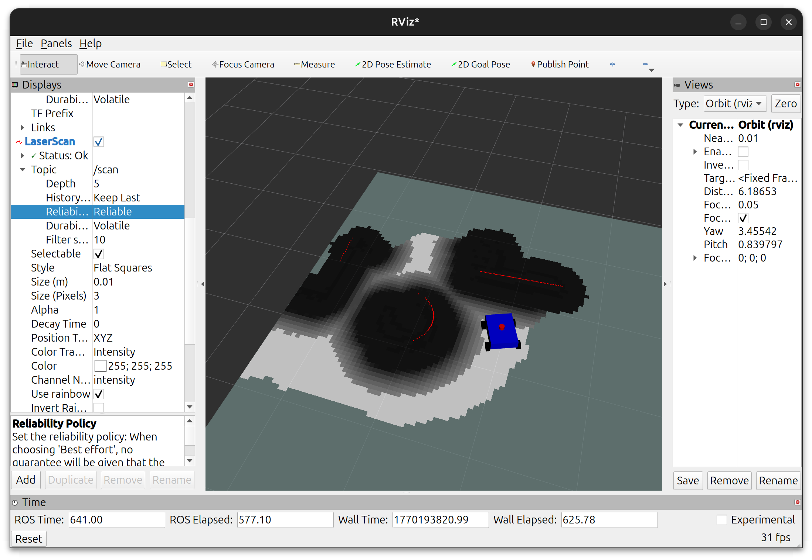
编写这个`nav2_params.yaml`实际上就已经开始为规划器(`planner server`)和控制器(`controller server`)配置了，目前的这个`nav2_params2.yaml`文件为规划器配备了`NavfnPlanner`插件，支持$\mathbf{Dijkstra}$算法和$\mathbf{A}^*$算法，控制器配备了`MPPIController`插件，基于模型预测路径积分
对规划器：
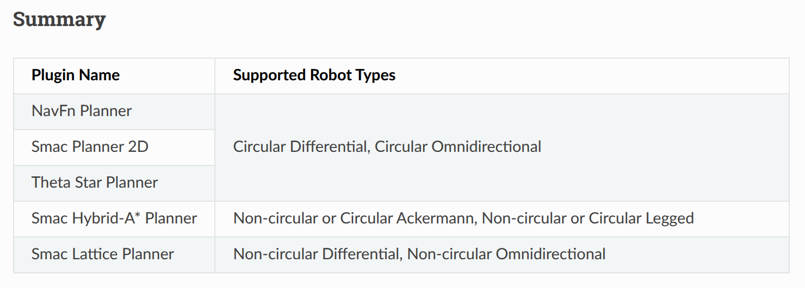
示例：
```py
planner_server:
  ros__parameters:
    planner_plugins: ['GridBased']
    GridBased:
      plugin: 'nav2_navfn_planner::NavfnPlanner' # In Iron and older versions, "/" was used instead of "::"
```
对控制器：
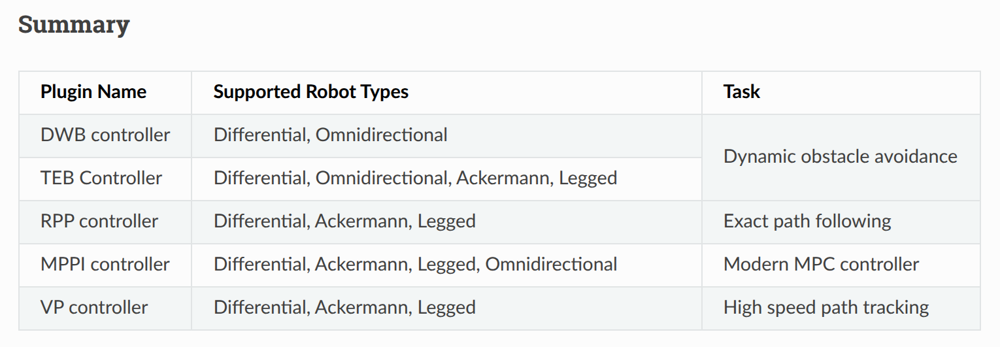
示例：
```py
controller_server:
  ros__parameters:
    controller_plugins: ["FollowPath"]
    FollowPath:
       plugin: "dwb_core::DWBLocalPlanner"
```

#### 组件
**组件**，$\mathbf{Composition}$，首先我们要知道nav2启动后，如果没有组件，那么所有节点都单独占一个线程运行，这样做不仅很消耗cpu资源和内存，并且节点互相通信时需要拷贝大量信息来交流
如果开启组件，那么就相当于让所有节点都在一个线程运行，不仅节省内存和cpu资源，通信也无需拷贝，实现0拷贝通信
如何实现？组件提供了一个**容器**的概念，节点放入容器后，容器内的所有节点就会在同一个线程同时运行，所以我们也可以实现多个容器，存放不同数量不同类型的节点，使得同时存在若干个线程分别同时运行着若干个节点，例如
```py
container = ComposableNodeContainer(
    name='my_container',
    namespace='',
    package='rclcpp_components',
    executable='component_container',
    composable_node_descriptions=[
        ComposableNode(
            package='nav2_route_server',
            plugin='nav2_route_server::RouteServer',
            name='nav2_route_server'),
    ],
    output='screen',
)
```
创建了一个新容器`container`，里面有一个名为`nav2_route_server`的节点，如果想要更多节点，直接在`composable_node_descriptions`内用`ComposableNode`描述即可
这个代码写到官方提供的`navigation_launch.py`中（如果自己没有写自己叠nav2启动的launch文件）
随后必须将包含服务器的功能包添加到`packages.xml`中
```xml
<exec_depend>nav2_route_server</exec_depend>
```

#### 地图系统
nav2中地图使用代价地图为模式，它包含三个层
- 静态层$-\mathrm{Static~Layer}$
  来源于`map_server`加载的`.yaml`和`.pgm`文件，提供一些固定障碍物
- 障碍物层$-\mathrm{Obstacle~Layer}$
  来源于激光雷达和深度相机，实时感知静态层、地图上没有的东西（箱子，路人等）
- 膨胀层$-\mathrm{Inflation~Layer}$
  通过计算机器人的footprint数据，为地图障碍物周边附加若干层，防止机器人碰撞

一般来说一个`map_server`需要这其中的第一、三个层（在`nav2_params.yaml`编写），其中第一个层需要传入地图文件`.pgm`和`.yaml`，同时你也需要启动`amcl`进行**蒙特卡洛法**定位机器人在地图的位置，如果暂时没有地图文件，那就可以去掉第一个层，使用slam进行建图，同时需要设置地图滚动模式（`rolling_window`），这样就会使用雷达全方位扫描来进行建图，此时就不需要开启`amcl`了，因为正在即时建图
你也可以用slam跑过一次地图生成`.yaml`和`.pgm`后，使用`amcl`记载两个地图文件，关掉slam进行运行
即先控制机器人跑完整张图，等地图形成差不多后，在新控制台输入
```bash
ros2 run nav2_map_server map_saver_cli -f map1
```
可以保存一个名为`map1`的`.yaml`和`.pgm`文件在当前目录下（你需要先`cd`到你功能包的`maps`目录下）
下次启动时关掉slam，加载地图，把静态层加回来，关掉滚动窗口就可以进入导航模式（但是此时gazebo是不会有模型的，因为他的地图文件是`.world`和`.sdf`），最后要**记得**将`maps`目录添加到cmake文件中进行安装，之后编译刷新环境，否则无法找到map文件加载，以及在这个情况下你的`map` -> `odom`转换需要手动发布（没错`amcl`不会给你发布这个tf），如果建图顺利的话，在nav模式下能看到
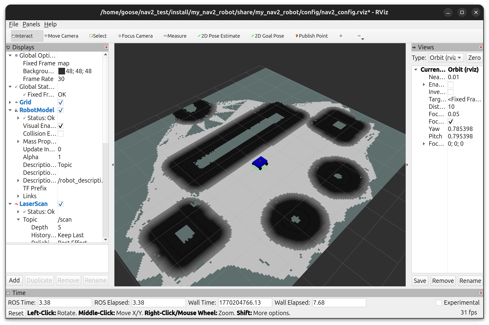

#### 小建议
写一个`full_navigation.launch.py`同时启动`gazebo_sim.launch.py`、`bringup_launch.py`、rviz配置文件（打开一个新的rviz，想要保存目前rviz的面板（配置），可以选左上角$\mathrm{File>Save~Config~as}$保存`.rviz`文件到`config`目录下（这个目录记得也要通过cmake安装），在后面的rviz配置启动文件可以填这个），可能还有`slam_toolbox`、静态`map` -> `odom`转换等
这样能显著提升效率，至于选择分支可以用一个变量`slam_mode`判断选择slam模式还是nav模式，同时也要进行对不同模式下`.yaml`文件的区分，推荐使用`IfCondition/UnlessCondition`或`PythonExpression`库

### $\mathbf{Nav2}$行为树
#### 动作节点$-\mathbf{Action~Nodes}$
作为动作客户端调用nav2的各个（动作）服务器
- **`ComputePathToPose`**
  规划器接口，用于计算两点之间的路径，如果可以计算出来，则返回`SUCCESS`，否则返回`FAILURE`
- **`FollowPath`**
  控制器接口，控制机器人沿着生成的路径移动，走完是`SUCCESS`，走时是`RUNNING`，装障或走丢返回`FAILURE`
- **`Spin \ Wait \ BackUp`**
  旋转、等待、后退，只有当机器人卡住时它们才会执行上面三个运动，在主任务失败时出来执行
- **`ClearCostmapService`**
  服务客户端，用于清除Costmap消除传感器留下来的虚假障碍物

#### 条件节点$-\mathbf{Condition~Nodes}$
监察系统状态，结果为`True`返回`SUCCESS`、为`False`返回`FAILURE`
- **`GoalUpdated`**
  监听目标话题用于更新机器人的目的地，可以即使更新在rviz上点出的新目标点
- **`GoalReached`**
  监听机器人为姿检测机器人目前的位置是否与目标点重合
- **`IsBatteryLow`**
  监听电池话题检测电量是否充足
- **`InitialPoseReceived`**
  检查是否收到了`initial_pose`话题上的位姿信息

#### 装饰节点$-\mathbf{Decorator~Nodes}$
用于约定子节点的运行频率和触发时机
- **`RateController`**
  限制子节点的每秒运行频率(tick)
- **`DistanceController`**
  限制机器人行走到足够的距离后再重新计算路径
- **`GoalUpdater`**
  通过BT端口（传到其他节点之前）更新目标位置（根据动态障碍物微调）
- **`SpeedController`**
  根据机器人的行驶速度调整子节点的运行频率(tick)
- **`SingleTrigger`**
  只运行一次的节点，第一个tick时，它会执行，正在执行返回`RUNNING`，完成了且成功了返回`SUCCESS`，完成后无论到达几个tick，都返回`FAILURE`

#### 控制节点$-\mathbf{Control~Nodes}$
- **`PipelineSequence`**
  形象的说就是一个带顺序的并行运行节点，它允许每个子节点返回`SUCCESS`后执行下一个子节点，而当任何一个子节点返回`RUNNING`时，它都会重新tick之前的节点，保证顺序上节点的并行运行，如果某个节点返回`FAILURE`，它会杀死之后的所有任务，父节点（本身）返回`FAILURE`
  为什么不用`Parallel`？因为它无法做到带**顺序**并行运行，例如`FollowPath`和`ComputePathToPose`，它们通常都是`PipelineSequence`下的两个子节点，前者必须依赖后者计算的路径，否则顺序不一致会发生错误
- **`RecoveryNode`**
  专门处理失败的情况，它有通常有两个节点，一个是主行为（如导航），如果返回了`FAILURE`代表失败了，则执行第二个子节点（如原地旋转），如果返回`SUCCESS`，重试主行为，如果主行为随后返回`SUCCESS`，父节点返回`SUCCESS`
- **`RoundRobin`**
  **轮询**方式tick子节点，知道某个子节点返回`SUCCESS`，它就会返回`SUCCESS`，否则返回`RUNNING`，如果所有子节点都返回`FAILURE`，那么就停止轮询

如下是一个BT例图
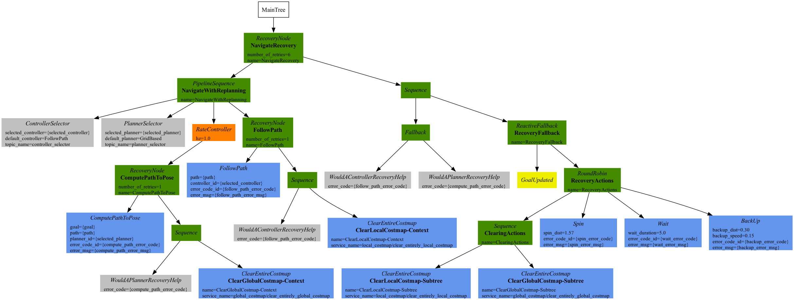
它在`.xml`中的代码是这样的
```xml
<root BTCPP_format="4" main_tree_to_execute="MainTree">
    <BehaviorTree ID="MainTree">
        <RecoveryNode number_of_retries="6" name="NavigateRecovery">
            <PipelineSequence name="NavigateWithReplanning">
                <ControllerSelector selected_controller="{selected_controller}" default_controller="FollowPath" topic_name="controller_selector"/>
                <PlannerSelector selected_planner="{selected_planner}" default_planner="GridBased" topic_name="planner_selector"/>
                <RateController hz="1.0">
                    <RecoveryNode number_of_retries="1" name="ComputePathToPose">
                        <ComputePathToPose goal="{goal}" path="{path}" planner_id="{selected_planner}" error_code_id="{compute_path_error_code}" error_msg="{compute_path_error_msg}"/>
                        <Sequence>
                            <WouldAPlannerRecoveryHelp error_code="{compute_path_error_code}"/>
                            <ClearEntireCostmap name="ClearGlobalCostmap-Context" service_name="global_costmap/clear_entirely_global_costmap"/>
                        </Sequence>
                    </RecoveryNode>
                </RateController>
                <RecoveryNode number_of_retries="1" name="FollowPath">
                    <FollowPath path="{path}" controller_id="{selected_controller}" error_code_id="{follow_path_error_code}" error_msg="{follow_path_error_msg}"/>
                    <Sequence>
                        <WouldAControllerRecoveryHelp error_code="{follow_path_error_code}"/>
                        <ClearEntireCostmap name="ClearLocalCostmap-Context" service_name="local_costmap/clear_entirely_local_costmap"/>
                    </Sequence>
                </RecoveryNode>
            </PipelineSequence>
            <Sequence>
                <Fallback>
                    <WouldAControllerRecoveryHelp error_code="{follow_path_error_code}"/>
                    <WouldAPlannerRecoveryHelp error_code="{compute_path_error_code}"/>
                </Fallback>
                <ReactiveFallback name="RecoveryFallback">
                    <GoalUpdated/>
                    <RoundRobin name="RecoveryActions">
                        <Sequence name="ClearingActions">
                        <ClearEntireCostmap name="ClearLocalCostmap-Subtree" service_name="local_costmap/clear_entirely_local_costmap"/>
                        <ClearEntireCostmap name="ClearGlobalCostmap-Subtree" service_name="global_costmap/clear_entirely_global_costmap"/>
                        </Sequence>
                        <Spin spin_dist="1.57" error_code_id="{spin_error_code}" error_msg="{spin_error_msg}"/>
                        <Wait wait_duration="5.0" error_code_id="{wait_error_code}" error_msg="{wait_error_msg}"/>
                        <BackUp backup_dist="0.30" backup_speed="0.15" error_code_id="{backup_error_code}" error_msg="{backup_error_msg}"/>
                    </RoundRobin>
                </ReactiveFallback>
            </Sequence>
        </RecoveryNode>
    </BehaviorTree>
</root>
```
主要包括两个主子树：导航子树和恢复子树
我们应保证整个行为树的大部分时间都在导航子树上，只有导航子树返回`FAILURE`才执行恢复子树，直到重试恢复子树的次数超过6（代码中的`number_of_retries="6"`来决定）
其中的`ReactiveFallback`控制系统范围内其余恢复之间的流程，并异步检查是否收到新目标，如果在任何时候目标更新，它将停止所有子节点返回`SUCCESS`

#### $\mathbf{Groot2}$
去 https://www.behaviortree.dev/groot 即groot2官网下载其`.AppImage`版，变为可执行程序后启动
我们可以通过小车ip和端口用groot连接到nav2服务器上，来监视整个行为树
它同时也是一个bt的可视化编辑器，我们可以用它来编辑一些`.xml`文件来构造行为树（随写随存）
我们可以将这些`.xml`放到功能包的`behavior_trees`目录下（你可以选择在之后的cmake中安装该目录）
我们在打开文件前可能需要先在`Model`栏目选择`Import Models from file`倒入一棵bt需要的所有nav2节点
在编辑好一个文件后，如果想要让小车遵循该行为树，我们需要在`nav2_params.yaml`中的`bt_navigator`中的`ros__parameters`添加
```xml
default_nav_to_pose_bt_xml: "/home/goose/nav2_test/src/my_nav2_robot/behavior_trees/test_nav.xml
```
后面的路径可以是绝对路径，也可以是相对路径（如果你在cmake文件中添加了安装这个文件夹的代码），这样小车就会使用这个文件编写的bt了（如果不填使用一个默认bt文件）
例如一个`test_nav.yaml`
```xml
<?xml version="1.0" encoding="UTF-8"?>
<root BTCPP_format="4"
      main_tree_to_execute="MainTree">
  <BehaviorTree ID="MainTree">
    <RecoveryNode name="NavigateRecovery"
                  number_of_retries="6">
      <PipelineSequence name="NavigateWithReplanning">
        <RateController hz="20.0">
          <RecoveryNode name="ComputePathToPose"
                        number_of_retries="1">
            <ComputePathToPose goal="{goal}"
                               path="{path}"
                               planner_id="GridBased"/>
            <ClearEntireCostmap name="ClearGlobalCostmap-Context"
                                service_name="global_costmap/clear_entirely_global_costmap"/>
          </RecoveryNode>
        </RateController>
        <FollowPath path="{path}"
                    controller_id="FollowPath"/>
      </PipelineSequence>
      <ReactiveFallback name="RecoveryFallback">
        <GoalUpdated/>
        <Sequence name="StuckRecovery">
          <BackUp backup_dist="0.2"
                  backup_speed="0.05"/>
          <ClearEntireCostmap name="ClearLocalCostmap-Subtree"
                              service_name="local_costmap/clear_entirely_local_costmap"/>
          <Wait wait_duration="2.0"/>
        </Sequence>
      </ReactiveFallback>
    </RecoveryNode>
  </BehaviorTree>

  <!-- Description of Node Models (used by Groot) -->
  <TreeNodesModel>
    <Action ID="BackUp"
            editable="true">
      <input_port name="backup_dist"/>
      <input_port name="backup_speed"/>
    </Action>
    <Action ID="ClearEntireCostmap"
            editable="true">
      <input_port name="service_name"/>
    </Action>
    <Action ID="ComputePathToPose"
            editable="true">
      <input_port name="goal"/>
      <input_port name="path"/>
      <input_port name="planner_id"/>
    </Action>
    <Action ID="FollowPath"
            editable="true">
      <input_port name="path"/>
      <input_port name="controller_id"/>
    </Action>
    <Action ID="GoalUpdated"
            editable="true"/>
    <Control ID="PipelineSequence"
             editable="true"/>
    <Decorator ID="RateController"
               editable="true">
      <input_port name="hz"/>
    </Decorator>
    <Control ID="RecoveryNode"
             editable="true">
      <input_port name="number_of_retries"/>
    </Control>
    <Action ID="Wait"
            editable="true">
      <input_port name="wait_duration"/>
    </Action>
  </TreeNodesModel>

</root>
```
在groot2里应该是这样的
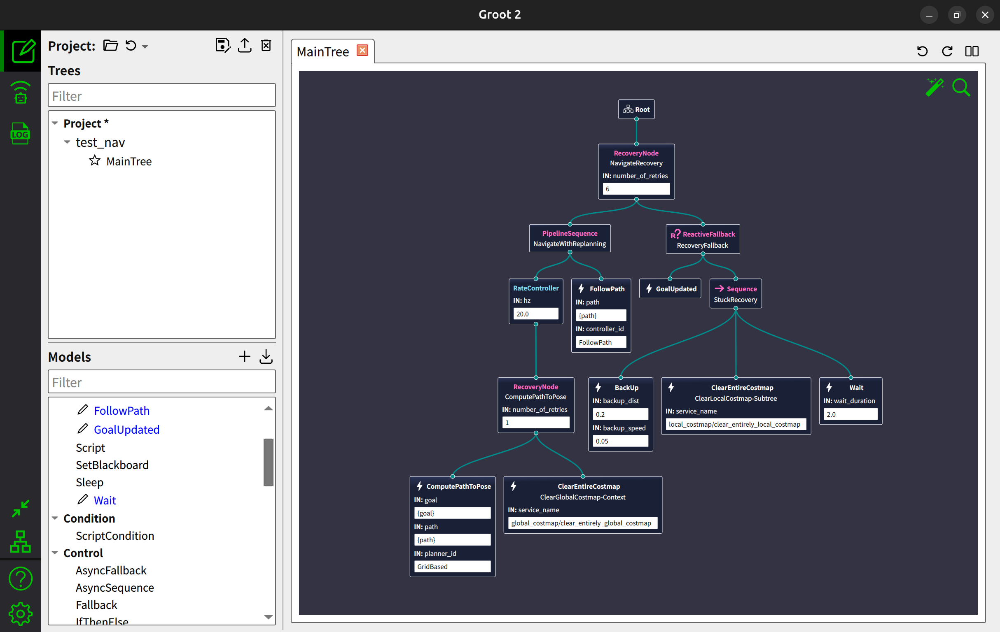
groot2还有添加自定义节点和导出项目的功能

### 局部路径规划算法
#### $\mathbf{Dynamic~Window~Approach-DWA}$
dwa算法一共有三个步骤
- 设计动态窗口
- 轨迹推算
- 优化组合计算

##### 设计动态窗口
动态窗口实际上是一个速度范围，用于约束机器人在短时间内安全到达目标点的$v$和$\omega$，它定义了一个速度空间$V_d$的子集$D_{dw}$，其中
$$ V_d = \{ (v,\omega) | v \in [ v_c - \dot{v} \Delta t, v_c + \dot{v} \Delta t ], \omega \in [ \omega_c - \dot{ \omega } \Delta t, \omega_c + \dot{ \omega } \Delta t ] \} $$
$ v_c $ 和 $ \omega_c $ 是当前的线速度和角速度，同时$D_{dw}$内的元素还应保证是安全速度（即遇到障碍物有充足的时间改变以致于不会撞上）

##### 轨迹推算
我们对$D_{dw}$内的每一组元素都进行未来一小段时间内的推演（速度不变），得到它的轨迹（应该是圆弧线），随后记录所有在轨迹末端时刻的点的位姿

##### 优化组合计算
接下来就是对每一组$D_{dw}$内的元素根据它们在未来轨迹末端时刻的点的位姿进行打分，分数最高的组合就是我们要选择的速度组合，记每一组元素的得分为$ G(v,\omega) $，其公式为：
$$ G( v, \omega ) = \alpha \cdot \mathrm{heading}( v, \omega ) + \beta \cdot \mathrm{dist}( v, \omega ) + \gamma \cdot \mathrm{vel}( v, \omega ) $$
其中$ \mathrm{heading}( v, \omega ),\mathrm{dist}( v, \omega ),\mathrm{vel}( v, \omega ) $分别为朝向权重、障碍物距离权重、线速度权重
而$\alpha$为轨迹末端时刻的朝向与目标点方向的差角的绝对值，$\beta$为轨迹末端时刻与最近障碍物的距离，$\gamma$为轨迹末端时刻的线速度的大小

##### 综合
将这三个步骤实现即可，需要注意的事项就是权重的选择，应选择合适的权重来达到最好的效果，同时dwa算法容易陷入局部最优，即可能会在一个凹形障碍物前不断磕碰，优点也是计算量小简单易懂实现简单

##### 实践
我们用
```bash
ros2 pkg create --build-type ament_cmake my_nav2_controller --dependencies nav2_core pluginlib rclcpp
```
创建一个新的功能包`my_dwa_controller`在工作空间下，里面写我们实现的dwa算法
准备两个文件`dwa_controller.cpp`和`dwa_controller.hpp`，假设我们已经写好：
`dwa_controller.hpp`:
```cpp
#ifndef MY_NAV2_CONTROLLER__DWA_CONTROLLER
#define MY_NAV2_CONTROLLER__DWA_CONTROLLER

#include <memory>
#include <string>
#include <vector>

#include "nav2_core/controller.hpp"
#include "rclcpp/rclcpp.hpp"
#include "nav_msgs/msg/path.hpp"
#include "geometry_msgs/msg/twist_stamped.hpp"
#include "nav2_costmap_2d/costmap_2d_ros.hpp"
#include "nav2_util/node_utils.hpp"

namespace my_nav2_controller {

    class MyDWAController : public nav2_core::Controller {

    public:

        MyDWAController() = default;
        ~MyDWAController() override = default;

        /**
         * @brief 初始化插件
         * @param parent 生命周期节点
         * @param name 加载的插件的名称
         * @param tf 用于检查变换
         * @param costmap_ros 代价地图
         * @return 无
         */
        void configure(
            const rclcpp_lifecycle::LifecycleNode::WeakPtr &parent,
            std::string name, std::shared_ptr<tf2_ros::Buffer> tf,
            std::shared_ptr<nav2_costmap_2d::Costmap2DROS> costmap_ros) override;
        
        void activate() override;
        void deactivate() override;
        void cleanup() override;

        /**
         * @brief 接受规划器传来的路径
         * @param path 路径消息
         * @return 无
         */
        void setPlan(const nav_msgs::msg::Path &path) override;

        void setSpeedLimit(const double &speed_limit, const bool &percentage) override;

        /**
         * @brief 计算下达给底盘的速度（但不是直接下达给底盘）
         * @param pose 带时间戳的小车位姿
         * @param v 目前小车的速度
         * @param goal_checker 到达目标点检测
         * @return 带时间戳的运动向量类型
         */
        geometry_msgs::msg::TwistStamped computeVelocityCommands(
            const geometry_msgs::msg::PoseStamped &pose,
            const geometry_msgs::msg::Twist &v,
            nav2_core::GoalChecker *goal_checker) override;
    protected:
        
        double cal_score(double v, double w);
        double cal_diff_angle(double inialp, double goalalp);

        rclcpp_lifecycle::LifecycleNode::WeakPtr node_;
        std::shared_ptr<nav2_costmap_2d::Costmap2DROS> costmap_ros_;
        std::shared_ptr<tf2_ros::Buffer> tf_;
        rclcpp::Logger logger_{rclcpp::get_logger("MyDWAController")};
        rclcpp::Clock::SharedPtr clock_;
        nav_msgs::msg::Path global_plan_;
        std::string plugin_name_;

        // DWA参数
        double alpha, beta, gamma; // heading distance velocity分权重
        double lookahead_dist; // 诱饵点
        double max_v; // 最大速度
        double max_w;
        double lim_a; // 加速度限制
        double lim_aw;
        double sim_time_; // 未来时间
        rclcpp::Duration transform_tolerance_{0, 0};
    };
}

#endif // MY_NAV2_CONTROLLER__DWA_CONTROLLER
```
`dwa_controller.cpp`:
```cpp
#include "my_nav2_controller/dwa_controller.hpp"
#include "nav2_core/controller_exceptions.hpp"
#include "pluginlib/class_list_macros.hpp"
#include "nav2_util/node_utils.hpp"

using nav2_util::declare_parameter_if_not_declared;

namespace my_nav2_controller {

    struct Path {
        double v, w,      // 速度组合
            score,        // 总评分
            cost,         // 障碍物代价
            dist_to_path; // 距离全局路径的距离
    };

    void MyDWAController::configure(
        const rclcpp_lifecycle::LifecycleNode::WeakPtr &parent,
        std::string name, std::shared_ptr<tf2_ros::Buffer> tf,
        std::shared_ptr<nav2_costmap_2d::Costmap2DROS> costmap_ros) {
        
        node_ = parent;
        auto node = node_.lock();
        tf_ = tf;
        plugin_name_ = name;
        costmap_ros_ = costmap_ros;
        logger_ = node->get_logger();
        clock_ = node->get_clock();
        
        declare_parameter_if_not_declared(
            node, plugin_name_ + ".alpha", rclcpp::ParameterValue(2.0)
        );
        declare_parameter_if_not_declared(
            node, plugin_name_ + ".beta", rclcpp::ParameterValue(1.5)
        );
        declare_parameter_if_not_declared(
            node, plugin_name_ + ".gamma", rclcpp::ParameterValue(1.0)
        );
        declare_parameter_if_not_declared(
            node, plugin_name_ + ".lookahead_dist", rclcpp::ParameterValue(0.8)
        );
        declare_parameter_if_not_declared(
            node, plugin_name_ + ".max_v", rclcpp::ParameterValue(0.5)
        );
        declare_parameter_if_not_declared(
            node, plugin_name_ + ".max_w", rclcpp::ParameterValue(1.0)
        );
        declare_parameter_if_not_declared(
            node, plugin_name_ + ".lim_a", rclcpp::ParameterValue(2.5)
        );
        declare_parameter_if_not_declared(
            node, plugin_name_ + ".lim_aw", rclcpp::ParameterValue(3.2)
        );
        declare_parameter_if_not_declared(
            node, plugin_name_ + ".sim_time", rclcpp::ParameterValue(1.5)
        );
        declare_parameter_if_not_declared(
            node, plugin_name_ + ".transform_tolerance", rclcpp::ParameterValue(0.1)
        );

        // 获取参数
        node->get_parameter(plugin_name_ + ".alpha", alpha);
        node->get_parameter(plugin_name_ + ".beta", beta);
        node->get_parameter(plugin_name_ + ".gamma", gamma);
        node->get_parameter(plugin_name_ + ".lookahead_dist", lookahead_dist);
        node->get_parameter(plugin_name_ + ".max_v", max_v);
        node->get_parameter(plugin_name_ + ".max_w", max_w);
        node->get_parameter(plugin_name_ + ".lim_a", lim_a);
        node->get_parameter(plugin_name_ + ".lim_aw", lim_aw);
        node->get_parameter(plugin_name_ + ".sim_time", sim_time_);

        double transform_tolerance;
        node->get_parameter(plugin_name_ + ".transform_tolerance", transform_tolerance);
        transform_tolerance_ = rclcpp::Duration::from_seconds(transform_tolerance);

        RCLCPP_INFO(logger_, "自定义DWA控制器配置完成");
    }
     
    void MyDWAController::setPlan(const nav_msgs::msg::Path &path) {

        global_plan_ = path;
    }

    /**
     * @brief 以逆时针为正方向计算初始角到目标角的差角
     * @param inialp 初始角
     * @param goalalp 目标角
     * @return 一个double值
     */
    double MyDWAController::cal_diff_angle(double inialp, double goalalp) {

        double raw_diff_angle = goalalp - inialp;
        while (raw_diff_angle > M_PI) raw_diff_angle -= 2 * M_PI;
        while (raw_diff_angle < -M_PI) raw_diff_angle += 2 * M_PI;
        return raw_diff_angle;
    }

    geometry_msgs::msg::TwistStamped MyDWAController::computeVelocityCommands(
        const geometry_msgs::msg::PoseStamped & pose,
        const geometry_msgs::msg::Twist & velocity,
        nav2_core::GoalChecker *goal_checker) {

        auto node = node_.lock();
        auto costmap = costmap_ros_->getCostmap();

        // 设定诱饵点
        geometry_msgs::msg::PoseStamped target_pose;
        bool found_target = false;

        // 获取机器人位置
        double r_x = pose.pose.position.x,
            r_y = pose.pose.position.y,
            r_yaw = tf2::getYaw(pose.pose.orientation);

        // 遍历路径
        for (const auto &p : global_plan_.poses) {

            double dx = p.pose.position.x - r_x,
                dy = p.pose.position.y - r_y;
            if (std::hypot(dx, dy) >= lookahead_dist) {

                target_pose = p;
                found_target = true;
                break;
            }
        }
        if (!found_target && !global_plan_.poses.empty()) {

            target_pose = global_plan_.poses.back();
        }
        // 计算到诱饵点的角度
        double target_yaw = std::atan2(target_pose.pose.position.y - r_y,
                                 target_pose.pose.position.x - r_x);

        // 动态窗口
        double dt = 0.1,
            v_min = std::max(0.0, velocity.linear.x - lim_a * dt),
            v_max = std::min(max_v, velocity.linear.x + lim_a * dt),
            w_min = velocity.angular.z - lim_aw * dt,
            w_max = velocity.angular.z + lim_aw * dt;

        Path best_path = {0.0, 0.0, -1e9, 0.0, 0.0};

        // 采样循环
        for (double v = v_min; v <= v_max; v += 0.02) {

            for (double w = w_min; w <= w_max; w += 0.1) {

                double x = 0.0, y = 0.0, alp = r_yaw;
                bool collided = false;
                double min_dist_to_path = 1e9;

                for (double t = 0; t < sim_time_; t += 0.2) {

                    x += v * cos(alp) * 0.2;
                    y += v * sin(alp) * 0.2;
                    alp += w * 0.2;
                    unsigned int mx, my;
                    // 地图内判断
                    if (costmap_ros_->getCostmap()->worldToMap(x + r_x, y + r_y, mx, my)) {

                        // 获取代价
                        unsigned char cost = costmap->getCost(mx, my);
                        if (cost >= nav2_costmap_2d::INSCRIBED_INFLATED_OBSTACLE) { // 撞墙了

                            collided = true;
                            break;
                        }
                        double dist_score_temp = (255.0 - cost) / 255.0; // 归一化
                        if (dist_score_temp < min_dist_to_path) {

                            // 代价越小，距离越大
                            min_dist_to_path = dist_score_temp;
                        }
                    }
                }

                if (collided) continue;
                // 评分
                // Heading
                double diff_angle = std::abs(cal_diff_angle(alp, target_yaw)),
                    heading_score = (M_PI - diff_angle) / M_PI;
                
                // Distance
                double distance_score = min_dist_to_path;

                // Velocity
                double velocity_score = v / max_v;
                double score = alpha * heading_score +
                               beta * distance_score +
                               gamma * velocity_score;
                if (score > best_path.score) best_path = {v, w, score, 0.0, 0.0};
            }
        }
        
        geometry_msgs::msg::TwistStamped cmd_vel;
        cmd_vel.header.stamp = clock_->now();
        cmd_vel.header.frame_id = "base_link";
        cmd_vel.twist.linear.x = best_path.v;
        cmd_vel.twist.angular.z = best_path.w;

        return cmd_vel;
    }
    void MyDWAController::activate() { RCLCPP_INFO(logger_, "插件已激活"); }
    void MyDWAController::deactivate() { RCLCPP_INFO(logger_, "插件已停用"); }
    void MyDWAController::cleanup() { RCLCPP_INFO(logger_, "插件已清理"); }
    void MyDWAController::setSpeedLimit(const double & speed_limit, const bool & percentage) {
        
        (void)speed_limit;
        (void)percentage;
        RCLCPP_INFO(logger_, "收到限速指令，当前插件尚未实现具体的限速逻辑");
    }
} // my_nav2_controller

// 注册算法插件
PLUGINLIB_EXPORT_CLASS(my_nav2_controller::MyDWAController, nav2_core::Controller)
```
之后我们编写`CMakeLists.txt`，它应该包含需要的依赖、安装需要的文件、导出所需要的依赖供其他包使用、编译动态库，还需要使用
```c
pluginlib_export_plugin_description_file(nav2_core plugins.xml)
```
导出插件描述文件，以便我们能正常加载我们的插件，这是一个完整的cmake文件：
```c
cmake_minimum_required(VERSION 3.8)
project(my_nav2_controller)

if(CMAKE_COMPILER_IS_GNUCXX OR CMAKE_CXX_COMPILER_ID MATCHES "Clang")
  add_compile_options(-Wall -Wextra -Wpedantic)
endif()

# find dependencies
find_package(ament_cmake REQUIRED)
find_package(nav2_core REQUIRED)
find_package(nav2_util REQUIRED)
find_package(nav2_costmap_2d REQUIRED)
find_package(pluginlib REQUIRED)
find_package(rclcpp REQUIRED)
find_package(rclcpp_lifecycle REQUIRED)
find_package(geometry_msgs REQUIRED)
find_package(nav_msgs REQUIRED)
find_package(tf2 REQUIRED)
find_package(tf2_ros REQUIRED)
find_package(angles REQUIRED)

# 添加头文件目录
include_directories(include)

# 编译动态库 (Shared Library)
add_library(${PROJECT_NAME}_lib SHARED
  src/dwa_controller.cpp
)

ament_target_dependencies(${PROJECT_NAME}_lib
  nav2_core
  nav2_util
  nav2_costmap_2d
  pluginlib
  rclcpp
  rclcpp_lifecycle
  geometry_msgs
  nav_msgs
  tf2
  tf2_ros
  angles
)

pluginlib_export_plugin_description_file(nav2_core plugins.xml)

install(TARGETS ${PROJECT_NAME}_lib
  ARCHIVE DESTINATION lib
  LIBRARY DESTINATION lib
  RUNTIME DESTINATION bin
)

install(DIRECTORY include/
  DESTINATION include/
)

# 导出依赖以供其他包使用
ament_export_include_directories(include)
ament_export_libraries(${PROJECT_NAME}_lib)
ament_export_dependencies(nav2_core nav2_util pluginlib rclcpp)

if(BUILD_TESTING)
  find_package(ament_lint_auto REQUIRED)
  # the following line skips the linter which checks for copyrights
  # comment the line when a copyright and license is added to all source files
  set(ament_cmake_copyright_FOUND TRUE)
  # the following line skips cpplint (only works in a git repo)
  # comment the line when this package is in a git repo and when
  # a copyright and license is added to all source files
  set(ament_cmake_cpplint_FOUND TRUE)
  ament_lint_auto_find_test_dependencies()
endif()

ament_package()
```
同时这里提到的`plugins.xml`也是需要写的，位于与`package.xml`同级的位置：
```xml
<library path="my_nav2_controller_lib">
  <class name="my_nav2_controller/MyDWAController" 
         type="my_nav2_controller::MyDWAController" 
         base_class_type="nav2_core::Controller">
    <description>
      这是一个手动实现的简单DWA局部路径规划器插件。
    </description>
  </class>
</library>
```
注意这里的`name`就是我们加载插件时需要填的，该文件用于描述插件
以及`package.xml`我们需要把所有用到的依赖全都写上：
```xml
<?xml version="1.0"?>
<?xml-model href="http://download.ros.org/schema/package_format3.xsd" schematypens="http://www.w3.org/2001/XMLSchema"?>
<package format="3">
  <name>my_nav2_controller</name>
  <version>0.0.0</version>
  <description>TODO: Package description</description>
  <maintainer email="meis38@126.com">goose</maintainer>
  <license>TODO: License declaration</license>

  <buildtool_depend>ament_cmake</buildtool_depend>

  <depend>nav2_core</depend>
  <depend>nav2_util</depend>
  <depend>nav2_costmap_2d</depend>
  <depend>pluginlib</depend>
  <depend>rclcpp</depend>
  <depend>rclcpp_lifecycle</depend>
  <depend>geometry_msgs</depend>
  <depend>nav_msgs</depend>
  <depend>tf2</depend>
  <depend>tf2_ros</depend>
  <depend>angles</depend>

  <test_depend>ament_lint_auto</test_depend>
  <test_depend>ament_lint_common</test_depend>

  <export>
    <build_type>ament_cmake</build_type>
    <nav2_core plugin="${prefix}/plugins.xml" />
  </export>
</package>
```
随后我们可以复制一份`nav2_params_nav.yaml`改名为`nav2_params_nav_diy.yaml`，我们主要将`FollowPath`的算法改成我们手写的dwa算法（官方使用mppi算法），改完后`controller_server`部分代码如下：
```py
FollowPath:
  plugin: "my_nav2_controller/MyDWAController"
  alpha: 2.0
  beta: 1.5
  gamma: 1.0
  lookahead_dist: 0.8
  max_v: 0.5
  max_w: 1.0
  lim_a: 2.5
  lim_aw: 3.2
  sim_time: 1.5
  transform_tolerance: 0.1
  goal_checker_plugin: "general_goal_checker"
  progress_checker_plugin: "progress_checker"
```
我们修改对应的launch文件中调用这个文件的参数名，重新编译整个包刷新环境后正常运行launch文件就能使用上我们自己写的dwa算法了

#### 误差计算
通过$\mathrm{Sophus}$库可以将我们的`/odom`话题下的位姿和在gazebo仿真中的位姿结合来计算轨迹误差$\boldsymbol{T}_{\mathrm{err}}$
在此之前我们需要安装`tf2_eigen`以及`Sophus`库，前者一般已经安装完毕了（可以通过`sudo apt install ros-<ros-distro>-tf2-eigen`查看），后者最好是安装**模板类**版本的库：
```bash
# 1. 创建一个存放源码的文件夹
mkdir -p ~/3rdparty && cd ~/3rdparty

# 2. 从 GitHub 克隆最新的源码
git clone https://github.com/strasdat/Sophus.git
cd Sophus

# 3. 创建编译目录
mkdir build && cd build

# 4. 编译并安装
cmake ..
make -j1
sudo make install
```
注意`make -j1`表明单核编译，如果对自己的内存有足够信心可以使用`make -j$(nproc)`会快一点，记得分配交换内存（至少8G以上），这个安装后的库一般位于`/usr/local/include/sophus`
于是我们编写一个`odom_evaluator.hpp`：
```cpp
#include "rclcpp/rclcpp.hpp"
#include "nav_msgs/msg/odometry.hpp"
#include "sophus/se3.hpp"
#include "eigen3/Eigen/Core"
#include "tf2_eigen/tf2_eigen.hpp"

class OdomEvaluator : public rclcpp::Node {

public:

    OdomEvaluator();
private:

    void compute_error();

    rclcpp::Subscription<nav_msgs::msg::Odometry>::SharedPtr odom_sub_;
    rclcpp::Subscription<nav_msgs::msg::Odometry>::SharedPtr gt_sub_;
    rclcpp::TimerBase::SharedPtr timer_;

    Sophus::SE3d last_odom_, last_gt_;
    bool has_odom_ = false, has_gt_ = false;
};
```
以及一个`odom_evaluator.cpp`：
```cpp
#include "odom_evaluator.hpp"

OdomEvaluator::OdomEvaluator() : Node("odom_evaluator") {

    odom_sub_ = this->create_subscription<nav_msgs::msg::Odometry>(
        "/odom", 10, [this](const nav_msgs::msg::Odometry::SharedPtr msg) {

            Eigen::Isometry3d eigen_pose;
            tf2::fromMsg(msg->pose.pose, eigen_pose);
            last_odom_ = Sophus::SE3d(eigen_pose.rotation(), eigen_pose.translation());
            has_odom_ = true;
        }
    );
    gt_sub_ = this->create_subscription<nav_msgs::msg::Odometry>(
        "/ground_truth", 10, [this](const nav_msgs::msg::Odometry::SharedPtr msg) {

            Eigen::Isometry3d eigen_pose;
            tf2::fromMsg(msg->pose.pose, eigen_pose);
            last_gt_ = Sophus::SE3d(eigen_pose.rotation(), eigen_pose.translation());
            has_gt_ = true;
        }
    );
    timer_ = this->create_wall_timer(
        std::chrono::milliseconds(200), [this](){
            
            compute_error();
        }
    );
}

void OdomEvaluator::compute_error() {

    if (!has_odom_ || !has_gt_) return;

    Sophus::SE3d T_err = last_gt_.inverse() * last_odom_;

    double trans_err = T_err.translation().norm(),
        rot_err = T_err.so3().log().norm();

    RCLCPP_INFO(this->get_logger(), 
            "误差统计 -> 平移: %.4f m, 旋转: %.4f rad (%.2f deg)", 
            trans_err, rot_err, rot_err * 180.0 / M_PI);
}

int main(int argc, char** argv) {
    
    rclcpp::init(argc, argv);
    rclcpp::spin(std::make_shared<OdomEvaluator>());
    rclcpp::shutdown();
    return 0;
}
```
完成后记得在cmake文件以及`package.xml`中配置好依赖与可执行文件的安装
还有一点是我们需要配置gazebo插件才能获取真实位姿，我们在urdf文件中添加这个插件：
```xml
<gazebo>
    <plugin
        filename="gz-sim-odometry-publisher-system"
        name="gz::sim::systems::OdometryPublisher">
        <odom_topic>ground_truth</odom_topic> <odom_frame>world</odom_frame>
        <robot_base_frame>base_footprint</robot_base_frame>
        <tf_topic>ground_truth/tf</tf_topic>
        <dimensions>3</dimensions>
    </plugin>
</gazebo>
```
同时还需要在launch文件中（或者手动发布命令）添加桥接节点中的一段桥接
```py
'/ground_truth@nav_msgs/msg/Odometry[gz.msgs.Odometry'
```
随后编译运行，只要用`ros2 run my_nav2_robot odom_evaluator`就可以启动误差估计节点了
特别的，如果我们想查看两条轨迹的具体形式，可以使用`python`写一个`trajectory_saver.py`来记录两个话题的所有位姿并绘制成一个轨迹对比图（使用`matplotlib`库）：
```python
import rclpy
from rclpy.node import Node
from nav_msgs.msg import Odometry
import matplotlib.pyplot as plt

class TrajectoryPlotter(Node):
    def __init__(self):
        super().__init__('trajectory_plotter')

        self.odom_x, self.odom_y, self.gt_x, self.gt_y = [], [], [], []

        self.create_subscription(Odometry, '/odom', self.odom_cb, 10)
        self.create_subscription(Odometry, '/ground_truth', self.gt_cb, 10)
        self.timer = self.create_timer(10.0, self.status_report)
        self.get_logger().info('轨迹记录器启动')
    
    def odom_cb(self, msg):
        self.odom_x.append(msg.pose.pose.position.x)
        self.odom_y.append(msg.pose.pose.position.y)
    
    def gt_cb(self, msg):
        self.gt_x.append(msg.pose.pose.position.x)
        self.gt_y.append(msg.pose.pose.position.y)
    
    def status_report(self):
        self.get_logger().info(f'已记录点数: Odom={len(self.odom_x)}, GT={len(self.gt_x)}')

    def save_plot(self):
        plt.figure(figsize=(10, 10), facecolor='white')
        plt.plot(self.gt_x, self.gt_y, label='Ground Truth', color='green', linewidth=2)
        plt.plot(self.odom_x, self.odom_y, label='Odometry', color='red', linestyle='--', linewidth=1.5)

        plt.title('Robot Trajectory Comparison')
        plt.xlabel('X (meters)')
        plt.ylabel('Y (meters)')
        plt.legend()
        plt.grid(True, linestyle=':', alpha=0.6)
        plt.axis('equal') 

        save_path = 'trajectory_result.png'
        plt.savefig(save_path)
        print(f'\n图片已保存至: {save_path}')

def main():
    rclpy.init()
    node = TrajectoryPlotter()
    try:
        rclpy.spin(node)
    except KeyboardInterrupt:
        node.save_plot()
    finally:
        node.destroy_node()
        rclpy.shutdown()

if __name__ == '__main__':
    main()
```
这个脚本只要用
```bash
chmod +x trajectory_saver.py
```
把它变为可执行文件，再
```python
python3 trajectory_saver.py
```
就能运行这个节点了，好处是不用每次都重新编译，记得该节点应在小车运动前、环境初始化后启动，同时如果想要生成图像使用`ctrl+c`中止节点运行就会自动保存图像了，应该能得到如下结果：
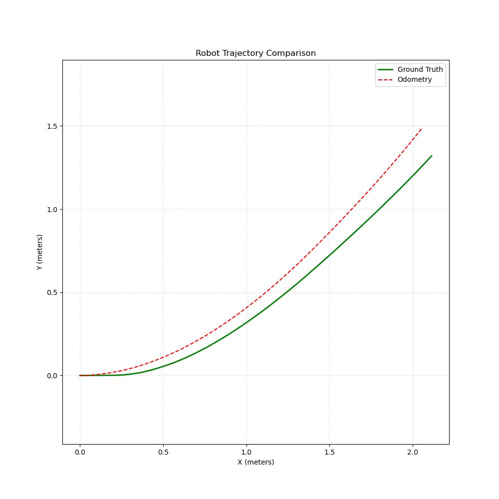

### 全局路径规划算法
我们也可以自己写一个规划器插件用在我们的机器人上，对于全局路径规划，我们先采用A*算法

#### $\mathrm{OpenCV}$可视化
在正式写插件之前，可以先使用opencv进行一个寻路可视化，在此之前，我们需要拥有一个用slam建的图的`.pgm`和`.yaml`文件，新建一个项目`planner_test`，对于里面的文件`astar_visualizer.hpp`：
```cpp
#include "opencv2/opencv.hpp"
#include <vector>
#include <queue>
#include <iostream>
#include <cmath>
#include <algorithm>

struct Node {

    cv::Point pos;
    double g, h; // 代价
    Node* Parent;
    bool operator>(const Node &other) const { return (g + h) > (other.g + other.h); }
};

class MapPlanner {

public:

    cv::Mat map_img, display_map, raw_map;
    double resolution = 0.05;
    double origin_x = -5.046, origin_y = -4.64;
    int img_w = 200, img_h = 162;
    std::vector<cv::Point> path;

    MapPlanner(std::string pgm_path);
    void preprocessMap();
    cv::Point WorldToMap(double wx, double wy);
    void plan(cv::Point start, cv::Point goal);
};
```
`astar_visualizer.cpp`：
```cpp
#include "astar_visualizer.hpp"

MapPlanner::MapPlanner(std::string pgm_path) {

    // 加载灰度图
    map_img = cv::imread(pgm_path, cv::IMREAD_GRAYSCALE);
    raw_map = map_img;
    if (map_img.empty()) {

        std::cerr << "Failed to load .pgm";
        return;
    }
    //cv::threshold(map_img, map_img, 100, 255, cv::THRESH_BINARY);
}

void MapPlanner::preprocessMap() {

    cv::cvtColor(map_img, display_map, cv::COLOR_GRAY2BGR);

    // 腐蚀核Size(9, 9) -> r=4
    // 4像素*0.05 分辨率=0.2
    int robot_radius_pixel = 4; 
    cv::Mat element = cv::getStructuringElement(cv::MORPH_RECT, 
                      cv::Size(2 * robot_radius_pixel + 1, 2 * robot_radius_pixel + 1));
    cv::erode(map_img, map_img, element);
}

cv::Point MapPlanner::WorldToMap(double wx, double wy) {

    int mx = static_cast<int>(std::round(wx - origin_x) / resolution),
        premy = static_cast<int>(std::round(wy - origin_y) / resolution);
    int my = img_h - premy;
    mx = std::max(0, std::min(mx, img_w - 1));
    my = std::max(0, std::min(my, img_h - 1));
    return cv::Point(mx, my);
}

void MapPlanner::plan(cv::Point start, cv::Point goal) {

    std::vector<std::vector<double>> g_values(map_img.rows, std::vector<double>(map_img.cols, std::numeric_limits<double>::infinity()));
    std::vector<std::vector<bool>> closed_list(map_img.rows, std::vector<bool>(map_img.cols, false));
    std::vector<std::vector<cv::Point>> parents(map_img.rows, std::vector<cv::Point>(map_img.cols, cv::Point(-1, -1)));

    std::priority_queue<Node, std::vector<Node>, std::greater<Node>> open_list;

    // 放入起点
    g_values[start.y][start.x] = 0;
    double h_cost_ = std::sqrt(std::pow(start.x - goal.x, 2) + std::pow(start.y - goal.y, 2));
    open_list.push({start, 0, h_cost_, nullptr});

    // 寻路
    while (!open_list.empty()) {
        
        Node cur = open_list.top();
        open_list.pop();
        display_map.at<cv::Vec3b>(cur.pos.y, cur.pos.x) = cv::Vec3b(200, 200, 255);

        if (closed_list[cur.pos.y][cur.pos.x]) continue;
        closed_list[cur.pos.y][cur.pos.x] = true;

        if (cur.pos == goal) {

            std::cout << "Path Found" << std::endl;
            cv::Point curr = goal;

            while (curr != start && curr != cv::Point(-1, -1)) {

                path.push_back(curr);
                curr = parents[curr.y][curr.x];
            }
            path.push_back(start);

            // 绘制最终路径
            for (size_t i = 0; i < path.size() - 1; ++ i) {

                cv::line(display_map, path[i], path[i + 1], cv::Scalar(255, 0, 0), 2);
            }
            cv::imshow("A* Result", display_map);
            return;
        }

        for (int dx = -1; dx <= 1; ++ dx) {

            for (int dy = -1; dy <= 1; ++ dy) {

                if (dx == 0 && dy == 0) continue;

                cv::Point nei_pos(cur.pos.x + dx, cur.pos.y + dy);

                // 边界与碰撞检查
                if (nei_pos.x < 0 || nei_pos.x >= map_img.cols || 
                    nei_pos.y < 0 || nei_pos.y >= map_img.rows) continue;
                if (map_img.at<uchar>(nei_pos.y, nei_pos.x) == 0) continue;

                // 未知区域罚分
                uchar raw_pixel = raw_map.at<uchar>(nei_pos.y, nei_pos.x);
                double extra_cost = 0.0;
                if (raw_pixel < 250 && raw_pixel > 150) { 

                    extra_cost = 10.0;
                }

                double step_cost = (dx != 0 && dy != 0) ? 1.414 : 1.0,
                    tentative_g = g_values[cur.pos.y][cur.pos.x] + step_cost + extra_cost;

                if (tentative_g < g_values[nei_pos.y][nei_pos.x]) {

                    g_values[nei_pos.y][nei_pos.x] = tentative_g;
                    display_map.at<cv::Vec3b>(nei_pos.y, nei_pos.x) = cv::Vec3b(255, 200, 200);

                    static int count = 0;
                    if (count ++ % 50 == 0) { // 每50个点刷新一次界面

                        cv::imshow("A* Searching Process", display_map);
                        cv::waitKey(30);
                    }

                    parents[nei_pos.y][nei_pos.x] = cur.pos;
                    double h = std::sqrt(std::pow(nei_pos.x - goal.x, 2) + std::pow(nei_pos.y - goal.y, 2));
                    open_list.push({nei_pos, tentative_g, h, nullptr});
                }
            }
        }
    } 
}
int main() {
    
    MapPlanner planner("map1.pgm");
    
    cv::Point start_px = planner.WorldToMap(-4.0, 1.0);
    cv::Point goal_px = planner.WorldToMap(1.0, -3.0);

    planner.preprocessMap();

    planner.plan(start_px, goal_px);
    cv::waitKey(0);
    return 0;
}
```
以及cmake文件：
```c
cmake_minimum_required(VERSION 3.10)
project(planner_test)
set(CMAKE_CXX_STANDARD 14)
set(CMAKE_CXX_STANDARD_REQUIRED ON)

# 找
find_package(OpenCV REQUIRED)

# 添加可执行文件
add_executable(planner_test 
    astar_visualizer.cpp
)

# 链接 OpenCV 库
target_link_libraries(planner_test 
    ${OpenCV_LIBRARIES}
)
```
随后需要新建一个`build`文件夹在里面进行`cmake ..`和`make -j1`完成编译，随后`./planner_test`就能运行了，注意`map1.pgm`需要放到`build`文件夹内
这个项目主要利用了**栅格化地图**来进行坐标转换，将每一个坐标点（特定分辨率下是有限的）作为节点，设定好`start`和`goal`（根节点与目标节点）后就可以开始规划了
而作为主体的地图我们需要准备三份，分别用来**寻路、展示、未知地带代价计算**
- 寻路我们需要使用`erode`进行腐蚀，扩大黑色（障碍物）面积，更符合现实
- 展示的话只需要展示最原始的地图即可
- 未知地带的计算主要是对灰色部分（未探索区域）进行额外的代价叠加，让机器人尽可能避免走灰色地带，也是最原始的地图

同时到达终点回溯的时候利用opencv可以将每一个点都用蓝色的线连起来，寻路时每一个到达的节点涂成浅红色，即将要探索的节点涂成浅蓝色，这样更能可视化整条路径
如果设定了正确的起点和终点，应该能看到如下图像
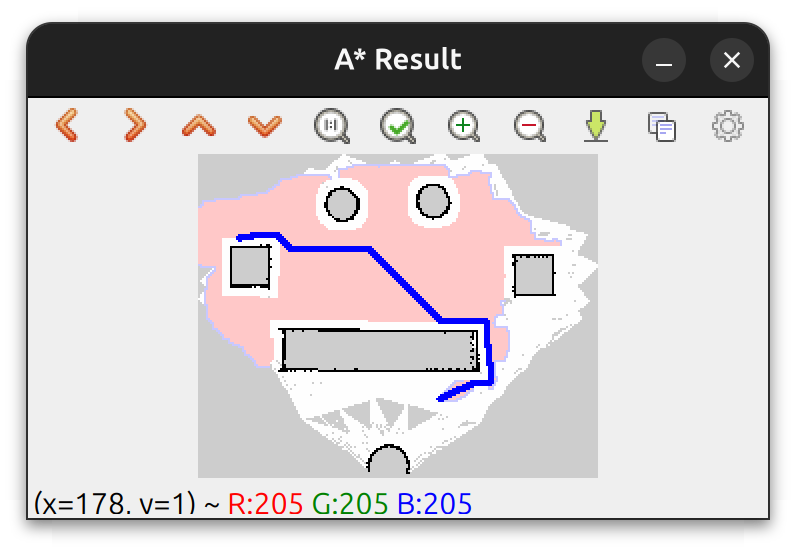

#### 实践
接下来我们将上述代码移植到一个规划器插件中，编写一个自定义A*路径规划器，依旧先创建功能包：
```bash
ros2 pkg create --build-type ament_cmake my_nav2_planner --dependencies nav2_core pluginlib rclcpp
```
按照官方教程所要求的继承5个基类函数并完成函数定义，以及一个`createPlan`函数来进行A*算法的核心代码编写
`astar_planner.hpp`：
```cpp
#ifndef MY_NAV2_PLANNER__ASTAR_PLANNER
#define MY_NAV2_PLANNER__ASTAR_PLANNER

#include <memory>
#include <string>
#include <vector>
#include <queue>

#include "nav2_core/global_planner.hpp"
#include "rclcpp/rclcpp.hpp"
#include "nav_msgs/msg/path.hpp"
#include "geometry_msgs/msg/pose_stamped.hpp"
#include "nav2_costmap_2d/costmap_2d_ros.hpp"
#include "nav2_util/lifecycle_node.hpp"
#include "nav2_util/node_utils.hpp"

namespace my_nav2_planner {

    class MyAStarPlanner : public nav2_core::GlobalPlanner {

    public:

        MyAStarPlanner() = default;
        ~MyAStarPlanner() override = default;

        void configure(
            const rclcpp_lifecycle::LifecycleNode::WeakPtr &parent,
            std::string name, std::shared_ptr<tf2_ros::Buffer> tf,
            std::shared_ptr<nav2_costmap_2d::Costmap2DROS> costmap_ros) override;
    
        void activate() override;
        void deactivate() override;
        void cleanup() override;

        nav_msgs::msg::Path createPlan(
            const geometry_msgs::msg::PoseStamped &start,
            const geometry_msgs::msg::PoseStamped &goal,
            std::function<bool()> cancel_checker) override;
    private:

        std::shared_ptr<tf2_ros::Buffer> tf_;
        nav2_util::LifecycleNode::SharedPtr node_;
        nav2_costmap_2d::Costmap2D *costmap_;
        std::string global_frame_, name_;
        double unknown_cost_, interpolation_resolution_;
    };
} // namespace my_nav2_planner

#endif // MY_NAV2_PLANNER__ASTAR_PLANNER
```
`astar_planner.cpp`：
```cpp
#include "my_nav2_planner/astar_planner.hpp"
#include "nav2_core/planner_exceptions.hpp"
#include "pluginlib/class_list_macros.hpp"
#include "nav2_util/node_utils.hpp"

#include <cmath>
#include <unordered_map>

namespace my_nav2_planner {

    void MyAStarPlanner::configure(
        const rclcpp_lifecycle::LifecycleNode::WeakPtr &parent,
        std::string name, std::shared_ptr<tf2_ros::Buffer> tf,
        std::shared_ptr<nav2_costmap_2d::Costmap2DROS> costmap_ros) {

        node_ = parent.lock();
        name_ = name;
        costmap_ = costmap_ros->getCostmap();
        global_frame_ = costmap_ros->getGlobalFrameID();

        nav2_util::declare_parameter_if_not_declared(
            node_, name_ + ".unknown_cost", rclcpp::ParameterValue(5.0));
        node_->get_parameter(name_ + ".unknown_cost", unknown_cost_);
        nav2_util::declare_parameter_if_not_declared(
            node_, name_ + ".interpolation_resolution", rclcpp::ParameterValue(0.1));
        node_->get_parameter(name_ + ".interpolation_resolution", interpolation_resolution_);

        RCLCPP_INFO(node_->get_logger(), "自定义A*规划器配置完成");
    }

    void MyAStarPlanner::activate() { RCLCPP_INFO(node_->get_logger(), "插件已激活"); }
    void MyAStarPlanner::deactivate() { RCLCPP_INFO(node_->get_logger(), "插件已停用"); }
    void MyAStarPlanner::cleanup() { RCLCPP_INFO(node_->get_logger(), "插件已清理"); }

    nav_msgs::msg::Path MyAStarPlanner::createPlan(
        const geometry_msgs::msg::PoseStamped &start,
        const geometry_msgs::msg::PoseStamped &goal,
        std::function<bool()> cancel_checker) {

        nav_msgs::msg::Path global_path;
        global_path.header.frame_id = global_frame_;
        global_path.header.stamp = node_->now();

        // 坐标转换
        unsigned int mx_start, my_start, mx_goal, my_goal;
        if (!costmap_->worldToMap(start.pose.position.x, start.pose.position.y, mx_start, my_start) ||
            !costmap_->worldToMap(goal.pose.position.x, goal.pose.position.y, mx_goal, my_goal)) {

            RCLCPP_ERROR(node_->get_logger(), "Start or Goal is outside of costmap bounds");
            return global_path;
        }

        // 路径规划
        int width = costmap_->getSizeInCellsX(), 
            height = costmap_->getSizeInCellsY();
        int map_size = width * height;
        std::vector<double> g_values(map_size, std::numeric_limits<double>::max());
        std::vector<int> parent_map(map_size, -1);

        typedef std::pair<double, int> Node;
        std::priority_queue<Node, std::vector<Node>, std::greater<Node>> open_list;

        int start_idx = my_start * width + mx_start,
            goal_idx = my_goal * width + mx_goal;

        g_values[start_idx] = 0.0;
        open_list.push({0.0, start_idx});

        bool found_path = false;

        // 开始寻路
        while (!open_list.empty()) {

            int cur_idx = open_list.top().second;
            open_list.pop();

            if (cur_idx == goal_idx) {

                found_path = true;
                break;
            }

            int cx = cur_idx % width,
                cy = cur_idx / width;

            for (int dx = -1; dx <= 1; ++ dx) {

                for (int dy = -1; dy <= 1; ++ dy) {

                    if (dx == 0 && dy == 0) continue;
                    int nx = cx + dx,
                        ny = cy + dy;
                    if (nx < 0 || nx >= width || ny < 0 || ny >= height) continue;

                    int next_idx = ny * width + nx;
                    unsigned char cost = costmap_->getCost(nx, ny);

                    if (cost >= 250 && cost <= 254) continue;

                    double extra_cost = (cost == 255) ? unknown_cost_ : 0.0,
                        step_cost = std::sqrt(dx * dx + dy * dy);
                    double tentative_g = g_values[cur_idx] + step_cost + extra_cost;

                    if (tentative_g < g_values[next_idx]) {

                        g_values[next_idx] = tentative_g;
                        parent_map[next_idx] = cur_idx;

                        double h_cost = std::sqrt(std::pow(nx - (int)mx_goal, 2) + 
                                        std::pow(ny - (int)my_goal, 2));
                        open_list.push({tentative_g + h_cost, next_idx});
                    }
                }
            }
        }
        if (found_path) {

            std::vector<int> path_;
            int curr_idx = goal_idx;
            while (curr_idx != -1) {

                path_.push_back(curr_idx);
                curr_idx = parent_map[curr_idx];
            }
            std::reverse(path_.begin(), path_.end());

            for (int idx : path_) {

                geometry_msgs::msg::PoseStamped pose;
                pose.header.frame_id = global_frame_;
                pose.header.stamp = node_->now();

                unsigned int mx = idx % width,
                    my = idx / width;
                double wx, wy;
                costmap_->mapToWorld(mx, my, wx, wy);

                pose.pose.position.x = wx;
                pose.pose.position.y = wy;
                pose.pose.orientation = goal.pose.orientation;
                global_path.poses.push_back(pose);
            }
        } else {

            global_path.poses.clear();
            RCLCPP_WARN(node_->get_logger(), "A* failed to find a path from start to goal");
        }
        return global_path;
    } 
}// namespace my_nav2_planner

PLUGINLIB_EXPORT_CLASS(my_nav2_planner::MyAStarPlanner, nav2_core::GlobalPlanner)
```
值得注意的是，我们的地图存取可以直接使用`nav2_costmap_2d::Costmap2D`指针类型，同时不需要手动进行腐蚀操作，我们只需要判断地图代价是否在250到254之间（通常意味着快接近障碍物），是的话直接中断该条路径即可，当地图代价是255，说明到达未知区域，此时可以设定额外代价最终加上。同时为了保证内存效率，我们使用一维容器用形如`idx = y * width + x`的形式存取变量，取变量则
```cpp
x = idx % width;
y = idx / width;
```
即可，其余代码无太大差别
最后要注意的就是各种配置环境文件的编写，完成后在`nav2_params_nav_diy.yaml`的`planner_server`栏目下改为：
```py
planner_server:
  ros__parameters:
    use_sim_time: True
    expected_planner_frequency: 20.0
    planner_plugins: ["GridBased"]
    costmap_update_timeout: 1.0
    GridBased:
      plugin: "my_nav2_planner/MyAStarPlanner"
      unknown_cost: 5.0
      interpolation_resolution: 0.1
```
类似的即可，随后编译运行，在规划了路径后可以看到
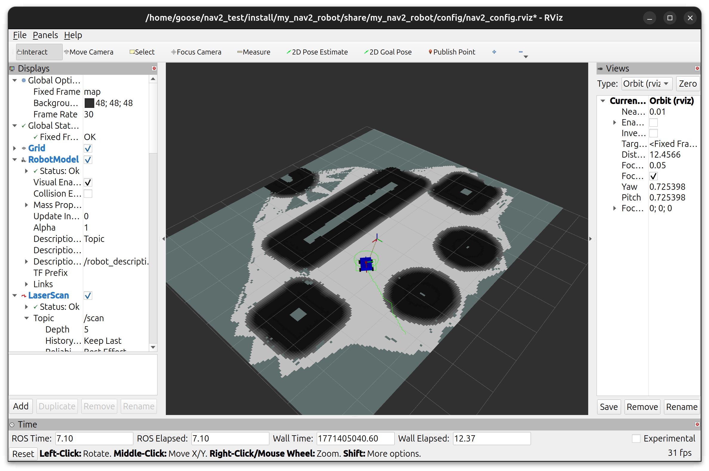
此时的路径是锯齿状的，我们在后面进行平滑器的编写后可以将其优化为更顺化的曲线

### 平滑路径算法
#### 梯度下降平滑算法
##### 概论
平滑算法中最常用的就是梯度下降平滑
该算法主要由两个参数$\alpha ,\beta$主导，分别是**平滑力权重**和**保持力权重**，分别用于**平滑路径**和**保持原路径**。具体来说就是该算法由以下公式决定：
$$P_i\leftarrow P_i + \alpha(P_{i - 1} + P_{i + 1} - 2P_i) + \beta(P_{i,\mathrm{original}} - P_i)$$其中$P_i$表示第$i$个路径点（一条路径在nav2中一般是`nav_msgs::msg::Path`类型，类似一个数组容器，里面由若干个路径点组成），而$P_{i,\mathrm{original}}$表示在经过平滑前的原始路径点（在第一次平滑前），利用该公式，算法进行若干次（由`max_iteration`决定）循环平滑（每次平滑都要用这个公式处理所有节点），这个公式的意义就是把路径点拉向两个路径点中心，但是为了防止过度拉扯导致可能碰到障碍物，所以需要最原始的路径点进行拉回路径，且我们需要使用代价地图中的代价等来判断是否回退（即放弃此次平滑，因为撞墙了），同时在平滑路径点后，该点的朝向（每个路径点都存储了小车此刻应有的位姿）也要修正，需使用四元数

##### 实践
我们可以利用这个简单写一个平滑器，在这个平滑其中我们不额外对路径进行额外线性插值（我们假设在规划器中已经做好了对路径疏密程度的处理），只进行路径平滑。同样，先进行功能包创建：
```bash
ros2 pkg create --build-type ament_cmake my_nav2_smoother --dependencies nav2_core pluginlib rclcpp
```
注意平滑器的基类继承函数与规划器和控制器有部分区别
`gradient_smoother.hpp`：
```cpp
#ifndef MY_NAV2_SMOOTHER__GRADIENT_SMOOTHER
#define MY_NAV2_SMOOTHER__GRADIENT_SMOOTHER

#include <vector>
#include <memory>
#include <string>

#include "nav2_costmap_2d/costmap_subscriber.hpp"
#include "nav2_costmap_2d/footprint_subscriber.hpp"
#include "nav2_core/smoother.hpp"
#include "rclcpp/rclcpp.hpp"
#include "nav_msgs/msg/path.hpp"
#include "nav2_util/lifecycle_node.hpp"
#include "nav2_util/node_utils.hpp"
#include "nav2_costmap_2d/costmap_2d_ros.hpp"

namespace my_nav2_smoother {

    class MyGradientSmoother : public nav2_core::Smoother {

    public:

        MyGradientSmoother() = default;
        ~MyGradientSmoother() override = default;

        void configure(
            const rclcpp_lifecycle::LifecycleNode::WeakPtr & parent,
            std::string name, 
            std::shared_ptr<tf2_ros::Buffer> /*tf*/,
            std::shared_ptr<nav2_costmap_2d::CostmapSubscriber> costmap_sub,
            std::shared_ptr<nav2_costmap_2d::FootprintSubscriber> /*footprint_sub*/) override;

        void cleanup() override;
        void activate() override;
        void deactivate() override;

        bool smooth(
            nav_msgs::msg::Path &path,
            const rclcpp::Duration &/*max_time*/) override;
    private:

        // 平滑算法
        void applyGradientDescent(nav_msgs::msg::Path &path, const nav_msgs::msg::Path &raw_path);

        // 平滑力、拉回力权重
        double alpha_ = 0.1, beta_ = 0.5;
        nav2_util::LifecycleNode::SharedPtr node_;
        std::string name_;
        int max_iterations_ = 500;
        std::shared_ptr<nav2_costmap_2d::CostmapSubscriber> costmap_sub_;
    };
} // my_nav2_smoother

#endif // MY_NAV2_SMOOTHER__GRADIENT_SMOOTHER
```
`gradient_smoother.cpp`：
```cpp
#include "my_nav2_smoother/gradient_smoother.hpp"
#include "pluginlib/class_list_macros.hpp"
#include "tf2/LinearMath/Quaternion.h"
#include "tf2_geometry_msgs/tf2_geometry_msgs.hpp"

namespace my_nav2_smoother {

    void MyGradientSmoother::configure(
        const rclcpp_lifecycle::LifecycleNode::WeakPtr & parent,
        std::string name, 
        std::shared_ptr<tf2_ros::Buffer> /*tf*/,
        std::shared_ptr<nav2_costmap_2d::CostmapSubscriber> costmap_sub,
        std::shared_ptr<nav2_costmap_2d::FootprintSubscriber> /*footprint_sub*/
    ) {
            
        costmap_sub_ = costmap_sub;
        node_ = parent.lock();
        name_ = name;

        nav2_util::declare_parameter_if_not_declared(node_, name + ".alpha", rclcpp::ParameterValue(0.1));
        nav2_util::declare_parameter_if_not_declared(node_, name + ".beta", rclcpp::ParameterValue(0.5));
        nav2_util::declare_parameter_if_not_declared(node_, name + ".max_iterations", rclcpp::ParameterValue(500));

        node_->get_parameter(name + ".alpha", alpha_);
        node_->get_parameter(name + ".beta", beta_);
        node_->get_parameter(name + ".max_iterations", max_iterations_);
    }
    void MyGradientSmoother::activate() { RCLCPP_INFO(node_->get_logger(), "插件已激活"); }
    void MyGradientSmoother::deactivate() { RCLCPP_INFO(node_->get_logger(), "插件已停用"); }
    void MyGradientSmoother::cleanup() { RCLCPP_INFO(node_->get_logger(), "插件已清理"); }
    bool MyGradientSmoother::smooth(
        nav_msgs::msg::Path &path,
        const rclcpp::Duration &/*max_time*/
    ) {

        if (path.poses.size() < 3) return true;
        nav_msgs::msg::Path raw_path = path;

        applyGradientDescent(path, raw_path);

        return true;
    }
    void MyGradientSmoother::applyGradientDescent(
        nav_msgs::msg::Path &path, 
        const nav_msgs::msg::Path &raw_path
    ) {

        auto costmap = costmap_sub_->getCostmap();
        int n = path.poses.size();

        for (int iter = 0; iter < max_iterations_; ++ iter) {

            for (int i = 1; i < n - 1; ++ i) {

                double 
                    &x1 = path.poses[i].pose.position.x,
                    &y1 = path.poses[i].pose.position.y,
                    &x2 = path.poses[i + 1].pose.position.x,
                    &y2 = path.poses[i + 1].pose.position.y,
                    &x0 = path.poses[i - 1].pose.position.x,
                    &y0 = path.poses[i - 1].pose.position.y;
                double 
                    old_x = x1,
                    old_y = y1;
                
                x1 += 
                    alpha_ * (x0 + x2 - 2.0 * x1) + 
                    beta_ * (raw_path.poses[i].pose.position.x - x1);
                y1 += 
                    alpha_ * (y0 + y2 - 2.0 * y1) + 
                    beta_ * (raw_path.poses[i].pose.position.y - y1);
                
                // 碰撞检查
                unsigned int mx, my;
                if (costmap->worldToMap(x1, y1, mx, my)) {

                    if (costmap->getCost(mx, my) >= 250) {

                        x1 = old_x;
                        y1 = old_y;
                    }
                }
            }
            for (int i = 0; i < n - 1; ++ i) {

                double 
                    dx = path.poses[i + 1].pose.position.x - path.poses[i].pose.position.x,
                    dy = path.poses[i + 1].pose.position.y - path.poses[i].pose.position.y;
                double yaw = std::atan2(dy, dx);
                tf2::Quaternion q;
                q.setRPY(0, 0, yaw);
                path.poses[i].pose.orientation = tf2::toMsg(q);
            }
            if (n > 1) 
                path.poses.back().pose.orientation = path.poses[n - 2].pose.orientation;
        }
    }
} // my_nav2_smoother

PLUGINLIB_EXPORT_CLASS(my_nav2_smoother::MyGradientSmoother, nav2_core::Smoother);
```
完成cmake和`package.xml`以及`plugins/xml`的编写
`CMakeLists.txt`：
```c
cmake_minimum_required(VERSION 3.8)
project(my_nav2_smoother)

if(CMAKE_COMPILER_IS_GNUCXX OR CMAKE_CXX_COMPILER_ID MATCHES "Clang")
  add_compile_options(-Wall -Wextra -Wpedantic)
endif()

# find dependencies
find_package(ament_cmake REQUIRED)
find_package(rclcpp REQUIRED)
find_package(nav2_core REQUIRED)
find_package(nav2_util REQUIRED)
find_package(nav2_costmap_2d REQUIRED)
find_package(nav_msgs REQUIRED)
find_package(geometry_msgs REQUIRED)
find_package(pluginlib REQUIRED)
find_package(tf2 REQUIRED)
find_package(tf2_ros REQUIRED)
find_package(tf2_geometry_msgs REQUIRED)

# 添加头文件目录
include_directories(include)

# 编译动态库 (Shared Library)
add_library(${PROJECT_NAME}_lib SHARED
  src/gradient_smoother.cpp
)
ament_target_dependencies(${PROJECT_NAME}_lib
  rclcpp
  nav2_core
  nav2_util
  nav2_costmap_2d
  nav_msgs
  geometry_msgs
  pluginlib
  tf2
  tf2_ros
  tf2_geometry_msgs
)

pluginlib_export_plugin_description_file(nav2_core plugins.xml)

install(TARGETS ${PROJECT_NAME}_lib
  ARCHIVE DESTINATION lib
  LIBRARY DESTINATION lib
  RUNTIME DESTINATION bin
)

install(DIRECTORY include/
  DESTINATION include/
)

# 导出依赖以供其他包使用
ament_export_include_directories(include)
ament_export_libraries(${PROJECT_NAME}_lib)
ament_export_dependencies(nav2_core nav2_util pluginlib rclcpp)

if(BUILD_TESTING)
  find_package(ament_lint_auto REQUIRED)
  # the following line skips the linter which checks for copyrights
  # comment the line when a copyright and license is added to all source files
  set(ament_cmake_copyright_FOUND TRUE)
  # the following line skips cpplint (only works in a git repo)
  # comment the line when this package is in a git repo and when
  # a copyright and license is added to all source files
  set(ament_cmake_cpplint_FOUND TRUE)
  ament_lint_auto_find_test_dependencies()
endif()

ament_package()
```
`package.xml`：
```xml
<?xml version="1.0"?>
<?xml-model href="http://download.ros.org/schema/package_format3.xsd" schematypens="http://www.w3.org/2001/XMLSchema"?>
<package format="3">
  <name>my_nav2_smoother</name>
  <version>0.0.0</version>
  <description>TODO: Package description</description>
  <maintainer email="meis38@126.com">goose</maintainer>
  <license>TODO: License declaration</license>

  <buildtool_depend>ament_cmake</buildtool_depend>

  <depend>rclcpp</depend>
  <depend>nav2_core</depend>
  <depend>nav2_util</depend>
  <depend>nav2_costmap_2d</depend>
  <depend>nav_msgs</depend>
  <depend>geometry_msgs</depend>
  <depend>pluginlib</depend>
  <depend>tf2</depend>
  <depend>tf2_ros</depend>
  <depend>tf2_geometry_msgs</depend>

  <test_depend>ament_lint_auto</test_depend>
  <test_depend>ament_lint_common</test_depend>

  <export>
    <build_type>ament_cmake</build_type>
  </export>
</package>
```
`plugins.xml`：
```xml
<library path="my_nav2_smoother_lib">
    <class name="my_nav2_smoother/MyGradientSmoother" 
            type="my_nav2_smoother::MyGradientSmoother" 
            base_class_type="nav2_core::Smoother">
        <description>
            简单的梯度下降路径平滑器
        </description>
    </class>
</library>
```
我们在`nav2_params_nav.yaml`修改部分代码：
```py
smoother_server:
  ros__parameters:
    use_sim_time: True
    smoother_plugins: ["simple_smoother"]
    simple_smoother:
      plugin: "my_nav2_smoother/MyGradientSmoother"
      alpha: 0.1
      beta: 0.5
      max_iterations: 500
```
值得注意的是，一般情况下平滑器并不会启动，需要bt中编写启动的平滑器，我们将之前写的`test_nav.xml`（或使用groot2）中的`ComputePathToPose`处改为：
```xml
<Sequence>
    <ComputePathToPose goal="{goal}"
                        path="{path}"
                        planner_id="GridBased"/>
    <SmoothPath smoother_id="simple_smoother"
                unsmoothed_path="{path}"
                smoothed_path="{path}"/>
</Sequence>
```
确保插件名称是正确的，然后去`bt_navigator`启动bt，随后编译运行应该能看到小车按照平滑路径走了，如果想要更明显的效果，可以可视化`/plan_smoothed`话题，这是小车平滑后的路径，设其为红色，应该可以看到例：
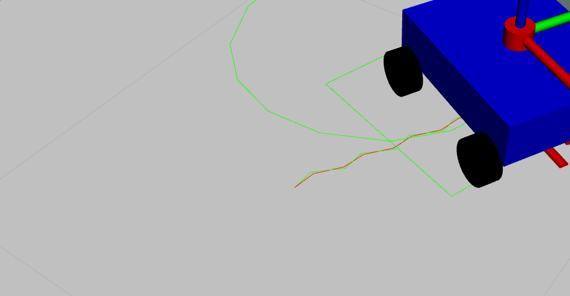
有平滑效果