## $$\mathbf{Nav2}~学习笔记$$
### 安装与配置
#### 示例包
使用
```bash
sudo apt install ros-jazzy-navigation2
sudo apt install ros-jazzy-nav2-bringup
```
可安装jazzy版本（可安装其他版本）下的nav2的示例包，使用
```bash
sudo apt install ros-jazzy-turtlebot3*
```
可安装$\mathbf{Turtlebot~3}$，然后用
```bash
source /opt/ros/jazzy/setup.bash
export TURTLEBOT3_MODEL=waffle
export GAZEBO_MODEL_PATH=$GAZEBO_MODEL_PATH:/opt/ros/jazzy/share/turtlebot3_gazebo/models
```
配置好环境变量（第一行如果配置ros时用过就不需要再用了），然后用
```bash
ros2 launch nav2_bringup tb3_simulation_launch.py
```
就能启动运行了
启动后应该能看到这样的画面
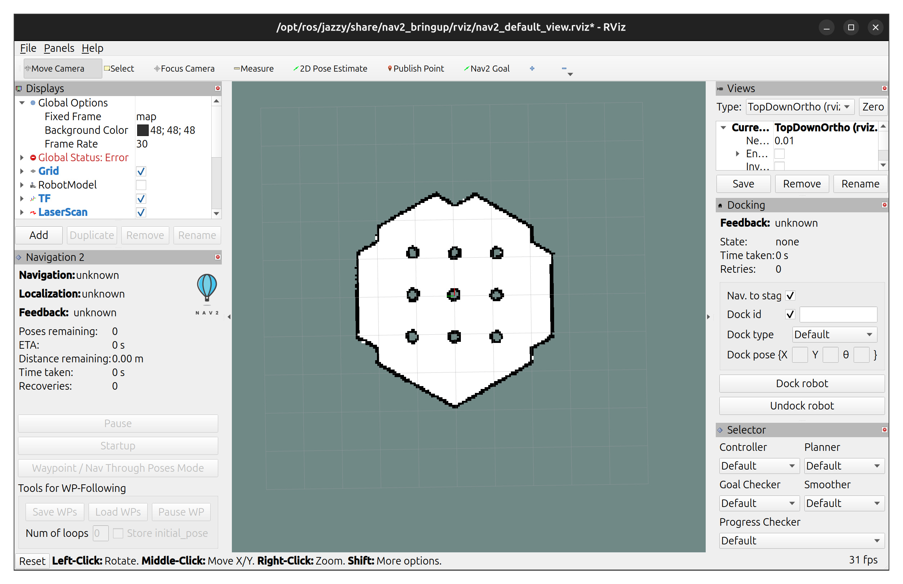
一般来说选择左下角的`Startup`就能启动显示这个画面
然后依次选择上方的`2D Pose Estimate`进行放置指定位置的机器人并扫描整个平面，然后点击`Nav2 Goal`（也有`Navigation2 Goal`的版本）指定接下来机器人移动的目标和最终朝向
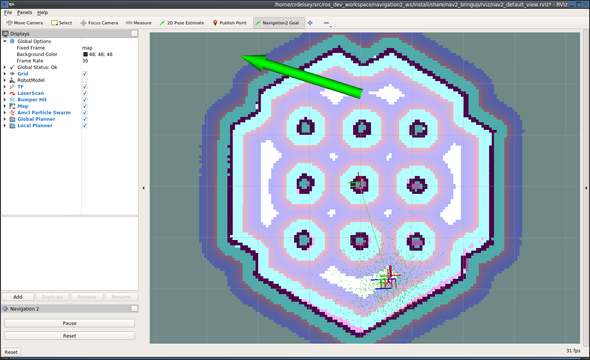
途中的一团复杂的彩色线段堆砌的位置就是机器人所在处，巨大的绿色箭头的起点是机器人移动的目标点，方向是机器人最终朝向，松手后机器人就会自动寻路移动

#### 安装与编译
##### 安装
在$\mathbf{Ubuntu20.04}$以上的版本，使用
```bash
sudo apt install ros-jazzy-navigation2 ros-jazzy-nav2-bringup ros-jazzy-turtlebot3*
```
来安装nav2
##### 编译
安装好后需要进行编译
先创建一个名为`nav2_ws`的工作空间，进到其下的`src`文件夹内，随后将nav2分支功能包克隆到这个目录下：（在humble或foxy版本中需要将`main`改为对应的`<ros2-distro>-devel`）
```bash
git clone https://github.com/ros-planning/navigation2.git --branch main
```
然后退回到`nav2_ws`目录下，用rosdep获取所有依赖项
```bash
rosdep install -y -r -q --from-paths src --ignore-src --rosdistro jazzy
```
然后使用
```bash
colcon build --symlink-install
```
进行软链接编译
（注意，直接进行编译可能会导致并行编译强制跑满所有内存和cpu直接卡死重启，为了避免这种情况，可以考虑设置交换内存为16~32G，例如：
```bash
sudo swapoff /swapfile
# 关闭/swapfile文件
sudo fallocate -l 4G /swapfile
# 额外增加4G的交换内存，写入/swapfile中
sudo chmod 600 /swapfile
sudo mkswap /swapfile
# 格式化为swap格式
sudo swapon /swapfile
# 启用swapfile文件
free -h
# 查看交换内存
```
进行限制性编译（即限制编译时只能一次编译一个项目等）例如：
```bash
MAKEFLAGS="-j1" colcon build --symlink-install --executor sequential --parallel-workers 1
```
这意味着一次进行一个项目编译，绝不多占用，这样不会导致卡死，但是仍有一个问题就是可能会出现编译器无法识别到`.hpp`文件的情况（明明存在且找到），这时候最好直接安装二进制版，不再折腾此编译，这里我们以二进制版本继续）
输入
```bash
rm -rf ~/nav2_ws/src/navigation2
```
可以删除之前编译的源代码，使用
```bash
sudo apt install ros-jazzy-navigation2 ros-jazzy-nav2-bringup ros-jazzy-turtlebot3-gazebo
```
安装二进制版
同时再使用
```bash
sudo apt install ros-jazzy-nav2-loopback-sim ros-jazzy-nav2-bringup ros-jazzy-turtlebot3-gazebo
```
安装```nav2_loopback_sim```，因为jazzy将nav2拆分的更细，光靠上面的无法安装全部
（如果是在折腾全部编译中途传过来二进制版，则很可能遇到环境污染，此时需要删除编译产物
```bash
cd ~/nav2_ws
rm -rf build/ install/ log/
```
记得设置环境变来嗯
```bash
export TURTLEBOT3_MODEL=burger
export GAZEBO_MODEL_PATH=$GAZEBO_MODEL_PATH:/opt/ros/jazzy/share/turtlebot3_gazebo/models
```
）
随后使用```ros2 launch nav2_bringup tb3_simulation_launch.py headless:=False```就能启动仿真了
如果不走二进制安装，且实在无法编译源码，可以使用$\mathbf{Docker}$容器，这里不详细展开

### 导航相关概念
#### 生命周期节点
该节点为ros2独有的节点，和普通节点（`rclcpp::Node`）不一样，生命周期节点（`rclcpp_lifecycle::LifecycleNode`）引入了状态机，它被划分为
- **未配置**$-\mathbf{Unconfigured}$
- **未激活**$-\mathbf{Inactive}$
- **激活**$-\mathbf{Active}$
- **已结束**$-\mathbf{Finalized}$

四个状态
同时必须通过外部指令（或者launch）手动触发它的状态转换
|          |普通节点                |生命周期节点                  |
|----------|----------------------|-----------------------------|
|逻辑执行时间|构造函数完成            |进入Active状态                |
|配置灵活性  |运行时修改参数较麻烦     |可在Inactive状态下完成配置再激活|
|确定性     |低（节点启动顺序不确定等）|高                           |

在nav2中，我们可以使用`nav2_util LifecycleNode`这个包装器，它统一了原有的复杂逻辑并简化了操作，同时它还拥有一个`bond`，这个东西用于连接**生命周期管理器**与各个导航服务，如果`bond`断开，管理器认为服务器不一定处于Active状态，无法信任，会直接**向下过渡**，让所有的导航节点都变为Inactive或者Unconfigured状态

*在后文学习了`nav2_params.yaml`文件的配置后再往下看横线内的内容*

---
生命周期节点统一由`lifecycle_manager`控制，如果想要增加自己的生命周期节点，需在某个launch文件中修改，如果目前是遵照官方的教程，使用`bringup_launch.py`和其调用的`navigation_launch.py`启动的话，那就在这两个文件中找到启动`lifecycle_manager`的那一个文件进行修改，例如添加一个自定义`sensor_driver`节点：
```py
lifecycle_nodes = ['sensor_driver',
                   'controller_server',
                   'smoother_server',
                   'planner_server',
                   'behavior_server',
                   'bt_navigator',
                   'waypoint_follower']
...
Node(
    package='nav2_sensor_driver',
    executable='sensor_driver',
    name='sensor_driver',
    output='screen',
    parameters=[configured_params],
    remappings=remappings),
Node(
    package='nav2_lifecycle_manager',
    executable='lifecycle_manager',
    name='lifecycle_manager_navigation',
    output='screen',
    parameters=[{'autostart': autostart},
                {'node_names': lifecycle_nodes}]),
```
`lifecycle_manager_navigation`需要填入`lifecycle_nodes`作为参数记录节点名，而我们要添加的新节点名称就添加到`lifecycle_nodes`里，并额外新定义一个节点`Node`

---

#### 有限状态机($\mathbf{Finite~State~Machine,~FSM}$)
状态机是一种数学模型，描述了一个对象在其生命周期内所经历的状态，以及由于触发事件而导致的状态转换
有限状态机-FSM就是有限个状态，包含
- 有限个状态
- 转换条件
- 状态动作

它的局限性是当逻辑变得复杂，异常情况会增多，难以维护

#### 行为树($\mathbf{Behaviour~Tree,~BT}$)
在这里仅简要介绍，具体可阅读《Behaviour Tree in Robotics and AI》（https://arxiv.org/abs/1709.00084）
假如有若干个状态，FSM就像是网状结构，状态就是各个网络中的节点，自由切换，但是逻辑复杂起来就异常庞大，难以维护
而BT就是一棵树，状态就是各个节点，例如有四个状态A,B,C,D，其中B，D是A的子节点，C是B的子节点
当切换状态时，A会每秒发出多次信号脉冲（$\mathbf{Tick}$），这个tick会一直往下深探，直到到达某个节点后它返回**成功**或者**失败**，如果失败则往回走，如果成功则停下来，若这个节点只是一个**策略**，那么就直接继续走，在这里它经过B到达C，此时B根据C返回的信号决定是否回到A还是继续走或者停止继续
举个例子：
假如A是一个选择节点，B是走路，D是原地自旋，C是前进
A先发射tick到B，经过B到达C，如果确实可以前进，那就在这里停止，否则就返回失败信号，此时A知道B这个路走不通，就去D，再重复以上逻辑
Nav2使用`Behaviour CPP V3`作为行为树库，它可以加载子树，也就是说可以将一个nav2项目的BT加载到另一个更高级别的BT中，从而将其作为插件，同时它还提供了一个NavigationToPoseAction插件，可以从客户端应用程序通过通常的动作接口调用Nav2软件堆栈

#### 导航服务器
规划器和控制器是导航任务的核心，恢复器用于使机器人摆脱不良状态或尝试处理各种形式的问题，以使系统具有容错能力

##### 规划器、控制器和恢复器
在ros2中，这三个服务器以Action Server形式存在，并由BT统一管理调用
它们都托管于一个**地图算法插件**，即**代价地图**$-\mathbf{Costmap~2D}$（被实现为pluginlib插件）及其相关插件层
- 地图算法插件
  所有的导航服务器都托管于代价地图上，规划器托管于**全局代价地图**（关注整张地图），控制器托管于**局部代价地图**（关注机器人周边局部地图）
  这个插件则是代价地图的层级结构，分为
  - **静态层**
    提供自地图的`.yaml`文件，记录的是死物
  - **障碍物层**
    来自激光雷达或者摄像机，捕捉的是活物或动物
  - **膨胀层**
    给障碍物画一个警戒圈，警示机器人与墙的距离

规划器和控制器都需要在运行时配置一个配置名称（任务别名）和使用的算法类型（已注册的插件库的名称）
例如使用名为`FollowPath`的DWB控制器，此时DWB的所有参数都会放置在该命名空间中，例`FollowPath.<param>`
然后这两个服务器会公开任务对应的操作接口，以便调用所选算法
对于恢复器，它类似于备选方案，即用于给机器人不同方案执行后出现问题后的备选方案，其公共接口一般是原地旋转、等待、后退、清理代价图层等
它主要由BT监控并调用，而不是用户

#### 航点跟随
航点跟随是导航系统的基本功能之一，它会告知系统如何使用导航程序到达多个目的地
`nav2_waypoint_follower`软件包含一个航路点和跟踪程序，它一般有两种主要的实现思想，即哑机器人应用程序+智能集中式调度器和智能机器人应用程序+哑集中式调度器
区别在于统一由调度器考虑所有信息还是分给各部分分别考虑

#### 状态估计
在导航项目中，需要提供两个主要的坐标转换：
- map 到 odom 的坐标变换由定位系统（定位，建图，SLAM）提供
- odom 到 base_link 的坐标转换由里程计系统提供

$\mathbf{REP-105}$(https://www.ros.org/reps/rep-0105.html)表示至少必须为机器人建造一个包含``map`` -> `odom` -> `base_link` -> `[sensor frames]/base_laser` 的完整的TF树，TF2是ROS 2中的时变坐标变换库，Nav2使用TF2来表达和获取时间同步的坐标变换
全球定位系统 (GPS、SLAM-同步定位与建图、动作捕捉Motion Capture) 的工作是至少要提供 `map` -> `odom` 的坐标转换
然后，里程计系统的作用是提供 `odom` -> `base_link` 的坐标转化
关于 base_link 的其余坐标转换应该是静态的，并应在 URDF 中定义
`map`是全局地图坐标系，`odom`是里程计坐标系，`base_link`是机器人中心坐标系，`base_laser`是传感器坐标系
这个`map` -> `odom` -> `base_link` -> `base_laser`转换实际上是
`base_laser`传感获取数据，处理为`base_link`坐标系下的数据，再处理为给`odom`坐标系下使用的数据，最后处理为`map`即整张地图的数据（类似于一个坐标）
这样的处理就是为了给导航服务器等其他东西使用的，用于规划和执行机器人运动方案
为什么要多一个odom？为什么不直接把转换到odom这一步的数据直接当成map处理？
因为里程计有误差，从odom到map这一步转换通过AMCL-**自适应蒙特卡洛定位**插件得出，即一个微小的数据修正处理
最后得到的map才是精准的数据

#### 地图过滤器
我们可以对地图文件进行**注释**，即可以将某些区域排除在外避免在这些区域内进行路径规划，这种带注释的地图称为$\mathbf{Filter~mask}$
这个地图过滤器基于成本地图插件实现

### 配置一个机器人
#### urdf
使用urdf可以快速建模一个机器人，语法和`.xml`是一样的，本节内容在`Ros2 for learning`中已学习，假设我们已经有一个urdf建模的机器人，它拥有四个轮子，长方体身体，一个雷达
切记定义一个机器人需要定义它的`visual`、`collision`，如果需要更为专业，需要额外定义`inertial`，关于这个标签-物理属性的惯性 的相关公式，可以直接网上查询到
同时各个关节之间也需要标签`joint`链接，这个标签可以用于发布静态tf转换（注意`odom` -> `base_link`是动态转换）
除去给机器人建模等内容，我们在定义轮子插件时，可以选择使用差速驱动插件或者使用麦克纳姆轮，这里需要注意的是，麦克纳姆轮对应的插件文件名是`gz-sim-mecanum-drive-system`，对应的插件名是`gz::sim::systems::MecanumDrive`，由于仿真限制，在使用圆柱体型（或者其他模型）作为轮子时，并不能实现麦克纳姆轮的效果，你需要使用`gz::sim::systems::VelocityControl`插件，直接控制模型移动（毕竟是仿真）
如果还想给轮子导入麦克纳姆轮模型，可以使用例：
```xml
<mesh filename="package://my_nav2_robot/meshes/mecanum_${prefix}_hands.stl" scale="0.001 0.001 0.001"/>
```
导入一个位于功能包`my_nav2_robot`（必填）的文件夹`meshes`下的`.stl`模型文件，后面的`scale`参数是缩放比例。必须要注意的一点是，你需要在运行前使用`export GZ_SIM_RESOURCE_PATH=$GZ_SIM_RESOURCE_PATH:~/your_ws/src/`来设置gz的环境变量，以便它能读取轮子模型，你也可以使用`nano ~/.bashrc`打开配置文件后最后一行输入：
```bash
# 添加 Gazebo 模型资源路径
export GZ_SIM_RESOURCE_PATH=$GZ_SIM_RESOURCE_PATH:~/nav2_test/src/
```
这样gz就能读取了

#### 里程计系统
我们可以从各种传感器硬件中获取里程计信息，如IMU($\mathbf{Inertial~Measurement~Unit}$)-惯性测量单元、LIDAR、RADAR等，odom框架与之相关
里程计系统主要用于解决机器人局部的运动问题（局部的轮胎打滑、运动漂移、运动不稳等）
这个`odom` -> `base_link`的转换一般由tf2或诸如`robot_localization`等的框架发布
这个`robot_localization`会订阅各个有关机器人位姿和运动参数（传感器IMU、车轮编码器等），通过一系列矫正算法（EKF、UKF等）计算出最合适的转换并发布，和`map` -> `odom`不同的是，这个转换着重于在整个地图上的精确位置，而这个`robot_localization`则是关注于机器人的局部
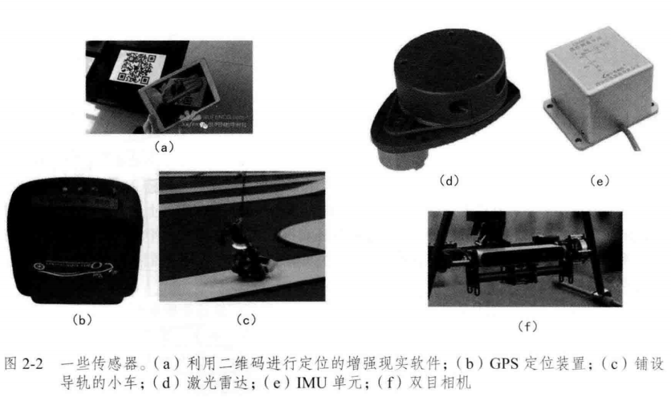
在编写仿真机器人时，其核心代码（一般由python或c++编写的ros2节点代码）应具备TF2的`odom` -> `base_link`的转换以及也要发送消息至Nav2的`nav_msgs/Odometry`，它应包含以下信息：
```bash
# This represents estimates of position and velocity in free space.
# The pose in this message should be specified in the coordinate frame given by header.frame_id
# The twist in this message should be specified in the coordinate frame given by the child_frame_id

# Includes the frame id of the pose parent.
std_msgs/Header header

# Frame id the pose is pointing at. The twist is in this coordinate frame.
string child_frame_id

# Estimated pose that is typically relative to a fixed world frame.
geometry_msgs/PoseWithCovariance pose

# Estimated linear and angular velocity relative to child_frame_id.
geometry_msgs/TwistWithCovariance twist
```
这个信息是发给规划器的，而前面发布的tf转换是给rviz看的
我们还可以设置这个类型为`nav_msgs::msg::Odometry`发布到规划器的信息`odom`中的协方差矩阵参数`odom.pose.covariance[i]`，在其对角线上的部分位置设置为$1\mathrm{e}-9$表示更相信模拟数据
最后注意整个tf树应该是`odom` -> `base_footprint` -> `base_link` -> `other`
注意不要在`.urdf`里写错`<parent link>`和`<child link>`

#### $\mathbf{Gazebo}$
在进入下一步前，可以先在urdf中集成gazebo插件，它可以接管我们原本写的核心框架中负责**监听`/cmd_vel`并发布`odom`和TF**的工作
既然是在urdf中集成，那我们需要直接修改`.urdf.xacro`（如果没有使用xacro则修改`.urdf`），在`</robot>`标签前添加：
```xml
<gazebo>
    <plugin
        filename="gz-sim-diff-drive-system"
        name="gz::sim::systems::DiffDrive">
        <left_joint>front_left_wheel_joint</left_joint> 
        <right_joint>front_right_wheel_joint</right_joint>
        <left_joint>rear_left_wheel_joint</left_joint> 
        <right_joint>rear_right_wheel_joint</right_joint>

        <wheel_separation>0.34</wheel_separation>
        <wheel_radius>${wheel_radius}</wheel_radius>
        <max_wheel_torque>50</max_wheel_torque> 
        <max_wheel_acceleration>3.5</max_wheel_acceleration>

        <topic>cmd_vel</topic>
        <odom_topic>odom</odom_topic>
        <tf_topic>/tf</tf_topic>
        <frame_id>odom</frame_id>
        <child_frame_id>base_footprint</child_frame_id>
    </plugin>

    <plugin
        filename="gz-sim-joint-state-publisher-system"
        name="gz::sim::systems::JointStatePublisher">
        <topic>joint_states</topic>
    </plugin>
</gazebo>
```
其中在humble版本下会有`<gazebo reference="link_name">`即包含的内容表示重新识别机器人在仿真环境中的颜色（因为gazebo使用不同的渲染引擎不识别urdf中的`<material>`标签），这个标签内还可定义摩擦力（如`<mu1>`等标签），在jazzy版gazebo进行了大更新，许多旧版的规则不适用，目前不用写这个标签的原因可能是渲染引擎已经可以自动识别
随后的`<gazebo>`标签内的内容主要是把这个机器人的属性添加到gazebo中，让gazebo“认识”这个机器人，最后的
```xml
<topic>cmd_vel</topic>
<odom_topic>odom</odom_topic>
<tf_topic>/tf</tf_topic>
<frame_id>odom</frame_id>
<child_frame_id>base_footprint</child_frame_id>
```
分别表明订阅速度的话题名称？里程计的话题名称？tf树话题名称？里程计的坐标系名称？里程计要转换到的机器人基准点坐标系名称？以及是否发布tf转换？是否使用gazebo仿真时间？
配置好后gazebo会代替原本核心框架中的三件事：
- 订阅`/cmd_vel`并发布速度，它会根据物理学推导最终机器人的位姿
- 物理仿真
- 发布里程计话题`/odom`和TF变换（`odom` -> `base_footprint`）
  
同时，如果是旧版gazebo（`Classic`），它可能还需要更多的参数，具体参数可在网站 https://gazebosim.org/api/sim/9/classgz_1_1sim_1_1systems_1_1DiffDrive.html 上查询，这里也可以查到其他插件的参数和使用方法，这个轮式里程计使用前要注意有没有还使用了其他里程计插件（例如`ground_truth`），如果有的话要注意`/tf`的一一对应，否则会互相抢占话题导致数据混乱
之后还需要写一个新的launch文件，负责启动robot state publisher、Gazebo、调用`spawn_entity`节点-负责将机器人模型添加到gazebo里、bridge桥接节点-桥接gazebo和ros2的话题（gazebo内部使用$\mathbf{gz~transport}$协议，而ros2内部使用$\mathbf{DDS}$协议，这样会导致ros2无法通过`ros2 topic list`等获取数据）
（注意：使用jazzy下的gazebo应提前用
```bash
sudo apt install ros-jazzy-ros-gz
```
安装gazebo依赖，同时`spawn_entity`节点在新版gazebo下的可执行程序变为了`create`，位于`/opt/ros/jazzy/lib/ros_gz_sim`，而gazebo的launch文件变为了`gz_sim.launch.py`，位于`/opt/ros/jazzy/share/ros_gz_sim/launch`，以及最重要的一点，必须先提前为gazebo设定好预设场景，否则一开始机器人就往下掉，因为没有地板，可以使用`empty.sdf`或`shapes.sdf`）

#### 配置传感器
在开始配置传感器前，先在urdf中建模出雷达，同时也要给他各种物理属性（碰撞箱和惯性）
随后我们在`laser_joint`的`</joint>`标签后添加
```xml
<gazebo reference="laser_link">
    <sensor name="gpu_lidar" type="gpu_lidar">
        <topic>scan</topic>
        <pose>0 0 0 0 0 0</pose>
        <frame_id>laser_link</frame_id>
        <gz_frame_id>laser_link</gz_frame_id>
        <visualize>true</visualize> <update_rate>10</update_rate>
        <lidar>
            <scan>
                <horizontal>
                    <samples>360</samples>
                    <resolution>1</resolution>
                    <min_angle>-3.14159</min_angle>
                    <max_angle>3.14159</max_angle>
                </horizontal>
            </scan>
            <range>
                <min>0.12</min>
                <max>12.0</max>
                <resolution>0.01</resolution>
            </range>
        </lidar>
        <plugin filename="gz-sim-sensors-system" name="gz::sim::systems::Sensors">
            <render_engine>ogre2</render_engine>
        </plugin>
    </sensor>
</gazebo>
```
这段代码表明雷达是一个`gpu_lidar`类型（利用显卡扫描而不是cpu）的雷达，第一个`<topic>`标签用于告诉gazebo将扫描的信息发到`/scan`话题，否则它会发到自己的一个长的话题，后面的`<pose>`标签则分别表示相对于原`laser_link`分别在`x y z r p y`上的偏移量，这里的`<frame_id>`和`<gz_frame_id>`标签可能很重要，它告诉rviz雷达消息来源于这个坐标系，`<visualize>`标签表示显示扫描光束，下一个标签明显是扫描频率（单位是$\mathrm{Hz}$）
之后`<scan>`标签里的内容是2D扫描参数
- `<samples>`
  表示一圈扫描产生360个采样点
- `<min/max_angle>`
  表示扫描范围，这里是全方位扫描

之后的`<range>`标签表示测距范围，里面的第三个标签表示传感器能识别$1\mathrm{cm}$级别的距离变化
后面就是插件加载标签了，`orge2`是指定的渲染引擎
这里时间戳同步非常重要，请注意启动rviz2时它的时间戳是仿真时间内的（启动左下角看时间），同时也要注意tf2 monitor给出的时间戳延迟（Net Delay）最好为0
我们也可以添加一个摄像头，用来捕捉图像，只需要在urdf的`<gazebo>`标签下建立和`<sensor>`同标签的另一个`<sensor>`标签下有`<camera>`标签：
```xml
<sensor name="camera" type="camera">
    <pose>0.2 0 0.2 0 0 0</pose> <update_rate>30</update_rate>
    <frame_id>laser_link</frame_id>
    <gz_frame_id>laser_link</gz_frame_id>
    <visualize>true</visualize>
    <topic>camera/image_raw</topic> 
    <camera>
        <horizontal_fov>1.089</horizontal_fov>
        <image>
            <width>640</width>
            <height>480</height>
            <format>R8G8B8</format>
        </image>
        <clip>
            <near>0.05</near>
            <far>8.0</far>
        </clip>
    </camera>
</sensor>
```
同时在py的桥接器节点中添加图像和摄像机信息的传输：
```py
...
'/camera/image_raw@sensor_msgs/msg/Image@gz.msgs.Image',
'/camera/camera_info@sensor_msgs/msg/CameraInfo@gz.msgs.CameraInfo',
...
```
最后放入两个障碍物并将rviz2中的`/scan`话题下的`LaserScan`添加，再将这个下的`Topic`下的`Reliability Policy`改为`Best Effort`，就能看到扫描的红色轨迹，之后添加`/camera/image_raw`话题下`Image`添加，就能在左下角看到捕捉的图了，效果大概是这样：
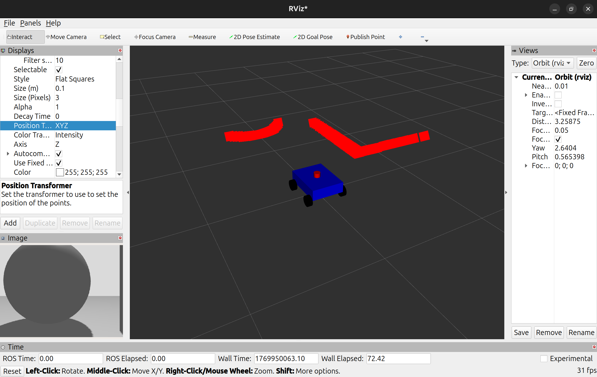
同时如果场景选择的是`sensors.sdf`，能在gazebo里看到
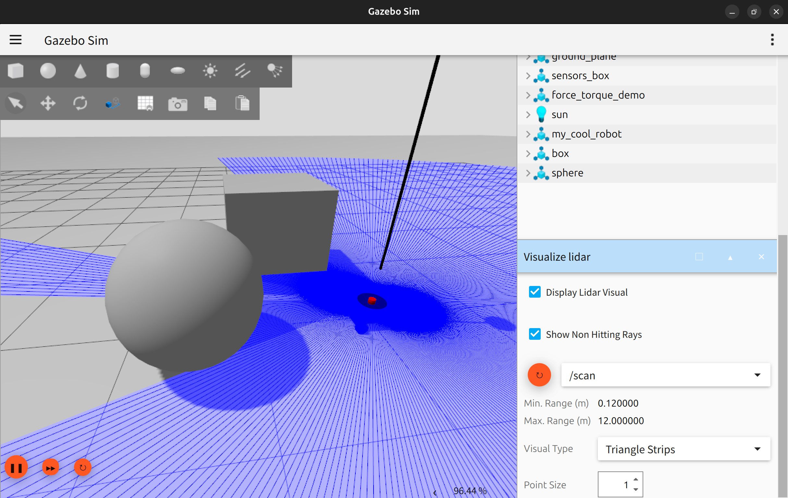

#### 配置$\mathbf{Footprint}$
`footprint`和我们之前定义的`base_footprint`不一样，`footprint`是机器人在底面的投影，说白了就是碰撞面积，用于给规划器规划路径作为参考数据，而`base_footprint`是机器人中心在底面的投影
`footprint`更表示多边形，如果你的机器人不需要很精确的碰撞，改用`robot_radius`可直接使用半径表示碰撞面积
我们需要一个`nav2_params.yaml`文件来配置相关信息，https://github.com/ros-navigation/navigation2_tutorials/blob/rolling/sam_bot_description/config/nav2_params.yaml 是一个官方提供的nav2教程包里的默认nav2 yaml文件（最新版本下），按理来说一般不通用，因为我们没有按照教程包编写机器人，但是这个确实能让我们的代码跑起来，我们将`robot_radius`那一栏（一共有两处，全局代价地图和局部代价地图，全局代价地图上的可以不改）改为`footprint`，输入格式为
```py
footprint: "[ [0.2, 0.15], [0.2, -0.15], [-0.2, -0.15], [-0.2, 0.15] ]"
```
类似这样按顺时针或逆时针的方式输入所有角点即可，`robot_radius`可填$0.25$
我们编译运行gazebo后，运行
```bash
ros2 run tf2_ros static_transform_publisher 0 0 0 0 0 0 map odom
```
来发送一个`map` -> `odom`的转换
随后用
```bash
ros2 launch nav2_bringup navigation_launch.py params_file:=$HOME/nav2_test/src/my_nav2_robot/config/nav2_params.yaml 
```
运行`nav2_params.yaml`文件，按理来说不出现各种`[ERROR]`和`[FATAL]`信息，再在rviz中添加两个`Polygon`，应该能看到如下场景（记住`Fixed Frame`要设置为`map`）
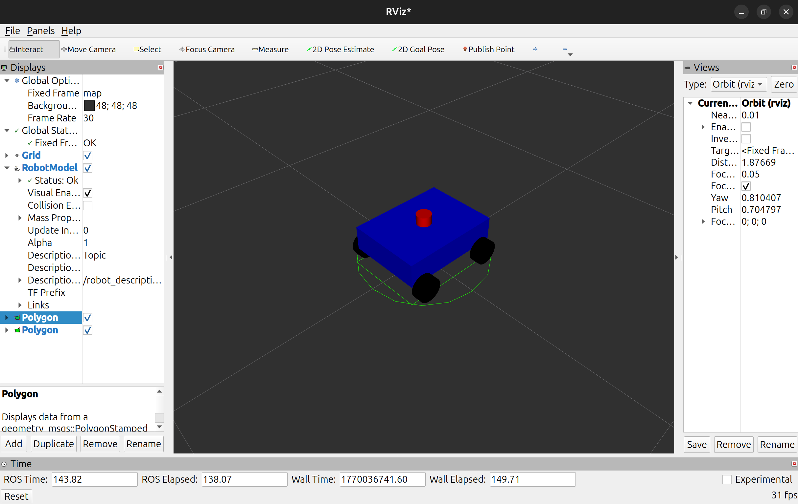
（注意：在挪用别人的`nav2_params.yaml`时，需要注意修改`robot_base_frame`、`odom_frame`、`global_frame`（一般是`map`）和urdf里一致，同时`observation_sources`下的`topic`要和你的扫描话题`/scan`一致，最后就是其他机器人的动力学约束，和你本身的机器人一致，最重要的是$\mathbf{MPPI/DWB}$控制器参数和激光雷达的`max_obstacle_height`，同时注意类型对齐，即如果`/cmd_vel`的类型不带`Stamped`，应该在文件中将所有地方的`enable_stamped_cmd_vel`全都设置为`false`）
在地图方面，由于官方的`.yaml`文件所在的教程包内自带地图文件，如果想不使用地图文件运行，建议在`global_costmap`下新增`rolling_window`设置为`true`，然后将`plugins`的`static_layer`去掉，同时安装slam
```bash
sudo apt install ros-jazzy-slam-toolbox
```
我们最好先将`robot.urdf.xacro`内的`<publish_odom_tf>`设为`false`
随后先运行
```bash
ros2 launch slam_toolbox online_async_launch.py use_sim_time:=True
```
再运行nav2
```bash
ros2 launch nav2_bringup bringup_launch.py use_sim_time:=True params_file:=$HOME/nav2_test/src/my_nav2_robot/config/nav2_params.yaml
```
需要注意的是，这次我们使用`bringup_launch.py`启动，它还多启动了`amcl`和`map_server`节点
这时slam会自动扫描并建图，同时也会自动发布`map` -> `odom`的转换
如果你的小车是四轮，在`<gazebo>`中设置两个轮标签时可能会导致后续gazebo转动时由于另外两个轮摩擦力太大导致gazebo中无法转动，rviz中可以转动但是`LaserScan`的扫描物也会一起转动，这很可能是摩擦力和扭矩的问题，我们可以设置
```xml
<gazebo reference="rear_left_wheel_link">
    <mu1>0.01</mu1> 
    <mu2>0.01</mu2>
</gazebo>
<gazebo reference="rear_right_wheel_link">
    <mu1>0.01</mu1>
    <mu2>0.01</mu2>
</gazebo>
```
以及
```xml
<max_wheel_torque>200</max_wheel_torque> ```
```
设置两轮摩擦力和最大扭矩
在这里**扭矩**$(\mathbf{Torque})$指的是让物体绕轴转动的力，它的方向实际上平行于转动轴，遵循右手定则（即如果扭矩是正的，那就是大拇指方向为扭矩方向，其余四指方向为旋转方向（逆时针），反之亦然），公式为$$
\vec{\tau}=\vec{r}\times\vec{F}$$即扭矩矢量=力臂矢量$\times$力矢量
这里扭矩很像另一个概念**旋度**$(\mathbf{Curl})=\nabla \times F$，用于衡量向量场中某点的旋转程度，方向和扭矩一致
完成一切后启动整个项目，在`2D Pose Estimate`选定机器人位置后再`2D Goal Pose`选定目标点后应该能看到机器人正常规划路径
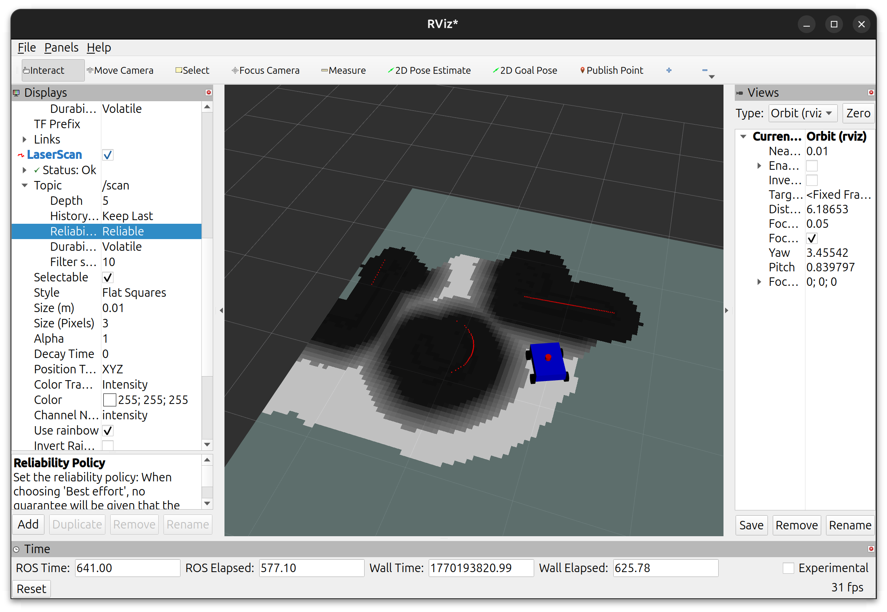
编写这个`nav2_params.yaml`实际上就已经开始为规划器(`planner server`)和控制器(`controller server`)配置了，目前的这个`nav2_params2.yaml`文件为规划器配备了`NavfnPlanner`插件，支持$\mathbf{Dijkstra}$算法和$\mathbf{A}^*$算法，控制器配备了`MPPIController`插件，基于模型预测路径积分
对规划器：
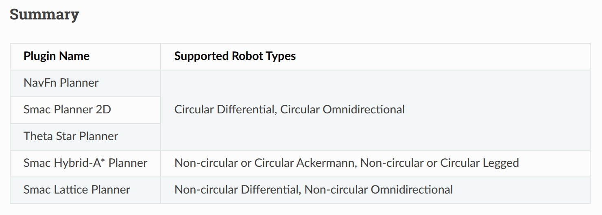
示例：
```py
planner_server:
  ros__parameters:
    planner_plugins: ['GridBased']
    GridBased:
      plugin: 'nav2_navfn_planner::NavfnPlanner' # In Iron and older versions, "/" was used instead of "::"
```
对控制器：
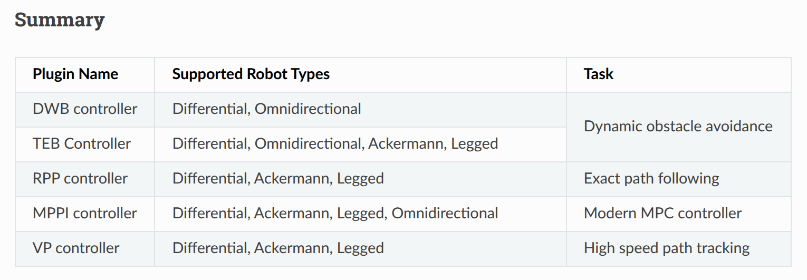
示例：
```py
controller_server:
  ros__parameters:
    controller_plugins: ["FollowPath"]
    FollowPath:
       plugin: "dwb_core::DWBLocalPlanner"
```

#### 组件
**组件**，$\mathbf{Composition}$，首先我们要知道nav2启动后，如果没有组件，那么所有节点都单独占一个线程运行，这样做不仅很消耗cpu资源和内存，并且节点互相通信时需要拷贝大量信息来交流
如果开启组件，那么就相当于让所有节点都在一个线程运行，不仅节省内存和cpu资源，通信也无需拷贝，实现0拷贝通信
如何实现？组件提供了一个**容器**的概念，节点放入容器后，容器内的所有节点就会在同一个线程同时运行，所以我们也可以实现多个容器，存放不同数量不同类型的节点，使得同时存在若干个线程分别同时运行着若干个节点，例如
```py
container = ComposableNodeContainer(
    name='my_container',
    namespace='',
    package='rclcpp_components',
    executable='component_container',
    composable_node_descriptions=[
        ComposableNode(
            package='nav2_route_server',
            plugin='nav2_route_server::RouteServer',
            name='nav2_route_server'),
    ],
    output='screen',
)
```
创建了一个新容器`container`，里面有一个名为`nav2_route_server`的节点，如果想要更多节点，直接在`composable_node_descriptions`内用`ComposableNode`描述即可
这个代码写到官方提供的`navigation_launch.py`中（如果自己没有写自己叠nav2启动的launch文件）
随后必须将包含服务器的功能包添加到`packages.xml`中
```xml
<exec_depend>nav2_route_server</exec_depend>
```

#### 地图系统
nav2中地图使用代价地图为模式，它包含三个层
- 静态层$-\mathrm{Static~Layer}$
  来源于`map_server`加载的`.yaml`和`.pgm`文件，提供一些固定障碍物
- 障碍物层$-\mathrm{Obstacle~Layer}$
  来源于激光雷达和深度相机，实时感知静态层、地图上没有的东西（箱子，路人等）
- 膨胀层$-\mathrm{Inflation~Layer}$
  通过计算机器人的footprint数据，为地图障碍物周边附加若干层，防止机器人碰撞

一般来说一个`map_server`需要这其中的第一、三个层（在`nav2_params.yaml`编写），其中第一个层需要传入地图文件`.pgm`和`.yaml`，同时你也需要启动`amcl`进行**蒙特卡洛法**定位机器人在地图的位置，如果暂时没有地图文件，那就可以去掉第一个层，使用slam进行建图，同时需要设置地图滚动模式（`rolling_window`），这样就会使用雷达全方位扫描来进行建图，此时就不需要开启`amcl`了，因为正在即时建图
你也可以用slam跑过一次地图生成`.yaml`和`.pgm`后，使用`amcl`记载两个地图文件，关掉slam进行运行
即先控制机器人跑完整张图，等地图形成差不多后，在新控制台输入
```bash
ros2 run nav2_map_server map_saver_cli -f map1
```
可以保存一个名为`map1`的`.yaml`和`.pgm`文件在当前目录下（你需要先`cd`到你功能包的`maps`目录下）
下次启动时关掉slam，加载地图，把静态层加回来，关掉滚动窗口就可以进入导航模式（但是此时gazebo是不会有模型的，因为他的地图文件是`.world`和`.sdf`），最后要**记得**将`maps`目录添加到cmake文件中进行安装，之后编译刷新环境，否则无法找到map文件加载，以及在这个情况下你的`map` -> `odom`转换需要手动发布（没错`amcl`不会给你发布这个tf），如果建图顺利的话，在nav模式下能看到
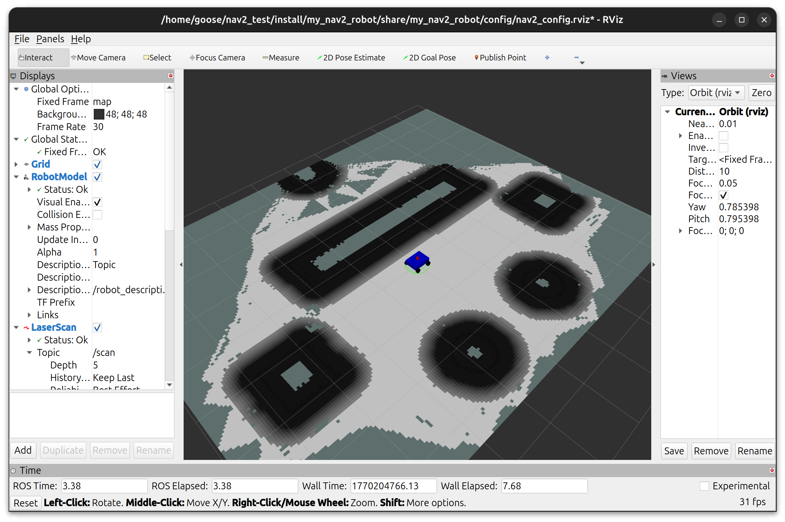

#### 小建议
写一个`full_navigation.launch.py`同时启动`gazebo_sim.launch.py`、`bringup_launch.py`、rviz配置文件（打开一个新的rviz，想要保存目前rviz的面板（配置），可以选左上角$\mathrm{File>Save~Config~as}$保存`.rviz`文件到`config`目录下（这个目录记得也要通过cmake安装），在后面的rviz配置启动文件可以填这个），可能还有`slam_toolbox`、静态`map` -> `odom`转换等
这样能显著提升效率，至于选择分支可以用一个变量`slam_mode`判断选择slam模式还是nav模式，同时也要进行对不同模式下`.yaml`文件的区分，推荐使用`IfCondition/UnlessCondition`或`PythonExpression`库

##### 关于小车抖动
这个问题主要体现在小车在amcl定位后开始运动，就会出现剧烈的坐标跳变抖动，很大程度上是因为amcl参数的设置有问题，注意以下这几个参数
```py
amcl:
  ros__parameters:
    # 里程计噪声
    alpha1: 0.2
    alpha2: 0.2
    alpha3: 0.2
    alpha4: 0.2
    alpha5: 0.2
    # update 触发阈值
    update_min_a: 0.05    # 旋转 0.05 rad (~3°) 即更新
    update_min_d: 0.05    # 直移 5cm 即更新
    # 粒子数
    max_particles: 2000
    min_particles: 500
    …
    laser_model_type: "likelihood_field"
    scan_topic: /scan
```
这些参数较为不合理，里程计噪声（`alpha`）不要设太大，更新触发阈值更小一点，粒子数可以少一点，速度更快，`resample_interval`可以调大一点，避免一更新就重新采样，以下参数设置比较合理：
```py
# 减小这些，让 AMCL 对 odom 过渡更平滑
alpha1: 0.05
alpha2: 0.05
alpha3: 0.05
alpha4: 0.05
alpha5: 0.05

# 只在显著运动时更新
update_min_a: 0.2
update_min_d: 0.1
resample_interval: 2

# 粒子数也可缩小到几百，提高速度
max_particles: 800
min_particles: 200
```
除此之外，urdf方面的轮距、摩擦力、PID也是导致仿真不稳定的原因（类似`LaserScan`扫描物随着小车一起轻微旋转，这是gazebo仿真无法跟上rviz2导致的），利用sophus库写的轨迹误差对比可以逐渐微调这些参数

### $\mathbf{Nav2}$行为树
#### 动作节点$-\mathbf{Action~Nodes}$
作为动作客户端调用nav2的各个（动作）服务器
- **`ComputePathToPose`**
  规划器接口，用于计算两点之间的路径，如果可以计算出来，则返回`SUCCESS`，否则返回`FAILURE`
- **`FollowPath`**
  控制器接口，控制机器人沿着生成的路径移动，走完是`SUCCESS`，走时是`RUNNING`，装障或走丢返回`FAILURE`
- **`Spin \ Wait \ BackUp`**
  旋转、等待、后退，只有当机器人卡住时它们才会执行上面三个运动，在主任务失败时出来执行
- **`ClearCostmapService`**
  服务客户端，用于清除Costmap消除传感器留下来的虚假障碍物

#### 条件节点$-\mathbf{Condition~Nodes}$
监察系统状态，结果为`True`返回`SUCCESS`、为`False`返回`FAILURE`
- **`GoalUpdated`**
  监听目标话题用于更新机器人的目的地，可以即使更新在rviz上点出的新目标点
- **`GoalReached`**
  监听机器人为姿检测机器人目前的位置是否与目标点重合
- **`IsBatteryLow`**
  监听电池话题检测电量是否充足
- **`InitialPoseReceived`**
  检查是否收到了`initial_pose`话题上的位姿信息

#### 装饰节点$-\mathbf{Decorator~Nodes}$
用于约定子节点的运行频率和触发时机
- **`RateController`**
  限制子节点的每秒运行频率(tick)
- **`DistanceController`**
  限制机器人行走到足够的距离后再重新计算路径
- **`GoalUpdater`**
  通过BT端口（传到其他节点之前）更新目标位置（根据动态障碍物微调）
- **`SpeedController`**
  根据机器人的行驶速度调整子节点的运行频率(tick)
- **`SingleTrigger`**
  只运行一次的节点，第一个tick时，它会执行，正在执行返回`RUNNING`，完成了且成功了返回`SUCCESS`，完成后无论到达几个tick，都返回`FAILURE`

#### 控制节点$-\mathbf{Control~Nodes}$
- **`PipelineSequence`**
  形象的说就是一个带顺序的并行运行节点，它允许每个子节点返回`SUCCESS`后执行下一个子节点，而当任何一个子节点返回`RUNNING`时，它都会重新tick之前的节点，保证顺序上节点的并行运行，如果某个节点返回`FAILURE`，它会杀死之后的所有任务，父节点（本身）返回`FAILURE`
  为什么不用`Parallel`？因为它无法做到带**顺序**并行运行，例如`FollowPath`和`ComputePathToPose`，它们通常都是`PipelineSequence`下的两个子节点，前者必须依赖后者计算的路径，否则顺序不一致会发生错误
- **`RecoveryNode`**
  专门处理失败的情况，它有通常有两个节点，一个是主行为（如导航），如果返回了`FAILURE`代表失败了，则执行第二个子节点（如原地旋转），如果返回`SUCCESS`，重试主行为，如果主行为随后返回`SUCCESS`，父节点返回`SUCCESS`
- **`RoundRobin`**
  **轮询**方式tick子节点，知道某个子节点返回`SUCCESS`，它就会返回`SUCCESS`，否则返回`RUNNING`，如果所有子节点都返回`FAILURE`，那么就停止轮询

如下是一个BT例图
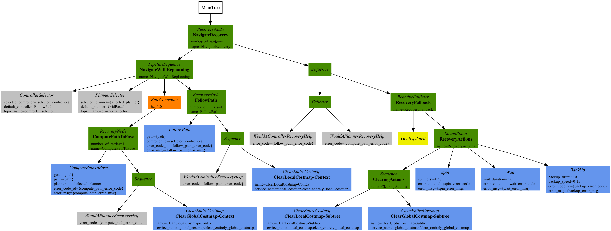
它在`.xml`中的代码是这样的
```xml
<root BTCPP_format="4" main_tree_to_execute="MainTree">
    <BehaviorTree ID="MainTree">
        <RecoveryNode number_of_retries="6" name="NavigateRecovery">
            <PipelineSequence name="NavigateWithReplanning">
                <ControllerSelector selected_controller="{selected_controller}" default_controller="FollowPath" topic_name="controller_selector"/>
                <PlannerSelector selected_planner="{selected_planner}" default_planner="GridBased" topic_name="planner_selector"/>
                <RateController hz="1.0">
                    <RecoveryNode number_of_retries="1" name="ComputePathToPose">
                        <ComputePathToPose goal="{goal}" path="{path}" planner_id="{selected_planner}" error_code_id="{compute_path_error_code}" error_msg="{compute_path_error_msg}"/>
                        <Sequence>
                            <WouldAPlannerRecoveryHelp error_code="{compute_path_error_code}"/>
                            <ClearEntireCostmap name="ClearGlobalCostmap-Context" service_name="global_costmap/clear_entirely_global_costmap"/>
                        </Sequence>
                    </RecoveryNode>
                </RateController>
                <RecoveryNode number_of_retries="1" name="FollowPath">
                    <FollowPath path="{path}" controller_id="{selected_controller}" error_code_id="{follow_path_error_code}" error_msg="{follow_path_error_msg}"/>
                    <Sequence>
                        <WouldAControllerRecoveryHelp error_code="{follow_path_error_code}"/>
                        <ClearEntireCostmap name="ClearLocalCostmap-Context" service_name="local_costmap/clear_entirely_local_costmap"/>
                    </Sequence>
                </RecoveryNode>
            </PipelineSequence>
            <Sequence>
                <Fallback>
                    <WouldAControllerRecoveryHelp error_code="{follow_path_error_code}"/>
                    <WouldAPlannerRecoveryHelp error_code="{compute_path_error_code}"/>
                </Fallback>
                <ReactiveFallback name="RecoveryFallback">
                    <GoalUpdated/>
                    <RoundRobin name="RecoveryActions">
                        <Sequence name="ClearingActions">
                        <ClearEntireCostmap name="ClearLocalCostmap-Subtree" service_name="local_costmap/clear_entirely_local_costmap"/>
                        <ClearEntireCostmap name="ClearGlobalCostmap-Subtree" service_name="global_costmap/clear_entirely_global_costmap"/>
                        </Sequence>
                        <Spin spin_dist="1.57" error_code_id="{spin_error_code}" error_msg="{spin_error_msg}"/>
                        <Wait wait_duration="5.0" error_code_id="{wait_error_code}" error_msg="{wait_error_msg}"/>
                        <BackUp backup_dist="0.30" backup_speed="0.15" error_code_id="{backup_error_code}" error_msg="{backup_error_msg}"/>
                    </RoundRobin>
                </ReactiveFallback>
            </Sequence>
        </RecoveryNode>
    </BehaviorTree>
</root>
```
主要包括两个主子树：导航子树和恢复子树
我们应保证整个行为树的大部分时间都在导航子树上，只有导航子树返回`FAILURE`才执行恢复子树，直到重试恢复子树的次数超过6（代码中的`number_of_retries="6"`来决定）
其中的`ReactiveFallback`控制系统范围内其余恢复之间的流程，并异步检查是否收到新目标，如果在任何时候目标更新，它将停止所有子节点返回`SUCCESS`

#### $\mathbf{Groot2}$
去 https://www.behaviortree.dev/groot 即groot2官网下载其`.AppImage`版，变为可执行程序后启动
我们可以通过小车ip和端口用groot连接到nav2服务器上，来监视整个行为树
它同时也是一个bt的可视化编辑器，我们可以用它来编辑一些`.xml`文件来构造行为树（随写随存）
我们可以将这些`.xml`放到功能包的`behavior_trees`目录下（你可以选择在之后的cmake中安装该目录）
我们在打开文件前可能需要先在`Model`栏目选择`Import Models from file`倒入一棵bt需要的所有nav2节点
在编辑好一个文件后，如果想要让小车遵循该行为树，我们需要在`nav2_params.yaml`中的`bt_navigator`中的`ros__parameters`添加
```xml
default_nav_to_pose_bt_xml: "/home/goose/nav2_test/src/my_nav2_robot/behavior_trees/test_nav.xml
```
后面的路径可以是绝对路径，也可以是相对路径（如果你在cmake文件中添加了安装这个文件夹的代码），这样小车就会使用这个文件编写的bt了（如果不填使用一个默认bt文件）
例如一个`test_nav.yaml`
```xml
<?xml version="1.0" encoding="UTF-8"?>
<root BTCPP_format="4"
      main_tree_to_execute="MainTree">
  <BehaviorTree ID="MainTree">
    <RecoveryNode name="NavigateRecovery"
                  number_of_retries="6">
      <PipelineSequence name="NavigateWithReplanning">
        <RateController hz="20.0">
          <RecoveryNode name="ComputePathToPose"
                        number_of_retries="1">
            <ComputePathToPose goal="{goal}"
                               path="{path}"
                               planner_id="GridBased"/>
            <ClearEntireCostmap name="ClearGlobalCostmap-Context"
                                service_name="global_costmap/clear_entirely_global_costmap"/>
          </RecoveryNode>
        </RateController>
        <FollowPath path="{path}"
                    controller_id="FollowPath"/>
      </PipelineSequence>
      <ReactiveFallback name="RecoveryFallback">
        <GoalUpdated/>
        <Sequence name="StuckRecovery">
          <BackUp backup_dist="0.2"
                  backup_speed="0.05"/>
          <ClearEntireCostmap name="ClearLocalCostmap-Subtree"
                              service_name="local_costmap/clear_entirely_local_costmap"/>
          <Wait wait_duration="2.0"/>
        </Sequence>
      </ReactiveFallback>
    </RecoveryNode>
  </BehaviorTree>

  <!-- Description of Node Models (used by Groot) -->
  <TreeNodesModel>
    <Action ID="BackUp"
            editable="true">
      <input_port name="backup_dist"/>
      <input_port name="backup_speed"/>
    </Action>
    <Action ID="ClearEntireCostmap"
            editable="true">
      <input_port name="service_name"/>
    </Action>
    <Action ID="ComputePathToPose"
            editable="true">
      <input_port name="goal"/>
      <input_port name="path"/>
      <input_port name="planner_id"/>
    </Action>
    <Action ID="FollowPath"
            editable="true">
      <input_port name="path"/>
      <input_port name="controller_id"/>
    </Action>
    <Action ID="GoalUpdated"
            editable="true"/>
    <Control ID="PipelineSequence"
             editable="true"/>
    <Decorator ID="RateController"
               editable="true">
      <input_port name="hz"/>
    </Decorator>
    <Control ID="RecoveryNode"
             editable="true">
      <input_port name="number_of_retries"/>
    </Control>
    <Action ID="Wait"
            editable="true">
      <input_port name="wait_duration"/>
    </Action>
  </TreeNodesModel>

</root>
```
在groot2里应该是这样的
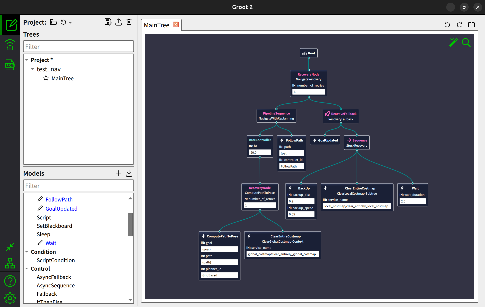
groot2还有添加自定义节点和导出项目的功能

### 局部路径规划算法
#### $\mathbf{Dynamic~Window~Approach-DWA}$
dwa算法一共有三个步骤
- 设计动态窗口
- 轨迹推算
- 优化组合计算

##### 设计动态窗口
动态窗口实际上是一个速度范围，用于约束机器人在短时间内安全到达目标点的$v$和$\omega$，它定义了一个速度空间$V_d$的子集$D_{dw}$，其中
$$ V_d = \{ (v,\omega) | v \in [ v_c - \dot{v} \Delta t, v_c + \dot{v} \Delta t ], \omega \in [ \omega_c - \dot{ \omega } \Delta t, \omega_c + \dot{ \omega } \Delta t ] \} $$
$ v_c $ 和 $ \omega_c $ 是当前的线速度和角速度，同时$D_{dw}$内的元素还应保证是安全速度（即遇到障碍物有充足的时间改变以致于不会撞上）

##### 轨迹推算
我们对$D_{dw}$内的每一组元素都进行未来一小段时间内的推演（速度不变），得到它的轨迹（应该是圆弧线），随后记录所有在轨迹末端时刻的点的位姿

##### 优化组合计算
接下来就是对每一组$D_{dw}$内的元素根据它们在未来轨迹末端时刻的点的位姿进行打分，分数最高的组合就是我们要选择的速度组合，记每一组元素的得分为$ G(v,\omega) $，其公式为：
$$ G( v, \omega ) = \alpha \cdot \mathrm{heading}( v, \omega ) + \beta \cdot \mathrm{dist}( v, \omega ) + \gamma \cdot \mathrm{vel}( v, \omega ) $$
其中$ \mathrm{heading}( v, \omega ),\mathrm{dist}( v, \omega ),\mathrm{vel}( v, \omega ) $分别为朝向权重、障碍物距离权重、线速度权重
而$\alpha$为轨迹末端时刻的朝向与目标点方向的差角的绝对值，$\beta$为轨迹末端时刻与最近障碍物的距离，$\gamma$为轨迹末端时刻的线速度的大小

##### 综合
将这三个步骤实现即可，需要注意的事项就是权重的选择，应选择合适的权重来达到最好的效果，同时dwa算法容易陷入局部最优，即可能会在一个凹形障碍物前不断磕碰，优点也是计算量小简单易懂实现简单

##### 实践
我们用
```bash
ros2 pkg create --build-type ament_cmake my_nav2_controller --dependencies nav2_core pluginlib rclcpp
```
创建一个新的功能包`my_dwa_controller`在工作空间下，里面写我们实现的dwa算法
准备两个文件`dwa_controller.cpp`和`dwa_controller.hpp`，假设我们已经写好：
`dwa_controller.hpp`:
```cpp
#ifndef MY_NAV2_CONTROLLER__DWA_CONTROLLER
#define MY_NAV2_CONTROLLER__DWA_CONTROLLER

#include <memory>
#include <string>
#include <vector>

#include "nav2_core/controller.hpp"
#include "rclcpp/rclcpp.hpp"
#include "nav_msgs/msg/path.hpp"
#include "geometry_msgs/msg/twist_stamped.hpp"
#include "nav2_costmap_2d/costmap_2d_ros.hpp"
#include "nav2_util/node_utils.hpp"

namespace my_nav2_controller {

    class MyDWAController : public nav2_core::Controller {

    public:

        MyDWAController() = default;
        ~MyDWAController() override = default;

        /**
         * @brief 初始化插件
         * @param parent 生命周期节点
         * @param name 加载的插件的名称
         * @param tf 用于检查变换
         * @param costmap_ros 代价地图
         * @return 无
         */
        void configure(
            const rclcpp_lifecycle::LifecycleNode::WeakPtr &parent,
            std::string name, std::shared_ptr<tf2_ros::Buffer> tf,
            std::shared_ptr<nav2_costmap_2d::Costmap2DROS> costmap_ros) override;
        
        void activate() override;
        void deactivate() override;
        void cleanup() override;

        /**
         * @brief 接受规划器传来的路径
         * @param path 路径消息
         * @return 无
         */
        void setPlan(const nav_msgs::msg::Path &path) override;

        void setSpeedLimit(const double &speed_limit, const bool &percentage) override;

        /**
         * @brief 计算下达给底盘的速度（但不是直接下达给底盘）
         * @param pose 带时间戳的小车位姿
         * @param v 目前小车的速度
         * @param goal_checker 到达目标点检测
         * @return 带时间戳的运动向量类型
         */
        geometry_msgs::msg::TwistStamped computeVelocityCommands(
            const geometry_msgs::msg::PoseStamped &pose,
            const geometry_msgs::msg::Twist &v,
            nav2_core::GoalChecker *goal_checker) override;
    protected:
        
        double cal_score(double v, double w);
        double cal_diff_angle(double inialp, double goalalp);

        rclcpp_lifecycle::LifecycleNode::WeakPtr node_;
        std::shared_ptr<nav2_costmap_2d::Costmap2DROS> costmap_ros_;
        std::shared_ptr<tf2_ros::Buffer> tf_;
        rclcpp::Logger logger_{rclcpp::get_logger("MyDWAController")};
        rclcpp::Clock::SharedPtr clock_;
        nav_msgs::msg::Path global_plan_;
        std::string plugin_name_;

        // DWA参数
        double alpha, beta, gamma; // heading distance velocity分权重
        double lookahead_dist; // 诱饵点
        double max_v; // 最大速度
        double max_w;
        double lim_a; // 加速度限制
        double lim_aw;
        double sim_time_; // 未来时间
        rclcpp::Duration transform_tolerance_{0, 0};
    };
}

#endif // MY_NAV2_CONTROLLER__DWA_CONTROLLER
```
`dwa_controller.cpp`:
```cpp
#include "my_nav2_controller/dwa_controller.hpp"
#include "nav2_core/controller_exceptions.hpp"
#include "pluginlib/class_list_macros.hpp"
#include "nav2_util/node_utils.hpp"

using nav2_util::declare_parameter_if_not_declared;

namespace my_nav2_controller {

    struct Path {
        double v, w,      // 速度组合
            score,        // 总评分
            cost,         // 障碍物代价
            dist_to_path; // 距离全局路径的距离
    };

    void MyDWAController::configure(
        const rclcpp_lifecycle::LifecycleNode::WeakPtr &parent,
        std::string name, std::shared_ptr<tf2_ros::Buffer> tf,
        std::shared_ptr<nav2_costmap_2d::Costmap2DROS> costmap_ros) {
        
        node_ = parent;
        auto node = node_.lock();
        tf_ = tf;
        plugin_name_ = name;
        costmap_ros_ = costmap_ros;
        logger_ = node->get_logger();
        clock_ = node->get_clock();
        
        declare_parameter_if_not_declared(
            node, plugin_name_ + ".alpha", rclcpp::ParameterValue(2.0)
        );
        declare_parameter_if_not_declared(
            node, plugin_name_ + ".beta", rclcpp::ParameterValue(1.5)
        );
        declare_parameter_if_not_declared(
            node, plugin_name_ + ".gamma", rclcpp::ParameterValue(1.0)
        );
        declare_parameter_if_not_declared(
            node, plugin_name_ + ".lookahead_dist", rclcpp::ParameterValue(0.8)
        );
        declare_parameter_if_not_declared(
            node, plugin_name_ + ".max_v", rclcpp::ParameterValue(0.5)
        );
        declare_parameter_if_not_declared(
            node, plugin_name_ + ".max_w", rclcpp::ParameterValue(1.0)
        );
        declare_parameter_if_not_declared(
            node, plugin_name_ + ".lim_a", rclcpp::ParameterValue(2.5)
        );
        declare_parameter_if_not_declared(
            node, plugin_name_ + ".lim_aw", rclcpp::ParameterValue(3.2)
        );
        declare_parameter_if_not_declared(
            node, plugin_name_ + ".sim_time", rclcpp::ParameterValue(1.5)
        );
        declare_parameter_if_not_declared(
            node, plugin_name_ + ".transform_tolerance", rclcpp::ParameterValue(0.1)
        );

        // 获取参数
        node->get_parameter(plugin_name_ + ".alpha", alpha);
        node->get_parameter(plugin_name_ + ".beta", beta);
        node->get_parameter(plugin_name_ + ".gamma", gamma);
        node->get_parameter(plugin_name_ + ".lookahead_dist", lookahead_dist);
        node->get_parameter(plugin_name_ + ".max_v", max_v);
        node->get_parameter(plugin_name_ + ".max_w", max_w);
        node->get_parameter(plugin_name_ + ".lim_a", lim_a);
        node->get_parameter(plugin_name_ + ".lim_aw", lim_aw);
        node->get_parameter(plugin_name_ + ".sim_time", sim_time_);

        double transform_tolerance;
        node->get_parameter(plugin_name_ + ".transform_tolerance", transform_tolerance);
        transform_tolerance_ = rclcpp::Duration::from_seconds(transform_tolerance);

        RCLCPP_INFO(logger_, "自定义DWA控制器配置完成");
    }
     
    void MyDWAController::setPlan(const nav_msgs::msg::Path &path) {

        global_plan_ = path;
    }

    /**
     * @brief 以逆时针为正方向计算初始角到目标角的差角
     * @param inialp 初始角
     * @param goalalp 目标角
     * @return 一个double值
     */
    double MyDWAController::cal_diff_angle(double inialp, double goalalp) {

        double raw_diff_angle = goalalp - inialp;
        while (raw_diff_angle > M_PI) raw_diff_angle -= 2 * M_PI;
        while (raw_diff_angle < -M_PI) raw_diff_angle += 2 * M_PI;
        return raw_diff_angle;
    }

    geometry_msgs::msg::TwistStamped MyDWAController::computeVelocityCommands(
        const geometry_msgs::msg::PoseStamped & pose,
        const geometry_msgs::msg::Twist & velocity,
        nav2_core::GoalChecker *goal_checker) {

        auto node = node_.lock();
        auto costmap = costmap_ros_->getCostmap();

        // 设定诱饵点
        geometry_msgs::msg::PoseStamped target_pose;
        bool found_target = false;

        // 获取机器人位置
        double r_x = pose.pose.position.x,
            r_y = pose.pose.position.y,
            r_yaw = tf2::getYaw(pose.pose.orientation);

        // 遍历路径
        for (const auto &p : global_plan_.poses) {

            double dx = p.pose.position.x - r_x,
                dy = p.pose.position.y - r_y;
            if (std::hypot(dx, dy) >= lookahead_dist) {

                target_pose = p;
                found_target = true;
                break;
            }
        }
        if (!found_target && !global_plan_.poses.empty()) {

            target_pose = global_plan_.poses.back();
        }
        // 计算到诱饵点的角度
        double target_yaw = std::atan2(target_pose.pose.position.y - r_y,
                                 target_pose.pose.position.x - r_x);

        // 动态窗口
        double dt = 0.1,
            v_min = std::max(0.0, velocity.linear.x - lim_a * dt),
            v_max = std::min(max_v, velocity.linear.x + lim_a * dt),
            w_min = velocity.angular.z - lim_aw * dt,
            w_max = velocity.angular.z + lim_aw * dt;

        Path best_path = {0.0, 0.0, -1e9, 0.0, 0.0};

        // 采样循环
        for (double v = v_min; v <= v_max; v += 0.02) {

            for (double w = w_min; w <= w_max; w += 0.1) {

                double x = 0.0, y = 0.0, alp = r_yaw;
                bool collided = false;
                double min_dist_to_path = 1e9;

                for (double t = 0; t < sim_time_; t += 0.2) {

                    x += v * cos(alp) * 0.2;
                    y += v * sin(alp) * 0.2;
                    alp += w * 0.2;
                    unsigned int mx, my;
                    // 地图内判断
                    if (costmap_ros_->getCostmap()->worldToMap(x + r_x, y + r_y, mx, my)) {

                        // 获取代价
                        unsigned char cost = costmap->getCost(mx, my);
                        if (cost >= nav2_costmap_2d::INSCRIBED_INFLATED_OBSTACLE) { // 撞墙了

                            collided = true;
                            break;
                        }
                        double dist_score_temp = (255.0 - cost) / 255.0; // 归一化
                        if (dist_score_temp < min_dist_to_path) {

                            // 代价越小，距离越大
                            min_dist_to_path = dist_score_temp;
                        }
                    }
                }

                if (collided) continue;
                // 评分
                // Heading
                double diff_angle = std::abs(cal_diff_angle(alp, target_yaw)),
                    heading_score = (M_PI - diff_angle) / M_PI;
                
                // Distance
                double distance_score = min_dist_to_path;

                // Velocity
                double velocity_score = v / max_v;
                double score = alpha * heading_score +
                               beta * distance_score +
                               gamma * velocity_score;
                if (score > best_path.score) best_path = {v, w, score, 0.0, 0.0};
            }
        }
        
        geometry_msgs::msg::TwistStamped cmd_vel;
        cmd_vel.header.stamp = clock_->now();
        cmd_vel.header.frame_id = "base_link";
        cmd_vel.twist.linear.x = best_path.v;
        cmd_vel.twist.angular.z = best_path.w;

        return cmd_vel;
    }
    void MyDWAController::activate() { RCLCPP_INFO(logger_, "插件已激活"); }
    void MyDWAController::deactivate() { RCLCPP_INFO(logger_, "插件已停用"); }
    void MyDWAController::cleanup() { RCLCPP_INFO(logger_, "插件已清理"); }
    void MyDWAController::setSpeedLimit(const double & speed_limit, const bool & percentage) {
        
        (void)speed_limit;
        (void)percentage;
        RCLCPP_INFO(logger_, "收到限速指令，当前插件尚未实现具体的限速逻辑");
    }
} // my_nav2_controller

// 注册算法插件
PLUGINLIB_EXPORT_CLASS(my_nav2_controller::MyDWAController, nav2_core::Controller)
```
之后我们编写`CMakeLists.txt`，它应该包含需要的依赖、安装需要的文件、导出所需要的依赖供其他包使用、编译动态库，还需要使用
```c
pluginlib_export_plugin_description_file(nav2_core plugins.xml)
```
导出插件描述文件，以便我们能正常加载我们的插件，这是一个完整的cmake文件：
```c
cmake_minimum_required(VERSION 3.8)
project(my_nav2_controller)

if(CMAKE_COMPILER_IS_GNUCXX OR CMAKE_CXX_COMPILER_ID MATCHES "Clang")
  add_compile_options(-Wall -Wextra -Wpedantic)
endif()

# find dependencies
find_package(ament_cmake REQUIRED)
find_package(nav2_core REQUIRED)
find_package(nav2_util REQUIRED)
find_package(nav2_costmap_2d REQUIRED)
find_package(pluginlib REQUIRED)
find_package(rclcpp REQUIRED)
find_package(rclcpp_lifecycle REQUIRED)
find_package(geometry_msgs REQUIRED)
find_package(nav_msgs REQUIRED)
find_package(tf2 REQUIRED)
find_package(tf2_ros REQUIRED)
find_package(angles REQUIRED)

# 添加头文件目录
include_directories(include)

# 编译动态库 (Shared Library)
add_library(${PROJECT_NAME}_lib SHARED
  src/dwa_controller.cpp
)

ament_target_dependencies(${PROJECT_NAME}_lib
  nav2_core
  nav2_util
  nav2_costmap_2d
  pluginlib
  rclcpp
  rclcpp_lifecycle
  geometry_msgs
  nav_msgs
  tf2
  tf2_ros
  angles
)

pluginlib_export_plugin_description_file(nav2_core plugins.xml)

install(TARGETS ${PROJECT_NAME}_lib
  ARCHIVE DESTINATION lib
  LIBRARY DESTINATION lib
  RUNTIME DESTINATION bin
)

install(DIRECTORY include/
  DESTINATION include/
)

# 导出依赖以供其他包使用
ament_export_include_directories(include)
ament_export_libraries(${PROJECT_NAME}_lib)
ament_export_dependencies(nav2_core nav2_util pluginlib rclcpp)

if(BUILD_TESTING)
  find_package(ament_lint_auto REQUIRED)
  # the following line skips the linter which checks for copyrights
  # comment the line when a copyright and license is added to all source files
  set(ament_cmake_copyright_FOUND TRUE)
  # the following line skips cpplint (only works in a git repo)
  # comment the line when this package is in a git repo and when
  # a copyright and license is added to all source files
  set(ament_cmake_cpplint_FOUND TRUE)
  ament_lint_auto_find_test_dependencies()
endif()

ament_package()
```
同时这里提到的`plugins.xml`也是需要写的，位于与`package.xml`同级的位置：
```xml
<library path="my_nav2_controller_lib">
  <class name="my_nav2_controller/MyDWAController" 
         type="my_nav2_controller::MyDWAController" 
         base_class_type="nav2_core::Controller">
    <description>
      这是一个手动实现的简单DWA局部路径规划器插件。
    </description>
  </class>
</library>
```
注意这里的`name`就是我们加载插件时需要填的，该文件用于描述插件
以及`package.xml`我们需要把所有用到的依赖全都写上：
```xml
<?xml version="1.0"?>
<?xml-model href="http://download.ros.org/schema/package_format3.xsd" schematypens="http://www.w3.org/2001/XMLSchema"?>
<package format="3">
  <name>my_nav2_controller</name>
  <version>0.0.0</version>
  <description>TODO: Package description</description>
  <maintainer email="meis38@126.com">goose</maintainer>
  <license>TODO: License declaration</license>

  <buildtool_depend>ament_cmake</buildtool_depend>

  <depend>nav2_core</depend>
  <depend>nav2_util</depend>
  <depend>nav2_costmap_2d</depend>
  <depend>pluginlib</depend>
  <depend>rclcpp</depend>
  <depend>rclcpp_lifecycle</depend>
  <depend>geometry_msgs</depend>
  <depend>nav_msgs</depend>
  <depend>tf2</depend>
  <depend>tf2_ros</depend>
  <depend>angles</depend>

  <test_depend>ament_lint_auto</test_depend>
  <test_depend>ament_lint_common</test_depend>

  <export>
    <build_type>ament_cmake</build_type>
    <nav2_core plugin="${prefix}/plugins.xml" />
  </export>
</package>
```
随后我们可以复制一份`nav2_params_nav.yaml`改名为`nav2_params_nav_diy.yaml`，我们主要将`FollowPath`的算法改成我们手写的dwa算法（官方使用mppi算法），改完后`controller_server`部分代码如下：
```py
FollowPath:
  plugin: "my_nav2_controller/MyDWAController"
  alpha: 2.0
  beta: 1.5
  gamma: 1.0
  lookahead_dist: 0.8
  max_v: 0.5
  max_w: 1.0
  lim_a: 2.5
  lim_aw: 3.2
  sim_time: 1.5
  transform_tolerance: 0.1
  goal_checker_plugin: "general_goal_checker"
  progress_checker_plugin: "progress_checker"
```
我们修改对应的launch文件中调用这个文件的参数名，重新编译整个包刷新环境后正常运行launch文件就能使用上我们自己写的dwa算法了

#### $\mathbf{Model~Predictive~Control,MPC}$
在学习了mpc后，我们可以利用mpc来写一个控制器插件
实际上mpc包含两个步骤，**采样**以及**求解**，采样步骤是因为需要$\boldsymbol{X_{\text{ref}}}$，如果没有这个就相当于没有参考（参考值为0），就无法随着路径行走，而是一味地往原点移动
- **采样**
  采样主要是在根据规划器算出来的路径上根据步长来采取路径点，通过整合为若干个状态量后存入矩阵$\boldsymbol{X_\text{ref}}$中，理论上步长应该所有未来预测区间内路径点上适当的速度与采样间隔之积的离散和，但是我们这里可以先统一用预测开始时刻的速度作为整个采样过程中的速度，即$s_{\text{acc}} = Nv_{\text{cur}}\Delta t$
- **求解**
  求解主要是在一系列约束条件下使用求解器对目标代价函数的最小值这个问题所代表的式子进行求解，实际上就是求一个二次型的最小值，在不涉及额外约束条件，追求快捷方便的情况下可以使用`Eigen`库自带的`ldlt().solve()`函数来进行QP求解（实际上整个求解过程就是一个QP问题的求解过程）

我们可以直接复制上述章节写的dwa控制器的功能包直接进行修改为mpc控制器插件：
`mpc_controller.hpp`：
```cpp
#ifndef MY_MPC_CONTROLLER__MPC_CONTROLLER
#define MY_MPC_CONTROLLER__MPC_CONTROLLER

#include <memory>
#include <string>
#include <vector>
#include <Eigen/Dense>

#include "nav2_core/controller.hpp"
#include "rclcpp/rclcpp.hpp"
#include "nav_msgs/msg/path.hpp"
#include "geometry_msgs/msg/twist_stamped.hpp"
#include "nav2_costmap_2d/costmap_2d_ros.hpp"
#include "nav2_util/node_utils.hpp"

namespace my_mpc_controller {

    struct PathPoint {

        double 
            x,
            y,
            theta,
            s; // 累积距离
    };
    struct MPCmatrices {

        Eigen::MatrixXd H; // 二次项矩阵
        Eigen::VectorXd f; // 一次项向量
        double G; // 常数项
    };
    class MyMPCController : public nav2_core::Controller {

    public:

        MyMPCController() = default;
        ~MyMPCController() override = default;

        /**
         * @brief 初始化插件
         * @param parent 生命周期节点
         * @param name 加载的插件的名称
         * @param tf 用于检查变换
         * @param costmap_ros 代价地图
         * @return 无
         */
        void configure(
            const rclcpp_lifecycle::LifecycleNode::WeakPtr &parent,
            std::string name, std::shared_ptr<tf2_ros::Buffer> tf,
            std::shared_ptr<nav2_costmap_2d::Costmap2DROS> costmap_ros) override;
        
        void activate() override;
        void deactivate() override;
        void cleanup() override;

        /**
         * @brief 接受规划器传来的路径
         * @param path 路径消息
         * @return 无
         */
        void setPlan(const nav_msgs::msg::Path &path) override;

        void setSpeedLimit(const double &speed_limit, const bool &percentage) override;

        /**
         * @brief 计算下达给底盘的速度（但不是直接下达给底盘）
         * @param pose 带时间戳的小车位姿
         * @param v 目前小车的速度
         * @param goal_checker 到达目标点检测
         * @return 带时间戳的运动向量类型
         */
        geometry_msgs::msg::TwistStamped computeVelocityCommands(
            const geometry_msgs::msg::PoseStamped &pose,
            const geometry_msgs::msg::Twist &v,
            nav2_core::GoalChecker */*goal_checker*/) override;
    protected:

        // 线性化
        void updateDiscreteModel(
            Eigen::Matrix3d &A, 
            Eigen::Matrix<double, 3, 2> &B,
            const double theta,
            const double v,
            const double dt);

        Eigen::VectorXd sampleReferencePath(
            const std::vector<PathPoint> &global_path,
            const Eigen::Vector3d &cur_pose,
            double v_ref,
            int N,
            double dt);

        /**
         * @brief 将 nav_msgs::Path 转换为带有累计距离 s 的 ReferencePoint 向量
         * @param path 订阅到的全局路径
         * @return 处理后的参考点序列
         */
        std::vector<PathPoint> preprocessPath(const nav_msgs::msg::Path &path);

        rclcpp_lifecycle::LifecycleNode::WeakPtr node_;
        std::shared_ptr<nav2_costmap_2d::Costmap2DROS> costmap_ros_;
        std::shared_ptr<tf2_ros::Buffer> tf_;
        rclcpp::Logger logger_{rclcpp::get_logger("MyMPCController")};
        rclcpp::Clock::SharedPtr clock_;
        nav_msgs::msg::Path global_plan_;
        std::string plugin_name_;
        std::vector<PathPoint> processed_path_;
        int last_closest_index_ = 0; // 优化路径寻找

        // MPC参数
        int N_ = 10; // 预测区间
        double dt_ = 0.1; // 采样时间 - 动态
        rclcpp::Duration transform_tolerance_{0, 0};
        double // 方便传数据
            q_11 = 20.0,
            q_22 = 20.0,
            q_33 = 1.0;
        double
            r_11 = 0.1,
            r_22 = 0.075;
        double
            f_11 = 40.0,
            f_22 = 40.0,
            f_33 = 2.0;
        Eigen::Matrix3d Q_; // 状态权重矩阵
        Eigen::Matrix2d R_; // 控制权重矩阵
        Eigen::Matrix3d F_; // 终端控制矩阵
    };
}

#endif // MY_MPC_CONTROLLER__MPC_CONTROLLER
```
`mpc_controller.cpp`：
```cpp
#include "my_mpc_controller/mpc_controller.hpp"
#include "nav2_core/controller_exceptions.hpp"
#include "pluginlib/class_list_macros.hpp"
#include "nav2_util/node_utils.hpp"

using nav2_util::declare_parameter_if_not_declared;

namespace my_mpc_controller {

    void MyMPCController::configure(
        const rclcpp_lifecycle::LifecycleNode::WeakPtr &parent,
        std::string name, std::shared_ptr<tf2_ros::Buffer> tf,
        std::shared_ptr<nav2_costmap_2d::Costmap2DROS> costmap_ros) {
        
        node_ = parent;
        auto node = node_.lock();
        tf_ = tf;
        plugin_name_ = name;
        costmap_ros_ = costmap_ros;
        logger_ = node->get_logger();
        clock_ = node->get_clock();

        nav2_util::declare_parameter_if_not_declared(
            node, plugin_name_ + ".q_11", rclcpp::ParameterValue(20.0));
        node->get_parameter(plugin_name_ + ".q_11", q_11);
        nav2_util::declare_parameter_if_not_declared(
            node, plugin_name_ + ".q_22", rclcpp::ParameterValue(20.0));
        node->get_parameter(plugin_name_ + ".q_22", q_22);
        nav2_util::declare_parameter_if_not_declared(
            node, plugin_name_ + ".q_33", rclcpp::ParameterValue(1.0));
        node->get_parameter(plugin_name_ + ".q_33", q_33);
        nav2_util::declare_parameter_if_not_declared(
            node, plugin_name_ + ".r_11", rclcpp::ParameterValue(0.1));
        node->get_parameter(plugin_name_ + ".r_11", r_11);
        nav2_util::declare_parameter_if_not_declared(
            node, plugin_name_ + ".r_22", rclcpp::ParameterValue(0.075));
        node->get_parameter(plugin_name_ + ".r_22", r_22);
        nav2_util::declare_parameter_if_not_declared(
            node, plugin_name_ + ".f_11", rclcpp::ParameterValue(40.0));
        node->get_parameter(plugin_name_ + ".f_11", f_11);
        nav2_util::declare_parameter_if_not_declared(
            node, plugin_name_ + ".f_22", rclcpp::ParameterValue(40.0));
        node->get_parameter(plugin_name_ + ".f_22", f_22);
        nav2_util::declare_parameter_if_not_declared(
            node, plugin_name_ + ".f_33", rclcpp::ParameterValue(2.0));
        node->get_parameter(plugin_name_ + ".f_33", f_33);

        Q_.setIdentity(); 
        Q_(0, 0) = q_11; // x 权重
        Q_(1, 1) = q_22; // y 权重
        Q_(2, 2) = q_33;  // theta 权重

        R_.setIdentity();
        R_(0, 0) = r_11; // v 权重
        R_(1, 1) = r_22; // w 权重

        F_.setIdentity(); 
        F_(0, 0) = f_11;
        F_(1, 1) = f_22;
        F_(2, 2) = f_33;

        nav2_util::declare_parameter_if_not_declared(
            node, plugin_name_ + ".n", rclcpp::ParameterValue(10));
        node->get_parameter(plugin_name_ + ".n", N_);

        double transform_tolerance;
        node->get_parameter(plugin_name_ + ".transform_tolerance", transform_tolerance);
        transform_tolerance_ = rclcpp::Duration::from_seconds(transform_tolerance);

        RCLCPP_INFO(logger_, "自定义MPC控制器配置完成");
    }
     
    void MyMPCController::setPlan(const nav_msgs::msg::Path &path) {

        global_plan_ = path;
        processed_path_ = preprocessPath(global_plan_); 
    }
    
    std::vector<PathPoint> MyMPCController::preprocessPath(const nav_msgs::msg::Path &path) {

        std::vector<PathPoint> processed_path;
        if (path.poses.empty()) return processed_path;
        double cumulative_s = 0.0;
        processed_path.reserve(path.poses.size());

        for (int i = 0; i < path.poses.size(); ++ i) {

            PathPoint pt;
            pt.x = path.poses[i].pose.position.x;
            pt.y = path.poses[i].pose.position.y;

            // s
            if (i > 0) {

                double 
                    dx = pt.x - processed_path.back().x,
                    dy = pt.y - processed_path.back().y;
                cumulative_s += std::hypot(dx, dy);
            }
            pt.s = cumulative_s;

            // yaw
            if (i < path.poses.size() - 1) {

                double 
                    dx_next = path.poses[i + 1].pose.position.x - pt.x,
                    dy_next = path.poses[i + 1].pose.position.y - pt.y;
                pt.theta = std::atan2(dy_next, dx_next);
            } else if (i > 0) {

                pt.theta = processed_path.back().theta;
            } else {

                pt.theta = tf2::getYaw(path.poses[i].pose.orientation);
            }

            processed_path.push_back(pt);
        }
        return processed_path;
    }

    /**
     * @brief 线性插值辅助函数
     */
    Eigen::Vector3d interpolatePathByS(const std::vector<PathPoint>& path, double s_target, int start_search_idx) {
        
        for (int i = start_search_idx; i < path.size() - 1; ++ i) {
            
            if (s_target >= path[i].s && s_target <= path[i + 1].s) {
                
                double rate = (s_target - path[i].s) / (path[i + 1].s - path[i].s);
                
                double 
                    x = path[i].x + rate * (path[i + 1].x - path[i].x),
                    y = path[i].y + rate * (path[i + 1].y - path[i].y);
                
                // 角度插值
                double diff = path[i + 1].theta - path[i].theta;
                while (diff > M_PI) diff -= 2 * M_PI;
                while (diff < -M_PI) diff += 2 * M_PI;
                double theta = path[i].theta + rate * diff;
                
                return Eigen::Vector3d(x, y, theta);
            }
        }
        return Eigen::Vector3d(path.back().x, path.back().y, path.back().theta);
    }

    /**
     * @brief MPC 路径采样函数
     * @param global_path 原始路径 (nav_msgs::msg::Path 转换后的结构)
     * @param cur_pose 当前机器人位姿 [x, y, theta]
     * @param v_ref 当前参考速度 (可以是动态计算的限速)
     * @param N 预测步长
     * @param dt 采样周期
     * @return 采样后的参考序列 x_ref [x1, y1, th1, x2, y2, th2, ...]
     */
    Eigen::VectorXd MyMPCController::sampleReferencePath(
        const std::vector<PathPoint> &global_path,
        const Eigen::Vector3d &cur_pose,
        double v_ref,
        int N,
        double dt
    ) {

        Eigen::VectorXd x_ref_vec(3 * (N + 1));

        // 寻点
        int min_idx = last_closest_index_;
        double min_dist = std::numeric_limits<double>::max();
        for (int i = last_closest_index_; i < global_path.size(); ++ i) {

            double d = hypot(global_path[i].x - cur_pose(0), global_path[i].y - cur_pose(1));
            if (d < min_dist) {

                min_dist = d;
                min_idx = i;
                last_closest_index_ = i;
            }
        }

        // 累积距离
        double
            s_start = global_path[min_idx].s,
            total_path_len = global_path.back().s;
        
        // 采样
        for (int i = 1; i <= N + 1; ++ i) {

            // 暂时先不考虑各段速度不同
            double s_target = s_start + i * v_ref * dt;

            Eigen::Vector3d ref_point;

            if (s_target >= total_path_len) {

                ref_point << global_path.back().x, global_path.back().y, global_path.back().theta;
            } else {

                // 防突变线性插值
                ref_point = interpolatePathByS(global_path, s_target, min_idx);
            }

            // 填充到Xk
            x_ref_vec.segment<3>((i - 1) * 3) = ref_point;
        }

        return x_ref_vec;
    }

    void MyMPCController::updateDiscreteModel(
        Eigen::Matrix3d &A, 
        Eigen::Matrix<double, 3, 2> &B,
        const double theta,
        const double v,
        const double dt
    ) {

        /*
            x_{k+1} = x_k + v_k \cos\theta_k \cdot \Delta t
            y_{k+1} = y_k + v_k \sin\theta_k \cdot \Delta t
            \theta_{k+1} = \theta_k + \omega_k \cdot \Delta t
            A = [1 0 -v \sin\theta \Delta t]
                [0 1 v \cos\theta \Delta t ]
                [0 0 1                     ]
            B = [\cos\theta \Delta t 0       ]
                [\sin\theta \Delta t 0       ]
                [0                   \Delta t]
        */
        A << 1.0, 0.0, -v * sin(theta) * dt,
             0.0, 1.0,  v * cos(theta) * dt,
             0.0, 0.0,                  1.0;
        B << cos(theta) * dt, 0.0,
             sin(theta) * dt, 0.0,
             0.0,              dt;
    }
    
    /**
     * @brief 构建 MPC 求解所需的 H f G
     * @param A, B 当前时刻线性化后的系统矩阵
     * @param x_k 当前机器人位姿 (3x1)
     * @param X_ref:采样得到的参考轨迹序列 (3*(N+1) x 1)
     * @param Q, R, F 权重矩阵 (状态, 控制, 终端状态)
     * @param N 预测步长
     */
    MPCmatrices replaceLargeMatrix(
        const Eigen::Matrix3d &A, 
        const Eigen::Matrix<double, 3, 2> &B,
        const Eigen::Vector3d &x_k,
        const Eigen::VectorXd &X_ref,
        const Eigen::Matrix3d &Q,
        const Eigen::Matrix2d &R,
        const Eigen::Matrix3d &F,
        int N
    ) {

        const int
            state_dim = 3,
            control_dim = 2;

        // 构建 M
        Eigen::MatrixXd M = Eigen::MatrixXd::Zero((N + 1) * state_dim, state_dim);
        Eigen::Matrix3d A_pow = Eigen::Matrix3d::Identity();
        for (int i = 0; i <= N; ++ i) {

            M.block<3, 3>(i * state_dim, 0) = A_pow;
            A_pow *= A;
        }

        // 构建 C
        Eigen::MatrixXd C = Eigen::MatrixXd::Zero((N + 1) * state_dim, N * control_dim);
        for (int i = 1; i <= N; ++ i) {

            for (int j = 0; j <= i - 1; ++ j) {

                A_pow = Eigen::Matrix3d::Identity();
                for (int k = 0; k < i - 1 - j; ++ k) {

                    A_pow *= A;
                }
                C.block<3, 2>(i * state_dim, j * control_dim) = A_pow * B;
            }
        }

        // 构建 Q_bar
        Eigen::MatrixXd Q_bar = Eigen::MatrixXd::Zero((N + 1) * state_dim, (N + 1) * state_dim);
        for (int i = 0; i <= N - 1; ++ i) {

            Q_bar.block<3, 3>(i * state_dim, i * state_dim) = Q;
        }
        Q_bar.block<3, 3>(N * state_dim, N * state_dim) = F; // 终端权重

        // 构建 R_bar
        Eigen::MatrixXd R_bar = Eigen::MatrixXd::Zero(N * control_dim, N * control_dim);
        for (int i = 0; i <= N - 1; ++ i) {

            R_bar.block<2, 2>(i * control_dim, i * control_dim) = R;
        }

        // 输出
        MPCmatrices mpcm_out;
        Eigen::VectorXd E = M * x_k - X_ref;
        mpcm_out.H = C.transpose() * Q_bar * C + R_bar;
        mpcm_out.f = C.transpose() * Q_bar * E;
        mpcm_out.G = E.transpose() * Q_bar * E;

        return mpcm_out;
    }

    geometry_msgs::msg::TwistStamped MyMPCController::computeVelocityCommands(
        const geometry_msgs::msg::PoseStamped & pose,
        const geometry_msgs::msg::Twist & velocity,
        nav2_core::GoalChecker */*goal_checker*/) {

        auto node = node_.lock();
        // FIXME：核心代码
        // x_k
        double 
            x = pose.pose.position.x,
            y = pose.pose.position.y,
            theta = tf2::getYaw(pose.pose.orientation);
        Eigen::Vector3d x_k(x, y, theta);
        
        // dt
        double dt;
        static rclcpp::Time last_time = clock_->now();
        rclcpp::Time current_time = clock_->now();
        dt = (current_time - last_time).seconds();
        if (dt <= 0.0 || dt > 0.5) dt = dt_;
        last_time = current_time;

        // X_ref
        Eigen::VectorXd X_ref = sampleReferencePath(processed_path_, x_k, velocity.linear.x, N_, dt);

        // 线性化AB
        Eigen::Matrix3d A;
        Eigen::Matrix<double, 3, 2> B;
        updateDiscreteModel(A, B, theta, std::max(std::abs(velocity.linear.x), 0.1), dt); // 暂时先这样
        
        // 构建HfG
        MPCmatrices mpcm = replaceLargeMatrix(A, B, x_k, X_ref, Q_, R_, F_, N_);

        // 求解U
        Eigen::VectorXd U_sol;
        U_sol = -mpcm.H.ldlt().solve(mpcm.f);
        // TODO：最终求解器

        double
            v_cmd = U_sol(0),
            w_cmd = U_sol(1);

        // 封装
        geometry_msgs::msg::TwistStamped cmd_vel;
        cmd_vel.header.stamp = clock_->now();
        cmd_vel.header.frame_id = "base_link";
        cmd_vel.twist.linear.x = v_cmd;
        cmd_vel.twist.angular.z = w_cmd;
        return cmd_vel;
    }
    void MyMPCController::activate() { RCLCPP_INFO(logger_, "插件已激活"); }
    void MyMPCController::deactivate() { RCLCPP_INFO(logger_, "插件已停用"); }
    void MyMPCController::cleanup() { RCLCPP_INFO(logger_, "插件已清理"); }
    void MyMPCController::setSpeedLimit(const double & speed_limit, const bool & percentage) {
        
        (void)speed_limit;
        (void)percentage;
        RCLCPP_INFO(logger_, "收到限速指令，当前插件尚未实现具体的限速逻辑");
    }
} // my_mpc_controller

// 注册算法插件
PLUGINLIB_EXPORT_CLASS(my_mpc_controller::MyMPCController, nav2_core::Controller)
```
cmake文件和`package.xml`和`plugins.xml`文件大部分是一样的，需要修改的地方在于插件名字和项目名字方面，同时还需要注意`Eigen`库依赖也要写上

#### 误差计算
通过$\mathrm{Sophus}$库可以将我们的`/odom`话题下的位姿和在gazebo仿真中的位姿结合来计算轨迹误差$\boldsymbol{T}_{\mathrm{err}}$
在此之前我们需要安装`tf2_eigen`以及`Sophus`库，前者一般已经安装完毕了（可以通过`sudo apt install ros-<ros-distro>-tf2-eigen`查看），后者最好是安装**模板类**版本的库：
```bash
# 1. 创建一个存放源码的文件夹
mkdir -p ~/3rdparty && cd ~/3rdparty

# 2. 从 GitHub 克隆最新的源码
git clone https://github.com/strasdat/Sophus.git
cd Sophus

# 3. 创建编译目录
mkdir build && cd build

# 4. 编译并安装
cmake ..
make -j1
sudo make install
```
注意`make -j1`表明单核编译，如果对自己的内存有足够信心可以使用`make -j$(nproc)`会快一点，记得分配交换内存（至少8G以上），这个安装后的库一般位于`/usr/local/include/sophus`
于是我们编写一个`odom_evaluator.hpp`：
```cpp
#include "rclcpp/rclcpp.hpp"
#include "nav_msgs/msg/odometry.hpp"
#include "sophus/se3.hpp"
#include "eigen3/Eigen/Core"
#include "tf2_eigen/tf2_eigen.hpp"

class OdomEvaluator : public rclcpp::Node {

public:

    OdomEvaluator();
private:

    void compute_error();

    rclcpp::Subscription<nav_msgs::msg::Odometry>::SharedPtr odom_sub_;
    rclcpp::Subscription<nav_msgs::msg::Odometry>::SharedPtr gt_sub_;
    rclcpp::TimerBase::SharedPtr timer_;

    Sophus::SE3d last_odom_, last_gt_;
    bool has_odom_ = false, has_gt_ = false;
};
```
以及一个`odom_evaluator.cpp`：
```cpp
#include "odom_evaluator.hpp"

OdomEvaluator::OdomEvaluator() : Node("odom_evaluator") {

    odom_sub_ = this->create_subscription<nav_msgs::msg::Odometry>(
        "/odom", 10, [this](const nav_msgs::msg::Odometry::SharedPtr msg) {

            Eigen::Isometry3d eigen_pose;
            tf2::fromMsg(msg->pose.pose, eigen_pose);
            last_odom_ = Sophus::SE3d(eigen_pose.rotation(), eigen_pose.translation());
            has_odom_ = true;
        }
    );
    gt_sub_ = this->create_subscription<nav_msgs::msg::Odometry>(
        "/ground_truth", 10, [this](const nav_msgs::msg::Odometry::SharedPtr msg) {

            Eigen::Isometry3d eigen_pose;
            tf2::fromMsg(msg->pose.pose, eigen_pose);
            last_gt_ = Sophus::SE3d(eigen_pose.rotation(), eigen_pose.translation());
            has_gt_ = true;
        }
    );
    timer_ = this->create_wall_timer(
        std::chrono::milliseconds(200), [this](){
            
            compute_error();
        }
    );
}

void OdomEvaluator::compute_error() {

    if (!has_odom_ || !has_gt_) return;

    Sophus::SE3d T_err = last_gt_.inverse() * last_odom_;

    double trans_err = T_err.translation().norm(),
        rot_err = T_err.so3().log().norm();

    RCLCPP_INFO(this->get_logger(), 
            "误差统计 -> 平移: %.4f m, 旋转: %.4f rad (%.2f deg)", 
            trans_err, rot_err, rot_err * 180.0 / M_PI);
}

int main(int argc, char** argv) {
    
    rclcpp::init(argc, argv);
    rclcpp::spin(std::make_shared<OdomEvaluator>());
    rclcpp::shutdown();
    return 0;
}
```
完成后记得在cmake文件以及`package.xml`中配置好依赖与可执行文件的安装
还有一点是我们需要配置gazebo插件才能获取真实位姿，我们在urdf文件中添加这个插件：
```xml
<gazebo>
    <plugin
        filename="gz-sim-odometry-publisher-system"
        name="gz::sim::systems::OdometryPublisher">
        <odom_topic>ground_truth</odom_topic> <odom_frame>world</odom_frame>
        <robot_base_frame>base_footprint</robot_base_frame>
        <tf_topic>ground_truth/tf</tf_topic>
        <dimensions>3</dimensions>
    </plugin>
</gazebo>
```
同时还需要在launch文件中（或者手动发布命令）添加桥接节点中的一段桥接
```py
'/ground_truth@nav_msgs/msg/Odometry[gz.msgs.Odometry'
```
随后编译运行，只要用`ros2 run my_nav2_robot odom_evaluator`就可以启动误差估计节点了
特别的，如果我们想查看两条轨迹的具体形式，可以使用`python`写一个`trajectory_saver.py`来记录两个话题的所有位姿并绘制成一个轨迹对比图（使用`matplotlib`库）：
```python
import rclpy
from rclpy.node import Node
from nav_msgs.msg import Odometry
import matplotlib.pyplot as plt

class TrajectoryPlotter(Node):
    def __init__(self):
        super().__init__('trajectory_plotter')

        self.odom_x, self.odom_y, self.gt_x, self.gt_y = [], [], [], []

        self.create_subscription(Odometry, '/odom', self.odom_cb, 10)
        self.create_subscription(Odometry, '/ground_truth', self.gt_cb, 10)
        self.timer = self.create_timer(10.0, self.status_report)
        self.get_logger().info('轨迹记录器启动')
    
    def odom_cb(self, msg):
        self.odom_x.append(msg.pose.pose.position.x)
        self.odom_y.append(msg.pose.pose.position.y)
    
    def gt_cb(self, msg):
        self.gt_x.append(msg.pose.pose.position.x)
        self.gt_y.append(msg.pose.pose.position.y)
    
    def status_report(self):
        self.get_logger().info(f'已记录点数: Odom={len(self.odom_x)}, GT={len(self.gt_x)}')

    def save_plot(self):
        plt.figure(figsize=(10, 10), facecolor='white')
        plt.plot(self.gt_x, self.gt_y, label='Ground Truth', color='green', linewidth=2)
        plt.plot(self.odom_x, self.odom_y, label='Odometry', color='red', linestyle='--', linewidth=1.5)

        plt.title('Robot Trajectory Comparison')
        plt.xlabel('X (meters)')
        plt.ylabel('Y (meters)')
        plt.legend()
        plt.grid(True, linestyle=':', alpha=0.6)
        plt.axis('equal') 

        save_path = 'trajectory_result.png'
        plt.savefig(save_path)
        print(f'\n图片已保存至: {save_path}')

def main():
    rclpy.init()
    node = TrajectoryPlotter()
    try:
        rclpy.spin(node)
    except KeyboardInterrupt:
        node.save_plot()
    finally:
        node.destroy_node()
        rclpy.shutdown()

if __name__ == '__main__':
    main()
```
这个脚本只要用
```bash
chmod +x trajectory_saver.py
```
把它变为可执行文件，再
```python
python3 trajectory_saver.py
```
就能运行这个节点了，好处是不用每次都重新编译，记得该节点应在小车运动前、环境初始化后启动，同时如果想要生成图像使用`ctrl+c`中止节点运行就会自动保存图像了，应该能得到如下结果：
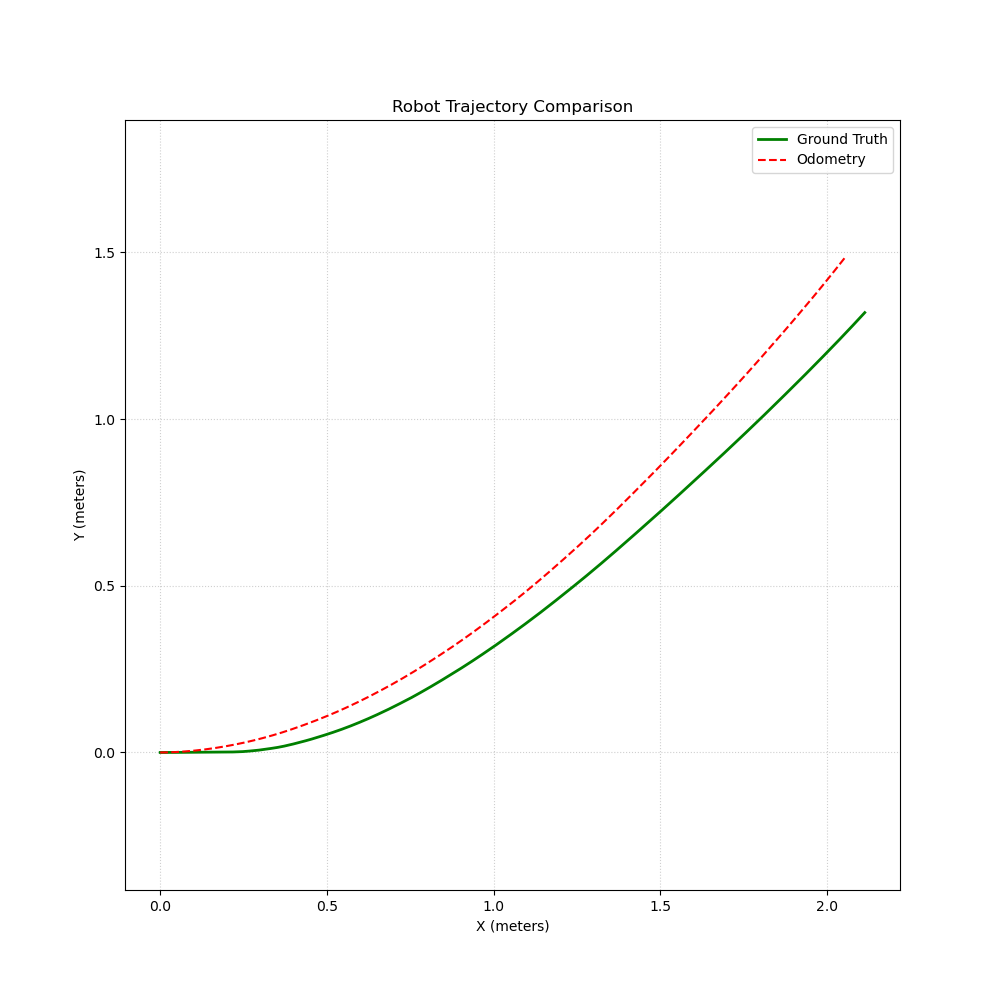

### 全局路径规划算法
我们也可以自己写一个规划器插件用在我们的机器人上

#### $\text{A}^*$
##### $\mathrm{OpenCV}$可视化
在正式写插件之前，可以先使用opencv进行一个寻路可视化，在此之前，我们需要拥有一个用slam建的图的`.pgm`和`.yaml`文件，新建一个项目`planner_test`，对于里面的文件`astar_visualizer.hpp`：
```cpp
#include "opencv2/opencv.hpp"
#include <vector>
#include <queue>
#include <iostream>
#include <cmath>
#include <algorithm>

struct Node {

    cv::Point pos;
    double g, h; // 代价
    Node* Parent;
    bool operator>(const Node &other) const { return (g + h) > (other.g + other.h); }
};

class MapPlanner {

public:

    cv::Mat map_img, display_map, raw_map;
    double resolution = 0.05;
    double origin_x = -5.046, origin_y = -4.64;
    int img_w = 200, img_h = 162;
    std::vector<cv::Point> path;

    MapPlanner(std::string pgm_path);
    void preprocessMap();
    cv::Point WorldToMap(double wx, double wy);
    void plan(cv::Point start, cv::Point goal);
};
```
`astar_visualizer.cpp`：
```cpp
#include "astar_visualizer.hpp"

MapPlanner::MapPlanner(std::string pgm_path) {

    // 加载灰度图
    map_img = cv::imread(pgm_path, cv::IMREAD_GRAYSCALE);
    raw_map = map_img;
    if (map_img.empty()) {

        std::cerr << "Failed to load .pgm";
        return;
    }
    //cv::threshold(map_img, map_img, 100, 255, cv::THRESH_BINARY);
}

void MapPlanner::preprocessMap() {

    cv::cvtColor(map_img, display_map, cv::COLOR_GRAY2BGR);

    // 腐蚀核Size(9, 9) -> r=4
    // 4像素*0.05 分辨率=0.2
    int robot_radius_pixel = 4; 
    cv::Mat element = cv::getStructuringElement(cv::MORPH_RECT, 
                      cv::Size(2 * robot_radius_pixel + 1, 2 * robot_radius_pixel + 1));
    cv::erode(map_img, map_img, element);
}

cv::Point MapPlanner::WorldToMap(double wx, double wy) {

    int mx = static_cast<int>(std::round(wx - origin_x) / resolution),
        premy = static_cast<int>(std::round(wy - origin_y) / resolution);
    int my = img_h - premy;
    mx = std::max(0, std::min(mx, img_w - 1));
    my = std::max(0, std::min(my, img_h - 1));
    return cv::Point(mx, my);
}

void MapPlanner::plan(cv::Point start, cv::Point goal) {

    std::vector<std::vector<double>> g_values(map_img.rows, std::vector<double>(map_img.cols, std::numeric_limits<double>::infinity()));
    std::vector<std::vector<bool>> closed_list(map_img.rows, std::vector<bool>(map_img.cols, false));
    std::vector<std::vector<cv::Point>> parents(map_img.rows, std::vector<cv::Point>(map_img.cols, cv::Point(-1, -1)));

    std::priority_queue<Node, std::vector<Node>, std::greater<Node>> open_list;

    // 放入起点
    g_values[start.y][start.x] = 0;
    double h_cost_ = std::sqrt(std::pow(start.x - goal.x, 2) + std::pow(start.y - goal.y, 2));
    open_list.push({start, 0, h_cost_, nullptr});

    // 寻路
    while (!open_list.empty()) {
        
        Node cur = open_list.top();
        open_list.pop();
        display_map.at<cv::Vec3b>(cur.pos.y, cur.pos.x) = cv::Vec3b(200, 200, 255);

        if (closed_list[cur.pos.y][cur.pos.x]) continue;
        closed_list[cur.pos.y][cur.pos.x] = true;

        if (cur.pos == goal) {

            std::cout << "Path Found" << std::endl;
            cv::Point curr = goal;

            while (curr != start && curr != cv::Point(-1, -1)) {

                path.push_back(curr);
                curr = parents[curr.y][curr.x];
            }
            path.push_back(start);

            // 绘制最终路径
            for (size_t i = 0; i < path.size() - 1; ++ i) {

                cv::line(display_map, path[i], path[i + 1], cv::Scalar(255, 0, 0), 2);
            }
            cv::imshow("A* Result", display_map);
            return;
        }

        for (int dx = -1; dx <= 1; ++ dx) {

            for (int dy = -1; dy <= 1; ++ dy) {

                if (dx == 0 && dy == 0) continue;

                cv::Point nei_pos(cur.pos.x + dx, cur.pos.y + dy);

                // 边界与碰撞检查
                if (nei_pos.x < 0 || nei_pos.x >= map_img.cols || 
                    nei_pos.y < 0 || nei_pos.y >= map_img.rows) continue;
                if (map_img.at<uchar>(nei_pos.y, nei_pos.x) == 0) continue;

                // 未知区域罚分
                uchar raw_pixel = raw_map.at<uchar>(nei_pos.y, nei_pos.x);
                double extra_cost = 0.0;
                if (raw_pixel < 250 && raw_pixel > 150) { 

                    extra_cost = 10.0;
                }

                double step_cost = (dx != 0 && dy != 0) ? 1.414 : 1.0,
                    tentative_g = g_values[cur.pos.y][cur.pos.x] + step_cost + extra_cost;

                if (tentative_g < g_values[nei_pos.y][nei_pos.x]) {

                    g_values[nei_pos.y][nei_pos.x] = tentative_g;
                    display_map.at<cv::Vec3b>(nei_pos.y, nei_pos.x) = cv::Vec3b(255, 200, 200);

                    static int count = 0;
                    if (count ++ % 50 == 0) { // 每50个点刷新一次界面

                        cv::imshow("A* Searching Process", display_map);
                        cv::waitKey(30);
                    }

                    parents[nei_pos.y][nei_pos.x] = cur.pos;
                    double h = std::sqrt(std::pow(nei_pos.x - goal.x, 2) + std::pow(nei_pos.y - goal.y, 2));
                    open_list.push({nei_pos, tentative_g, h, nullptr});
                }
            }
        }
    } 
}
int main() {
    
    MapPlanner planner("map1.pgm");
    
    cv::Point start_px = planner.WorldToMap(-4.0, 1.0);
    cv::Point goal_px = planner.WorldToMap(1.0, -3.0);

    planner.preprocessMap();

    planner.plan(start_px, goal_px);
    cv::waitKey(0);
    return 0;
}
```
以及cmake文件：
```c
cmake_minimum_required(VERSION 3.10)
project(planner_test)
set(CMAKE_CXX_STANDARD 14)
set(CMAKE_CXX_STANDARD_REQUIRED ON)

# 找
find_package(OpenCV REQUIRED)

# 添加可执行文件
add_executable(planner_test 
    astar_visualizer.cpp
)

# 链接 OpenCV 库
target_link_libraries(planner_test 
    ${OpenCV_LIBRARIES}
)
```
随后需要新建一个`build`文件夹在里面进行`cmake ..`和`make -j1`完成编译，随后`./planner_test`就能运行了，注意`map1.pgm`需要放到`build`文件夹内
这个项目主要利用了**栅格化地图**来进行坐标转换，将每一个坐标点（特定分辨率下是有限的）作为节点，设定好`start`和`goal`（根节点与目标节点）后就可以开始规划了
而作为主体的地图我们需要准备三份，分别用来**寻路、展示、未知地带代价计算**
- 寻路我们需要使用`erode`进行腐蚀，扩大黑色（障碍物）面积，更符合现实
- 展示的话只需要展示最原始的地图即可
- 未知地带的计算主要是对灰色部分（未探索区域）进行额外的代价叠加，让机器人尽可能避免走灰色地带，也是最原始的地图

同时到达终点回溯的时候利用opencv可以将每一个点都用蓝色的线连起来，寻路时每一个到达的节点涂成浅红色，即将要探索的节点涂成浅蓝色，这样更能可视化整条路径
如果设定了正确的起点和终点，应该能看到如下图像
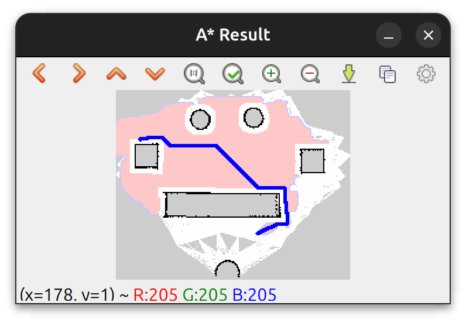

##### 实践
接下来我们将上述代码移植到一个规划器插件中，编写一个自定义A*路径规划器，依旧先创建功能包：
```bash
ros2 pkg create --build-type ament_cmake my_nav2_planner --dependencies nav2_core pluginlib rclcpp
```
按照官方教程所要求的继承5个基类函数并完成函数定义，以及一个`createPlan`函数来进行A*算法的核心代码编写
`astar_planner.hpp`：
```cpp
#ifndef MY_NAV2_PLANNER__ASTAR_PLANNER
#define MY_NAV2_PLANNER__ASTAR_PLANNER

#include <memory>
#include <string>
#include <vector>
#include <queue>

#include "nav2_core/global_planner.hpp"
#include "rclcpp/rclcpp.hpp"
#include "nav_msgs/msg/path.hpp"
#include "geometry_msgs/msg/pose_stamped.hpp"
#include "nav2_costmap_2d/costmap_2d_ros.hpp"
#include "nav2_util/lifecycle_node.hpp"
#include "nav2_util/node_utils.hpp"

namespace my_nav2_planner {

    class MyAStarPlanner : public nav2_core::GlobalPlanner {

    public:

        MyAStarPlanner() = default;
        ~MyAStarPlanner() override = default;

        void configure(
            const rclcpp_lifecycle::LifecycleNode::WeakPtr &parent,
            std::string name, std::shared_ptr<tf2_ros::Buffer> tf,
            std::shared_ptr<nav2_costmap_2d::Costmap2DROS> costmap_ros) override;
    
        void activate() override;
        void deactivate() override;
        void cleanup() override;

        nav_msgs::msg::Path createPlan(
            const geometry_msgs::msg::PoseStamped &start,
            const geometry_msgs::msg::PoseStamped &goal,
            std::function<bool()> cancel_checker) override;
    private:

        std::shared_ptr<tf2_ros::Buffer> tf_;
        nav2_util::LifecycleNode::SharedPtr node_;
        nav2_costmap_2d::Costmap2D *costmap_;
        std::string global_frame_, name_;
        double unknown_cost_, interpolation_resolution_;
    };
} // namespace my_nav2_planner

#endif // MY_NAV2_PLANNER__ASTAR_PLANNER
```
`astar_planner.cpp`：
```cpp
#include "my_nav2_planner/astar_planner.hpp"
#include "nav2_core/planner_exceptions.hpp"
#include "pluginlib/class_list_macros.hpp"
#include "nav2_util/node_utils.hpp"

#include <cmath>
#include <unordered_map>

namespace my_nav2_planner {

    void MyAStarPlanner::configure(
        const rclcpp_lifecycle::LifecycleNode::WeakPtr &parent,
        std::string name, std::shared_ptr<tf2_ros::Buffer> tf,
        std::shared_ptr<nav2_costmap_2d::Costmap2DROS> costmap_ros) {

        node_ = parent.lock();
        name_ = name;
        costmap_ = costmap_ros->getCostmap();
        global_frame_ = costmap_ros->getGlobalFrameID();

        nav2_util::declare_parameter_if_not_declared(
            node_, name_ + ".unknown_cost", rclcpp::ParameterValue(5.0));
        node_->get_parameter(name_ + ".unknown_cost", unknown_cost_);
        nav2_util::declare_parameter_if_not_declared(
            node_, name_ + ".interpolation_resolution", rclcpp::ParameterValue(0.1));
        node_->get_parameter(name_ + ".interpolation_resolution", interpolation_resolution_);

        RCLCPP_INFO(node_->get_logger(), "自定义A*规划器配置完成");
    }

    void MyAStarPlanner::activate() { RCLCPP_INFO(node_->get_logger(), "插件已激活"); }
    void MyAStarPlanner::deactivate() { RCLCPP_INFO(node_->get_logger(), "插件已停用"); }
    void MyAStarPlanner::cleanup() { RCLCPP_INFO(node_->get_logger(), "插件已清理"); }

    nav_msgs::msg::Path MyAStarPlanner::createPlan(
        const geometry_msgs::msg::PoseStamped &start,
        const geometry_msgs::msg::PoseStamped &goal,
        std::function<bool()> cancel_checker) {

        nav_msgs::msg::Path global_path;
        global_path.header.frame_id = global_frame_;
        global_path.header.stamp = node_->now();

        // 坐标转换
        unsigned int mx_start, my_start, mx_goal, my_goal;
        if (!costmap_->worldToMap(start.pose.position.x, start.pose.position.y, mx_start, my_start) ||
            !costmap_->worldToMap(goal.pose.position.x, goal.pose.position.y, mx_goal, my_goal)) {

            RCLCPP_ERROR(node_->get_logger(), "Start or Goal is outside of costmap bounds");
            return global_path;
        }

        // 路径规划
        int width = costmap_->getSizeInCellsX(), 
            height = costmap_->getSizeInCellsY();
        int map_size = width * height;
        std::vector<double> g_values(map_size, std::numeric_limits<double>::max());
        std::vector<int> parent_map(map_size, -1);

        typedef std::pair<double, int> Node;
        std::priority_queue<Node, std::vector<Node>, std::greater<Node>> open_list;

        int start_idx = my_start * width + mx_start,
            goal_idx = my_goal * width + mx_goal;

        g_values[start_idx] = 0.0;
        open_list.push({0.0, start_idx});

        bool found_path = false;

        // 开始寻路
        while (!open_list.empty()) {

            int cur_idx = open_list.top().second;
            open_list.pop();

            if (cur_idx == goal_idx) {

                found_path = true;
                break;
            }

            int cx = cur_idx % width,
                cy = cur_idx / width;

            for (int dx = -1; dx <= 1; ++ dx) {

                for (int dy = -1; dy <= 1; ++ dy) {

                    if (dx == 0 && dy == 0) continue;
                    int nx = cx + dx,
                        ny = cy + dy;
                    if (nx < 0 || nx >= width || ny < 0 || ny >= height) continue;

                    int next_idx = ny * width + nx;
                    unsigned char cost = costmap_->getCost(nx, ny);

                    if (cost >= 250 && cost <= 254) continue;

                    double extra_cost = (cost == 255) ? unknown_cost_ : 0.0,
                        step_cost = std::sqrt(dx * dx + dy * dy);
                    double tentative_g = g_values[cur_idx] + step_cost + extra_cost;

                    if (tentative_g < g_values[next_idx]) {

                        g_values[next_idx] = tentative_g;
                        parent_map[next_idx] = cur_idx;

                        double h_cost = std::sqrt(std::pow(nx - (int)mx_goal, 2) + 
                                        std::pow(ny - (int)my_goal, 2));
                        open_list.push({tentative_g + h_cost, next_idx});
                    }
                }
            }
        }
        if (found_path) {

            std::vector<int> path_;
            int curr_idx = goal_idx;
            while (curr_idx != -1) {

                path_.push_back(curr_idx);
                curr_idx = parent_map[curr_idx];
            }
            std::reverse(path_.begin(), path_.end());

            for (int idx : path_) {

                geometry_msgs::msg::PoseStamped pose;
                pose.header.frame_id = global_frame_;
                pose.header.stamp = node_->now();

                unsigned int mx = idx % width,
                    my = idx / width;
                double wx, wy;
                costmap_->mapToWorld(mx, my, wx, wy);

                pose.pose.position.x = wx;
                pose.pose.position.y = wy;
                pose.pose.orientation = goal.pose.orientation;
                global_path.poses.push_back(pose);
            }
        } else {

            global_path.poses.clear();
            RCLCPP_WARN(node_->get_logger(), "A* failed to find a path from start to goal");
        }
        return global_path;
    } 
}// namespace my_nav2_planner

PLUGINLIB_EXPORT_CLASS(my_nav2_planner::MyAStarPlanner, nav2_core::GlobalPlanner)
```
值得注意的是，我们的地图存取可以直接使用`nav2_costmap_2d::Costmap2D`指针类型，同时不需要手动进行腐蚀操作，我们只需要判断地图代价是否在250到254之间（通常意味着快接近障碍物），是的话直接中断该条路径即可，当地图代价是255，说明到达未知区域，此时可以设定额外代价最终加上。同时为了保证内存效率，我们使用一维容器用形如`idx = y * width + x`的形式存取变量，取变量则
```cpp
x = idx % width;
y = idx / width;
```
即可，其余代码无太大差别
最后要注意的就是各种配置环境文件的编写，完成后在`nav2_params_nav_diy.yaml`的`planner_server`栏目下改为：
```py
planner_server:
  ros__parameters:
    use_sim_time: True
    expected_planner_frequency: 20.0
    planner_plugins: ["GridBased"]
    costmap_update_timeout: 1.0
    GridBased:
      plugin: "my_nav2_planner/MyAStarPlanner"
      unknown_cost: 5.0
      interpolation_resolution: 0.1
```
类似的即可，随后编译运行，在规划了路径后可以看到
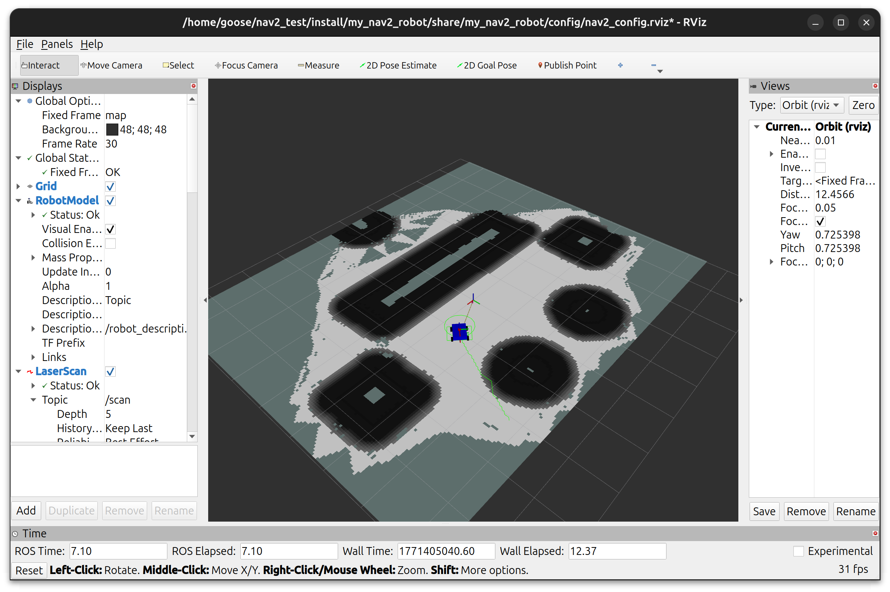
此时的路径是锯齿状的，我们在后面进行平滑器的编写后可以将其优化为更顺化的曲线

#### $\text{RRT}^*$
rrt*基于rrt，而rrt又基于**随机树**，随机树的核心步骤就是在一个点附近一直随机扔节点，这很明显是不明智的，到达终点的可能性极低
在此基础上发明了$\text{RRT}$算法，即**基础随机扩展树**，它是走一步，然后在半径范围内进行一次随机采样，再走一步，再继续采样，如此往复，只要路径不被隔断，就加入树，这样确实能到达终点，但是性能损耗很大，于是有了$\text{RRT}^*$算法
rrt*的步骤是：
- 1. 随机采样一个点（可以设定有$10%$概率直接采样到终点）
- 2. 在一定的搜索半径内，搜索所有邻居找到那个从起点走到邻居的累积代价最小的，然后以该邻居向该点的方向扩展一个点，距离为`step_size`
- 3. 放下这个点后，查看上一步搜索到的邻居与该点的路径是否有障碍物或者是非法路径，再进行筛选
- 4. 再在这个搜索半径内，进行第二次搜索，这次搜索是搜索所有邻居，如果它们的父节点改为该节点，到该节点的累积代价是否更小？是的话则替换它们的父节点，并重新计算代价

重复整个步骤直到终止，而终止条件也有讲究，可以简单粗暴的定义一个`max_iterations`表示每次必须进行那么多次的步骤循环。如果要优化时间，还可以找到到达终点的路径就直接退出循环。如果要优化路径质量，可以定义一个结束后迭代的阈值，表示在找到路径后最多再进行那么多次的步骤循环就结束，当然还有各种方法，这里就以最后一种为例

##### $\text{OpenCV}$可视化
在可视化，可以先写一个轻量的程序，创建功能包`rrtstar_test`
`rrtstar_visualizer.hpp`：
```cpp
#include "opencv2/opencv.hpp"
#include <vector>
#include <random>
#include <functional>
#include <limits>
#include <string>
#include <cmath>
#include <algorithm>

// RRT* 节点（使用世界坐标，单位 m）
struct RRTNode {

    cv::Point2d pos;
    int parent; // 在 tree 中的索引，-1 为根
    double cost; // 从起点到该节点的累计代价
    RRTNode() : pos(0,0), parent(-1), cost(0.0) {}
    RRTNode(const cv::Point2d &p, int par, double c) : pos(p), parent(par), cost(c) {}
};

class MapPlanner {

public:

    // 地图相关
    cv::Mat map_img, display_map, raw_map;
    int img_w = 200, img_h = 162;
    double resolution = 0.05;
    double origin_x = -5.046, origin_y = -4.64;

    // RRT* 参数
    double step_size = 1.0; // 扩展步长，单位 m
    int max_iterations = 50000; // 最大迭代次数
    double 
        search_radius = 2.0, // 用于重连
        goal_sample_rate = 0.5, // 采样直接采中目标的概率
        goal_tolerance = 0.2, // 认为到达目标的距离阈值，单位 m
        collision_check_resolution = 0.02; // 碰撞检查的插值分辨率，单位 m

    // 树结构
    std::vector<RRTNode> tree;

    // 起点/终点（像素，double用于插值计算）
    cv::Point2d start_pt, goal_pt;

    // 随机生成器
    std::mt19937 rng;
    std::uniform_real_distribution<double> uni_x;
    std::uniform_real_distribution<double> uni_y;

    // 结果与状态
    bool found_goal = false;
    std::vector<cv::Point2d> final_path;
    double best_cost = std::numeric_limits<double>::infinity();

    // 可视化
    cv::Mat draw_img;
    int iteration_delay_ms = 5;
    bool show_debug = true;

    // 构造与主要接口
    MapPlanner(const std::string &pgm_path);
    void preprocessMap(int robot_radius_px = 4);

    // 坐标转换辅助
    cv::Point worldToMap(double wx, double wy) const;

    // 规划接口：传入像素坐标的起点和终点
    void planRRTStar(const cv::Point &start_pix, const cv::Point &goal_pix);

    // 算法辅助函数
    cv::Point2d sampleRandomPoint();
    int nearestIndex(const cv::Point2d &p) const;
    cv::Point2d steer(const cv::Point2d &from, const cv::Point2d &to);
    std::vector<int> nearIndices(const cv::Point2d &p) const;
    bool collisionFree(const cv::Point2d &a, const cv::Point2d &b) const;
    double dist(const cv::Point2d &a, const cv::Point2d &b) const;
    void reconstructPath(int goal_idx);

    // 绘制
    void drawTree();
    void drawPath();

    // 地图查询
    bool isOccupiedPx(int mx, int my) const;
    bool isInsideMapPx(int mx, int my) const;

private:

    void initRandomGenerators();
};
```
`rrtstar_visualizer.cpp`：
```cpp
#include "rrtstar_visualizer.hpp"
#include <iostream>
#include <chrono>

MapPlanner::MapPlanner(const std::string &pgm_path) {

    map_img = cv::imread(pgm_path, cv::IMREAD_GRAYSCALE);
    raw_map = map_img;
    if (map_img.empty()) {
        std::cerr << "Failed to load .pgm" << std::endl;
        return;
    }
    img_w = map_img.cols;
    img_h = map_img.rows;
    display_map = map_img.clone();

    initRandomGenerators();
}

/**
 * @brief 对地图进行预处理，膨胀障碍物以考虑机器人尺寸
 * @param robot_radius_px 机器人半径（像素）
 * @return void
 */
void MapPlanner::preprocessMap(int robot_radius_px) {

    cv::cvtColor(map_img, display_map, cv::COLOR_GRAY2BGR);
    cv::Mat element = cv::getStructuringElement(cv::MORPH_RECT,
                      cv::Size(2 * robot_radius_px + 1, 2 * robot_radius_px + 1));
    cv::erode(map_img, map_img, element);
}

cv::Point MapPlanner::worldToMap(double wx, double wy) const {
    int mx = static_cast<int>(std::round((wx - origin_x) / resolution));
    int my = static_cast<int>(std::round((wy - origin_y) / resolution));
    my = img_h - my;
    mx = std::max(0, std::min(mx, img_w - 1));
    my = std::max(0, std::min(my, img_h - 1));
    return cv::Point(mx, my);
}

void MapPlanner::initRandomGenerators() {

    std::random_device rd;
    rng = std::mt19937(rd());
    uni_x = std::uniform_real_distribution<double>(0.0, static_cast<double>(img_w));
    uni_y = std::uniform_real_distribution<double>(0.0, static_cast<double>(img_h));
}

/**
 * @brief 从地图范围内随机采样一个点，按照 goal_sample_rate 的概率直接返回目标点
 * @return cv::Point2d 采样点的像素坐标（double 用于插值计算）
 */
cv::Point2d MapPlanner::sampleRandomPoint() {

    double r = std::uniform_real_distribution<double>(0.0, 1.0)(rng);
    if (r < goal_sample_rate) return goal_pt;
    return cv::Point2d(uni_x(rng), uni_y(rng));
}

int MapPlanner::nearestIndex(const cv::Point2d &p) const {

    int best = -1;
    double bestd = std::numeric_limits<double>::infinity();
    for (int i = 0; i < static_cast<int>(tree.size()); ++ i) {

        double d = dist(tree[i].pos, p);
        if (d < bestd) {

            bestd = d;
            best = i;
        }
    }
    return best;
}

/**
 * @brief 从 from 向 to 方向扩展一个新点，距离为 step_size
 * @param from 起点（像素坐标）
 * @param to 目标点（像素坐标）
 * @return cv::Point2d 新点的像素坐标（double 用于插值计算）
 */
cv::Point2d MapPlanner::steer(const cv::Point2d &from, const cv::Point2d &to) {

    double d = dist(from, to);
    if (d <= step_size) return to;
    cv::Point2d vec = to - from;
    return from + vec * (step_size / d);
}

/**
 * @brief 查找树中距离点 p 在 search_radius 范围内的所有节点索引
 * @param p 查询点（像素坐标）
 * @return 满足条件的节点索引列表
 */
std::vector<int> MapPlanner::nearIndices(const cv::Point2d &p) const {

    std::vector<int> inds;
    double r_pix = search_radius / resolution;
    for (int i = 0; i < static_cast<int>(tree.size()); ++ i) {

        if (dist(tree[i].pos, p) <= r_pix) {

            inds.push_back(i);
        }
    }
    return inds;
}

/**
 * @brief 检查线段 ab 上是否存在障碍物
 * @param a 起点（像素坐标）
 * @param b 终点（像素坐标）
 * @return true 如果线段上没有障碍物；false 如果存在障碍物
 */
bool MapPlanner::collisionFree(const cv::Point2d &a, const cv::Point2d &b) const {

    double d = dist(a, b);
    if (d < 1e-6) return !isOccupiedPx(static_cast<int>(a.x), static_cast<int>(a.y));
    double step = collision_check_resolution / resolution;
    int n = static_cast<int>(std::ceil(d / step));
    for (int i = 0; i <= n; ++ i) {

        double t = static_cast<double>(i) / n;
        double x = a.x + (b.x - a.x) * t;
        double y = a.y + (b.y - a.y) * t;
        int mx = static_cast<int>(std::round(x));
        int my = static_cast<int>(std::round(y));
        if (isOccupiedPx(mx, my)) return false;
    }
    return true;
}

inline double MapPlanner::dist(const cv::Point2d &a, const cv::Point2d &b) const {

    double 
        dx = a.x - b.x,
        dy = a.y - b.y;
    return std::sqrt(dx * dx + dy * dy);
}

/**
 * @brief 从 goal_idx 反向追踪父节点直到起点，重建路径
 * @param goal_idx 目标节点在树中的索引
 * @return void
 */
void MapPlanner::reconstructPath(int goal_idx) {

    final_path.clear();
    int idx = goal_idx;
    while (idx != -1) {

        final_path.push_back(tree[idx].pos);
        idx = tree[idx].parent;
    }
    std::reverse(final_path.begin(), final_path.end());
}

/**
 * @brief 绘制 RRT* 树结构
 * 每条边用绿色线段表示
 * @return void
 */
void MapPlanner::drawTree() {

    draw_img = display_map.clone();
    for (int i = 1; i < static_cast<int>(tree.size()); ++ i) {

        cv::Point p1(static_cast<int>(tree[i].pos.x), static_cast<int>(tree[i].pos.y));
        cv::Point p2(static_cast<int>(tree[tree[i].parent].pos.x),
                     static_cast<int>(tree[tree[i].parent].pos.y));
        cv::line(draw_img, p1, p2, cv::Scalar(0, 255, 0), 1);
    }
}

/**
 * @brief 绘制最终路径
 * 每条边用蓝色线段表示
 * @return void
 */
void MapPlanner::drawPath() {

    for (size_t i = 0; i + 1 < final_path.size(); ++ i) {

        cv::Point p1(static_cast<int>(final_path[i].x), static_cast<int>(final_path[i].y));
        cv::Point p2(static_cast<int>(final_path[i + 1].x), static_cast<int>(final_path[i + 1].y));
        cv::line(draw_img, p1, p2, cv::Scalar(255, 0, 0), 2);
    }
}

/**
 * @brief 检查像素坐标 (mx, my) 是否在地图范围内
 * @param mx 像素 x 坐标
 * @param my 像素 y 坐标
 * @return true 如果在地图范围内；false 如果超出地图边界
 */
bool MapPlanner::isInsideMapPx(int mx, int my) const {

    return mx >= 0 && mx < img_w && my >= 0 && my < img_h;
}

/**
 * @brief 检查像素坐标 (mx, my) 是否被占用（障碍物）
 * @param mx 像素 x 坐标
 * @param my 像素 y 坐标
 * @return true 如果被占用（障碍物）；false 如果空闲
 */
bool MapPlanner::isOccupiedPx(int mx, int my) const {

    if (!isInsideMapPx(mx, my)) return true;
    return map_img.at<uchar>(my, mx) == 0;
}

/**
 * @brief RRT* 规划主函数
 * @param start_pix 起点像素坐标
 * @param goal_pix 终点像素坐标
 * 流程：
 * 1. 初始化树，添加起点
 * 2. 循环 max_iterations 次：
 *   a. 随机采样一个点 p
 *   b. 找到树中距离 p 最近的节点 nearest
 *   c. 从 nearest 向 p 方向扩展一个新节点 new_pt，距离为 step_size
 *   d. 如果 new_pt 与 nearest 之间没有碰撞，则将 new_pt 添加到树中，父节点为 nearest，代价为 nearest 的代价加上两点距离
 *   e. 在 new_pt 周围 search_radius 范围内找到所有节点 near_ids，尝试通过 new_pt 重连这些节点以降低代价
 *   f. 如果 new_pt 距离目标点 goal_pt 在 goal_tolerance 范围内，则认为找到目标，添加 goal_pt 作为 new_pt 的子节点，并重建路径
 * 3. 可选：每隔一定迭代次数显示搜索过程
 * 4. 最终显示结果路径或失败信息
 * @return void
 */
void MapPlanner::planRRTStar(const cv::Point &start_pix, const cv::Point &goal_pix) {

    start_pt = cv::Point2d(start_pix.x, start_pix.y);
    goal_pt = cv::Point2d(goal_pix.x, goal_pix.y);

    tree.clear();
    tree.emplace_back(start_pt, -1, 0.0);
    found_goal = false;
    best_cost = std::numeric_limits<double>::infinity(); // 记录找到的路径的最优代价

    // 在地图上标记起点和终点
    cv::circle(display_map, cv::Point(static_cast<int>(start_pt.x), static_cast<int>(start_pt.y)), 3, cv::Scalar(0,0,255), -1);
    cv::circle(display_map, cv::Point(static_cast<int>(goal_pt.x), static_cast<int>(goal_pt.y)), 3, cv::Scalar(255,0,0), -1);

    static int count = 0;
    for (int it = 0; it < max_iterations; ++ it) {

        cv::Point2d p = sampleRandomPoint();
        int nearest = nearestIndex(p);
        if (nearest < 0) continue;
        cv::Point2d new_pt = steer(tree[nearest].pos, p);
        if (!collisionFree(tree[nearest].pos, new_pt)) continue;
        double new_cost = tree[nearest].cost + dist(tree[nearest].pos, new_pt);
        int new_idx = tree.size();
        tree.emplace_back(new_pt, nearest, new_cost);

        // 尝试重连附近节点以降低代价
        auto near_ids = nearIndices(new_pt);
        for (int nid : near_ids) {

            double c = tree[new_idx].cost + dist(new_pt, tree[nid].pos);
            if (c < tree[nid].cost && collisionFree(new_pt, tree[nid].pos)) {

                tree[nid].parent = new_idx;
                tree[nid].cost = c;
            }
        }

        // 检查是否接近目标点
        if (dist(new_pt, goal_pt) < goal_tolerance / resolution) {
            
            found_goal = true;
            // 直接将目标点作为 new_pt 的子节点添加到树中，方便路径重建
            cv::Point2d goal_node = goal_pt;
            double gcost = tree[new_idx].cost + dist(new_pt, goal_node);
            tree.emplace_back(goal_node, new_idx, gcost);
            reconstructPath(tree.size() - 1);
            best_cost = gcost;
            break;
        }

        // 每隔一定迭代次数显示搜索过程
        if (show_debug && (count++ % 50) == 0) {

            drawTree();
            cv::imshow("RRT* Searching", draw_img);
            cv::waitKey(iteration_delay_ms);
        }
    }

    // final visualization
    if (found_goal) {

        drawTree();
        drawPath();
        cv::imshow("RRT* Result", draw_img);
    } else {

        std::cout << "Failed to find path in " << max_iterations << " iterations\n";
    }
}

int main() {
    
    MapPlanner planner("map1.pgm");
    planner.preprocessMap();

    cv::Point start_px = planner.worldToMap(-4.5, 1.0);
    cv::Point goal_px = planner.worldToMap(1.0, -3.0);
    std::cout << "start pixel: " << start_px << "  goal pixel: " << goal_px << std::endl;

    // slow down visualization so process is visible
    planner.iteration_delay_ms = 30;
    planner.show_debug = true;

    planner.planRRTStar(start_px, goal_px);
    cv::waitKey(0);
    return 0;
}
```
写好cmake文件准备好地图，编译运行后可以看到如图：
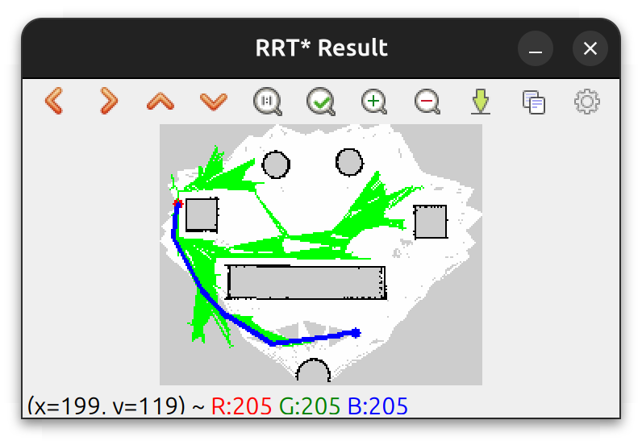
绿色是树，蓝色是最终路径

##### 实践
rrt*在半径范围内搜索邻居仍可优化，使用$\text{KD-Tree}$或者**网格哈希索引**可以将实践复杂度优化到对数甚至常数级别，各有优缺，在这里先暂时不实现
我们在功能包`my_rrtstar_planner`进行插件编写
`rrtstar_planner.hpp`：
```cpp
#ifndef MY_RRTSTAR_PLANNER__RRTSTAR_PLANNER
#define MY_RRTSTAR_PLANNER__RRTSTAR_PLANNER

#include <memory>
#include <string>
#include <vector>
#include <queue>
#include <random>
#include <cmath>

#include "nav2_core/global_planner.hpp"
#include "rclcpp/rclcpp.hpp"
#include "nav_msgs/msg/path.hpp"
#include "geometry_msgs/msg/pose_stamped.hpp"
#include "nav2_costmap_2d/costmap_2d_ros.hpp"
#include "nav2_util/lifecycle_node.hpp"
#include "nav2_util/node_utils.hpp"

namespace my_rrtstar_planner {

    // RRT* 节点（使用世界坐标，单位 m）
    struct RRTNode {

        int pos_idx; // map坐标索引，pos_idx = y * width + x
        int parent; // 在 tree 中的索引，-1 为根
        double cost; // 从起点到该节点的累计代价
        RRTNode() : pos_idx(0), parent(-1), cost(0.0) {}
        RRTNode(int pos_idx, int par, double c) : pos_idx(pos_idx), parent(par), cost(c) {}
    };

    class MyRRTStarPlanner : public nav2_core::GlobalPlanner {

    public:

        MyRRTStarPlanner() = default;
        ~MyRRTStarPlanner() override = default;

        void configure(
            const rclcpp_lifecycle::LifecycleNode::WeakPtr &parent,
            std::string name, std::shared_ptr<tf2_ros::Buffer> /*tf*/,
            std::shared_ptr<nav2_costmap_2d::Costmap2DROS> costmap_ros) override;
    
        void activate() override;
        void deactivate() override;
        void cleanup() override;

        nav_msgs::msg::Path createPlan(
            const geometry_msgs::msg::PoseStamped &start,
            const geometry_msgs::msg::PoseStamped &goal,
            std::function<bool()> /*cancel_checker*/) override;
    private:

        bool isCollisionFreePath(int idx1, int idx2); // 检查两个节点之间的路径是否碰撞
        void updateChildrenCost(int parent_idx, double cost_delta); // 递归更新子节点代价

        std::shared_ptr<tf2_ros::Buffer> tf_;
        nav2_util::LifecycleNode::SharedPtr node_;
        nav2_costmap_2d::Costmap2D *costmap_;
        std::string global_frame_, name_;
        
        std::vector<RRTNode> tree; // RRT*树结构

        // 随机生成器
        std::mt19937 rng;
        std::uniform_real_distribution<double> uni_x;
        std::uniform_real_distribution<double> uni_y;

        // RRT*算法参数
        double step_size_ = 0.5; // 扩展步长，单位 m
        int max_iterations_ = 50000; // 最大迭代次数
        int max_iterations_after_goal_ = 1000; // 在找到目标后继续迭代以优化路径的次数
        double 
            search_radius_ = 2.0, // 用于重连
            goal_sample_rate_ = 0.5, // 采样直接采中目标的概率
            goal_tolerance_ = 0.2, // 认为到达目标的距离阈值，单位 m
            collision_check_resolution_ = 0.02; // 碰撞检查的插值分辨率，单位 m
    };
} // namespace my_rrtstar_planner

#endif // MY_RRTSTAR_PLANNER__RRTSTAR_PLANNER
```
`rrtstar_planner.cpp`
```cpp
#include "my_rrtstar_planner/rrtstar_planner.hpp"
#include "nav2_core/planner_exceptions.hpp"
#include "pluginlib/class_list_macros.hpp"
#include "nav2_util/node_utils.hpp"

#include <cmath>
#include <unordered_map>

namespace my_rrtstar_planner {

    void MyRRTStarPlanner::configure(
        const rclcpp_lifecycle::LifecycleNode::WeakPtr &parent,
        std::string name, std::shared_ptr<tf2_ros::Buffer> /*tf*/,
        std::shared_ptr<nav2_costmap_2d::Costmap2DROS> costmap_ros) {

        node_ = parent.lock();
        name_ = name;
        costmap_ = costmap_ros->getCostmap();
        global_frame_ = costmap_ros->getGlobalFrameID();

        nav2_util::declare_parameter_if_not_declared(
            node_, name_ + ".step_size", rclcpp::ParameterValue(1.0));
        node_->get_parameter(name_ + ".step_size", step_size_);

        nav2_util::declare_parameter_if_not_declared(
            node_, name_ + ".max_iterations", rclcpp::ParameterValue(50000));
        node_->get_parameter(name_ + ".max_iterations", max_iterations_);

        nav2_util::declare_parameter_if_not_declared(
            node_, name_ + ".search_radius", rclcpp::ParameterValue(2.0));
        node_->get_parameter(name_ + ".search_radius", search_radius_);

        nav2_util::declare_parameter_if_not_declared(
            node_, name_ + ".goal_sample_rate", rclcpp::ParameterValue(0.5));
        node_->get_parameter(name_ + ".goal_sample_rate", goal_sample_rate_);

        nav2_util::declare_parameter_if_not_declared(
            node_, name_ + ".goal_tolerance", rclcpp::ParameterValue(0.2));
        node_->get_parameter(name_ + ".goal_tolerance", goal_tolerance_);

        nav2_util::declare_parameter_if_not_declared(
            node_, name_ + ".collision_check_resolution", rclcpp::ParameterValue(0.02));
        node_->get_parameter(name_ + ".collision_check_resolution", collision_check_resolution_);

        nav2_util::declare_parameter_if_not_declared(
            node_, name_ + ".max_iterations_after_goal", rclcpp::ParameterValue(1000));
        node_->get_parameter(name_ + ".max_iterations_after_goal", max_iterations_after_goal_);

        // 初始化随机数生成器
        rng.seed(std::random_device{}());
        double 
            origin_x = costmap_ros->getCostmap()->getOriginX(),
            origin_y = costmap_ros->getCostmap()->getOriginY(),
            size_x = costmap_ros->getCostmap()->getSizeInMetersX(),
            size_y = costmap_ros->getCostmap()->getSizeInMetersY();
        uni_x = std::uniform_real_distribution<double>(origin_x, origin_x + size_x);
        uni_y = std::uniform_real_distribution<double>(origin_y, origin_y + size_y);

        RCLCPP_INFO(node_->get_logger(), "自定义RRT*规划器配置完成");
    }

    void MyRRTStarPlanner::activate() { RCLCPP_INFO(node_->get_logger(), "插件已激活"); }
    void MyRRTStarPlanner::deactivate() { RCLCPP_INFO(node_->get_logger(), "插件已停用"); }
    void MyRRTStarPlanner::cleanup() { RCLCPP_INFO(node_->get_logger(), "插件已清理"); }

    bool MyRRTStarPlanner::isCollisionFreePath(int idx1, int idx2) {

        // 将地图索引转换为地图坐标，再转换为世界坐标进行检查
        unsigned int width = costmap_->getSizeInCellsX();
        unsigned int mx1 = idx1 % width, my1 = idx1 / width;
        unsigned int mx2 = idx2 % width, my2 = idx2 / width;
        
        double wx1, wy1, wx2, wy2;
        costmap_->mapToWorld(mx1, my1, wx1, wy1);
        costmap_->mapToWorld(mx2, my2, wx2, wy2);
        
        // 在世界坐标中进行线性插值检查
        double dist = std::sqrt((wx2 - wx1) * (wx2 - wx1) + (wy2 - wy1) * (wy2 - wy1));
        int steps = std::max(1, static_cast<int>(dist / collision_check_resolution_));
        
        for (int i = 0; i <= steps; ++ i) {

            double t = (steps > 0) ? static_cast<double>(i) / steps : 0.0;
            double 
                wx = (1 - t) * wx1 + t * wx2,
                wy = (1 - t) * wy1 + t * wy2;
            
            unsigned int mx, my;
            if (!costmap_->worldToMap(wx, wy, mx, my)) return false; // 超出地图范围
            
            if (costmap_->getCost(mx, my) >= 250) return false;
        }
        return true;
    }

    nav_msgs::msg::Path MyRRTStarPlanner::createPlan(
        const geometry_msgs::msg::PoseStamped &start,
        const geometry_msgs::msg::PoseStamped &goal,
        std::function<bool()> /*cancel_checker*/) {

        nav_msgs::msg::Path global_path;
        global_path.header.frame_id = global_frame_;
        global_path.header.stamp = node_->now();

        // 坐标转换
        unsigned int mx_start, my_start, mx_goal, my_goal;
        if (!costmap_->worldToMap(start.pose.position.x, start.pose.position.y, mx_start, my_start) ||
            !costmap_->worldToMap(goal.pose.position.x, goal.pose.position.y, mx_goal, my_goal)) {

            RCLCPP_ERROR(node_->get_logger(), "Start or Goal is outside of costmap bounds");
            return global_path;
        }

        // 路径规划
        int width = costmap_->getSizeInCellsX(), 
            height = costmap_->getSizeInCellsY();
        int map_size = width * height;
        // 将米为单位的参数转换为地图格子数，保持单位一致
        double resolution = costmap_->getResolution();
        double step_size_cells = step_size_ / resolution;
        double search_radius_cells = search_radius_ / resolution;
        double goal_tolerance_cells = goal_tolerance_ / resolution;

        int start_idx = my_start * width + mx_start,
            goal_idx = my_goal * width + mx_goal;

        tree.clear();
        tree.emplace_back(start_idx, -1, 0.0); // 将起点加入树中，父节点索引为-1，代价为0
        double best_cost = std::numeric_limits<double>::infinity(); // 记录找到的路径的最优代价
        int goal_node_idx = -1; // 记录找到的目标节点在树中的索引

        bool found_path = false;

        // 开始寻路
        int stop_iter = 0; // 优化迭代计数器
        // 记录算法耗时
        auto start_time = std::chrono::steady_clock::now();
        for (int iter = 0; iter < max_iterations_; ++ iter) {

            // 如果找到更优路径，更新 best_cost 和 found_path
            double r = std::uniform_real_distribution<double>(0.0, 1.0)(rng);
            int sample_idx; // 采样点在地图中的索引
            if (r < goal_sample_rate_) sample_idx = goal_idx; // 以一定概率直接采样目标点
            else {

                double rx = uni_x(rng), ry = uni_y(rng);
                unsigned int mx, my;
                if (!costmap_->worldToMap(rx, ry, mx, my)) continue; // 采样点在地图外，丢弃
                // 如果采样点落在障碍上也丢弃
                if (costmap_->getCost(mx, my) >= 250) continue;
                sample_idx = my * width + mx;
            }

            // 在搜索半径内找到代价最小的节点作为父节点
            int best_parent_idx = 0; // 默认为树的第一个节点（起点）
            double best_parent_cost = std::numeric_limits<double>::infinity();
            
            for (size_t i = 0; i < tree.size(); ++ i) {

                unsigned int mx, my; // 其他节点在地图中的坐标
                my = tree[i].pos_idx / width;
                mx = tree[i].pos_idx % width;
                double 
                    ddx = mx - (sample_idx % width), ddy = my - (sample_idx / width),
                    dist_to_sample = sqrt(ddx * ddx + ddy * ddy);
                
                if (dist_to_sample < search_radius_cells) {

                    // TODO：KD-Tree优化或网格哈希算法优化
                    double cost_via_this_node = tree[i].cost + dist_to_sample;
                    
                    // 检查这条路径是否碰撞
                    if (!isCollisionFreePath(tree[i].pos_idx, sample_idx)) continue;
                    
                    if (cost_via_this_node < best_parent_cost) {

                        best_parent_cost = cost_via_this_node;
                        best_parent_idx = i;
                    }
                }
            }
            
            unsigned int sample_mx = sample_idx % width;
            unsigned int sample_my = sample_idx / width;

            // 从选择的最优父节点向采样点扩展，在地图坐标中计算方向向量（格子单位）
            unsigned int parent_mx, parent_my;
            parent_my = tree[best_parent_idx].pos_idx / width;
            parent_mx = tree[best_parent_idx].pos_idx % width;

            double 
                dx = sample_mx - parent_mx, dy = sample_my - parent_my,
                dist = sqrt(dx * dx + dy * dy);
            if (dist > step_size_cells && dist > 0.0) {
                dx *= step_size_cells / dist;
                dy *= step_size_cells / dist;
            }

            // 计算新的地图坐标，确保在整数范围内
            unsigned int 
                new_mx = parent_mx + static_cast<int>(round(dx)),
                new_my = parent_my + static_cast<int>(round(dy));
            
            // 检查是否在地图范围内
            if (new_mx >= width || new_my >= height) continue;
                
            int new_idx = new_my * width + new_mx;

            // 如果没有移动则跳过
            if (new_idx == tree[best_parent_idx].pos_idx) continue;

            // 检查新节点是否与障碍物碰撞
            if (costmap_->getCost(new_mx, new_my) >= 250)  continue; // 新节点是障碍物，丢弃

            // 检查从最优父节点到新节点的路径是否碰撞
            if (!isCollisionFreePath(tree[best_parent_idx].pos_idx, new_idx)) continue;

            // 将新节点加入树中
            double cost_to_new_node = tree[best_parent_idx].cost + sqrt(dx * dx + dy * dy);
            tree.emplace_back(new_idx, best_parent_idx, cost_to_new_node);

            // 重连附近节点 Rewire
            for (size_t i = 0; i < tree.size() - 1; ++ i) { // 不包括刚加入的新节点

                unsigned int curr_mx, curr_my;
                curr_my = tree[i].pos_idx / width;
                curr_mx = tree[i].pos_idx % width;

                double 
                    ddx = curr_mx - new_mx, ddy = curr_my - new_my,
                    dist_to_new_node = sqrt(ddx * ddx + ddy * ddy);

                if (dist_to_new_node < search_radius_cells) {

                    // TODO：KD-Tree优化或网格哈希算法优化
                    double cost_via_new_node = cost_to_new_node + dist_to_new_node;

                    if (cost_via_new_node < tree[i].cost) { // 通过新节点到达该节点更优，尝试重连

                        bool is_collision_free_path =
                            isCollisionFreePath(tree[i].pos_idx, new_idx);

                        if (is_collision_free_path) {
                            
                            double old_cost = tree[i].cost;
                            tree[i].parent = tree.size() - 1; // 更新父节点索引
                            tree[i].cost = cost_via_new_node; // 更新代价
                            
                            // 递归更新该节点所有子节点的代价
                            double cost_delta = cost_via_new_node - old_cost;
                            updateChildrenCost(i, cost_delta);
                        }
                    }
                }
            }

            // 检查是否到达目标点附近
            unsigned int goal_mx, goal_my;
            goal_my = goal_idx / width;
            goal_mx = goal_idx % width;

            double ddx_goal = goal_mx - new_mx, ddy_goal = goal_my - new_my;
            double dist_to_goal_sqrd =
            ddx_goal * ddx_goal + ddy_goal * ddy_goal;

            if (dist_to_goal_sqrd < goal_tolerance_cells * goal_tolerance_cells) {

                // 检查到目标的路径是否碰撞
                if (isCollisionFreePath(new_idx, goal_idx)) {

                    found_path = true;
                    if (stop_iter == 0) RCLCPP_INFO(node_->get_logger(), "RRT* found a path to the goal in %d iterations, now optimizing...", iter + 1);
                    RCLCPP_INFO(node_->get_logger(), "RRT* successfully found a path to the goal in %d iterations", iter + 1);
                    double cost_to_goal = cost_to_new_node + std::sqrt(dist_to_goal_sqrd);
                    if (cost_to_goal < best_cost) {

                        best_cost = cost_to_goal;
                        goal_node_idx = tree.size() - 1; // 记录新节点在树中的索引
                    }
                }
            }
            if (found_path) {

                stop_iter ++;

                if (stop_iter >= max_iterations_after_goal_) {

                    RCLCPP_INFO(node_->get_logger(), "RRT* optimization finished after %d iterations", iter + 1);
                    break;
                }
            }
        }
        // 记录算法耗时
        auto end_time = std::chrono::steady_clock::now();
        auto duration_ms = std::chrono::duration_cast<std::chrono::milliseconds>(end_time - start_time).count();
        RCLCPP_INFO(node_->get_logger(), "RRT* planning completed in %ld ms", duration_ms);

        if (found_path && goal_node_idx != -1) {

            std::vector<int> path_;
            int curr_idx = goal_node_idx;
            while (curr_idx != -1) {

                path_.push_back(tree[curr_idx].pos_idx);
                curr_idx = tree[curr_idx].parent;
            }
            std::reverse(path_.begin(), path_.end());
            
            // 添加目标点
            path_.push_back(goal_idx);

            // 线性插值生成全局路径
            for (size_t i = 0; i < path_.size() - 1; ++ i) {

                unsigned int mx1 = path_[i] % width, my1 = path_[i] / width;
                unsigned int mx2 = path_[i + 1] % width, my2 = path_[i + 1] / width;

                double wx1, wy1, wx2, wy2;
                costmap_->mapToWorld(mx1, my1, wx1, wy1);
                costmap_->mapToWorld(mx2, my2, wx2, wy2);

                double dist = std::hypot(wx2 - wx1, wy2 - wy1);
                // 根据距离和碰撞检查分辨率计算插值点的数量，确保路径平滑且足够密集进行碰撞检查
                int steps = std::max(1, static_cast<int>(dist / collision_check_resolution_));

                for (int j = 0; j < steps; ++ j) {

                    double t = static_cast<double>(j) / steps;
                    double 
                        wx = (1 - t) * wx1 + t * wx2,
                        wy = (1 - t) * wy1 + t * wy2;

                    geometry_msgs::msg::PoseStamped pose;
                    pose.header.frame_id = global_frame_;
                    pose.header.stamp = node_->now();
                    pose.pose.position.x = wx;
                    pose.pose.position.y = wy;
                    pose.pose.orientation.w = goal.pose.orientation.w;
                    global_path.poses.push_back(pose);
                }
            }
        } else {

            global_path.poses.clear();
            RCLCPP_WARN(node_->get_logger(), "RRT* failed to find a path from start to goal");
        }
        return global_path;
    }

    /**
     * @brief 递归更新子节点的代价
     * @param parent_idx 父节点在树中的索引
     * @param cost_delta 父节点代价的变化量（新代价 - 旧代价）
     * 这个函数会遍历树中所有以 parent_idx 为父节点的节点，更新它们的代价，并递归更新它们的子节点的代价
     * @return void
     */
    void MyRRTStarPlanner::updateChildrenCost(int parent_idx, double cost_delta) {
        
        // 递归遍历所有子节点，更新它们的代价
        for (size_t i = 0; i < tree.size(); ++ i) {

            if (tree[i].parent == parent_idx) {

                tree[i].cost += cost_delta;
                updateChildrenCost(i, cost_delta); // 递归更新其子节点
            }
        }
    }
}// namespace my_rrtstar_planner

PLUGINLIB_EXPORT_CLASS(my_rrtstar_planner::MyRRTStarPlanner, nav2_core::GlobalPlanner)
```
值的一提的是，rrt*规划的路径由于具有随机性，所以很多情况下都不是最优的，它是渐进最优的，迭代次数足够才能接近最优，一般情况下，大地图最好用rrt*，速度比a*稍快，但是如果不对上述提到的两个地方进行优化，其搜索效率可能达到a*的200倍或以上

### 平滑路径算法
#### 梯度下降平滑算法
##### 概论
平滑算法中最常用的就是梯度下降平滑
该算法主要由两个参数$\alpha ,\beta$主导，分别是**平滑力权重**和**保持力权重**，分别用于**平滑路径**和**保持原路径**。具体来说就是该算法由以下公式决定：
$$P_i\leftarrow P_i + \alpha(P_{i - 1} + P_{i + 1} - 2P_i) + \beta(P_{i,\mathrm{original}} - P_i)$$其中$P_i$表示第$i$个路径点（一条路径在nav2中一般是`nav_msgs::msg::Path`类型，类似一个数组容器，里面由若干个路径点组成），而$P_{i,\mathrm{original}}$表示在经过平滑前的原始路径点（在第一次平滑前），利用该公式，算法进行若干次（由`max_iteration`决定）循环平滑（每次平滑都要用这个公式处理所有节点），这个公式的意义就是把路径点拉向两个路径点中心，但是为了防止过度拉扯导致可能碰到障碍物，所以需要最原始的路径点进行拉回路径，且我们需要使用代价地图中的代价等来判断是否回退（即放弃此次平滑，因为撞墙了），同时在平滑路径点后，该点的朝向（每个路径点都存储了小车此刻应有的位姿）也要修正，需使用四元数

##### 实践
我们可以利用这个简单写一个平滑器，在这个平滑其中我们不额外对路径进行额外线性插值（我们假设在规划器中已经做好了对路径疏密程度的处理），只进行路径平滑。同样，先进行功能包创建：
```bash
ros2 pkg create --build-type ament_cmake my_nav2_smoother --dependencies nav2_core pluginlib rclcpp
```
注意平滑器的基类继承函数与规划器和控制器有部分区别
`gradient_smoother.hpp`：
```cpp
#ifndef MY_NAV2_SMOOTHER__GRADIENT_SMOOTHER
#define MY_NAV2_SMOOTHER__GRADIENT_SMOOTHER

#include <vector>
#include <memory>
#include <string>

#include "nav2_costmap_2d/costmap_subscriber.hpp"
#include "nav2_costmap_2d/footprint_subscriber.hpp"
#include "nav2_core/smoother.hpp"
#include "rclcpp/rclcpp.hpp"
#include "nav_msgs/msg/path.hpp"
#include "nav2_util/lifecycle_node.hpp"
#include "nav2_util/node_utils.hpp"
#include "nav2_costmap_2d/costmap_2d_ros.hpp"

namespace my_nav2_smoother {

    class MyGradientSmoother : public nav2_core::Smoother {

    public:

        MyGradientSmoother() = default;
        ~MyGradientSmoother() override = default;

        void configure(
            const rclcpp_lifecycle::LifecycleNode::WeakPtr & parent,
            std::string name, 
            std::shared_ptr<tf2_ros::Buffer> /*tf*/,
            std::shared_ptr<nav2_costmap_2d::CostmapSubscriber> costmap_sub,
            std::shared_ptr<nav2_costmap_2d::FootprintSubscriber> /*footprint_sub*/) override;

        void cleanup() override;
        void activate() override;
        void deactivate() override;

        bool smooth(
            nav_msgs::msg::Path &path,
            const rclcpp::Duration &/*max_time*/) override;
    private:

        // 平滑算法
        void applyGradientDescent(nav_msgs::msg::Path &path, const nav_msgs::msg::Path &raw_path);

        // 平滑力、拉回力权重
        double alpha_ = 0.1, beta_ = 0.5;
        nav2_util::LifecycleNode::SharedPtr node_;
        std::string name_;
        int max_iterations_ = 500;
        std::shared_ptr<nav2_costmap_2d::CostmapSubscriber> costmap_sub_;
    };
} // my_nav2_smoother

#endif // MY_NAV2_SMOOTHER__GRADIENT_SMOOTHER
```
`gradient_smoother.cpp`：
```cpp
#include "my_nav2_smoother/gradient_smoother.hpp"
#include "pluginlib/class_list_macros.hpp"
#include "tf2/LinearMath/Quaternion.h"
#include "tf2_geometry_msgs/tf2_geometry_msgs.hpp"

namespace my_nav2_smoother {

    void MyGradientSmoother::configure(
        const rclcpp_lifecycle::LifecycleNode::WeakPtr & parent,
        std::string name, 
        std::shared_ptr<tf2_ros::Buffer> /*tf*/,
        std::shared_ptr<nav2_costmap_2d::CostmapSubscriber> costmap_sub,
        std::shared_ptr<nav2_costmap_2d::FootprintSubscriber> /*footprint_sub*/
    ) {
            
        costmap_sub_ = costmap_sub;
        node_ = parent.lock();
        name_ = name;

        nav2_util::declare_parameter_if_not_declared(node_, name + ".alpha", rclcpp::ParameterValue(0.1));
        nav2_util::declare_parameter_if_not_declared(node_, name + ".beta", rclcpp::ParameterValue(0.5));
        nav2_util::declare_parameter_if_not_declared(node_, name + ".max_iterations", rclcpp::ParameterValue(500));

        node_->get_parameter(name + ".alpha", alpha_);
        node_->get_parameter(name + ".beta", beta_);
        node_->get_parameter(name + ".max_iterations", max_iterations_);
    }
    void MyGradientSmoother::activate() { RCLCPP_INFO(node_->get_logger(), "插件已激活"); }
    void MyGradientSmoother::deactivate() { RCLCPP_INFO(node_->get_logger(), "插件已停用"); }
    void MyGradientSmoother::cleanup() { RCLCPP_INFO(node_->get_logger(), "插件已清理"); }
    bool MyGradientSmoother::smooth(
        nav_msgs::msg::Path &path,
        const rclcpp::Duration &/*max_time*/
    ) {

        if (path.poses.size() < 3) return true;
        nav_msgs::msg::Path raw_path = path;

        applyGradientDescent(path, raw_path);

        return true;
    }
    void MyGradientSmoother::applyGradientDescent(
        nav_msgs::msg::Path &path, 
        const nav_msgs::msg::Path &raw_path
    ) {

        auto costmap = costmap_sub_->getCostmap();
        int n = path.poses.size();

        for (int iter = 0; iter < max_iterations_; ++ iter) {

            for (int i = 1; i < n - 1; ++ i) {

                double 
                    &x1 = path.poses[i].pose.position.x,
                    &y1 = path.poses[i].pose.position.y,
                    &x2 = path.poses[i + 1].pose.position.x,
                    &y2 = path.poses[i + 1].pose.position.y,
                    &x0 = path.poses[i - 1].pose.position.x,
                    &y0 = path.poses[i - 1].pose.position.y;
                double 
                    old_x = x1,
                    old_y = y1;
                
                x1 += 
                    alpha_ * (x0 + x2 - 2.0 * x1) + 
                    beta_ * (raw_path.poses[i].pose.position.x - x1);
                y1 += 
                    alpha_ * (y0 + y2 - 2.0 * y1) + 
                    beta_ * (raw_path.poses[i].pose.position.y - y1);
                
                // 碰撞检查
                unsigned int mx, my;
                if (costmap->worldToMap(x1, y1, mx, my)) {

                    if (costmap->getCost(mx, my) >= 250) {

                        x1 = old_x;
                        y1 = old_y;
                    }
                }
            }
            for (int i = 0; i < n - 1; ++ i) {

                double 
                    dx = path.poses[i + 1].pose.position.x - path.poses[i].pose.position.x,
                    dy = path.poses[i + 1].pose.position.y - path.poses[i].pose.position.y;
                double yaw = std::atan2(dy, dx);
                tf2::Quaternion q;
                q.setRPY(0, 0, yaw);
                path.poses[i].pose.orientation = tf2::toMsg(q);
            }
            if (n > 1) 
                path.poses.back().pose.orientation = path.poses[n - 2].pose.orientation;
        }
    }
} // my_nav2_smoother

PLUGINLIB_EXPORT_CLASS(my_nav2_smoother::MyGradientSmoother, nav2_core::Smoother);
```
完成cmake和`package.xml`以及`plugins/xml`的编写
`CMakeLists.txt`：
```c
cmake_minimum_required(VERSION 3.8)
project(my_nav2_smoother)

if(CMAKE_COMPILER_IS_GNUCXX OR CMAKE_CXX_COMPILER_ID MATCHES "Clang")
  add_compile_options(-Wall -Wextra -Wpedantic)
endif()

# find dependencies
find_package(ament_cmake REQUIRED)
find_package(rclcpp REQUIRED)
find_package(nav2_core REQUIRED)
find_package(nav2_util REQUIRED)
find_package(nav2_costmap_2d REQUIRED)
find_package(nav_msgs REQUIRED)
find_package(geometry_msgs REQUIRED)
find_package(pluginlib REQUIRED)
find_package(tf2 REQUIRED)
find_package(tf2_ros REQUIRED)
find_package(tf2_geometry_msgs REQUIRED)

# 添加头文件目录
include_directories(include)

# 编译动态库 (Shared Library)
add_library(${PROJECT_NAME}_lib SHARED
  src/gradient_smoother.cpp
)
ament_target_dependencies(${PROJECT_NAME}_lib
  rclcpp
  nav2_core
  nav2_util
  nav2_costmap_2d
  nav_msgs
  geometry_msgs
  pluginlib
  tf2
  tf2_ros
  tf2_geometry_msgs
)

pluginlib_export_plugin_description_file(nav2_core plugins.xml)

install(TARGETS ${PROJECT_NAME}_lib
  ARCHIVE DESTINATION lib
  LIBRARY DESTINATION lib
  RUNTIME DESTINATION bin
)

install(DIRECTORY include/
  DESTINATION include/
)

# 导出依赖以供其他包使用
ament_export_include_directories(include)
ament_export_libraries(${PROJECT_NAME}_lib)
ament_export_dependencies(nav2_core nav2_util pluginlib rclcpp)

if(BUILD_TESTING)
  find_package(ament_lint_auto REQUIRED)
  # the following line skips the linter which checks for copyrights
  # comment the line when a copyright and license is added to all source files
  set(ament_cmake_copyright_FOUND TRUE)
  # the following line skips cpplint (only works in a git repo)
  # comment the line when this package is in a git repo and when
  # a copyright and license is added to all source files
  set(ament_cmake_cpplint_FOUND TRUE)
  ament_lint_auto_find_test_dependencies()
endif()

ament_package()
```
`package.xml`：
```xml
<?xml version="1.0"?>
<?xml-model href="http://download.ros.org/schema/package_format3.xsd" schematypens="http://www.w3.org/2001/XMLSchema"?>
<package format="3">
  <name>my_nav2_smoother</name>
  <version>0.0.0</version>
  <description>TODO: Package description</description>
  <maintainer email="meis38@126.com">goose</maintainer>
  <license>TODO: License declaration</license>

  <buildtool_depend>ament_cmake</buildtool_depend>

  <depend>rclcpp</depend>
  <depend>nav2_core</depend>
  <depend>nav2_util</depend>
  <depend>nav2_costmap_2d</depend>
  <depend>nav_msgs</depend>
  <depend>geometry_msgs</depend>
  <depend>pluginlib</depend>
  <depend>tf2</depend>
  <depend>tf2_ros</depend>
  <depend>tf2_geometry_msgs</depend>

  <test_depend>ament_lint_auto</test_depend>
  <test_depend>ament_lint_common</test_depend>

  <export>
    <build_type>ament_cmake</build_type>
  </export>
</package>
```
`plugins.xml`：
```xml
<library path="my_nav2_smoother_lib">
    <class name="my_nav2_smoother/MyGradientSmoother" 
            type="my_nav2_smoother::MyGradientSmoother" 
            base_class_type="nav2_core::Smoother">
        <description>
            简单的梯度下降路径平滑器
        </description>
    </class>
</library>
```
我们在`nav2_params_nav.yaml`修改部分代码：
```py
smoother_server:
  ros__parameters:
    use_sim_time: True
    smoother_plugins: ["simple_smoother"]
    simple_smoother:
      plugin: "my_nav2_smoother/MyGradientSmoother"
      alpha: 0.1
      beta: 0.5
      max_iterations: 500
```
值得注意的是，一般情况下平滑器并不会启动，需要bt中编写启动的平滑器，我们将之前写的`test_nav.xml`（或使用groot2）中的`ComputePathToPose`处改为：
```xml
<Sequence>
    <ComputePathToPose goal="{goal}"
                        path="{path}"
                        planner_id="GridBased"/>
    <SmoothPath smoother_id="simple_smoother"
                unsmoothed_path="{path}"
                smoothed_path="{path}"/>
</Sequence>
```
确保插件名称是正确的，然后去`bt_navigator`启动bt，随后编译运行应该能看到小车按照平滑路径走了，如果想要更明显的效果，可以可视化`/plan_smoothed`话题，这是小车平滑后的路径，设其为红色，应该可以看到例：
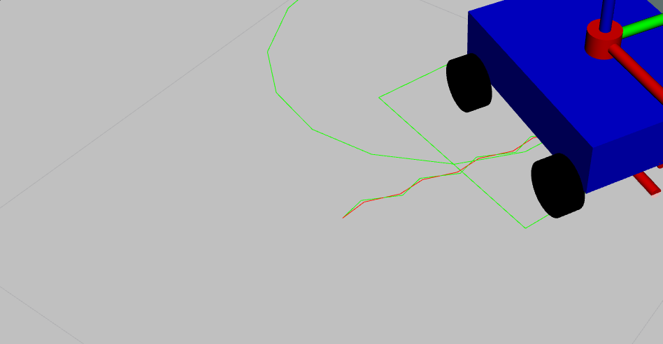
有平滑效果

#### $\text{B-Spline}算法$
可以利用b样条曲线进行平滑，其轨迹函数可表示为：
$$P(t) = \cfrac{1}{6}\begin{bmatrix}
    t^3 & t^2 & t & 1
\end{bmatrix}\begin{bmatrix}
    -1 & 3 & -3 & 1 \\
    3 & -6 & 3 & 0 \\
    -3 & 0 & 3 & 0 \\
    1 & 4 & 1 & 0
\end{bmatrix}\begin{bmatrix}
    P_0 \\
    P_1 \\ 
    P_2 \\ 
    P_3
\end{bmatrix}$$
所以对于任意四个控制点$P_i,P_{i+1},P_{i+2},P_{i+3}$，我们可以写成如下形式：
$$P(t) = \boldsymbol{TMP}_i,t\in[0, 1]
$$其中$\boldsymbol{M}$为$\cfrac{1}{6}$乘中间的基矩阵，我们平滑的目标是设计目标代价函数：
$$J_{smooth} = \int^1_0||P''(t)||^2dt
$$并使其最小，将轨迹函数的二阶导展开带入积分后得到：
$$J_{smooth} = \boldsymbol{P}_i^T \boldsymbol{M}^T \left( \int_{0}^{1} \boldsymbol{T}''^T \boldsymbol{T}'' dt \right) \boldsymbol{M} \boldsymbol{P}_i$$
中间的积分项实际上是一个常数矩阵$\boldsymbol{N} = \begin{bmatrix}
    12 & 6 & 0 & 0 \\
    6 & 4 & 0 & 0 \\
    0 & 0 & 0 & 0 \\
    0 & 0 & 0 & 0
\end{bmatrix}$，我们记$\text{Hessian}$矩阵$\boldsymbol{Q} = \boldsymbol{M}^T\boldsymbol{NM}$，在经过$\cfrac{1}{36}$缩放后写入代码中可为
```cpp
const double Q_data[4][4] = {
    { 0.333333, -0.500000,  0.000000,  0.166667},
    {-0.500000,  1.000000, -0.500000,  0.000000},
    { 0.000000, -0.500000,  1.000000, -0.500000},
    { 0.166667,  0.000000, -0.500000,  0.333333}
};
```
另外，还需要一个引导代价防止平滑后的路径偏离原始路径过多：
$$J_{guide} = \sum_{i=1}^n (P_i - P_{ref,i})^2 = \boldsymbol{P}^T \boldsymbol{I} \boldsymbol{P} - 2 \boldsymbol{P}_{ref}^T \boldsymbol{P} + \text{const}$$
随后我们将两个代价函数合并，并使用平滑权重系数和引导权重系数组成一个最终代价：
$$J_{total} = w_s\sum J_{smooth} + w_g J_{guide}$$
它可以写成一个qp问题的形式：
$$J_{total} = \frac{1}{2} \boldsymbol{P}^T \underbrace{(w_s \boldsymbol{H}_{smooth} + w_g \boldsymbol{I})}_{\text{二次项矩阵 } \boldsymbol{H}_{QP}} \boldsymbol{P} + \underbrace{(-w_g \boldsymbol{P}_{ref})^T}_{\text{一次项向量 } \boldsymbol{f}_{QP}^T} \boldsymbol{P}$$
其中$\boldsymbol{H}_{smooth}$为所有$4\times 4$的$\boldsymbol{Q}$进行对角线上叠加得到（不是分块放置，而是对角线上放下一个矩阵，下一格对角线再放一个，此时矩阵之间的重叠部分叠加）
同时我们需要设立一组约束，即对于平滑后的点，若为起点或终点，必须与平滑前相同，否则设立上下边界$u,l$，保证$\boldsymbol{A} = \boldsymbol{I}$下有$l \leq \boldsymbol{AP} \leq u$
因此在这里我们使用`osqp`库进行求解带约束的qp问题，它依赖于`Eigen`库，我们可以通过
```bash
sudo apt install ros-jazzy-osqp-vendor
```
进行安装（v0.6.x版本），也可以在 https://github.com/osqp/osqp 下载最新的版本（v1.0.0），注意不同版本之间大部分函数和使用方法不同，参考 https://osqp.org/docs/index.html 进行接口迁移或者查询使用方法，在这里我们使用v0.6.x版本，在这里需要注意矩阵$\boldsymbol{A}$和$\boldsymbol{H}_{QP}$必须得是$\text{CSC}$矩阵的形式
`bspline_smoother.hpp`：
```cpp
#ifndef MY_NAV2_SMOOTHER__BSPLINE_SMOOTHER
#define MY_NAV2_SMOOTHER__BSPLINE_SMOOTHER

#include <vector>
#include <memory>
#include <string>
#include "Eigen/Dense"
#include "Eigen/Sparse"

#include "nav2_costmap_2d/costmap_subscriber.hpp"
#include "nav2_costmap_2d/footprint_subscriber.hpp"
#include "nav2_core/smoother.hpp"
#include "rclcpp/rclcpp.hpp"
#include "nav_msgs/msg/path.hpp"
#include "nav2_util/lifecycle_node.hpp"
#include "nav2_util/node_utils.hpp"
#include "nav2_costmap_2d/costmap_2d_ros.hpp"

namespace my_bspline_smoother {

    class MyBSplineSmoother : public nav2_core::Smoother {

    public:

        MyBSplineSmoother() = default;
        ~MyBSplineSmoother() override = default;

        void configure(
            const rclcpp_lifecycle::LifecycleNode::WeakPtr & parent,
            std::string name, 
            std::shared_ptr<tf2_ros::Buffer> /*tf*/,
            std::shared_ptr<nav2_costmap_2d::CostmapSubscriber> costmap_sub,
            std::shared_ptr<nav2_costmap_2d::FootprintSubscriber> /*footprint_sub*/) override;

        void cleanup() override;
        void activate() override;
        void deactivate() override;

        bool smooth(
            nav_msgs::msg::Path &path,
            const rclcpp::Duration &/*max_time*/) override;
    private:

        // 平滑算法
        void applyBSplineAlgorithm(nav_msgs::msg::Path &path, const nav_msgs::msg::Path &raw_path);
        bool solveBSplineQP(
            const std::vector<double> &p_ref_x,
            const std::vector<double> &p_ref_y,
            double w_s,
            double w_g,
            std::vector<double> &p_smooth_x,
            std::vector<double> &p_smooth_y);

        // bspline参数
        double 
            w_smooth_ = 10.0,
            w_guide_ = 1.0;

        const double Q_data[4][4] = {
            { 0.333333, -0.500000,  0.000000,  0.166667},
            {-0.500000,  1.000000, -0.500000,  0.000000},
            { 0.000000, -0.500000,  1.000000, -0.500000},
            { 0.166667,  0.000000, -0.500000,  0.333333}
        };
        nav2_util::LifecycleNode::SharedPtr node_;
        std::string name_;
        std::shared_ptr<nav2_costmap_2d::CostmapSubscriber> costmap_sub_;
    };
} // my_bspline_smoother

#endif // MY_NAV2_SMOOTHER__BSPLINE_SMOOTHER
```
`bspline_smoother.cpp`：
```cpp
#include "my_nav2_smoother/bspline_smoother.hpp"
#include "pluginlib/class_list_macros.hpp"
#include "tf2/LinearMath/Quaternion.h"
#include "tf2_geometry_msgs/tf2_geometry_msgs.hpp"

extern "C" {
#include "osqp/osqp.h"
}

namespace my_bspline_smoother {

    void MyBSplineSmoother::configure(
        const rclcpp_lifecycle::LifecycleNode::WeakPtr & parent,
        std::string name, 
        std::shared_ptr<tf2_ros::Buffer> /*tf*/,
        std::shared_ptr<nav2_costmap_2d::CostmapSubscriber> costmap_sub,
        std::shared_ptr<nav2_costmap_2d::FootprintSubscriber> /*footprint_sub*/
    ) {
            
        costmap_sub_ = costmap_sub;
        node_ = parent.lock();
        name_ = name;

        nav2_util::declare_parameter_if_not_declared(node_, name + ".w_smooth", rclcpp::ParameterValue(10.0));
        nav2_util::declare_parameter_if_not_declared(node_, name + ".w_guide", rclcpp::ParameterValue(1.0));

        node_->get_parameter(name + ".w_smooth", w_smooth_);
        node_->get_parameter(name + ".w_guide", w_guide_);
    }
    void MyBSplineSmoother::activate() { RCLCPP_INFO(node_->get_logger(), "插件已激活"); }
    void MyBSplineSmoother::deactivate() { RCLCPP_INFO(node_->get_logger(), "插件已停用"); }
    void MyBSplineSmoother::cleanup() { RCLCPP_INFO(node_->get_logger(), "插件已清理"); }
    bool MyBSplineSmoother::smooth(
        nav_msgs::msg::Path &path,
        const rclcpp::Duration &/*max_time*/
    ) {

        if (path.poses.size() < 4) return true;
        nav_msgs::msg::Path raw_path = path;
        applyBSplineAlgorithm(path, raw_path);

        return true;
    }
    void MyBSplineSmoother::applyBSplineAlgorithm(
        nav_msgs::msg::Path &path, 
        const nav_msgs::msg::Path &raw_path
    ) {

        if (raw_path.poses.size() < 4) {
            
            path = raw_path;
            return;
        }
        std::vector<double> 
            ref_path_x,
            ref_path_y,
            smooth_path_x,
            smooth_path_y;
        for (size_t i = 0; i < raw_path.poses.size(); ++ i) {

            ref_path_x.push_back(raw_path.poses[i].pose.position.x);
            ref_path_y.push_back(raw_path.poses[i].pose.position.y);
        }
        solveBSplineQP(ref_path_x, ref_path_y, w_smooth_, w_guide_, smooth_path_x, smooth_path_y);
        int n = smooth_path_x.size();
        for (int i = 0; i < n; ++ i) {

            double yaw;
            
            if (i < n - 1) {

                yaw = std::atan2(smooth_path_y[i + 1] - smooth_path_y[i], 
                                smooth_path_x[i + 1] - smooth_path_x[i]);
            } else {

                yaw = std::atan2(smooth_path_y[i] - smooth_path_y[i - 1], 
                                smooth_path_x[i] - smooth_path_x[i - 1]);
            }

            // 更新位姿
            path.poses[i].pose.position.x = smooth_path_x[i];
            path.poses[i].pose.position.y = smooth_path_y[i];
            tf2::Quaternion q;
            q.setRPY(0, 0, yaw); // Roll=0, Pitch=0, Yaw=yaw
            path.poses[i].pose.orientation = tf2::toMsg(q);
        }
    }
    /**
     * @brief 使用 B-Spline 二次规划平滑路径
     * @param p_ref 原始参考路径的坐标序列 (x 或 y)
     * @param w_s 平滑权重
     * @param w_g 引导项权重
     * @param p_smooth 输出的平滑后的坐标序列
     * @return 成功返回true
     */
    bool MyBSplineSmoother::solveBSplineQP(
        const std::vector<double> &p_ref_x,
        const std::vector<double> &p_ref_y,
        double w_s,
        double w_g,
        std::vector<double> &p_smooth_x,
        std::vector<double> &p_smooth_y
    ) {

        RCLCPP_INFO(node_->get_logger(), "BSpline算法启动");
        int n = p_ref_x.size();
        if (n < 4) return false;

        Eigen::SparseMatrix<double> H(n, n);
        std::vector<Eigen::Triplet<double>> triplets;
        for (int i = 0; i < n - 3; ++ i) {

            for (int r = 0; r < 4; ++ r) {

                for(int c = 0; c < 4; ++ c) {

                    triplets.push_back(Eigen::Triplet<double>(i + r, i + c, w_s * Q_data[r][c]));
                }
            }
        }

        // 引导项
        for (int i = 0; i < n; ++ i) {

            triplets.push_back(Eigen::Triplet<double>(i, i, w_g));
        }
        H.setFromTriplets(triplets.begin(), triplets.end());

        Eigen::VectorXd f_x(n), f_y(n);
        for (int i = 0; i < n; ++ i) {
            
            f_x(i) = -w_g * p_ref_x[i];
            f_y(i) = -w_g * p_ref_y[i];
        }

        // 边界约束
        Eigen::VectorXd l_x(n), u_x(n), l_y(n), u_y(n);
        for (int i = 0; i < n; ++i) {

            l_x(i) = p_ref_x[i] - 1.0; 
            u_x(i) = p_ref_x[i] + 1.0;
            l_y(i) = p_ref_y[i] - 1.0; 
            u_y(i) = p_ref_y[i] + 1.0;
            if (i < 2 || i > n - 3) {

                l_x(i) = p_ref_x[i];
                u_x(i) = p_ref_x[i];
                l_y(i) = p_ref_y[i];
                u_y(i) = p_ref_y[i];
            }
        }
        
        // OSQP求解
        OSQPSettings *settings = (OSQPSettings*)c_malloc(sizeof(OSQPSettings));
        OSQPData *data = (OSQPData*)c_malloc(sizeof(OSQPData));
        Eigen::SparseMatrix<c_float, Eigen::ColMajor, c_int> H_csc = H.triangularView<Eigen::Upper>(); // csc形式
        Eigen::SparseMatrix<c_float, Eigen::ColMajor, c_int> A_csc(n, n);
        A_csc.setIdentity();
        A_csc.makeCompressed();
        H_csc.makeCompressed();

        data->n = n; // 变量
        data->m = n; // 约束
        data->P = csc_matrix( // csc矩阵信息
            n, n,
            H_csc.nonZeros(),
            H_csc.valuePtr(),
            (c_int*)H_csc.innerIndexPtr(),
            (c_int*)H_csc.outerIndexPtr()
        );
        data->q = f_x.data(); // 一次项
        data->A = csc_matrix( // 约束矩阵
            n, n, 
            A_csc.nonZeros(),
            A_csc.valuePtr(),
            (c_int*)A_csc.innerIndexPtr(),
            (c_int*)A_csc.outerIndexPtr()
        );

        // 约束向量
        data->l = l_x.data();
        data->u = u_x.data();

        // 开始求解
        osqp_set_default_settings(settings);
        settings->warm_start = 1;
        settings->verbose = 0; // 生产环境关闭日志

        OSQPWorkspace *work = nullptr;
        c_int status = osqp_setup(&work, data, settings);
        bool success = false;
        if (status == 0 && work) {

            osqp_solve(work);
            if (work->info->status_val >= 0 && work->solution) {

                p_smooth_x.resize(n);
                for (int i = 0; i < n; ++ i) {

                    p_smooth_x[i] = work->solution->x[i];
                }
            }
            osqp_update_lin_cost(work, f_y.data());
            osqp_update_bounds(work, l_y.data(), u_y.data());
            osqp_solve(work);
            if (work->info->status_val >= 0 && work->solution) {

                p_smooth_y.resize(n);
                for (int i = 0; i < n; ++ i) {

                    p_smooth_y[i] = work->solution->x[i];
                }
                success = true;
            }
        } else {

            RCLCPP_INFO(node_->get_logger(), "OSQP初始化失败");
        }

        // 释放
        if (work) osqp_cleanup(work);
        if (data) {

            if (data->P) c_free(data->P);
            if (data->A) c_free(data->A);
            c_free(data);
        }
        if (settings) c_free(settings);

        return success;
    }
} // my_bspline_smoother

PLUGINLIB_EXPORT_CLASS(my_bspline_smoother::MyBSplineSmoother, nav2_core::Smoother)
```
注意，使用`osqp`最好`osqp`和`osqp_vendor`一起写入cmake文件中，为防止出现问题，可以尝试手动链接`osqp::osqp`
`CmakeLists.txt`：
```c
cmake_minimum_required(VERSION 3.8)
project(my_nav2_smoother)

if(CMAKE_COMPILER_IS_GNUCXX OR CMAKE_CXX_COMPILER_ID MATCHES "Clang")
  add_compile_options(-Wall -Wextra -Wpedantic)
endif()

# find dependencies
find_package(ament_cmake REQUIRED)
find_package(rclcpp REQUIRED)
find_package(nav2_core REQUIRED)
find_package(nav2_util REQUIRED)
find_package(nav2_costmap_2d REQUIRED)
find_package(nav_msgs REQUIRED)
find_package(geometry_msgs REQUIRED)
find_package(pluginlib REQUIRED)
find_package(tf2 REQUIRED)
find_package(tf2_ros REQUIRED)
find_package(tf2_geometry_msgs REQUIRED)
find_package(Eigen3 REQUIRED)
find_package(osqp_vendor REQUIRED)
find_package(osqp REQUIRED)

# 添加头文件目录
include_directories(
  include
  ${Eigen3_INCLUDE_DIRS}
)

# 编译动态库 (Shared Library)
add_library(${PROJECT_NAME}_lib SHARED
  src/bspline_smoother.cpp
)
ament_target_dependencies(${PROJECT_NAME}_lib
  rclcpp
  nav2_core
  nav2_util
  nav2_costmap_2d
  nav_msgs
  geometry_msgs
  pluginlib
  tf2
  tf2_ros
  tf2_geometry_msgs
  osqp
  Eigen3
)

target_link_libraries(${PROJECT_NAME}_lib
  osqp::osqp
)

pluginlib_export_plugin_description_file(nav2_core plugins.xml)

install(TARGETS ${PROJECT_NAME}_lib
  ARCHIVE DESTINATION lib
  LIBRARY DESTINATION lib
  RUNTIME DESTINATION bin
)

install(DIRECTORY include/
  DESTINATION include/
)

# 导出依赖以供其他包使用
ament_export_include_directories(include)
ament_export_libraries(${PROJECT_NAME}_lib)
ament_export_dependencies(nav2_core nav2_util pluginlib rclcpp)

if(BUILD_TESTING)
  find_package(ament_lint_auto REQUIRED)
  # the following line skips the linter which checks for copyrights
  # comment the line when a copyright and license is added to all source files
  set(ament_cmake_copyright_FOUND TRUE)
  # the following line skips cpplint (only works in a git repo)
  # comment the line when this package is in a git repo and when
  # a copyright and license is added to all source files
  set(ament_cmake_cpplint_FOUND TRUE)
  ament_lint_auto_find_test_dependencies()
endif()

ament_package()
```
`package.xml`：
```xml
<?xml version="1.0"?>
<?xml-model href="http://download.ros.org/schema/package_format3.xsd" schematypens="http://www.w3.org/2001/XMLSchema"?>
<package format="3">
  <name>my_nav2_smoother</name>
  <version>0.0.0</version>
  <description>TODO: Package description</description>
  <maintainer email="meis38@126.com">goose</maintainer>
  <license>TODO: License declaration</license>

  <buildtool_depend>ament_cmake</buildtool_depend>

  <depend>rclcpp</depend>
  <depend>nav2_core</depend>
  <depend>nav2_util</depend>
  <depend>nav2_costmap_2d</depend>
  <depend>nav_msgs</depend>
  <depend>geometry_msgs</depend>
  <depend>pluginlib</depend>
  <depend>tf2</depend>
  <depend>tf2_ros</depend>
  <depend>tf2_geometry_msgs</depend>
  <depend>eigen</depend>
  <depend>osqp</depend>
  <depend>osqp_vendor</depend>

  <test_depend>ament_lint_auto</test_depend>
  <test_depend>ament_lint_common</test_depend>

  <export>
    <build_type>ament_cmake</build_type>
    <nav2_core plugin="${prefix}/plugins.xml" />
  </export>
</package>
```
`plugins.xml`和之前的差不多，这里不多展示
随后编译运行，规划好路径后应该能看到较为平滑的红色路径：
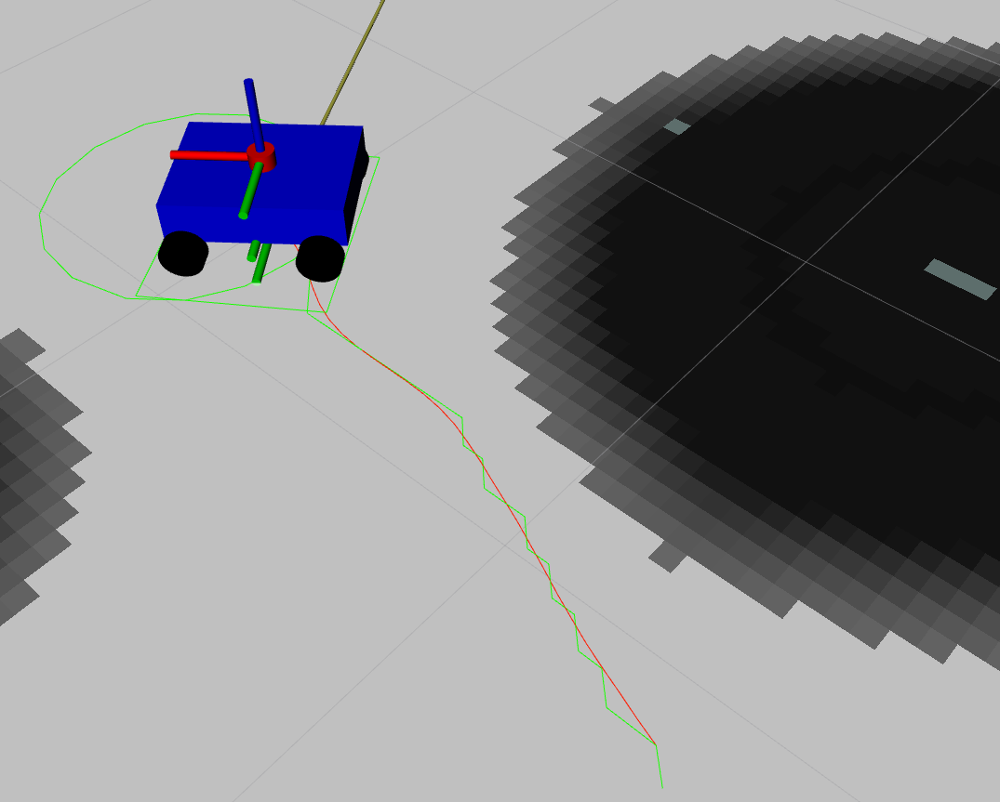

### 视觉里程计
#### 初步视觉处理$-\text{OpenCV}$
我们可以给小车增设一个深度相机插件，其可以获取周围环境的3d点云信息，并丢到对应话题，我们可以用opencv写一个初步项目，来对相机提取到的相邻两帧进行特征点提取、匹配、相机运动解算
首先创建功能包`nav2_visual_processing`，整个节点步骤如下：
- 1. 从深度相机读取并计算过的话题`/depth_camera/image`与`/depth_camera/points`读取图像与点云数据（注意，这两个话题需要自行在launch文件的桥接器上填写并注意名称对应，例如：
    ```py
    '/depth_camera/points@sensor_msgs/msg/PointCloud2@gz.msgs.PointCloudPacked',
    '/depth_camera/image@sensor_msgs/msg/Image[gz.msgs.Image',
    '/depth_camera/camera_info@sensor_msgs/msg/CameraInfo[gz.msgs.CameraInfo',
    ``` 
- 2. 使用opencv自带的orb算法对2d图像进行特征点提取，同时开始计算特征点与描述子，并用迭代器访问对应特征点的3d点云（这个深度相机已经为我们处理好了，只需要使用一一对应原则访问即可），剔除部分无效点（深度无效、超出边界等）
- 3. 使用一个比较结果存储容器来对两帧图像的每一组特征点进行描述子比对，并存入比较容器中，在一定程度上表示了下一帧的点云与上一帧点云的关系
- 4. 利用3d点云的对应关系进行svd解算，在这里也可以用`drawMatches`函数进行opencv可视化比较的特征点组

`visual_processor.hpp`：
```cpp
#ifndef NAV2_VISUAL_PROCESSING__VISUAL_PROCESSOR
#define NAV2_VISUAL_PROCESSING__VISUAL_PROCESSOR

#include "rclcpp/rclcpp.hpp"
#include "sensor_msgs/msg/image.hpp"
#include "sensor_msgs/msg/point_cloud2.hpp"
#include "cv_bridge/cv_bridge.hpp"
#include "message_filters/subscriber.h"
#include "message_filters/time_synchronizer.h"
#include "message_filters/sync_policies/approximate_time.h"

#include <opencv2/opencv.hpp>
#include <Eigen/Core>
#include <Eigen/Geometry>
#include <vector>

namespace nav2_visual_processing {

    struct Frame {

        cv::Mat color;
        std::vector<cv::KeyPoint> keypoints;
        cv::Mat descriptors; // 描述子
        std::vector<Eigen::Vector3d> points_3d;
    };

    class VisualProcessorNode : public rclcpp::Node {

    public:

        VisualProcessorNode();
    private:

        // 异步回调函数
        void sync_callback(
            const sensor_msgs::msg::Image::ConstSharedPtr &img_msg,
            const sensor_msgs::msg::PointCloud2::ConstSharedPtr &pc_msg
        );
        
        // 提取特征点
        Frame extract_frame(
            const cv::Mat &color_img,
            const sensor_msgs::msg::PointCloud2::ConstSharedPtr &pc_msg
        );

        // SVD解算位姿
        void estimate_motion(
            const Frame &f1,
            const Frame &f2
        );

        // 可视化匹配结果
        cv::Mat visualize_matches(
            const Frame &f1,
            const Frame &f2,
            const std::vector<cv::DMatch> &matches
        );

        // 消息同步
        using SyncPolicy = message_filters::sync_policies::ApproximateTime<sensor_msgs::msg::Image, sensor_msgs::msg::PointCloud2>;
        std::shared_ptr<message_filters::Subscriber<sensor_msgs::msg::Image>> img_sub_;
        std::shared_ptr<message_filters::Subscriber<sensor_msgs::msg::PointCloud2>> pc_sub_;
        std::shared_ptr<message_filters::Synchronizer<SyncPolicy>> sync_;

        cv::Ptr<cv::ORB> orb_;
        cv::Ptr<cv::DescriptorMatcher> matcher_;

        Frame last_f_;
        bool is_first_f_ = true;
    };
} // nav2_visual_processing

#endif // NAV2_VISUAL_PROCESSING__VISUAL_PROCESSOR
```
`visual_processor.cpp`：
```cpp
#include "nav2_visual_processing/visual_processor.hpp"
#include "sensor_msgs/point_cloud2_iterator.hpp"

namespace nav2_visual_processing {
    
    VisualProcessorNode::VisualProcessorNode() : Node("visual_processor_node") {

        // 初始化
        orb_ = cv::ORB::create();
        matcher_ = cv::DescriptorMatcher::create("BruteForce-Hamming");

        img_sub_ = std::make_shared<message_filters::Subscriber<sensor_msgs::msg::Image>>(this, "/depth_camera/image");
        pc_sub_ = std::make_shared<message_filters::Subscriber<sensor_msgs::msg::PointCloud2>>(this, "/depth_camera/points");

        sync_ = std::make_shared<message_filters::Synchronizer<SyncPolicy>>(SyncPolicy(10), *img_sub_, *pc_sub_);
        sync_->registerCallback(std::bind(&VisualProcessorNode::sync_callback, this, std::placeholders::_1, std::placeholders::_2));

        RCLCPP_INFO(this->get_logger(), "视觉处理节点已启动，等待同步数据...");
    }

    /**
     * @brief 同步回调函数，处理来自深度相机的彩色图像和点云数据
     * @param img_msg 彩色图像消息
     * @param pc_msg 点云消息
     */
    void VisualProcessorNode::sync_callback(
        const sensor_msgs::msg::Image::ConstSharedPtr &img_msg,
        const sensor_msgs::msg::PointCloud2::ConstSharedPtr &pc_msg
    ) {
        
        cv_bridge::CvImagePtr cv_ptr = cv_bridge::toCvCopy(img_msg, sensor_msgs::image_encodings::RGB8);

        // 提取特征和3D点
        Frame cur_f = extract_frame(cv_ptr->image, pc_msg);

        if (!is_first_f_) {

            estimate_motion(last_f_, cur_f);
        }

        last_f_ = cur_f;
        is_first_f_ = false;
    }

    /**
     * @brief 从彩色图像和点云数据中提取特征帧
     * @param color_img 彩色图像
     * @param pc_msg 点云数据
     * @return Frame 包含特征点、描述子和3D点的帧结构
     */
    Frame VisualProcessorNode::extract_frame(
        const cv::Mat &color_img,
        const sensor_msgs::msg::PointCloud2::ConstSharedPtr &pc_msg
    ) {
        
        Frame f;
        f.color = color_img;
        
        // 使用ORB算法检测图像中的特征点，并计算描述子-HammingCode
        // f.keypoints: 存储检测到的特征点位置
        // f.descriptors: 存储每个特征点的描述子向量
        orb_->detectAndCompute(color_img, cv::noArray(), f.keypoints, f.descriptors);

        // 获取点云的宽高信息
        int width = pc_msg->width;       // 点云的宽度（列数）
        int height = pc_msg->height;     // 点云的高度（行数）
        int row_step = pc_msg->row_step; // 点云每行占用的字节数

        // 创建点云坐标迭代器，用于按索引访问点云的x, y, z坐标
        sensor_msgs::PointCloud2ConstIterator<float> iter_x(*pc_msg, "x");
        sensor_msgs::PointCloud2ConstIterator<float> iter_y(*pc_msg, "y");
        sensor_msgs::PointCloud2ConstIterator<float> iter_z(*pc_msg, "z");

        f.points_3d.reserve(f.keypoints.size());

        // 遍历每个检测到的特征点，建立2D-3D对应关系
        for (const auto &kp : f.keypoints) {

            // 将特征点的浮点坐标转换为整数坐标（四舍五入）
            int u = static_cast<int>(kp.pt.x + 0.5);
            int v = static_cast<int>(kp.pt.y + 0.5);

            // 检查特征点坐标是否在点云的有效范围内
            if (u >= 0 && u < static_cast<int>(width) && v >= 0 && v < static_cast<int>(height)) {

                // 计算特征点对应的点云索引（行优先存储）
                int index = v * width + u;
                
                // 从点云中读取对应位置的3D坐标
                float x = iter_x[index];
                float y = iter_y[index];
                float z = iter_z[index];

                // 检查3D坐标是否为有限值（不是NaN或无穷大）
                // 深度相机无法获取深度时通常会返回NaN或Inf
                if (std::isfinite(x) && std::isfinite(y) && std::isfinite(z)) {

                    // 有效3D点，转换为Eigen向量并添加到结果中
                    f.points_3d.push_back(Eigen::Vector3d(x, y, z));
                } else {

                    // 深度无效，添加零向量占位（保持与特征点一一对应）
                    f.points_3d.push_back(Eigen::Vector3d::Zero());
                }
            } else {

                // 特征点坐标超出点云范围，添加零向量占位
                f.points_3d.push_back(Eigen::Vector3d::Zero());
            }
        }

        return f;
    }

    /**
     * @brief 通过SVD分解估计两帧之间的相机运动
     * @param f1 上一帧
     * @param f2 当前帧
     */
    void VisualProcessorNode::estimate_motion(
        const Frame &f1,
        const Frame &f2
    ) {
        
        // 存粗描述子匹配信息
        /**
         * @param queryIdx 特征点在第一帧 keypoints 数组中的索引
         * @param trainIdx 特征点在第二帧 keypoints 数组中的索引
         * @param distance 两个描述子之间的距离
         */
        std::vector<cv::DMatch> matches;
        matcher_->match(f1.descriptors, f2.descriptors, matches); // 用hammingcode比较两个描述子

        std::vector<Eigen::Vector3d> pts1, pts2;
        for (auto &m : matches) {

            // 向量模必须不为0,否则被视为无效向量
            if (f1.points_3d[m.queryIdx].norm() > 0 && f2.points_3d[m.trainIdx].norm() > 0) {

                pts1.push_back(f1.points_3d[m.queryIdx]);
                pts2.push_back(f2.points_3d[m.trainIdx]);
            }
        }

        if (pts1.size() < 4) return;

        // SVD解算
        // 1. 计算质心与去质心坐标
        Eigen::Vector3d p1(0, 0, 0), p2(0, 0, 0);
        for (size_t i = 0; i < pts1.size(); ++ i) {

            p1 += pts1[i];
            p2 += pts2[i];
        }
        p1 /= pts1.size();
        p2 /= pts2.size();

        Eigen::Matrix3d W = Eigen::Matrix3d::Zero();
        for (size_t i = 0; i < pts1.size(); ++ i) {

            W += (pts1[i] - p1) * (pts2[i] - p2).transpose(); // 同时存到W矩阵中
        }
        
        // 2. SVD分解
        Eigen::JacobiSVD<Eigen::Matrix3d> svd(W, Eigen::ComputeFullU | Eigen::ComputeFullV);
        Eigen::Matrix3d R = svd.matrixU() * svd.matrixV().transpose();

        // 负数取反
        if (R.determinant() < 0) R = -R;

        // 3. 计算t
        Eigen::Vector3d t = p1 - R * p2;

        RCLCPP_INFO(this->get_logger(), "解算平移 t: x=%f, y=%f, z=%f", t.x(), t.y(), t.z());

        // 可视化匹配结果
        cv::Mat match_img = visualize_matches(f1, f2, matches);
        
        // 可选：显示图像（调试用）
        cv::imshow("Feature Matches", match_img);
        cv::waitKey(1);
    }

    /**
     * @brief 可视化两帧之间的特征点匹配结果
     * @param f1 上一帧（包含图像、特征点、描述子）
     * @param f2 当前帧
     * @param matches 匹配对列表
     * @return cv::Mat 拼接后的匹配结果图像
     */
    cv::Mat VisualProcessorNode::visualize_matches(
        const Frame &f1,
        const Frame &f2,
        const std::vector<cv::DMatch> &matches
    ) {

        cv::Mat match_img;
        cv::drawMatches(
            f1.color, f1.keypoints,
            f2.color, f2.keypoints,
            matches,
            match_img, // 输出图像
            cv::Scalar::all(-1), // 匹配线随机颜色
            cv::Scalar::all(-1), // 单独特征点随机颜色
            std::vector<char>(), // 不屏蔽任何匹配
            cv::DrawMatchesFlags::NOT_DRAW_SINGLE_POINTS
        );

        return match_img;
    }
} // namespace nav2_visual_processing

int main(int argc, char **argv) {

    rclcpp::init(argc, argv);
    auto node = std::make_shared<nav2_visual_processing::VisualProcessorNode>();

    RCLCPP_INFO(node->get_logger(), "Visual Processor Node is spinning...");
    
    rclcpp::spin(node);
    rclcpp::shutdown();
    return 0;
}
```
注意好cmake文件和`package.xml`文件的配置，编译刷新环境，在小车运行时启动该节点，就能看到：
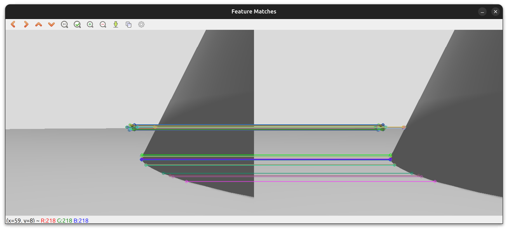
中心还有一个黑色小正方形，这些不同颜色的小圈对应特征点，直线表示对应关系
另一点值的注意的点是urdf文件的设置，如果要设置一个深度相机插件，在设置好它的关节和坐标系后，需要使用
```xml
<!--深度相机插件-->
<gazebo reference="camera_link">
    <sensor name="depth_camera" type="rgbd_camera">
        <visualize>true</visualize>
        <update_rate>10.0</update_rate>
        <topic>depth_camera</topic>
        <gz_frame_id>camera_link</gz_frame_id>
        <camera>
            <horizontal_fov>1.047198</horizontal_fov>
            <image>
                <width>640</width>
                <height>480</height>
                <format>R8G8B8</format>
            </image>
            <clip>
                <near>0.1</near>
                <far>5.0</far>
            </clip>
        </camera>
    </sensor>
</gazebo>

<!--全局挂载插件-->
<gazebo>
    <plugin filename="gz-sim-sensors-system" name="gz::sim::systems::Sensors">
        <render_engine>ogre2</render_engine>
    </plugin>
</gazebo>
```
进行插件加载，其中`<!--全局挂载插件-->`下方的代码是必须的，同时不能有其他的`gz::sim::systems::Sensors`插件被加载，否则会导致二次加载gazebo崩溃（所以你需要去除雷达插件的该插件加载，额外写出来）

### 通信串口
导航，算法平台算得的所有数据，最后都要通过一个协议通信串口传给电机等电控面板，最后由它们负责让小车跑起来。其中这个协议通信串口并不是一个桥接器，当我们在gazebo跑仿真时，需要桥接器将ros2的数据和gazebo的数据互传（也可以单向），在有实物的情况下，我们不需要启动gazebo仿真了，桥接器也不需要了，只需要一个通信节点，它将自动读取话题（例如`/cmd_vel`等），并打包成符合电机通信的格式发送（自己编写一个`.cpp`或使用$\text{ASIO}$或$\text{Linux}$自带的函数）给对应电机，我们不需要更改算法层面的代码，两个部分是解耦的