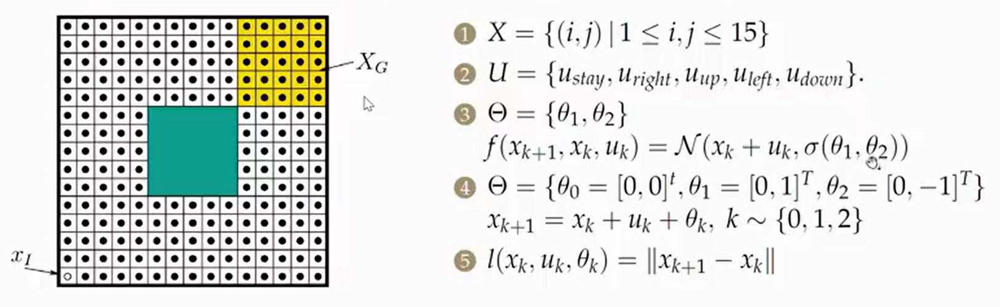
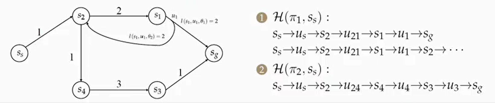
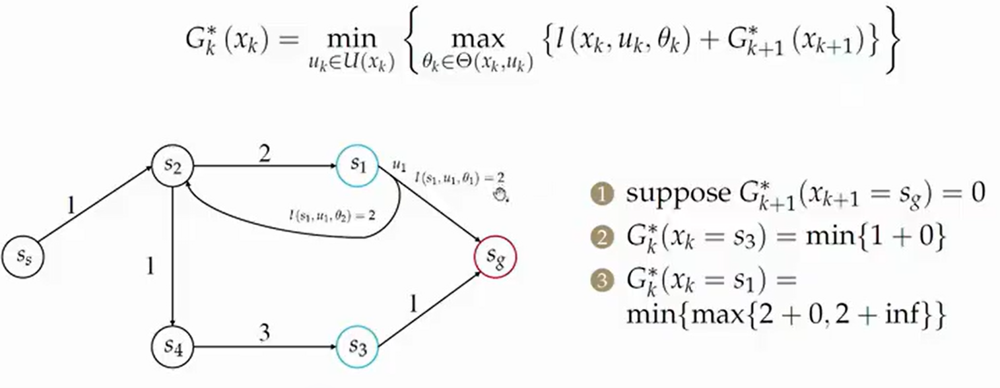
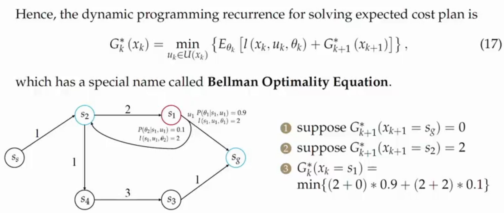

## 图搜索基础
- **配置空间** $\text{(C-Space)}$
  包含所有可能机器人配置 $n$ 的维空间，每个机器人位姿对应空间中的一个点
- **自由度** $\text{DOF}$
  表示配置机器人配置所需要的最小坐标数量，如无人机需要4个自由度（xyz平行角）

### 配置空间
在配置空间做规划是为了简化在**工作空间**中的机器人体积碰撞的问题（工作空间中可能机器人的形状不同，难以精细规划碰撞），在配置空间中，我们将机器人视作一个点（$R^3$中的点或者$SO(3)$中的姿态点），那我们就需要根据原机器人的碰撞体积，对障碍物进行**膨胀**，随后我们只需要保证机器人（不特别说明下，机器人在配置空间中是一个质点）在膨胀后的障碍物外就能保证机器人一定没有发生碰撞，膨胀的外围层被称为**膨胀层**。在这里我们定义$\text{C-free}$和$\text{C-obstacle}$分别表示配置空间中机器人可以自由移动的区域和障碍物区域

### 图与搜索方法
在进行搜索算法应用前，需要将进行路径规划的地图构建为一个图，图中的节点表示配置空间中的点，边表示节点之间的连接关系，边的权重表示节点之间的距离或代价
需要维护一个**容器**来缓存所有被访问的节点，以便在搜索过程中快速查找和更新节点状态，一开始加入一个空节点，接下来循环执行以下步骤：
- $\text{Remove}$：从容器中移除当前节点
- $\text{Expansion}$：扩展当前节点，访问其所有邻居节点
- $\text{Push}$：将扩展后的邻居节点加入容器

直到容器为空，搜索结束，除此之外，需要维护另一个容器，实现`close_list`机制，用于缓存已经访问过的节点，避免重复访问
所以我们的目标就是：
- **效率优化**：选择能使目标最快到达节点的弹出规则
- **扩展控制**：通过优化节点访问顺序减少不必要节点的扩展

#### 图搜索构建方法
一般有两种图搜索构建方法：
- **正向构建**：即从控制空间离散化（如4/8向移动）
  需要事先划分地图为格子，然后先定死机器人的位置，不管机器人的运动，例如AStar,Dijkstra算法等
- **反向构建**：即从状态空间离散化（如PRM采样）
  不需要事先划分地图为格子，但是同样事先定死机器人的运动（控制输入等），划分格子依旧需要但不是主要功能，例如Hybird AStar等运动学规划算法等

### 启发式代价
#### 可纳性
我们称**AStar**算法是**可纳的**$\text{admissible}$，即此时AStar算法可以取得最优结果，当且仅当其启发式代价函数$h(x)\leq h^*(x)$，其中$h^*(x)$表示从起点到目标的真实最短路径代价，即启发式代价函数不会高估实际路径代价，例如取0或$L_\infty$或欧氏距离，总是可纳的，若取曼哈顿距离，则不一定可纳（这里的$L$是范数，我们称$L_p$范数的数学定义公式为：
$$
L_p(x, y) = \left(\sum_{i=1}^n |x_i - y_i|^p\right)^{\frac{1}{p}}
$$
所以$L_1$为曼哈顿距离，$L_2$为欧氏距离，$L_\infty$为$L_p$范数中的$p=inf$，即为**切比雪夫距离**）
如果AStar算法不是可纳的，它寻得的路径就是次优的，虽然不是最短路径，但是速度更快（可以认为，启发式代价估计函数越大于实际代价，AStar算法越会靠近贪心算法），此时AStar的总代价为$f = g + \epsilon h, \epsilon > 1$，其中$\epsilon$表示权重，此时我们称该算法为**Weighted AStar**
该算法以精度换时间，由于其更接近贪心算法，所以其有很强的目的性，每次搜索范围会更小，减少了大量优先队列的`push`和`pop`操作，节省更多时间。除此之外，还有其他进阶算法：
- **Anytime AStar**：一种可 anytime 运行的 AStar 算法，它在搜索过程中不断调整启发式代价函数，以适应搜索过程中的变化，从而在保证可纳性的同时，尽可能地找到最优路径
- **ARAStar**：一种基于 AStar 的算法，它在搜索过程中使用多个启发式代价函数，以适应不同的搜索场景，从而在保证可纳性的同时，尽可能地找到最优路径
- **DStar - Dynamic AStar**：DStar算法可以自适应规划动态环境，它与AStar算法最大的不同在于它是从终点到起点搜索，在后期的DStar Lite算法中，其花费的时间更少

#### 搜索效率
##### 启发式函数
以$L_1$作为启发式函数的缺点是其不够**紧**，会留下较大的**Gap**，即对真实的启发式代价估计过于保守，导致搜索时会扩展大量无用节点。我们可以采取**对角启发式函数 - Diagonal Heuristic**：
$$
h = (dx + dy) + (\sqrt{2} - 2) \min(dx, dy)
$$
这个代价函数的估计更紧，搜索时会更高效地扩展节点，减少大量无用节点的扩展，从而找到更优的路径。

##### 路径对称性
除此之外，由于路径存在对称性，当算法不知道哪一条路径更优（对称性导致两者一样），就会在两者反复横跳全部扩展，也会浪费大量时间。我们有以下几种解决方法：
- 调整启发式函数：
  我们可以以一个微小倍率放大启发式函数，例如取
  $$
  h = h \times (1 + p), p = \frac{\text{minimum cost of one step}}{\text{expected maximum path cost}}
  $$
  即使用**一步最小代价**与**期望最大路径代价**来计算$p$，此时会轻微打破可纳性，但是同时也能打破对称性，引导搜索沿特定路径进行
- 使用**Tie Breaker**：
  当路径对称时，我们可以使用**Tie Breaker**来打破对称性，在$f$相同时，通过对比$h$来选择更优的路径（例如挑选更小的h）。不过这个方法治标不治本，这里有一个更好的实现方法：**双层桶结构**
  - 1. 使用哈希表维护一个优先队列，哈希表的键由节点的$f$通过哈希函数计算得到，值是一个链表或栈（桶），用于存储$f$相同的节点
  - 2. 需要弹出节点时，找到哈希表中键最小的（和原来的找最小代价是一个原理，因为都是找最小的$f$）桶，然后直接按**先进先出 - FIFO**或**后进先出 - LIFO**原则弹出
  - 3. 需要扩展节点时，判断该节点是否需要松弛，如果需要松弛，可以直接将该节点加入松弛后的代价表示的键的桶内，使用**懒惰删除**原则，维护一个记录节点最小代价的数字，不去动旧键的桶中的原节点，而是等到该旧节点要被旧桶弹出时，直接判断它的代价是不是数组中记录的最小的，如果不是，那就是个过期节点，直接扔掉
- 倾向性选择：
  对于只能上下左右移动的直线型路径，计算节点到终点的向量$\vec{v}_1$和起点到终点的向量$\vec{v}_2$，然后计算$\text{cross} = \vec{v}_1 \times \vec{v}_2$，如果$\text{cross}$为正，说明$\vec{v}_1$在$\vec{v}_2$的逆时针方向，选择向右或向下移动；如果$\text{cross}$为负，说明$\vec{v}_1$在$\vec{v}_2$的顺时针方向，选择向左或向上移动

### 采样算法
- **Complete Planner**
  我们称在有限时间内一定能正确回答路径规划查询结果的规划器为**Complete Planner**，例如AStar, Dijkstra算法都是这种类型的路径规划算法

- **Probabilistic Planner**
  我们称在有限时间内不一定能正确回答路径规划查询结果；若解存在通过随机采样（如**蒙特卡洛采样**）最终必定能找到解的规划器为**Probabilistic Planner**，例如RRT算法就是这种类型的路径规划算法。它的核心是解的存在性

- **Resolution Planner**
  和第二个规划器一样，也是采用采样方法的流经规划器，唯一不同的是它的采样更准确，例如将采样范围限制在固定网格采样中，解空间搜索局限在特定网络结构中

所有改进都围绕采样、最近邻、碰撞检测三个核心模块，要么限制采样区域、要么优化概率分布、要么加速计算过程等

#### 概率路图 - Probabilistic Road Map, PRM
采样路径规划算法的一种实现方式就是先随机大量采样地图，构建一个图结构，这个图就叫**概率路图**，采样的方式有很多种可以自己定义，采样完后还需要验证点的合法性和可连接性，该阶段成为**学习**阶段，随后进入**规划**阶段，再使用AStar / Dijkstra等算法进行路径搜索。这种方法的优点就是它是Probabilistic的，即解的存在性可以通过采样得到，但是缺点就是需要区分学习和规划阶段，过于冗长，因为最短路本来就能在学习阶段一次完成，而且学习阶段要进行点合法性和可连接性判断太费时费力，虽然可以用**懒惰碰撞检测 - Lazy Collision - checking**来优化，但是仍然不够高效

#### 快速随机采样树 - Rapidly-exploring Random Tree, RRT
采样路径规划算法的另一种实现方式就是**快速随机采样树**，该算法就是从初始节点$x_{\text{init}}$开始构建一棵树，每轮迭代采样新节点并在$x_{\text{init}}$节点找到树上最近的点记为$x_{\text{near}}$，沿着$x_{\text{near}}$到采样的节点移动一定的距离，得到新的节点$x_{\text{new}}$，然后进行各种合法性判定，如果合法就加入这个新采样的节点到树。
因此该算法有几个改进，比较著名的就是：
- RRTStar：一种改进的RRT算法，通过在扩展新节点时考虑到已有路径的代价来优化路径搜索，具体来说就是每次连接新节点，就检测其到周围旧节点的路径代价是否比它本身跟小，是的话就更新路径与代价，这就是**重连**机制
- 双向RRT：一种双向搜索的RRT算法，从起点和终点同时开始搜索，同时构建两棵树，直到找到一条连接它们的路径。
- Kinodynamic RRTStar：一种考虑动力学约束的RRTStar算法，通过在扩展新节点时考虑机器人的运动学模型来优化路径搜索，这种算法得到的路径包含运动姿态，所以可以直接使用在机器人控制中

同时，RRT系列算法还可以使用$K$**维树 - K-Dimension Tree, KD Tree**算法对遍历节点部分有很好的优化，这可以将搜索效率从线性复杂度提升到对数复杂度，从而在大规模地图上有更好的表现。

#### 基于高级采样方法的路径规划算法
##### Informed RRTStar
**Informed RRTStar**相比RRTStar更优化了采样空间，它将采样空间限制为包含当前最优路径的椭圆范围内，路径成本不变，采样时间大幅缩短，它的具体步骤是：
1. 首先，使用RRTStar算法找到一条路径，并计算出路径的长度和成本。
2. 然后，将采样空间限制为包含该路径的椭圆范围内。
3. 最后，在椭圆范围内进行采样，每次搜索到更优的路径就缩小椭圆范围，直到达到最优条件的路径或者达到迭代次数或者椭圆收缩达到阈值

##### Cross-entropy Motion Planning
**Cross-entropy Motion Planning**也是和Informed RRTStar类似的采样方法来规划路径，通过交叉熵方法估计最优路径的概率分布，属于蒙特卡洛优化技术，它的具体步骤是：
1. 首先，使用RRTStar算法找到一条路径，并计算出路径的长度和成本。
2. 然后，在每个节点周围建立高斯分布（注意分布范围），在这些圈内采样
3. 最后，保留较优路径，对其节点求均值构建新多高斯模型（逐渐缩小分布范围，不断优化），重复多步直至收敛或者达到迭代次数

缺点是高斯分布的协方差参数需要额外研究，防止无法收敛和陷入局部最优

## 基于动力学的路径规划
### 运动学模型
我们一般使用$s$表示机器人状态，即$\dot{s} = f(s, u)$，其中$s$是状态向量，$u$是控制输入向量
- 独轮车模型：
  $$
  \begin{bmatrix}
    \dot{x} \\
    \dot{y} \\
    \dot{\theta}
  \end{bmatrix}
  =
  \begin{bmatrix}
    v \cos(\theta) \\
    v \sin(\theta) \\
    \omega
  \end{bmatrix} 
  $$
  其中$v$是速度，$\omega$是角速度
- 差速驱动模型：
  $$
  \begin{bmatrix}
    \dot{x} \\
    \dot{y} \\
    \dot{\theta}
  \end{bmatrix}
  =
  \begin{bmatrix}
    v_l \cos(\theta) \\
    v_l \sin(\theta) \\
    \omega
  \end{bmatrix}
  $$
  其中$v_l = \cfrac{r}{2}(\omega_l + \omega_r)\cos(\theta)$，$\omega = \cfrac{r}{L}(\omega_r - \omega_l)$，$\omega_l$和$\omega_r$分别是左轮和右轮的角速度，$r$是轮半径，$L$是轴距

### Lattice Graph
**Lattice Graph**是一种基于网格的图搜索构建方法，它将机器人的运动空间划分为一个网格，每个网格节点代表一个可能的状态，通过连接相邻节点来构建图结构。它的原理和PRM一样，都是先给出所有状态节点，再检查点的合法性和可连接性（可以使用启发式代价限制扩展的状态节点的个数和倾向，扩展方式也可以使用采样的方式），连接的线使用如**Boundary Value Problem, BVP**求解器的东西来求解高阶多项式曲线，使用系数储存它们
该图的构建方式既可以离散化控制空间也可以离散化状态空间构建，对于差速驱动模型，我们还可以使用**Reeds Shepp**曲线来连接两个状态节点，该曲线基于差速驱动模型通过数学解析式严谨推出，不会出现让小车卡住，无法运动到的曲线，它仅由圆弧、直线拼接而成

### 最优边界值问题 Optimal Boundary Value Problem, OBVP
**最优边界值问题 - Optimal Boundary Value Problem, OBVP**是一种求解高阶多项式曲线的方法，它通过求解边界条件下的最优解来确定曲线的形状。在Lattice Graph中，我们使用OBVP来求解连接两个状态节点的曲线，在这里我们的优化目标就是最小化$\text{Jerk}$平方的积分$J_\Sigma = \sum_{k=1}^3 J_k$，其中$J_k = \cfrac{1}{T} \int_0^T j_k(t)^2 dt$，系统状态为$s_k = (p_k, v_k, a_k)$，控制量为$u_k = j_k$，系统模型为$\dot{s}_k = f_s(s_k, u_k) = (v_k, a_k, j_k)$，我们构建目标代价函数$J = h[s(T)] + \int_0^T g[s(t), u(t)]dt$，目标就是最小化它，求接触**最优状态**和**最优输入**

##### 求解方法
引入协态变量$\lambda = [\lambda_1, \lambda_2, \lambda_3]^T$，其中$\lambda_1, \lambda_2, \lambda_3$分别为$p_k, v_k, a_k$的协态变量，它通常用于指示哪一个维度的改变更有价值（对总体代价影响更大），如果我们将即时代价$L(s, u, t)$与未来代价的投影$\lambda ^T(t)f(s, u, t)$相加，得到的就是**汉密尔顿函数 - Hamiltonian Function**$H(\lambda, s, u, t) = L(s, u, t) + \lambda^T(t)f(s, u, t)$
我们列出状态方程（$H$对$\lambda$的偏导数）：
$$
\dot{s} = \cfrac{\partial H}{\partial \lambda} = f(s, u, t)
$$
列出协态方程（$H$对$s$的偏导数）：
$$
\dot{\lambda} = -\cfrac{\partial H}{\partial s} = -\cfrac{\partial L}{\partial s} - \cfrac{\partial f}{\partial s}^T\lambda = -\nabla_s H(s^*(t), u^*(t), \lambda (t))
$$
这两条方程组成**哈密顿方程**
如果有惩罚项代价（惩罚最后是否达到终点，即没有固定末状态的情况下，如果惩罚函数是到达终点为0，否则为$\infty$，那么这是硬约束，必须要求$s_f = s(T)$，该情况下不能用这个边界条件），则需要加上一个边界条件$\lambda (T) = \nabla_x h[s^*(T)]$
我们加上**庞特利亚金极小值原理 - Pontryagin's Minimum Principle**：
$$
u^*(t) = \arg\min_{j(t)} H[s^*(t), u(t), \lambda (t)]
$$
如果$u$没有约束，且最优解在内部，则有一阶必要条件$\cfrac{\partial H}{\partial u} = 0$，即$\cfrac{\partial L}{\partial u} + (\cfrac{\partial f}{\partial u})^T\lambda = 0$
该方程能解得最优输入$u^*(t) = g(s^*(t), \lambda (t))$，将该解带入$\dot{s} = f(s, u, t)$与$\dot{\lambda} = -\cfrac{\partial L}{\partial s} - (\cfrac{\partial f}{\partial s})^T\lambda$，得到只含$s,\lambda$的一阶微分方程组：
$$
\begin{cases}
\dot{s} = f(s, g(s, \lambda, t), t)\\
\dot{\lambda} = -\nabla_s H(s^*(t), g(s, \lambda, t), \lambda (t))
\end{cases}
$$
在给定初状态$s_0$和末状态$s_f$
（分别带入$t=0,t=T$，但是如果末状态不是固定的$s_f$，那么就需要用到惩罚项给出的式子）的情况下，我们能知道$[p_0, v_0, a_0]^T, [p_f, v_f, a_f]^T, [\Delta p, \Delta v, \Delta a]^T$，随后我们就能把s^*(t)转化为只与$T$有关的式子
顺带我们中途能求出总代价$J$的式子，它也只与$T$有关（最后可能是一个多项式函数），所以最后问题变成了函数求极值问题

### Hybird AStar
#### 节点扩展
**Hybird AStar**算法结合了Lattice Graph和Grid Map，首先将地图栅格化，然后根据状态扩展未来状态的邻居节点（使用控制量的离散化，将控制量在$[U_{\text{min}}, U_{\text{max}}]$之间按固定切分数量离散化为若干份，随后每份调用来进行未来状态的邻居节点扩展），随后我们保证栅格地图中每一个格子只有一个扩展的邻居节点，保留代价最小的，将它们加入优先队列，后续步骤和AStar算法一致。

#### 启发式函数
业内最佳的启发式函数设计就是取“考虑障碍物，但是不考虑动力学”与“考虑动力学，但是不考虑障碍物”两者的代价函数的最大值：
$$
h(n) = \text{max}(h_{2D}(n), h_{\text{reed\_shepp}}(n))
$$
其中，$h_{\text{reed\_shepp}}$就是不考虑障碍物，考虑动力学的代价函数，它使用Reeds Shepp曲线来计算两个状态节点之间的代价，但不直接拿曲线长度作为代价，而是使用四项加权计算代价：
- $L_{\text{forward}}$：向前行使的路径长度，一般代价较小
- $L_{\text{backward}}$：向后行使的路径长度，一般代价较大
- $N_{\text{gear\_switch}}$：换挡次数，代价也比较大
- $\int |\kappa| ds$：累计转弯曲率（打满方向盘的程度），代价也比较大

至于$h_{2D}$，它有以下几个步骤：
- 先用基础AStar/Dijkstra算法跑一次规划，使用欧氏距离为代价，在走到每一个新栅格化地图格子时，使用一个二维数组储存所有格子的代价
- 用Hybird AStar算法跑规划时，每走到一个格子，就将该格子之前存储的对应的代价取出来作为$h_{\text{2D}}(n)$的结果

除此之外我们还有一个额外的优化策略，**One Shot**方法，即例如每进行20步路径规划，就直接设一次一个扩展的邻居节点为终点，使用BVP等求解器看看能否求解出合法的Reed Shepp路径，如果可以，那么是极其幸运的，直接使用这条路径到达终点即可，否则继续周期性检验

### Kinodynamic RRTStar
#### 节点扩展
**Kinodynamic RRTStar**算法和RRTStar算法基本流程是一样的，区别在于前者在`Choose Parent`部分求解了一个BVP/OBVP问题用曲线连接而不是直线，同时前者采样不同于后者在欧式空间采样位置，它需要在全状态空间采样，即采样位置和速度。实际上前者的代价定义为求解OBVP问题中得到的最优转移代价，越小代表越近。
所以这里出现了一个问题，在寻找最近点时，不可能所有节点之间都求解OBVP问题，这会占用大量开销，工程上一般通过计算**正向可达集**和**反向可达集**来进行剪枝，避免计算过多无意义节点。以计算前向可达集为例，我们从当前节点，使用满足所有硬约束区间的控制输入在$[0, \tau]$时间间隔内计算可达区域，最后会得到一个**向前扩散的漏斗状或鸭梨状行包络面**，我们不需要直接去计算这个方程，只需要用一个外接椭球体（也有其他方法，例如kdtree等），就能百分百包括它，此时检测所有节点是否都在这个椭球体里面，只有在的才需要进行OBVP求解，否则直接跳过，这个是用于`Choose Parent`部分的方法。
在`Rewrite`部分，我们同样可以计算反向可达集来达到剪枝的目的

## 基于动力学的轨迹优化
我们一般直接最小化jerk或snap作为优化目标，即最小化多项式函数作为优化目标，但多项式函数并不是最优的形式，虽然它大部分情况下最优，且差异忽略不计，但需要知道，有更适合的函数

### 微分平坦性与平坦输出空间
为了更好的优化轨迹，我们通常将高维的状态空间压缩为低维的**平坦输出空间**进行规划，例如无人机的状态为$\boldsymbol{x} = [x, y, z, \phi, \theta, \delta, \dot{x}, \dot{y}, \dot{z}, \omega_x, \omega_y, \omega_z]^T$的平坦输出状态为$[x, y, z, \phi]^T$（这里没有roll和pitch是因为它们没有独立的控制输入，它们的产生主要来源于各轴的加速度，所以他们不许要单独表示，这也意味着最终轨迹可以由 $\mathbb{R}^3 \times \rm SO(2)$ 表示）

### 凸优化问题
对于一个集合，如果其中任意两个元素的连线，都包含在这个集合之内，就称这个集合为**凸集**，否则为**凹集**，对于在**凸函数**上就是函数值的权重和大于等于函数权重和的值，所以QP问题也成凸优化问题，下面有几个常见类型的优化问题：
- LP：线性优化问题，其优化函数是线性的，约束条件也是线性的（硬约束）
- QP：二次优化问题，其优化函数是二次型，约束条件是线性的
- QCQP：二次约束二次优化问题，其优化函数是二次型同时约束条件也是二次型（一个凸包，类似超椭球体内部的凸集）
- SOCP：二阶锥优化问题，其优化函数是线性的，但是其约束条件是线性型函数的二维范数小于等于线性型函数，如果待优化的问题是二次型，则需要强行换元为一次型，再用约束条件约束
- SDP：半正定优化问题，其优化函数同样是线性的，但是其约束条件是一个对称矩阵的特征值，其约束条件为：
  $$
  x_1A_1 + x_2A_2 + \cdots + x_nA_n - B ⪰ 0
  $$
  其中$⪰0$表示左边的矩阵必须是一个半正定矩阵，即所有特征值必须大于等于0

以上五种优化问题实际上是层层包含的：$\text{SDP} ⊃ \text{SOCP} ⊃ \text{QCQP} ⊃ \text{QP} ⊃ \text{LP}$，即可以自上而下逐渐转化

### 多项式轨迹优化
#### 求解优化问题
如果构造完优化问题后，直接对多项式系数进行求解器求解，由于系数并无实际物理意义，所以求解时很容易出现奇异解，而且求解更费劲。所以如果使用一个映射矩阵$M$将多项式系数映射变换为端点导数的话，就会使求解量具有实际物理意义，同时在物理意义下消除部份约束，将矩阵变成了对角块结构，此时使用**闭式求解**快速求解出解（除此之外，类似的优化方式还有将时间线变为按段来表示，以及将时间和数值全部归一化为0~1范围内，将大尺度唯一缩小解决微型问题后再放大获取，防止出现大数大幂次或相对时间差过大的问题），求解步骤如下：
- 对轨迹方程连续求导，得到：
  $$
  \begin{cases}
    x(t) = p_5t^5 + p_4t^4 + p_3t^3 + p_2t^2 + p_1t + p_0 \\
    \dot{x}(t) = v(t) = 5p_5t^4 + 4p_4t^3 + 3p_3t^2 + 2p_2t + p_1 \\
    \ddot{x}(t) = a(t) = 20p_5t^3 + 12p_4t^2 + 6p_3t + 2p_2 \\
  \end{cases}
  $$
- 我们有映射变换公式：$\boldsymbol{M_jp_j = d_j}$，其中$\boldsymbol{M_j,p_j,d_j}$是将以第$j$个状态点$d_j$为目标，对应第$j$个多项式系数$p_j$变换为此的映射矩阵$M_j$
- 利用$t = 0$和$t = T$，赋值上述求导轨迹方程得到的一系列方程，得到$\boldsymbol{d_j}$，逆向构造出$\boldsymbol{M_j}$

总公式：
$$
\boldsymbol{M_jp_j} = \begin{bmatrix}
        0 &    0  &    0 &   0 & 0 & 1 \\
        0 &     0 &    0 &   0 & 1 & 0 \\
        0 &     0 &    0 &   2 & 0 & 0 \\
      T^5 &   T^4 &  T^3 & T^2 & T & 1 \\
     5T^4 &  4T^3 & 3T^2 &  2T & 1 & 0 \\
    20T^3 & 12T^2 &   6T &   2 & 0 & 0
\end{bmatrix} \begin{bmatrix}
    p_5 \\
    p_4 \\
    p_3 \\
    p_2 \\
    p_1 \\
    p_0
\end{bmatrix} = \begin{bmatrix}
    d_5 \\
    d_4 \\
    d_3 \\
    d_2 \\
    d_1 \\
    d_0 
\end{bmatrix} = \begin{bmatrix}
           x(0) \\
     \dot{x}(0) \\
    \ddot{x}(0) \\
           x(T) \\
     \dot{x}(T) \\
    \ddot{x}(T)
\end{bmatrix}
$$
所以最后的$J = \boldsymbol{p^TQp} \rightarrow \boldsymbol{d^TM^{-T}QM^{-1}d}$，将$\boldsymbol{M^{-T}QM^{-1}}$视为新的权重矩阵$\boldsymbol{R}$
在这之后，我们还可以进一步优化，我们将所有的$\boldsymbol{d_j}$分成两组：$[\boldsymbol{d}_F, \boldsymbol{d}_P]$，分别表示**固定变量**和**自由变量**，分别表示由边界条件确定和需要优化求解。我们可以使用一个排序矩阵$\boldsymbol{C}$，由
$$
\boldsymbol{C}^T\begin{bmatrix}
    \boldsymbol{d}_F \\
    \boldsymbol{d}_P
\end{bmatrix} = \begin{bmatrix}
    \boldsymbol{b}_1 \\
    \vdots \\
    \boldsymbol{b}_m
\end{bmatrix}
$$
将代价函数变为：
$$
\begin{bmatrix}
    \boldsymbol{d}_F \\
    \boldsymbol{d}_P 
\end{bmatrix}^T
\boldsymbol{CM^{-T}QM^{-1}C^T}
\begin{bmatrix}
    \boldsymbol{d}_F \\
    \boldsymbol{d}_P
\end{bmatrix}
$$
这次变换不仅能简化表达，还能去除约束条件，让后续的代价函数的优化问题变为无约束优化问题，即通过将原状态矩阵中端点前后的两个状态$\boldsymbol{d_i, d_{i + 1}}$通过选择矩阵映射为$\boldsymbol{d_P}$中的一个状态$\boldsymbol{d_j}$，这样就完成了端点状态连续性约束的去除，再次将$\boldsymbol{CM^{-T}QM^{-1}C^T}$记为$\boldsymbol{R}$作为新的权重矩阵，随后我们可以对$\boldsymbol{R}$进行划分，以便每个块对应不同的信息，也方便后续处理：
$$
\begin{bmatrix} 
    \boldsymbol{R}_{FF} & \boldsymbol{R}_{FP} \\
    \boldsymbol{R}_{PF} & \boldsymbol{R}_{PP}
\end{bmatrix}
$$
最后式子变为：$J = \sum_{\text{cyc}} \boldsymbol{d^T_FR_{FF}d_F}$，最优解就是$\boldsymbol{d}^*_P = -\boldsymbol{R}^{-1}_{PP}\boldsymbol{R}^T_{FP}\boldsymbol{d}_F$。

#### 轨迹超调
如果出现**轨迹超调**（优化后的轨迹反而会碰到障碍物），可以采取在所有路径点之间再插入若干路径点，这样就能更大概率保证不会超调（当然，需要在平滑性和安全性之前权衡），除此之外，还有以下两种常用的方法：
- 后验修正法：
  每次计算完轨迹后，使用$\cfrac{dp(t)}{dt}$求得轨迹多项式函数的极值点，判断他们是否超过了$\text{Bounding Box}$（**边界箱**），如果是的话就在越界处添加新的约束，然后再次求解优化问题。
  优点是最后的轨迹能最大限度的保留原轨迹的速度和寻路方式，缺点是每次都要重新求解qp问题，计算量大，也可能存在无法收敛的情况
- 密集分段法：
  将原始路径分割为密集小段，使得相邻的bounding box有重叠的区域，然后限制这段时间内的状态。
  优点是一次优化即可保证全局约束，提前验证解的约束性，缺点是速度会被限制在低速下运行，无法实现高速机动

这里有一些qp问题求解器：osqp、mosek、ooqp、glpk，各有优缺，按实际情况使用

#### 时间分配
进行轨迹优化时，很多部分都要涉及到段轨迹中时间的长度分配，时间分配的程度，会很大程度影响求解的效率和效果，一般有两种方法解决时间分配问题：
- 启发式分配：
  假设每段小车都是最大速度和加速度等跑完，然后计算大概时间$T = \max(\cfrac{\Delta s}{v_{\max}}, \sqrt{\cfrac{2\Delta s}{a_{\max}}})$
  优点是速度快，但并不是最优解
- 纳入优化函数：
  直接把每段时间当作未知变量和代价函数一起优化
  优点是效果好，但速度很慢
- 双层迭代法：
  由一个实际问题引出，法一法二生成的结果都有可能导致速度和加速度等超过机器人物理极限，所以该方法的主要步骤是：
  - 使用方案一跑一次粗略的时间分配
  - 检测每段速度和加速度等有没有超限
  - 超限的地方说明时间短了，用一个系数$k$放大这段时间（工程经验）
  - 继续进行闭式求解，直到不存在超限问题

#### 硬约束与软约束
对于一个标准的优化问题，它的优化代价函数是$f(x)$，假设此时由**硬约束**进行约束：
$$
g_i(x) = c_i, i = 1, \cdots, n \\
h_j(x) \geq d_j, j = 1, \cdots, n
$$
这要求上述两个约束必须全局满足，如果转换为**软约束**，我们可以采用**惩罚函数**模式（或损失函数），例如将待优化代价函数改为：
$$
f_{\text{soft}}(x) = f(x) + \sigma ||g(x) - c||^2 + \mu \max [0, d - h(x)]^2
$$
其中$\sigma, \mu$是惩罚因子，用于决定惩罚强度，其中的第二、三项都是损失函数，以$||g(x) - c||^2$为例，他是$L2$型损失函数，即温和型，几何形态是一个抛物线，越错越罚，微错允许，除此之外还有以下三种损失函数：
- $L1$型：几何形态为V字尖点，只要犯错就有惩罚，逼出绝对0误差
- $\text{Huber}$型：是L1和L2型的结合体，微错使用L2型，大错使用L1型
- $\text{Barrier}$函数：这个是内部惩罚函数，例如使用对数作为惩罚函数，在离错误远的时候，几乎没有惩罚，而一旦接近，惩罚巨大

尽量保证损失函数是全局可导的，否则很难求解最有问题。

#### 走廊轨迹优化
我们可以使用**八叉树地图 - Octomap**进行**走廊**的构建，构建走廊的目的是给轨迹规划一个安全的约束，最后生成的八叉树地图，剔除掉障碍物坐在的方框后，剩下的都是安全无障碍物的方框，可以视作一个个bounding box，此时它还有路径点的约束，我们可以膨胀所有的bounding box，直到与障碍物贴紧，去除掉重复部分，最后得到的是所有无障碍物在内扩充到最大的bounding box，这样路径点约束就由安全约束取而代之了，这里的路径点实际上不是真的去除了，只是目前的路径点变成了**重叠区域**的约束，也就是膨胀后的bounding box，两两之间一定会有重叠部分，我们就将新的路径点约束改为两段轨迹的连接点必须要在重叠区域内，但实际上连续性约束仍然不够，因为这样没有限制轨迹是否会跑到boudning box外面。
如果我们要加上这个约束，由于我们已经有八叉树生成的bounding box了，所以直接仿照上面讲的轨迹超调问题的解决方法去解决就行

##### $\text{Bezier Curve}$
我们可以将轨迹函数由多项式函数表示变为$\text{Bernstein}$多项式（**贝塞尔曲线 - Bezier Curve**）表示，这里不详细赘述，详看`Spline for learning.md`

#### 混合整数优化
一个**混合整数优化 - MIO**问题通常出现于无人机多路决策时，例如无人机面对一个障碍物，他可以选择上、下、左、右四个方向移动，绝对不能走中间，左中，右中这种，所以此时需要引入整数变量$c_i \in \{0, 1\}$进行条件约束，为了表达为数学语言，我们使用**大M法**表示约束：
$$
\forall t_k:x_1(t_k) - x_2(t_k) - c_0M \geq d_x \\
x_2(t_k) - x_1(t_k) - c_1M \geq d_x \\ 
y_1(t_k) - y_2(t_k) - c_2M \geq d_y \\
y_2(t_k) - y_1(t_k) - c_3M \geq d_y \\ 
z_1(t_k) - z_2(t_k) - c_4M \geq d_z \\
z_2(t_k) - z_1(t_k) - c_5M \geq d_z
$$
其中$M$是一个很大的常数，$\sum c_i = 5$（保证所有$c_i$同时只有一个为0），它的复杂度会随着整数变量的个数指数性增长，一般这种问题出现在无人机编队等实际问题中

## 基于距离的轨迹优化
基于动力学的轨迹优化虽然很大程度上能符合动力学合理性，同时也不会碰到障碍物，在理想情况下是最好的，但是优化后的轨迹很可能离障碍物很近，如果小车走到这部分时打滑，就会撞上去损坏，下面介绍的**基于距离的轨迹优化**就是利用障碍物的斥力继续对轨迹优化，该优化方法是一个软约束，使用光滑项和排斥项优化轨迹

### 代价函数
和前面的方法一致，轨迹函数$p(t)$使用多项式函数、贝塞尔曲线、B样条曲线都可以，代价函数则需要平滑项代价、碰撞项代价、动力学代价的加权和，他们由于量纲不同所以才需要加权系数$\lambda_1, \lambda_2, \lambda_3$
而碰撞代价函数$c(\cdot)$使用**欧式符号距离场 - ESDF**（该距离场不会是凸的，所以该问题无法化为典型凸优化问题，只能作为非线性优化问题解决），即环境每个点到最近障碍物的带符号距离（外部为正，内部为负），同时距离越近惩罚越大（可以用二次函数作为惩罚函数，但最好是指数函数，因为越接近障碍物惩罚应该越大，快速趋近$\infty$），必须对曲线积分而不是时间进行积分作为代价，否则优化的目标就不正确（对时间积分意味着调整轨迹某段的运动时间，只会放大速度而不会调整轨迹）：
$$J_c = \int^{T_M}_{T_0} c[p(t)] ds$$
需要写成数值积分，求数值的解，这样我们才能对它求$d_{p\mu}$的偏导，进而进行后续梯度下降/非线性规划，至于平滑代价：
$$
J_s = \sum_{\mu \in \{x,y,z\}} \int_0^T \left( \frac{d^k f_\mu(t)}{dt^k} \right)^2 dt
$$
它对$d_{p\mu}$的偏导是：
$$
\frac{\partial J_s}{\partial d_{p\mu}} = 2d_F^T R_{FP} + 2d_P^T R_{PP}
$$
这里的$\boldsymbol{R_{FP}}$以及其他，都是状态矩阵$\boldsymbol{R}$分块后的分块矩阵，它的组成就是上面讲过的$\boldsymbol{CM^{-T}QM^{-1}C^T}$

### 数值优化方法
我们需要优化代价函数$f(x)$，也就是通过迭代产生点序列$x^{(k)}$，使得$f(x^{(k)}) \rightarrow p^*$，其中$p^*$是最优解，也就是求解最优性条件$\nabla f(x^*) = 0$的迭代方法。
迭代方法可以使用一阶方法例如梯度下降法，二阶方法例如高斯牛顿法以及其进阶版列文伯格-马夸尔特，而在迭代方法之前，还需要进行一次**线性搜索策略**，用精确线搜索，寻找使函数值最小化的最优步长，例如用二分法/k分法进行不断比例缩小
这方面可以使用`ceres`库或者`NLopt`库等进行求解器调用，同时也有一定的优化策略可以使用，例如**分步骤优化**，即第一步先优化碰撞代价$J_c$，第二步优化再考虑光滑代价$J_d$，后续可以再进行整体优化，这样的做法比直接联合优化效果更好，收敛更快

## FastPlanner 案例分析
### 前端 Kinodynamic 搜索 + 后端 B-Spline 优化

Fast-Planner 的核心思路可以概括为：**前端先用 kinodynamic search 给出一条满足系统动力学模型的粗轨迹，后端再在 B 样条参数化下做连续优化**。相比传统“几何搜索 + 分段多项式/飞行走廊优化”的流水线，它更强调利用 B 样条的局部支撑性、导数差分关系以及凸包性质，把一部分原本作用在连续轨迹上的约束转化为对离散控制点的高效优化。

```
[前端：Kinodynamic A*] ──(提供满足动力学的粗路径)──> [后端：均匀B样条非线性优化] ──> [局部时间调整]
                                                               │
                                               (利用凸包性质与解析梯度高效求解)

```

---

### 前端：满足动力学约束的路径搜索 (Kinodynamic Search)

#### 1. 传统几何 A*/JPS 的工程痛点

传统的几何搜索（如纯 3D A* 或 JPS）只考虑几何可行性（是否撞墙），不考虑机器人的物理极限（速度、加速度）。这会导致算出来的路径包含大量的 **90°直角死弯**。在交付给后端优化时，多项式为了硬扭过这些直角，会导致高阶导数（Jerk/Snap）瞬间数值爆炸，给后端带来沉重的非线性求解压力，甚至导致无解。

#### 2. Kinodynamic 扩展机制

* **状态空间升维**：将传统的 3D 位置搜索空间 $[x, y, z]$ 扩展为含有物理状态的状态空间 $[x, y, z, \dot{x}, \dot{y}, \dot{z}]$。
* **控制基元采样 (Motion Primitives)**：在搜索每一步时，对底盘/无人机的控制输入（如加速度 $\mathbf{a}$）进行离散采样，通过机器人运动学前向积分生成一段段自带物理速度、加速度弧度的轨迹微元。
* **启发式对齐**：使用一维全状态边界值问题（OBVP）的解析解（如最小控制输入代价）作为 A* 的启发式函数（Heuristic），它的主要作用是给搜索提供更合理的代价估计、减少无效扩展；真正的动力学可行性仍主要来自状态传播、控制基元设计以及可行性检查本身，而不是启发式单独“保证”出来的。

---

### 后端：B 样条轨迹优化 (B-Spline Trajectory Optimization)

#### 1. 传统分段多项式规划与早期软约束平滑方法的局限

这里需要区分两类常见方法：

* **分段多项式 / Minimum Snap / Bezier + 飞行走廊**：优点是能把平滑性和连续性写成结构清晰的优化问题，但通常需要显式处理分段拼接约束、走廊约束以及时间分配问题。
* **基于距离场的早期软约束非线性平滑**：优点是避障表达更直接，但如果直接在连续轨迹上做碰撞代价和动力学代价的数值积分，计算量和数值调参压力会更大。

Fast-Planner 后端主要想规避的是后者在连续积分上的负担，同时降低前者在重规划场景下对时间分配和复杂约束处理的工程成本。

* **连续积分代价高**：如果碰撞代价直接定义在整条连续轨迹上，通常需要沿曲线密集采样或数值积分。
* **时间分配敏感**：对于分段高阶多项式方法，若某段时间分配过短，优化问题更容易出现病态或数值不稳定。

#### 2. B 样条（B-Spline）的代数救赎

B 样条曲线由**阶数 (Order)**、**时间节点向量 (Knots Vector $\Delta t$)** 和 **控制点集 (Control Points $\mathbf{P}_i$)** 共同确定。Fast-Planner 采用**均匀 B 样条 (Uniform B-Spline)**，即控制点之间的时间间隔 $\Delta t$ 完全相同。

##### 核心优势矩阵：

* **天然连续性**：B 样条由基函数拼接得到，在固定阶数下天然具有较高连续性，因此不用像分段多项式那样把每一段的连接连续性全部显式写成一长串等式约束；不过边界状态、端点行为和时间分配仍然需要单独处理。
* **凸包性质（Convex Hull Property）**：
每一段 B 样条曲线都落在其局部控制点形成的凸包内；其导数曲线同样可以用导数控制点来表述，因此速度、加速度约束也能转化为对离散控制点差分关系的处理。这里要注意，这个性质提供的是**高效建模与保守安全分析的抓手**，不是在任意情况下都“绝对安全”的魔法保证。

#### 3. “推包即推轨”的避障与可行性建模

利用凸包性质，Fast-Planner 可以把一部分原本定义在连续轨迹上的约束，近似或等价地转写到离散控制点上：

##### ① 安全项 (Safety Cost)：基于 EDF 距离场的势函数

在优化时，不再把碰撞代价写成“对整条轨迹做高密度连续积分”的形式，而是结合 ESDF 梯度对控制点施加排斥。这样做的好处是梯度计算直接、局部性强，适合快速重规划。


$$\text{Cost } J_c = \sum_{i} \psi\big(d(\mathbf{P}_i)\big)$$


直观上可以把它理解成“推控制点，连带把对应曲线段一起往安全区域拉”。凸包性质使这种做法通常有效，并且便于把安全性分析落实到局部控制多边形上；但严格来说，它不是对任意场景都无条件成立的“绝对安全”结论，过于拥挤时仍可能需要更密控制点、重新参数化或重新搜索。

##### ② 光滑项 (Smoothness Cost)：Elastic Band 弹力模型

模拟物理世界中的弹性橡皮筋模型，测量相邻控制点之间的几何张力（回弹力），直接压低控制点之间的代数差分：


$$J_s = \sum_{i} \|\mathbf{P}_{i-1} - 2\mathbf{P}_i + \mathbf{P}_{i+1}\|^2$$

##### ③ 动力学可行性项 (Feasibility Cost)：导数的控制点锁定

均匀 B 样条的导数依然是 B 样条，且在固定阶数与固定节点间隔下，其速度、加速度控制点可以直接通过位置控制点 $\mathbf{P}_i$ 的差分关系得到：

* 速度控制点： $\mathbf{V}_i = \frac{\mathbf{P}_{i+1} - \mathbf{P}_i}{\Delta t}$
* 加速度控制点： $\mathbf{A}_i = \frac{\mathbf{P}_{i+2} - 2\mathbf{P}_{i+1} + \mathbf{P}_i}{\Delta t^2}$

算法直接对 $\mathbf{V}_i$ 和 $\mathbf{A}_i$ 施加**二次惩罚函数 (Quadratic Penalty Function)**。这样总代价函数 $J = J_s + J_c + J_f$ 对控制点的**梯度**可以较方便地解析计算出来，因此很适合梯度型非线性优化器。

#### 4. 优化算法选型：梯度型非线性优化器

由于问题最终被写成了软约束下的非线性优化，Fast-Planner 没有走标准 QP 那条路，而是调用 **NLopt** 这一类非线性优化框架来求解；具体实现里算法是可配置的，常见可选项包括 **L-BFGS** 这类梯度型方法。

* **工程意义**：梯度型方法不需要显式构造完整海森矩阵，适合这种变量多、目标项可微、且需要快速反复求解的局部重规划问题。
* **论文结果**：论文中的后端优化对比表明，所提方法的平均优化时间约为 **0.001s**，对比方法约为 **0.010s**；同时从代价下降曲线看，前几毫秒内收敛速度明显更快。这里更稳妥的结论是“优化更快、重规划频率更高”，而不是把所有场景都概括成固定的倍率或绝对实时指标。

---

### 工业级选型指南：多项式流派 vs B 样条流派

| 评估维度 | 传统多项式流派（Minimum Snap / 贝塞尔） | 均匀 B 样条流派（Fast-Planner / EGO-Planner） |
| --- | --- | --- |
| **段间连续性** | 需要显式写出各段拼接连续性与边界条件，结构清晰但约束组织更繁琐。 | 给定阶数下天然具备较高连续性，但边界状态与时间分配仍需单独处理。 |
| **避障约束处理** | 常见做法是依赖飞行走廊（SFC）或采样点硬约束，把可行域显式写进优化问题。 | 常见做法是利用凸包性质和 ESDF 梯度，把避障写成控制点上的软约束优化。 |
| **时间敏感度** | 往往更依赖时间分配质量；时间过短时更容易数值不稳定。 | 对局部重规划更友好，但也不是对时间尺度完全不敏感，后续仍需时间调整。 |
| **常见求解器** | QP / SOCP / 闭式解等结构化方法更常见。 | NLopt 一类梯度型非线性优化器更常见，L-BFGS 是其中一种可选实现。 |

---

### 作业落地实验指南与工程直觉

#### 任务一：飞行走廊约束下的分段贝塞尔（Bezier）轨迹生成

##### 核心工程逻辑：

* **基底转换**：作业要求在预定义的飞行走廊（一系列硬性不重叠/重叠的长方体 AABB 盒子）内生成轨迹。由于贝塞尔曲线和多项式可以相互转换（Bernstein 矩阵变换），需要利用贝塞尔曲线的**凸包性质**。
* **硬约束上锁**：每一段贝塞尔曲线对应一个走廊方块。为了保证轨迹完全不出格子，**必须强制要求这一段的所有贝塞尔控制点 $P_0, P_1, \dots, P_n$ 的坐标，严格呆在该走廊方块的 $[x_{\min}, x_{\max}]$ 几何边界内**。
* **位置连续性强锁**：前一段的最后一个控制点与后一段的第一个控制点必须在空间上重合，以保证位置连续。

#### 任务二：时间分配（Time Allocation）实验现象与本质直觉

##### 现象 A：时间分配过于硬朗（过短）

* **结果**：轨迹发生严重的**剧烈震荡（Overshoot）**，甚至为了满足端点姿态，曲线在走廊内部发生“打卡子”和倒退现象，直接顶破走廊硬边界导致优化失败。
* **本质**：时间 $T$ 在高阶导数里处于分母位置（加速度正比于 $\frac{1}{T^2}$）。压缩时间等同于在代数层面上将动力学代价放大了成百上千倍，破坏了矩阵的数值健康。

##### 现象 B：走廊约束对时间分配的免役（隐式时间调整）

* **走廊的交叉重叠区域（Overlap Region）** 提供了极大的几何容错。由于交界节点变量在重叠盒子里是可以自由漂移的，优化器在时间分配不理想时，可以通过自发挪动重叠区节点的位置，在空间上“延长”或“缩短”实际的物理位移，从而**隐式地对冲掉不合理的时间分配**，显著降低了算法对外界时间分配器的依赖。

## 基于 MDP 的路径规划
### 规划中的不确定性
#### 不确定性的规范
为了方便规划，我们假设传统机器人的所有动作都完美执行，例如网格移动精确到位（现实会存在打滑、地形不平等因素）。
在状态估计时，估计的值会受各方面因素的影响而变得不确定，例如：
- 感知局限：传感器噪声、标定误差、部分可观测性等
- 状态认知：无法精确获知环境状态
- 复合影响：执行与感知不确定性常同时存在

#### 不确定性分类
不确定性一般分为两种：
- $\text{Nondeterministic}$：完全无法预测干扰程度
- $\text{Probabilistic}$：可通过经验估计干扰概率分布

我们可以引入$\text{Nature}$角色模拟所有不确定性来源，规划结果变为Robot与Nature的博弈，也就是单步决策时，需要同时考虑两者的双重影响

#### 在不确定性中规划
##### 对抗自然
我们建立**独立博弈模型**，假设机器人动作空间$U$和自然动作空间$\Theta$相互独立，通过成本函数$L(U, \Theta): U \times \Theta \rightarrow \mathbb{R} \cup \{\infty\}$衡量交互结果

##### 自然知道机器人动作的不确定性规划 - Planning with Uncertainties
机器人动作空间$U$与自然动作空间$\Theta$存在条件依赖关系，对于每一个$u \in U$都称为机器人动作空间的一个动作，$\Theta(u)$称为自然空间的动作，同样使用成本函数$L$衡量交互结果，即在自然参与的情况下为机器人寻找最优路径、计划或决策

##### One-step Wrost-Case Analysis方法
该情况下，自然永远对机器人施加最坏的动作，机器人无法预测自然的行为，那么我们要求得最优的动作就是：
$$
u^* = \arg\min_{u \in U} \{ \max_{\theta \in \Theta} \{ L(u, \theta) \} \}
$$

##### One-step Expected-Case Analysis方法
概率模型下，自然行为已知服从某种分布，$P(\theta)$表示自然动作$\theta$的先验概率分布，而$P(\theta | u_k)$表示机器人在采取$u_k$下，自然动作$\theta $发生的概率，所以我们只需优化期望即可：
$$
u^* = \arg\min_{u \in U} \{ E_{\theta} [ L(u, \theta) ] \}
$$
期望的概率按需取 $ P(\theta) $ 和 $ P(\theta | u_k) $

##### 正式规划不确定性
设非状态空间$X$和初始状态$x_s$，目标集$X_F \subset X$，例如：
- $X = {s_s, s_1, s_2, s_3, s_4, s_g}$
- $X_F = {s_g}$
- $U = {u_s, u_1, u_{21}, u_{24}, u_3, u_4}$
- $\Theta = {\theta_0, \theta_1, \theta_2}$

例如，假设从$s_1$状态出发，动作是$u_1$，但是nature可能有两种动作$\theta_1, \theta_2$，导致状态转移函数$f(s, u, \theta)$出现：
$$
f(s_1, u_1, \theta_1) = s_g \\
f(s_1, u_1, \theta_2) = s_2
$$
如果定义一步代价函数$l: X \times U \times \Theta \rightarrow \mathbb{R},l(x, u, \theta)$表示在状态 $x$ 下，机器人选择动作 $u$，nature 选择动作 $\theta$，这一瞬间产生的代价，即$l(s_1, u_1, \theta_1) = l(s_1, u_1, \theta_2)$
我们定义
$$
X_{k+1} (x_k, u_k) = \{ x_{k+1} \in X | \exist \theta_k \in \Theta(x_k, u_k) \text{s.t. }x_{k+1} = f(x_k, u_k, \theta_k) \}
$$
所以我们就有
$$
P(x_{k+1}|x_k, u_k) = \sum_{\theta_k}P(x_{k+1}, \theta | x_k, u_k) \text{s.t.} \{ \theta_k | x_{k+1} = f(x_k, u_k, \theta_k) \}
$$
例如刚刚的例子，我们可以得到$X(s_1, u_1) = \{ f(s_1, u_1, \theta_1), f(s_1, u_1, \theta_2) \}$
由于我们是多步规划，不再是单步规划，所以我们规定规划的机器人运动步数$F = K + 1$，其中$K$是自然作用的步数，以$k = 1$作为实时规划步开始，$k = K + 1$结束
对于代价函数，我们先定义$\tilde{x}_F = (x_1, x_2, \cdots, x_F)$，类似定义$\tilde{u}_k, \tilde{\theta}_K$，所以代价函数就是：
$$
L(\tilde{x}_F, \tilde{u}_K, \tilde{\theta}_K) = \sum^K_{k = 1} l(x_k, u_k, \theta_k) + l_F(x_F) \\
l_F(x_F) = \begin{cases}
    0, \text{if }x_F \in X_G , \\
    \infty, \text{otherwise.}
\end{cases}
$$

##### 马尔科夫决策过程 - \text{Markov Decision Process, MDP}
**马尔科夫决策过程**是一个四元组，在强化学习领域表示为$(S, A, P, R)$，在规划领域表示为$(X, U, P, L)$，这里特别说明一下，MDP中的$R(x_k, x_{k+1})$是即时奖励，也可以看成$-l(x_k, u_k, \theta_k)$，例如在格子中决策：

定义一个**策略**为从状态空间到动作空间的映射$\pi:X\rightarrow U$，表示在状态$x$下应该选择动作$\pi(x) = u$，但是由于nature动作的原因，它通常不是一个值，严格来说他是$\pi(x) \in U(x)$，因为解都不是固定的确定性路径，其展开后是一棵决策树。由此引出$\mathcal{H}(\pi, x_s)$表示从初始状态$x_s$​出发，按照策略$\pi$执行时，所有可能出现的轨迹集合，所以同一个策略可能产生多条轨迹，例如一条轨迹可以写成：
$$
(\tilde{x}, \tilde{u}, \tilde{\theta}) \in \mathcal{H}(\pi, x_s)
$$
它们满足：
$$
x_0 = x_s \\
u_k = \pi(x_k) \\
\theta_k \in \Theta(x_k ,u_k) \\
x_{k + 1} = f(x_k, u_k, \theta_k)
$$

我们再定义$G_\pi(x_s) = \max_{(\tilde{x}, \tilde{u}, \tilde(\theta)) \in \mathcal{H}(\pi, x_s)} \{ L(\tilde{x}, \tilde{u}, \tilde{\theta}) \}$，这是非确定模型的$\text{cost-to-goal}$函数，即从初始状态$x_s$出发，按照策略$\pi$执行到达终点的总体性能表现，如果是概率模型则需改为$G_\pi(x_s) = E_{\mathcal{H}(\pi, x_s)}[L(\tilde{x}, \tilde{u}, \tilde{\theta})]$
我们记$\pi^*$为最优策略，那么：
$$
G_{\pi^*}(x_s) = \min_\pi\{G_\pi (x_s)\} = \min_\pi\{\max_{\mathcal{H}(\pi, x_s)} \{ L(\tilde{x}, \tilde{u}, \tilde{\theta}) \}\}
$$
##### 动态规划求解方法
我们要求接这个**最小代价规划 - Minimax Cost Planning**问题，可以引入动态规划方法。记$G^*_k(x_k)$表示从第k阶段的状态x_k出发，到达目标的最优代价，记最优终止状态成本$G^*_F = l_F(x_F)$，我们给定目标状态$s_g$，以及不是目标的终端状态$x$，则$G^*(s_g) = 0,G^*(x) = +\infty$
对于非确定模型，其单步递推模型就是：
$$
G^*_K(x_K) = \min_{u_k}\max_{\theta_k} \{ l(x_K, u_K, \theta_K) + G^*_F(f(x_K, u_K, \theta_K)) \}
$$
其中$F = K + 1$，类似地，我们就能推导出第$k$到第$k + 1$步的递推模型公式（也就是**贝尔曼最优方程 - Bellman Update Equation**）：

以下是基于Dijkstra算法的Minimax Cost Planning非确定性模型的伪代码：

---

$G(x_F) \leftarrow 0; \text{ all other } G \text{ values are infinite}; \text{ OPEN } = \{x_F\}; \text{ CLOSED } = \varnothing;$
**while** $x_S \text{ is not expanded}$ **do**
$\quad x_{k+1} \leftarrow \text{remove } x \text{ with the smallest } G \text{ value from OPEN};$
$\quad \text{insert } x_{k+1} \text{ to CLOSED};$
$\quad$ **for** $\text{every } x_k \notin \text{CLOSED s.t. } x_{k+1} \in X_{k+1}(x_k, u_k)$ **do**
$\quad\quad \textbf{if } G(x_k) > \max_{\theta_k \in \Theta(x_k, u_k)} \{ l(x_k, u_k, \theta_k) + G(x_{k+1}) \} \textbf{ then}$
$\quad\quad\quad G(x_k) = \max_{\theta_k \in \Theta(x_k, u_k)} \{ l(x_k, u_k, \theta_k) + G(x_{k+1}) \};$
$\quad\quad\quad \text{insert } x_k \text{ into OPEN};$
$\quad\quad$ **end**
$\quad$ **end**
**end**

---

初始状态下$G(s_g) = 0$，其他$G(s) = \infty$，$\text{OPEN} = \{ s_g \}, \text{CLOSED} = \varnothing$，正如上面的伪代码和公式所展示的，这个算法实际上是倒推版本的Dijkstra算法，这是由$G$函数的定义得到的最优递推公式导致的。
该算法的优点很明显，就是对最坏情况的不确定性的鲁棒性很强，缺点就是太过悲观，每次都只考虑最坏情况，容易导致效率过低，除此之外：
- 相比传统路径规划，其求解是直接求解决策树而非固定路径，更为复杂
- 非确定性下Dijkstra算法和AStar算法都不适用，就算AStar算法适用，其计算成本也远高于单一路径的AStar算法
  
对于概率模型，我们不再是minimax，而是**Expected-Case**，有：
$$
G_{\pi^*}(x_s) = \min_\pi \{ G_\pi(x_s) \} = \min_\pi \{ E_{\mathcal{H}(\pi, x_s)} [ L(\tilde{x}, \tilde{u}, \tilde{\theta}) ] \}
$$
依然可以得到单步递推模型：
$$
G^*_K(x_K) = \min_{u_k} \{ E_{\theta_k} [ l(x_K, u_K, \theta_K) + G^*_F(f(x_K, u_K, \theta_K)) ] \}
$$
得到$k \rightarrow k + 1$的公式：


以下是基于迭代动态规划算法的Expected-Case概率模型的伪代码：

---

$
\begin{aligned}
&\textbf{Initialize } G \textbf{ values of all states to finite values;}\\[4pt]
&\textbf{while not converge do}\\
&\quad \textbf{for all the states } x \textbf{ do}\\[4pt]
&\quad\quad G(x_F) \leftarrow 0\\[6pt]
&\quad\quad 
G_k(x_k)
\leftarrow
\min_{u_k \in U(x_k)}
\left\{
\mathbb{E}_{\theta_k}
\left[
l(x_k,u_k,\theta_k)
+
G_{k+1}(x_{k+1})
\right]
\right\},
\qquad x_k \neq x_F\\[4pt]
&\quad \textbf{end}\\
&\textbf{end}
\end{aligned}
$

---

也就是初始化所有$G$值为极小值（例如0之类的），然后每步都令$G(x_F)$为0，然后不断使用贝尔曼方程进行迭代优化，直到收敛。
该算法的优点是：
- 平均意义最优

缺点是：
- 小概率事件仍可能发生，大概率事件也不一定会发生
- 需要明确定义$\theta_k$的分布来建模，也需要定义nature和action space及其依赖关系
- 计算困难，需要全局计算
- 对初始值和迭代次序很敏感，效率会有所变动

需要注意的是，无条件约束的情况下不一定能收敛，例如：
- 递推式的折扣代价为$\gamma$1（就是现在的递推方程），如果$0 < \gamma < 1$，则可以保证收敛，否则无法保证
- 带环的情况下，正代价环、零代价环、负代价环均无法保证收敛，因为环会使得状态间相互依赖

同样的，对于确定性模型，它的收敛条件也是使用反向Dijkstra算法以及不能出现负边和负环