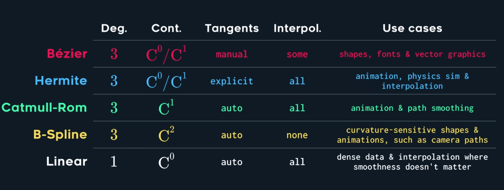
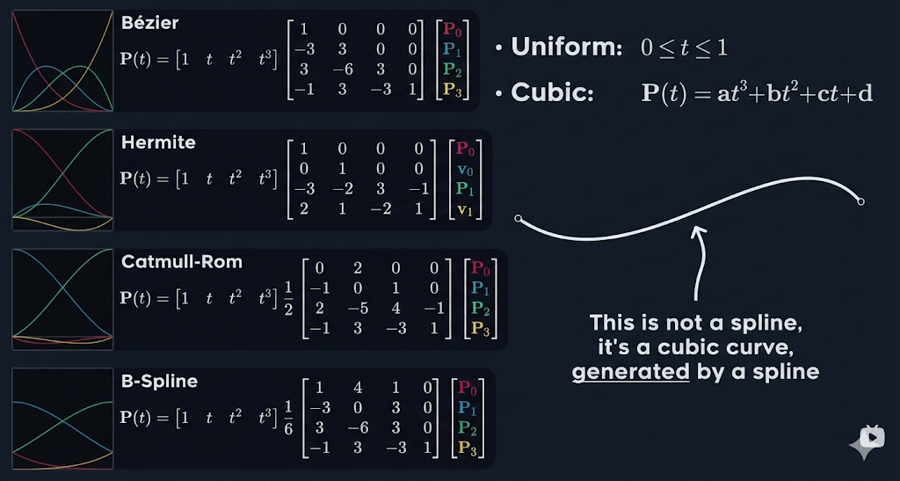

## $$\text{Spline for learning}$$

### 样条曲线
**所有的三次曲线（$\text{Cubic curves}$），本质上都是 $P(t) = \mathbf{a}t^3 + \mathbf{b}t^2 + \mathbf{c}t + \mathbf{d}(0 \leq t \leq 1)$ 的形式**，而不同的样条（Bézier, Hermite, Catmull-Rom, B-Spline），只是使用了**不同的基矩阵（$\text{Basis Matrix}$）去转换控制点**，以下是几个核心评价指标：
- **Cont. (连续性 $\text{Continuity}$)**：这是平滑度的指标。$C^0$ 表示曲线连在一起不断开；$C^1$ 表示一阶导数（速度/切线）连续，没有尖角；**$C^2$ 表示二阶导数（加速度/曲率）连续**，过渡极其丝滑
- **Tangents (切线)**：决定曲线方向的向量是怎么来的。是手动给的（manual/explicit），还是算法自动算的（auto）。
- **Interpol. (插值 $\text{Interpolation}$)**：**最关键的区别**,它表示生成的曲线**是否会穿过给定的控制点**，“all”表示全穿过，“none”表示全不穿过（只在附近绕），“some”表示只穿过端点

例如以下这张图包含了四种常用的曲线：

#### $\text{Bézier}$（贝塞尔曲线）

- **数学形式**：由矩阵乘以控制点 $[P_0, P_1, P_2, P_3]^T$ 得到，它是**凸包 - Convex hull**，即曲线被控制点连线包括在内
- **特征**：
  - **插值性**：只穿过起点 $P_0$ 和终点 $P_3$（Interpol. = some）。中间的 $P_1$ 和 $P_2$ 像磁铁一样把曲线“拉”过去
  - **切线**：手动控制（manual），$P_0$ 到 $P_1$ 的连线就是起点的切线方向
  - **连续性**：拼接时通常只能保证 $C^0$ 或 $C^1$ 连续
- **应用场景**：字体设计、矢量图形（如 PS 的钢笔工具、Figma）。在机器人里用得较少，因为让机器人精确跟着控制点走比较麻烦

#### $\text{Hermite}$（埃尔米特曲线）

- **数学形式**：它不再是 4 个位置点，而是 **2 个位置点 $[P_0, P_1]$ 和 2 个速度/切线向量 $[\mathbf{v}_0, \mathbf{v}_1]$**
- **特征**：
  - **插值性**：百分之百穿过给定的起点和终点（Interpol. = all）
  - **切线**：显式指定（explicit）。你直接告诉数学公式：“我要小车以 $1.0m/s$ 的速度经过 $P_0$，以 $0.5m/s$ 的速度到达 $P_1$”
  - **连续性**：$C^0 / C^1$ 连续
- **应用场景**：物理模拟、关键帧动画（明确知道每个点的速度）

#### $\text{Catmull-Rom}$ 样条

这是机器人“路径跟踪”里经常用到的平滑利器
- **数学形式**：矩阵前面有一个 $\cfrac{1}{2}$ 的系数，输入是 4 个控制点 $[P_0, P_1, P_2, P_3]$
- **特征**：
  - **插值性**：**完美穿过所有给定的点**（Interpol. = all）。它计算 $P_1$ 到 $P_2$ 之间的曲线时，会参考前后的 $P_0$ 和 $P_3$
  - **切线**：自动计算（auto）。你不需要给速度，它会根据相邻的点自动算出平滑的切线
  - **连续性**：保证 $C^1$ 连续（速度连续）
- **应用场景**：路径平滑（Path smoothing）、动画。如果你想让小车**必须**压过你在地图上点的那些航点，并且不希望有急弯，用它最合适

#### $\text{B-Spline}$（B 样条）

- **数学形式**：矩阵前面有一个 $\cfrac{1}{6}$ 的系数，输入也是 4 个控制点 $[P_0, P_1, P_2, P_3]$
- **特征**：
  - **插值性**：**不穿过任何控制点**（Interpol. = none）。曲线只会在控制点构成的“安全走廊”内部平滑地游走
  - **切线**：自动计算（auto）
  - **连续性**：拥有这几种曲线中最高的 **$C^2$ 连续性（加速度/曲率连续）**
- **应用场景**：对曲率极度敏感的形状、相机轨迹（Camera paths）。在自动驾驶中，B-spline 能保证方向盘的转角（对应曲率）是连续平滑变化的，不会让乘客觉得猛打方向

如图是一张涵盖了这四种曲线的数学模型图：

图中每个样条曲线都由4个基函数组成，这些基函数实际上就是基矩阵决定的，每一列分别作为一个函数的系数（从上到下分别对应$1,t,t^2,t^3$）
同时这四个基函数由一个母函数平移得到，它们四个基函数拼接在一起就是这个母函数，母函数向右平移$i$个单位就是$B_i(t)$，所以如果$C^1$连续，我们会有$B_{i + 1}(1) = B_i(0)$

---

#### $\text{Knot}$（节点向量）——样条背后的隐藏自由度

上面的框架是"样条 = 固定基矩阵 × 控制点"，但基矩阵本身从哪来？答案是 **knot（节点向量）**：参数轴上的一个递增刻度序列 $U = [u_0, u_1, \dots, u_m]$。它**不是空间中的点**（控制点才是），而是参数域 $u$ 的分段边界表——区间 $[u_i, u_{i+1})$ 对应曲线的一段分片多项式。

- **knot 的三个作用**：
  1. **支撑区间**：决定第 $i$ 段曲线由哪 $p{+}1$ 个控制点管辖（局部支撑性的来源）
  2. **接缝连续性**：knot 的重复度直接决定接缝处焊到几阶导（见下表）
  3. **参数化刻度**：knot 间距是参数速度——如果刻度单位是秒，则参数 $u$ 就是时间（EGO-Planner 的用法）
- **均匀 knot 的特权**：只有 knot 等距时，"母函数平移"才成立、基函数才能预先写成固定多项式（即上面的基矩阵）。我的 nav2 平滑器里 `cubicBSplineBasis` 那 4 个多项式和 `Q_data` 常量矩阵，就是均匀 knot 的"化石"——一旦换成非均匀 knot，基矩阵必须逐段重算

##### 基本等式 $m = n + p + 1$ 的来历

设 $n{+}1$ 个控制点、次数 $p$、knot 共 $K = m{+}1$ 个。关键观察：**Cox–de Boor 递推每升一阶，基函数个数恰好少一个**（递推三角每层首尾各报废一个）：

$$\text{0次基: } K-1 \text{ 个} \;\xrightarrow{\text{升阶}}\; \text{p次基: } K-1-p \text{ 个}$$

而曲线 $p(u) = \sum N_{i,p}(u) P_i$ 要求基函数与控制点一一配对，所以 $K - 1 - p = n + 1$，即 $K = n+p+2$，也就是 $m = n+p+1$。**体感核对**：单段三次贝塞尔 knot $=[0,0,0,0,1,1,1,1]$ 共 8 个 → 基函数 $8-1-3=4$ 个 = 4 个控制点 ✓（EGO 源码 `uniform_bspline.cpp` 里 `m_ = n_ + p_ + 1` 就是照抄这条）

##### knot 向量的值怎么定（三层决策，没有拍脑袋）

1. **数量与重复度**：总数被 $m=n+p+1$ 锁死；内部重复度由连续性需求决定；端点是否重复 $p{+}1$ 次由"要不要插值端点"决定——**零自由度**
2. **端点样式**：clamped（首尾重复 $p{+}1$ 次，曲线过端点）或均匀开放（允许负数起点，如 EGO 的 $-3\tau$）
3. **间距分布**（唯一真自由度）：均匀 / **时间参数化**（EGO：knot 间距 = 秒，$u \equiv t$）/ 弦长 / 优化变量。对 knot 做仿射变换 $u \to au+b$ 曲线形状不变，**只有相对间距、重复度、端点模式携带真实信息**

##### 重复度阶梯：$m$ 重 knot $\Rightarrow$ 接缝 $C^{\,p-m}$（Curry–Schoenberg 定理）

数值实验（随机系数三次样条，看接缝两侧导数跳变）：

| 内部 knot 重复度 | 接缝连续性 | 时间语义下的物理效应 |
|---|---|---|
| 1 重 | $C^2$ | 一切连续（标准 B 样条 / EGO 的用法） |
| 2 重 | $C^1$ | 加速度瞬间跳变 = jerk 冲击 |
| 3 重 | $C^0$ | 速度瞬间跳变 = 无限大加速度 |
| 4 重（$=p{+}1$） | **断裂** | **位置瞬移**（曲线真的断成两截） |

所以四种曲线其实是同一个家族 $(p, U)$ 在不同角落的居民：

$$\underbrace{[0,0,0,0,1,1,1,1]}_{\text{贝塞尔：无内部接缝}} \quad \underbrace{[\dots,1,1,2,2,\dots]}_{\text{Catmull-Rom 住的空间：}C^1} \quad \underbrace{[\dots,1,2,3,\dots]}_{\text{B样条：}C^2}$$

##### 为什么 knot 重合能让曲线经过控制点？

De Boor 递推的插值比例 $\alpha = \frac{u-u_j}{u_{j+1}-u_j}$ 的**分母是相邻 knot 间距**。数值实验：把前三个 knot 逐渐并拢到 0，曲线起点权重连续滑移——

$$[u_0,u_1,u_2]=[{-3},{-2},{-1}]: \left(\tfrac{1}{6},\tfrac{4}{6},\tfrac{1}{6}\right) \;\to\; [{-\tfrac{3}{10}},{-\tfrac{2}{10}},{-\tfrac{1}{10}}]: (0.76, 0.24, 0.004) \;\to\; [0,0,0]: (1,0,0)$$

权重全部塌缩到 $P_0$，端点被"拖"到控制点上。**clamped 插值 = 权重滑移的极限状态**。

##### "瞬移"悖论：重合 knot ≠ 时间被压缩

直觉困惑：knot 是时间刻度，几个重合不就是要瞬间穿过几段时间？数值实验的解答：
- 内部 knot 重复 $p{+}1$ 次（如 $[0,0,0,0,1,1,1,1,2,2,2,2]$）时**瞬移真的发生**：$u\to1^-$ 时曲线在 $P_3$，$u\to1^+$ 时在 $P_4$，参数连续但曲线点跳变——这其实就是两条独立贝塞尔焊在同一个刻度上
- 但**没有时间被跳过**：零宽 span（宽度=0 的 $[1,1)$）里**根本不存放曲线段**——像栅栏的几根桩钉在同一位置，桩之间没有板，不是"板被压缩"，是"没有板"。定义域的每一秒都由真实曲线段覆盖
- **clamped 端点 = 放在存在边界上的断裂**：瞬移需要"另一边"，而端点处另一边不存在（定义域到 $u_p$ 为止），跳跃退化成钉住——这就是端点插值的本质

##### 工程锚点

- **我的 nav2_test**：无显式 knot（隐式均匀）；基函数硬编码于 `cubicBSplineBasis`，`Q_data` = $\int B''B''^T du$ 常量；$u$ 与时间无关，端点问题用"钉住首末各 2 个控制点"替代 clamped
- **EGO-Planner**：显式 knot 数组，$u_i = (i{-}3)\cdot\tau$、$\tau$=秒，**参数 $u$ 就是飞行时间**；全定义域单重 knot 保持 $C^2$（任何重合 knot 都意味着不可飞的动力学）；轨迹广播消息 `Bspline.knots` 携带整张时刻表，否则接收端 De Boor 的 $\alpha$ 分母无从算起
- 记忆锚点：**knot 是参数轴的刻度，控制点是空间中的磁铁**；改 knot 改变的是"函数空间长多光滑"，改控制点改变的是"曲线被吸去哪"