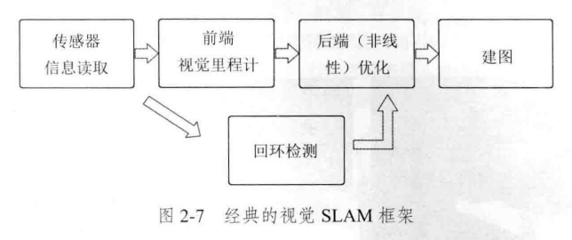
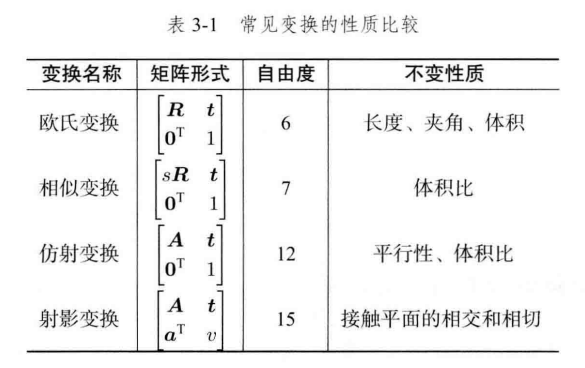
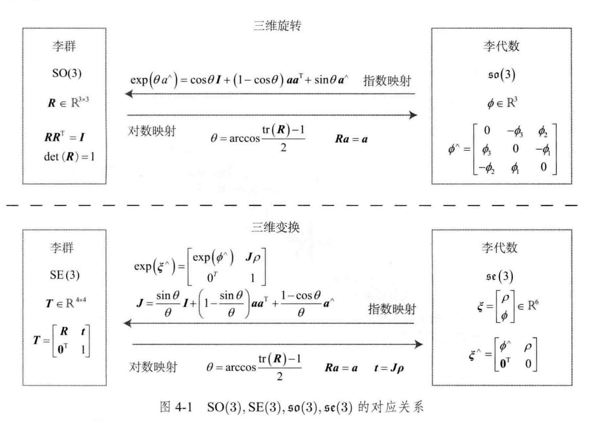

## $$\mathbf{SLAM}~学习笔记$$

- 单目相机
  只使用一个摄像头进行SLAM的做法称为单目SLAM
  缺点是无法判断**尺度**$\mathbf{(SLAM)}-$估计值与真实值之间的因子，称为**尺度不确定性**
- 双目相机
  通过左右相机的**基线**-两个相机之间的距离，结合左右相机获得的图像计算真实像素点的深度（要计算所有像素点），所以双目SLAM的主要问题就是算力
- 深度相机
  通过发射和接收光线测定像素点的距离（深度），这种方法使用物理手段比较节省算力

## 视觉SLAM框架
经典视觉SLAM框架：

### 视觉里程计
和里程计很像，在较短的时间内通过前几帧的图像信息估计相机运动并进行建图，缺点同理，会因为误差累积造成**漂移**，为了解决漂移，就需要**后端优化**和**回环检测**了

### 后端优化
后端优化就是如何从带有噪声的数据中估计整个系统的状态，以及这个状态估计的不确定性有多大——这称为最大后验概率估计（MAP），这里的状态既包括机器人也包括地图
所以SLAM问题的本质就是：**对运动主体本身和周围环境空间不确定性的估计**

#### 回环检测
用于解决**时间漂移问题**，通过判断图像之间的相似性，让机器人知道到达了（回到了）某个点，再对位置估计值进行修正，即可消除漂移

### $\mathrm{SLAM}$问题的数学化
我们定义：每一个运动的时刻为$t=1,\cdots,K$，每一个时刻的位置为$x=x_1,\cdots,x_K$，在运动过程中，每一个时刻机器人都会识别到若干个路标，不妨设总共有$N$个路标，分别是$y=y_1,\cdots,y_N$
接下来我们来定义**运动**和**观测**

#### 运动
也就是从$k-1$时刻到$k$时刻位置$x$的变化，于是我们可以设定一个**运动方程**
$$\bold{x}_k=f(\bold{x}_{k-1},\bold{u}_k,\bold{w}_k)$$
其中$\bold{u}_k$就是$k$时刻运动传感器的输入，而$\bold{w}_k$就是$k$时刻的噪声，$f$用于描述整个过程

#### 观测
描述机器人在$k$时刻$x_k$位置探测到了某一个路标$y_j$
和运动一样，我们可以写一个**观测方程**
$$\bold{z}_{k,j}=h(\bold{y}_j,\bold{x}_k,\bold{v}_{k,j})$$
其中$\bold{z}_{k,j}$是一个$k$时刻的观测数据，$\bold{v}_{k,j}$是观测噪声

#### 综合
综合运动方程和观测方程
$$\begin{cases}
  \bold{x}_k=f(\bold{x}_{k-1},\bold{u}_k,\bold{w}_k),~k=1,\cdots,K\\
  \bold{z}_{k,j}=h(\bold{y}_j,\bold{x}_k,\bold{v}_{k,j}),~(k,j)\in \mathcal{O}
\end{cases}$$
这就是SLAM过程的两个基本方程，其中$\mathcal{O}$是一个集合，记录了哪个时刻观测到了哪个路标
按照运动观测噪声的线性和非线性、噪声的高斯和非高斯分布来分类，可以将其分为**线性/非线性**和**高斯/非高斯**系统

## 三维空间刚体运动
### 平移和旋转
对于世界坐标系与相机坐标系，假设它们分别由两组正交基组成$[\bold{e}_1,\bold{e}_2,\bold{e}_3]$和$[\bold{e}'_1,\bold{e}'_2,\bold{e}'_3]$
对于一个在三维空间中的向量$\bold{p}$，它在不同坐标系下的坐标不同，它不会随着坐标系变换而变换，这两个坐标系之间相差了一个**欧式变换**

#### 旋转
$\bold{p}$在$[\bold{e}_1,\bold{e}_2,\bold{e}_3]$下的坐标表示为$\begin{bmatrix}
  p_1 \\
  p_2 \\
  p_3
\end{bmatrix}$，在$[\bold{e}'_1,\bold{e}'_2,\bold{e}'_3]$下的坐标表示为$\begin{bmatrix}
  p'_1 \\
  p'_2 \\
  p'_3
\end{bmatrix}$，由于$\bold{p}$本身并不会变，所以满足$$[\bold{e}_1,\bold{e}_2,\bold{e}_3]\begin{bmatrix}
  p_1 \\
  p_2 \\
  p_3
\end{bmatrix}=[\bold{e}'_1,\bold{e}'_2,\bold{e}'_3]\begin{bmatrix}
  p'_1 \\
  p'_2 \\
  p'_3
\end{bmatrix}$$
只要我们两边左乘$\begin{bmatrix}
  \bold{e}^T_1 \\
  \bold{e}^T_2 \\
  \bold{e}^T_3
\end{bmatrix}$左边的系数就变成了单位矩阵
$$\begin{bmatrix}
  p_1 \\
  p_2 \\
  p_3
\end{bmatrix}=\begin{bmatrix}
  \bold{e}^T_1\bold{e}'_1 & \bold{e}^T_1\bold{e}'_2 & \bold{e}^T_1\bold{e}'_3 \\
  \bold{e}^T_2\bold{e}'_1 & \bold{e}^T_2\bold{e}'_2 & \bold{e}^T_2\bold{e}'_3 \\
  \bold{e}^T_3\bold{e}'_1 & \bold{e}^T_3\bold{e}'_2 & \bold{e}^T_3\bold{e}'_3 
\end{bmatrix}\begin{bmatrix}
  p'_1 \\
  p'_2 \\
  p'_3 
\end{bmatrix}$$
我们设中间那个大的矩阵为$\bold{R}$，这个矩阵由两组基之间的内积组成，所以其仅依赖于两对正交基的选取，故也称为**旋转矩阵**，也叫它**方向余弦矩阵**，实际上旋转矩阵是一个行列式为$1$的正交矩阵，反之行列式为$1$的正交矩阵也是一个旋转矩阵，所以对于$n$维旋转矩阵的集合可以如此定义：
$$\mathrm{SO}(n)={\bold{R}\in\mathbb{R}^{n\times n}|\bold{RR}^T=\bold{I},\mathrm{det}(\bold{R})=1}$$
其中$\mathrm{SO}(n)$是特殊正交群，由于$\bold{R}$是一个正交矩阵，所以它的逆（也是转置）则描述了一个相反的旋转：
$$\bold{a}'=\bold{R}^{-1}\bold{a}=\bold{R}^T\bold{a}$$

#### 平移
除旋转外，对于平移我们只需要一个额外的平移向量即可，按上面的式子我们可以设出坐标系$1$和坐标系$2$，可以得出：
$$\bold{a}_1=\bold{R}_{12}\bold{a}_2+\bold{t}_{12}$$
，其中$\bold{t}$就是平移向量（坐标系原点指向另一个坐标系原点的向量），旋转矩阵的下标表示**把从坐标系2的向量变换到坐标系1中**，注意这里的下标是从右往左读，而平移向量是从左往右读的

#### 变换矩阵与齐次坐标
上述变换的描述正确但不是线性变换，这样做的后果是多次变换后式子会变得麻烦不堪
我们设**变换矩阵**$\bold{T}=\begin{bmatrix}
  \bold{R} & \bold{t} \\
  \bold{0}^T & 1
\end{bmatrix}$并重写$\bold{a}$为$\begin{bmatrix}
  \bold{a} \\
  1
\end{bmatrix}$，$\bold{a}'$同理，称它们为**齐次坐标**。这样我们就能重写之前的变换公式：
$$\begin{bmatrix}
  \bold{a}' \\
  1
\end{bmatrix}=\begin{bmatrix}
  \bold{R} & \bold{t} \\
  \bold{0}^T & 1
\end{bmatrix}\begin{bmatrix}
  \bold{a} \\
  1
\end{bmatrix}=\bold{T}\begin{bmatrix}
  \bold{a} \\
  1
\end{bmatrix}$$
这样这个变换就是一个线性变换了，对于多次变换也只需要多次左乘矩阵即可，**我们约定如果直接写$\bold{b}=\bold{T}\bold{a}$那么默认它们已经进行了齐次坐标化**（如果是$\bold{b}=\bold{Ra}$则不使用齐次坐标）
对于$\bold{T}$，这种矩阵属于**特殊欧式群**$\mathrm{SE}(n)$，在这里有：
$$\mathrm{SE}(3)=\begin{Bmatrix}
  \bold{T}=\begin{bmatrix}
    \bold{R} & \bold{t} \\
    \bold{0}^T & 1
  \end{bmatrix}\in\mathbb{R}^{4\times4}|\bold{R}\in\mathrm{SO}(3),\bold{t}\in\mathbb{R}^3
\end{Bmatrix}$$
与$\mathrm{SO}(3)$一样，该矩阵的逆表示一个反向变换：
$$\bold{T}^{-1}=\begin{bmatrix}
    \bold{R}^T & -\bold{R}^T\bold{t} \\
    \bold{0}^T & 1
  \end{bmatrix}$$
它的下标和旋转矩阵的下标表示方法一致
在这里先给一个符号定义，记$\bold{a}^\land=\begin{bmatrix}
  0 & -a_3 & a_2 \\
  a_3 & 0 & -a_1 \\
  -a_2 & a_1 & 0 
\end{bmatrix}$为向量$\bold{a}=\begin{bmatrix}
  a_1 \\
  a_2 \\
  a_3
\end{bmatrix}$的**反对称矩阵**，用$^\lor$符号则可表示反对称矩阵对应的向量
我们注意到，虽然$\bold{R}$能通过两组基来描述两个基坐标系之间的旋转变换，但是我们也可以设一个三维向量$\bold{n}$用$\theta\bold{n}$描述旋转轴为$\bold{n}$旋转角度为$\theta$的旋转变换（默认按右手定则），我们可以从**罗德里格斯公式**$(\mathrm{Rodrigues's~Formula})$：
$$\bold{R}=\cos\theta\bold{I}+(1-\cos\theta)\bold{nn}^T+\sin\theta\bold{n}^\land$$
得到旋转矩阵和旋转向量之间的转换公式，同时如果我们两边同时**求迹**，能得到角度的求解公式：
$$\theta=\arccos\cfrac{\mathrm{tr}(\bold{R})-1}{2}$$

#### 四元数
由于不存在不带奇异性的三维向量描述旋转的方式，我们可以使用四元数这种一个实部三个虚部的类复数来表示旋转：$$\bold{q}=q_0+q_1i+q_2j+q_3k$$
其中三个虚部满足以下表达式：
$$\begin{cases}
  i^2=j^2=k^2=-1 \\
  ij=k,ji=-k \\
  jk=i,kj=-i \\
  ki=j,ik=-j
\end{cases}$$
我们可以用一个标量一个向量表示四元数：
$$\bold{q}=[s,\bold{v}]^T,~s=q_0\in\mathbb{R},~\bold{v}=[q_1,q_2,q_3]^T\in\mathbb{R}^3$$
$s$称为四元数的实部，$\bold{v}$称为四元数的虚部，大部分性质和普通复数一样，四元数的逆被定义为：
$$\bold{q}^{-1}=\cfrac{\bold{q}^*}{||\bold{q}||^2}$$
其中$\bold{q}^*$为$\bold{q}$的共轭
对于三维点$p$用四元数表示它（将坐标分别设为四元数的三个虚部系数），用四元数$\bold{q}$描述从$p$变换到$p'$的旋转变换，满足以下式子：
$$p'=\bold{q}p\bold{q}^{-1}$$
在这里需要构造的四元数为$\bold{q}=\cos\cfrac{\theta}{2}+\bold{v}\sin\cfrac{\theta}{2}$
如果不构造这种形式的旋转公式，只乘一次四元数就会导致实部非0，这样操作可以让实部为0并且旋转角度叠加为$\theta$，这是由于$\bold{q}^{-1}=\cos\cfrac{\theta}{2}-\bold{v}\sin\cfrac{\theta}{2}=\cos(-\cfrac{\theta}{2})+\bold{v}\sin(-\cfrac{\theta}{2})$
而左乘正转右乘逆转，所以这里确实是$\cfrac{\theta}{2}-(-\cfrac{\theta}{2})=\theta$
同时四元数也能写成矩阵，我们定义符号$^+$和$^\oplus$：
$$\bold{q}^+=\begin{bmatrix}
  s & -\bold{v}^T \\
  \bold{v} & s\bold{I}+\bold{v}^\land
\end{bmatrix},~\bold{q}=\begin{bmatrix}
  s & -\bold{v}^T \\
  \bold{v} & s\bold{I}-\bold{v}^\land
\end{bmatrix}$$
所以四元数的乘法也可以由上述形式写成矩阵的乘法：
$$\bold{q}^+_1\bold{q}_2=\begin{bmatrix}
  s_1 & -\bold{v}^T_1 \\
  \bold{v}_1 & s_1\bold{I}+\bold{v}^\land_1
\end{bmatrix}\begin{bmatrix}
  s_2 \\
  \bold{v}_2
\end{bmatrix}=\begin{bmatrix}
  -\bold{v}^T_1\bold{v}_2+s_1s_2 \\
  s_1\bold{v}_2+s_2\bold{v}_1+\bold{v}^\land_1\bold{v}_2
\end{bmatrix}=\bold{q}_1\bold{q}_2$$
同理能得$\bold{q}_1\bold{q}_2=\bold{q}^\oplus_2\bold{q}_1$
我们回到四元数的旋转变换公式：
$$\bold{p}'=\bold{qpq}^{-1}=\bold{q}^+\bold{p}^+\bold{q}^{-1}=\bold{q}^+(\bold{q}^{-1})^\oplus\bold{p} \\
=\begin{bmatrix}
  1 & \bold{0} \\
  \bold{0}^T & \bold{vv}^T+s^2\bold{I}+2s\bold{v}^\land+(\bold{v}^\land)^2
\end{bmatrix}\bold{p}$$
注意最后一个矩阵的右下角正是旋转矩阵$\bold{R}=\bold{vv}^T+s^2\bold{I}+2s\bold{v}^\land+(\bold{v}^\land)^2$
我们两边同时求迹：
$$\mathrm{tr}(\bold{R})=4s^2-1$$
同时：
$$\theta=\arccos\cfrac{\mathrm{tf}(\bold{R}-1)}{2} 
  = \arccos(2s^2-1) =2\arccos s$$
于是我们得到四元数$\bold{q}=\begin{bmatrix}
  q_0 \\
  q_1 \\
  q_2 \\
  q_3
\end{bmatrix}$的旋转公式：
$$\begin{cases}
  \theta=2\arccos q_0 \\
  \begin{bmatrix}
    n_x \\
    n_y \\
    n_z
  \end{bmatrix}=\cfrac{1}{\sin\frac{\theta }{2}}\begin{bmatrix}
    q_1 \\
    q_2 \\
    q_3
  \end{bmatrix}
\end{cases}$$
其中$[n_x, n_y, n_z]^T$是单位旋转轴

#### 几何变换

## 李群与李代数
### 正式定义
#### 群
前文讲述了三维旋转矩阵构成了特殊正交群$\mathrm{SO}(3)$，变换矩阵构成了特殊欧氏群$\mathrm{SE}(3)$
可以注意到，这两个群都不满足加法封闭性，但是满足乘法封闭性，我们称这种**只有一个良好运算的集合**为**群**，它是一种集合加上一种运算的**代数结构**，我们把集合记作$A$，运算记为$\cdot$，则群可以记作$G = (A, \cdot)$，它拥有四个性质
- 封闭性：$\forall a_1,a_2\in A,a_1\cdot a_2\in A$
- 结合律：$\forall a_1,a_2,a_3\in A,(a_1\cdot a_2)\cdot a_3=a_1\cdot(a_2\cdot a_3)$
- 么元：$\exists a_0 \in A, \forall a \in A, a_0 \cdot a = a \cdot a_0 = a$
- 逆：$\forall a \in A, \exist a^{-1} \in A, a \cdot a^{-1} = a_0$

**李群**是指具有连续（光滑）性质的群，$\mathrm{SO}(n)$和$\mathrm{SE}(n)$在实数空间上连续，它们都是李群，我们先从李代数入手再引出李群

#### 李代数
##### 引入
考虑旋转矩阵$\bold{R}$，假设它是总随时间变化的一个函数$\bold{R}(t)$，那么根据旋转矩阵性质应有$$\bold{R}(t) \bold{R}(t)^T = \bold{I}$$
两边分别对时间求导可得
$$\dot{ \bold{R} }(t) \bold{R}(t)^T + \bold{R}(t) \dot{ \bold{R} }(t)^T = 0$$
这表示$\dot{\bold{R}}(t) \bold{R}(t)^T$是一个反对称矩阵，所以我们可以找到一个向量$\phi (t)\in \mathbb{R}^3$与之对应：
$$\dot{ \bold{R} }(t) \bold{R}(t)^T = \phi (t)^\land$$
左右同乘$\bold{R}(t)$有：
$$\dot{ \bold{R} }(t) = \phi (t)^\land \bold{R}(t) = \begin{bmatrix}
  0 & -\phi_3 & \phi_2 \\
  \phi_3 & 0 & -\phi_1 \\
  -\phi_2 & \phi_1 & 0
\end{bmatrix} \bold{R}(t)$$
也就是说旋转矩阵求一次导相当于左乘一个$\phi^\land(t)$矩阵，设$\bold{R}(0) = \bold{I}$，我们可以在$t = 0$时进行一价**泰勒展开**：
$$\bold{R}(t) \approx \bold{R}(t) + \dot{ \bold{R} }(t_0)(t - t_0)=\bold{I} + \phi(t_0)^\land (t)$$
这里$\phi(t_0)$仍用$t_0$的原因只是为了表明这个旋转不是从0时刻开始而是从$t_0$时刻开始，即描述从$t_k$到$t_{k+1}$时刻的变化，我们称此时$\phi$在$\mathrm{SO}(3)$原点附近的**正切空间**上，同时在$t_0$附近我们可以令$\phi(t_0) = \phi_0$为常数，那么就有
$$\dot{ \bold{R} }(t) = \phi^\land_0 \bold{R}(t)$$
这是一个微分方程，容易解得：
$$\bold{R}(t) = e^{\phi^\land_0 t}$$
说明在0附近旋转矩阵还可由这个公式计算

##### $\mathfrak{so}(3)$
每个李群都有对应的李代数，它描述了李群在单位元附近的正切空间的性质，一般李代数定义如下：
李代数由一个集合$\mathbb{V}$、一个数域$\mathbb{F}$和一个二元运算$[,]$组成，如果满足以下性质则称$(\mathbb{V}, \mathbb{F}, [,])$为一个李代数，称为$\mathfrak{g}$
- 封闭性：$\forall \bold{X, Y} \in \mathbb{V},~[\bold{X, Y}] \in \mathbb{V}$
- 双线性：$\forall \bold{X, Y, Z} \in \mathbb{V},~a, b \in \mathbb{F}$，有
$$[a\bold{X} + b\bold{Y}, \bold{Z}] = a[\bold{X, Z}] + b[\bold{Y, Z}],~[\bold{Z}, a\bold{X} + b\bold{Y}] = a[\bold{Z, X}] + b[\bold{Z, Y}]$$
- 自反性：$\forall \bold{X} \in \mathbb{V},~[\bold{X, X}] = 0$
- 雅可比等价：$\forall \bold{X, Y, Z} \in \mathbb{V},~[\bold{X}, [\bold{Y, Z}]] + [\bold{Z}, [\bold{X, Y}]] + [\bold{Y}, [\bold{Z, Y}]] = 0$

其中二元运算也被称作**李括号**，实际上三维向量$\mathbb{R}^3$上的叉积也是一种李代数，因此$\mathfrak{g} = (\mathbb{R}^3, \mathbb{R}, \times)$构成了一个李代数（第四条性质可用**拉格朗日公式**也称$\mathrm{BAC-CAB}$公式推导）
实际上之前提到的$\phi$也是一个李代数，$\mathrm{SO}(3)$对应的李代数是定义在$\mathbb{R}^3$上的向量，每个$\phi$都可生成一个反对称矩阵：
$$\Phi = \phi^\land = \begin{bmatrix}
  0 & -\phi_3 & \phi_2 \\
  \phi_3 & 0 & -\phi_1 \\
  -\phi_2 & \phi_1 & 0
\end{bmatrix} \in \mathbb{R}^{3 \times 3}$$
在此定义下，两个向量的李括号为：
$$[\phi_1, \phi_2] = (\Phi_1 \Phi_2 - \Phi_2 \Phi_1)^\lor$$
易验证知其满足李代数性质，我们称$\mathfrak{so}(3)$的元素是三维向量或三维反对称矩阵（因为一一对应）：
$$\mathfrak{so}(3) = \begin{Bmatrix}
  \phi \in \mathbb{R}^3, \Phi = \phi^\land \in \mathbb{R}^{3 \times 3}
\end{Bmatrix}$$
我们可以利用指数映射用$\mathfrak{so}(3)$表示$\mathrm{SO}(3)$的旋转矩阵

##### $\mathfrak{se}(3)$
对于$\mathrm{SE}(3)$它也有对应的$\mathfrak{se}(3)$：
$$\mathfrak{se}(3) = \begin{Bmatrix}
  \xi = \begin{bmatrix}
    \rho \\
    \phi
  \end{bmatrix} \in \mathbb{R}^6, \rho \in \mathbb{R}^3, \phi \in \mathfrak{so}(3),\xi^\land = \begin{bmatrix}
    \phi ^ \land & \rho \\
    \bold{0}^T & 0
  \end{bmatrix} \in \mathbb{R}^{4 \times 4}
\end{Bmatrix}$$
在这里符号$^\land$和$^\lor$并不是向量到反对称矩阵和反对称矩阵到向量的关系，仅仅是向量到矩阵矩阵到向量的关系，虽然在这里$\rho$还不是平移向量，但可以先当作平移向量理解，$\xi$的李括号是：
$$[\xi_1, \xi_2] = (\xi^\land_1 \xi^\land_2 - \xi^\land_2 \xi^\land_1)^\lor$$

#### 指对映射
##### $\mathfrak{so}(3)$
我们先对矩阵的指数映射下定义：
$$e^{ \bold{A} } = \sum \limits_{n = 0}^{\infin} \cfrac{1}{n!} \bold{A}^n$$
结果仍是矩阵（如果公式收敛），这个公式并不好计算，我们可以使用
$$\begin{cases}
  \bold{a}^\land \bold{a}^\land = \begin{bmatrix}
    -a^2_2 - a^2_3 & a_1a_2 & a_1a_3 \\
    a_1a_2 & -a^2_1 - a^2_3 & a_2a_3 \\
    a_1a_3 & a_2a_3 & -a^2_1 - a^2_2
  \end{bmatrix} = \bold{aa}^T - \bold{I} \\
  \bold{a}^\land \bold{a}^\land \bold{a}^\land = \bold{a}^\land(\bold{aa}^T - \bold{I}) = -\bold{a}^\land
\end{cases}$$
将上述公式转化为罗德里格斯公式，也就是说$\mathfrak{so}(3)$实际上是由旋转向量组成的空间，指数映射即所谓的罗德里格斯公式
反之我们也可以定义对数映射从$\mathrm{SO}(3)$到$\mathfrak{so}(3)$：
$$\phi = \ln( \bold{R} )^\lor = \left[ \sum\limits_{n = 0}^{\infin} \cfrac{ (-1)^n }{n+1} (\bold{R} - \bold{I})^{n + 1} \right]^\lor$$
直接计算当然不现实，我们设$\theta$和$\bold{n}$分别是$\phi$的旋转角度和旋转轴向量使用以下公式：
$$\begin{cases}
  \theta = \arccos\cfrac{\mathrm{tr}(\mathbf{R}) - 1}{2} \\
  \mathbf{R} = \cos\theta \mathbf{I} + (1 - \cos\theta)\mathbf{n}\mathbf{n}^T + \sin\theta \mathbf{n}^\wedge 
\end{cases}$$
就能计算出$\bold{R} - \bold{R}^T$进一步算出$\phi = \theta \bold{n}$即
$$\phi = \cfrac{\theta}{ 2\sin \theta }(\bold{R} - \bold{R}^T)^\lor$$
注意奇异点的计算即可

##### $\mathfrak{se}(3)$
$\mathfrak{se}(3)$上的指对映射也能类似推导，其指数映射形式为：
$$e^{\xi^\land} \triangleq \begin{bmatrix}
  \bold{R} & \bold{J}\rho \\
  \bold{0}^T & 1
\end{bmatrix} = \bold{T}$$
其中$\sum\limits_{n = 0}^{\infin} \cfrac{(\phi^\land)^n}{ (n + 1)! } = \cfrac{\sin \theta}{\theta} \bold{I} + (1 - \cfrac{\sin \theta}{\theta}) \bold{nn}^T + \cfrac{1 - \cos \theta}{\theta}\bold{n} ^ \land = \bold{J} $
而对数映射需要$\xi = \begin{bmatrix}
  \rho \\
  \phi
\end{bmatrix}$，第二个分量我们在$\mathfrak{so}(3)$的对数映射已经求了，重点是第一个分量，观察$\bold{T}$能得到$\rho = \bold{J}^{-1}\bold{t}$，我们已经通过$\theta$得到了$\bold{J}$，只需求解$\bold{J}^{-1}$即可：
$$\boldsymbol{J}^{-1} = \frac{\theta}{2}\cot\frac{\theta}{2}\boldsymbol{I} + (1 - \frac{\theta}{2}\cot\frac{\theta}{2})\boldsymbol{n}\boldsymbol{n}^T - \frac{\theta}{2}\boldsymbol{n}^\wedge$$
最后我们可以得到如图转换关系

### 求导与扰动模型
在$\mathrm{SO}(3)$上的两个矩阵$A,B$相乘是否对应了其$\mathfrak{so}(3)$上的两个矩阵相加即：
$$e^{\phi^\land_1} e^{\phi^\land_2} = e^{(\phi_1 + \phi_2)^\land}$$
当元素为标量这是显然的，但当其为函数却不成立，我们相当于在研究：
$$\ln e^{\boldsymbol{A}} e^{\boldsymbol{B}} = \boldsymbol{A} + \boldsymbol{B}$$
这个在矩阵运算中并不成立，但是我们能通过$\mathrm{Baker-Campbell-Hausdorff, BCH}$**公式**得到：
$$\ln e^{\boldsymbol{A}} e^{\boldsymbol{B}} = \boldsymbol{A} + \boldsymbol{B} = \boldsymbol{A} + \boldsymbol{B} + \cfrac{1}{2} [\boldsymbol{A, B}] + \cfrac{1}{12}[\boldsymbol{A}, [\boldsymbol{A, B}]] - \cfrac{1}{12} [\boldsymbol{B}, [\boldsymbol{A, B}]] + \cdots$$
在$\phi_1,\phi_2$分别为小量时该公式可线性表达为$\boldsymbol{J}_l (\phi_2)^{-1}\phi_1 + \phi_2$和$\boldsymbol{J}_r (\phi_1)^{-1}\phi_2 + \phi_1$，这里的$\boldsymbol{J}(\phi)$是一个函数，由于$\phi = \theta \boldsymbol{n}$，所以这个函数的结果就是之前推导出来的由$\theta$和$\boldsymbol{n}$组成的$\boldsymbol{J}$计算公式
也不难证明左乘雅可比矩阵相当于右乘自变量为负的雅可比矩阵：（这里的左右乘仍然在主体左边，左右是相对于变换来说的）
$$\boldsymbol{J}_r(\phi) = \boldsymbol{J}_l(-\phi)$$
例如，对于$\mathfrak{so}(3)$上一个旋转$\phi$，给它左乘一个微小旋转$\Delta \boldsymbol{R}$，对应的李代数为$\Delta \phi$，在李群到李代数上就是：
$$\Delta \boldsymbol{R} \cdot \boldsymbol{R} = e^{ (\phi + \boldsymbol{J}^{-1}_l (\phi) \Delta \phi)^\land }$$
如果在李代数上加法，那从李代数到李群上就是：
$$e^{ (\phi + \Delta \phi)^\land } = e^{ (\boldsymbol{J}_l \Delta \phi)^\land } \boldsymbol{R} = \boldsymbol{R} e^{ (\boldsymbol{J}_r \Delta \phi)^\land }$$
在$\mathfrak{se}(3)$上也有类似的结论，不过这里的$\boldsymbol{J}$要换成$\mathcal{J}$，这是一个$6\times 6$矩阵，形式较为复杂暂不讨论

#### $\mathfrak{so}(3)$上的求导
##### 背景
假设一个机器人相对于世界坐标系的变换矩阵$\boldsymbol{T}$，它观察到了一个世界坐标位于$\boldsymbol{p}$的点，产生了一个观测数据$\boldsymbol{z}$，那么有：
$$\boldsymbol{z} = \boldsymbol{Tp} + \boldsymbol{w}$$
其中$\boldsymbol{w}$是随机噪声，我们的目的是计算实际与观测数据的误差$\boldsymbol{e} = \boldsymbol{z} - \boldsymbol{Tp}$并使若观测到了$N$个点，生成的$N$个数据误差最小：
$$\min\limits_{\boldsymbol{T}} J(\boldsymbol{T}) = \sum\limits_{i = 1}^N ||\boldsymbol{z}_i - \boldsymbol{Tp}||^2_2$$
求解此问题，需要计算目标函数$J$关于变换矩阵$\boldsymbol{T}$的导数，然而由于李群这种非欧空间没有良定义的加法，导致导数的定义也无从谈起，所以我们不能对位姿求导，只能在李代数上求导：
- 以李代数的姿态向量表示变换矩阵，然后根据李代数的加法对**李代数求导**
- 对李群左乘或右乘微小扰动，然后对该**扰动求导**，称为左扰动和右扰动模型

##### 李代数求导
对于空间点$\boldsymbol{p}$和旋转$\boldsymbol{R}$，我们无法计算$\cfrac{ \partial(\boldsymbol{Rp}) }{ \partial\boldsymbol{R} }$，因为$\mathrm{SO}(3)$没有加法，所以我们计算李代数形式的导数：
$$\cfrac{ \partial(e^{ \phi^\land }\boldsymbol{p}) }{\partial \phi}$$
按照导数的定义可算得$\cfrac{ \partial(e^{ \phi^\land }\boldsymbol{p}) }{\partial \phi} = -(\boldsymbol{Rp})^\land \boldsymbol{J}_l$
唯一的问题是这里含有形式较为复杂的$\boldsymbol{J}_l$

##### 扰动模型
我们对$\boldsymbol{R}$进行一次扰动$\Delta \boldsymbol{R}$（李代数下是$\varphi$），观察结果相对于扰动的变化率，左乘右乘无所谓只会有一点差异，假设左扰动，此时我们要计算的就是$\varphi$关于函数$g(\varphi) = e^{\varphi^\land}\boldsymbol{Rp}$在$\varphi = 0$处的导数：
$$\cfrac{\partial \boldsymbol{Rp}}{\partial \varphi} = \lim\limits_{\varphi \rightarrow 0} \cfrac{ e^{\varphi^\land} e^{\phi^\land}\boldsymbol{p} - e^{\phi^\land} \boldsymbol{p} }{\varphi} = -(\boldsymbol{Rp})^\land$$
$\mathrm{SE}(3)$上的李代数求导的扰动模型为：
$$\cfrac{ \partial (\boldsymbol{Tp}) }{ \partial \Delta \xi } = \begin{bmatrix}
  \boldsymbol{I} & -(\boldsymbol{Rp} + \boldsymbol{t}) ^ \land \\
  \bold{0}^T & \bold{0}^T
\end{bmatrix} = (\boldsymbol{Tp})^\odot$$
这里$^\odot$是被定义的一个算符，它把一个齐次坐标空间点变换成一个$4\times 6$的矩阵，在这里我们约定符号写法规则：
$$\cfrac{\mathrm{d} \begin{bmatrix}
  \boldsymbol{a} \\
  \boldsymbol{b}
\end{bmatrix}}{ \mathrm{d} \begin{bmatrix}
  \boldsymbol{x} \\
  \boldsymbol{y}
\end{bmatrix}} = \begin{bmatrix}
  \cfrac{\mathrm{d} \boldsymbol{a}}{ \mathrm{d} \boldsymbol{x}} & \cfrac{\mathrm{d} \boldsymbol{a}}{ \mathrm{d} \boldsymbol{y}} \\
  \cfrac{\mathrm{d} \boldsymbol{b}}{ \mathrm{d} \boldsymbol{x}} & \cfrac{\mathrm{d} \boldsymbol{b}}{ \mathrm{d} \boldsymbol{y}}
\end{bmatrix}$$

### 相似变换
对于一个空间内的点$\boldsymbol{p}$，经过相似变换后的点为$\boldsymbol{p}'$，则：
$$\boldsymbol{p}' = \begin{bmatrix}
  s\boldsymbol{R} & \boldsymbol{t} \\
  \bold{0}^T & 1
\end{bmatrix} = s\boldsymbol{Rp} + \boldsymbol{t}$$
尺度$s$表示对$\boldsymbol{p}$进行了一次缩放，这个变换矩阵也构成一个相似变换群$\mathrm{Sim}(3)$：
$$\mathrm{Sim}(3) = \begin{Bmatrix}
  \boldsymbol{S} = \begin{bmatrix}
    s\boldsymbol{R} & \boldsymbol{t} \\
    \bold{0}^T & 1
  \end{bmatrix} \in \mathbb{R}^{4\times 4}
\end{Bmatrix}$$
其也有对应的李代数$\mathfrak{sim}(3)$，其内的元素$\zeta$为七维向量，前六维和$\mathfrak{se}(3)$相同，最后多了一项$\sigma$：
$$\mathfrak{sim}(3) = \begin{Bmatrix}
  \zeta | \zeta = \begin{bmatrix}
    \rho \\
    \phi \\
    \sigma
  \end{bmatrix} \in \mathbb{R}^7, \zeta^\land = \begin{bmatrix}
    \sigma \boldsymbol{I} + \phi^\land & \rho \\
    \bold{0}^T & 0
  \end{bmatrix} \in \mathbb{R}^{4 \times 4}
\end{Bmatrix}$$
也比$\mathfrak{se}(3)$多一项$\sigma$，关联李群和李代数的指数映射为：
$$e^{\zeta^\land} = \begin{bmatrix}
  e^\sigma e^{\phi^\land} & \boldsymbol{J}_s\rho \\
  \bold{0}^T & 1
\end{bmatrix}$$
其中$\boldsymbol{J}_s = \cfrac{e^\sigma - 1}{\sigma} \boldsymbol{I} + \cfrac{\sigma e^\sigma \sin\theta + \theta(1 - e^\sigma \cos\theta)}{\sigma^2 + \theta^2}\boldsymbol{a}^\land + (\cfrac{e^\sigma - 1}{\sigma} - \cfrac{\sigma (e^\sigma \cos\theta - 1) + \theta(e^\sigma \sin\theta)}{\sigma^2 + \theta^2})\boldsymbol{a}^\land\boldsymbol{a}^\land$

### $\mathbf{Sophus}$库
先介绍几个轨迹误差：
对于估计轨迹$\boldsymbol{T}_{\mathrm{esti},i}$和真实轨迹$\boldsymbol{T}_{\mathrm{gt},i}$，其中$i = 1,\cdots,N$
- **绝对轨迹误差**$(\mathrm{Absolute~Trajectory~Erroe,ATE})$：
  $$\mathrm{ATE_{all}} = \sqrt{ \cfrac{1}{N} \sum\limits_{i = 1}^N ||\log (\boldsymbol{T}^{-1}_\mathrm{gt,i} \boldsymbol{T}_{\mathrm{esti,i}})^\lor ||^2_2 }$$
  其中$\mathrm{log}$表示以2为底
- **绝对平移误差**$(\mathrm{Average~Translational~Error})$
  $$\mathrm{ATE_{trans}} = \sqrt{ \cfrac{1}{N} \sum\limits_{i = 1}^N ||\mathrm{trans} (\boldsymbol{T}^{-1}_\mathrm{gt,i} \boldsymbol{T}_{\mathrm{esti,i}}) ||^2_2 }$$
  其中$\mathrm{trans}$表示内部向量的平移部分
- **相对位姿误差**$(\mathrm{Relative~Pose~Error,RPE})$
  $$\mathrm{RPE_{all}} = \sqrt{ \cfrac{1}{N - \Delta t} \sum\limits_{i = 1}^{N - \Delta t} ||\log ((\boldsymbol{T}^{-1}_\mathrm{gt,i} \boldsymbol{T}_{\mathrm{gt,i+\Delta t}})^{-1} (\boldsymbol{T}^{-1}_\mathrm{esti,i} \boldsymbol{T}_{\mathrm{esti,i+\Delta t}}))^\lor ||^2_2 }$$
- 相对位姿误差平移部分
  只需要将$\mathrm{RPE}$的$\log$换成$\mathrm{trans}$再去掉$^\lor$即可

